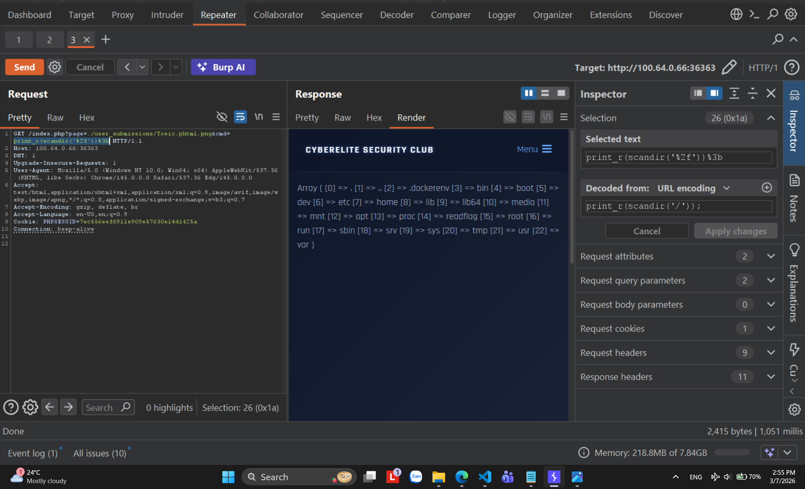
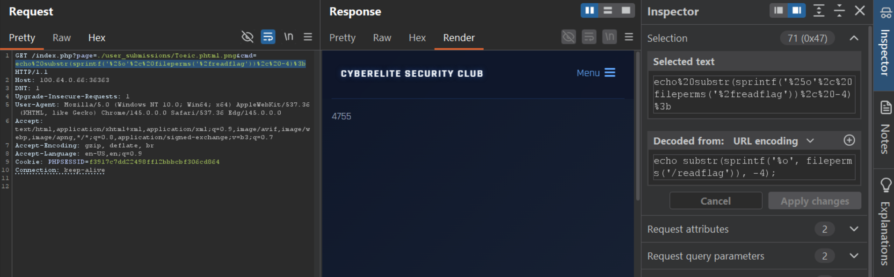
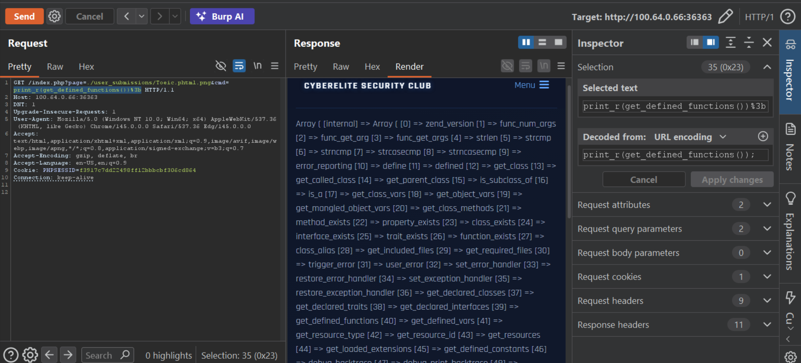
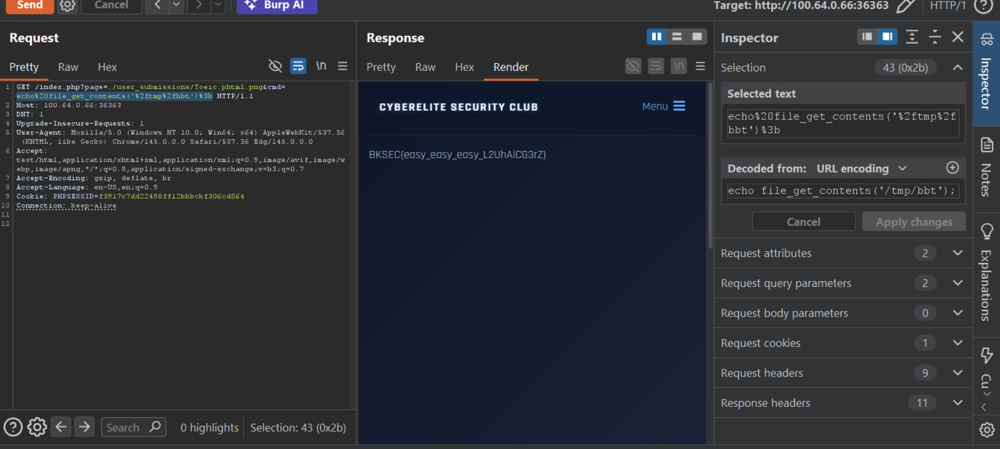

# ba buoc len may - revenge (BKSEC TTV 2026)
---
## Tổng quan
Như bài trước

## Luồng khai thác

Như bài trước không có j thay đổi cho đến khi scandir ở `/`:

Đọc ở env cũng k có flag, vậy khả năng bài này yêu cầu execute /readflag để đọc file.

Hỏi AI cách check quyền của /readflag

Confirm file này có SUID, và chỉ có cách exec file này mới có flag vì khả năng flag giấu trong /root và mình k phải là root.

Tham khảo AI cách bypass khi bị chặn các OS Command Execute và được biết rằng nó nằm trong `disable_function`. Recon các config

Đưa 3 ảnh cho AI tìm cách bypass, nó gợi ý lên repo của `mm0r1/exploits`

Tìm payload phù hợp với version: [PHP 8.0.12](https://github.com/mm0r1/exploits/tree/master/php-filter-bypass)

Sửa phần command execute trong code và upload
`pwn('/readflag > /tmp/bbt');` và lưu với tên là `b.phtml.png` như trong hình

Vì đây là file php, ta sẽ cho nó được include để chạy file. Ta tận dụng include của **index.php**

Quay về check ở `/tmp`

> Flag: ***BKSEC{easy_easy_easy_L2UhAiCG3rZ}***

Note: bài này yêu cầu bypass disable_function khá khoai vì tác giả config rất chặt (nếu k tìm được exploit) :vvvvvvv