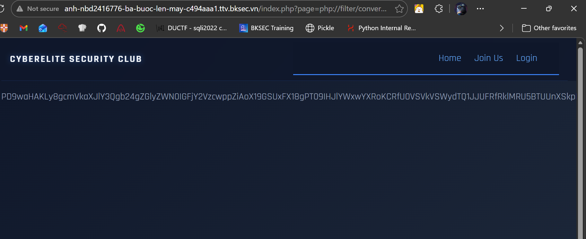
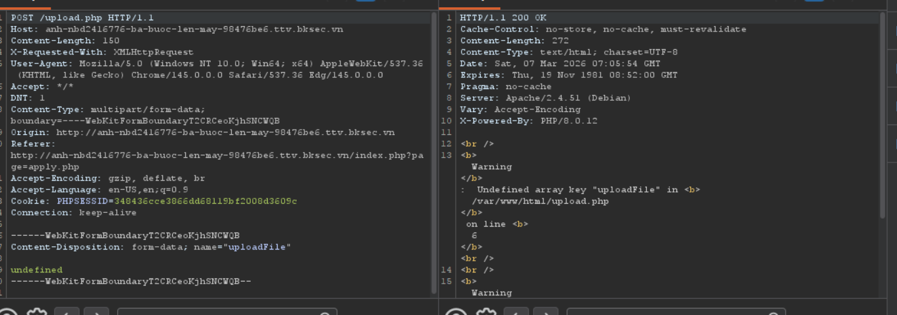
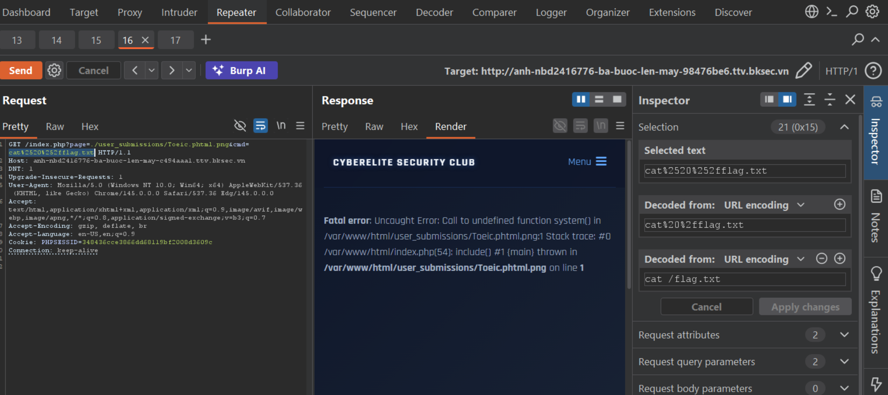
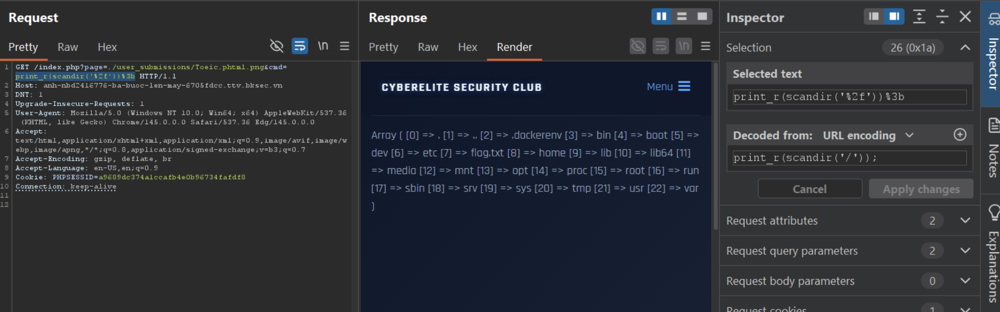
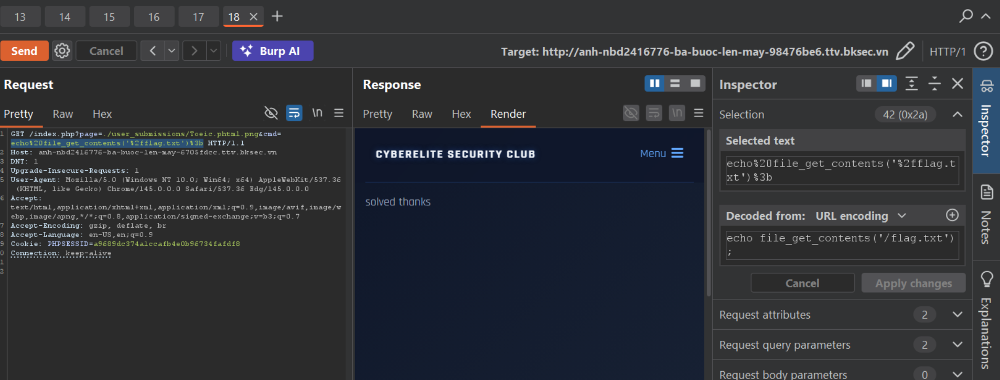
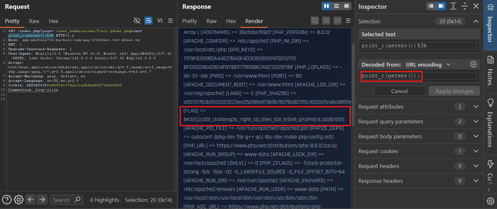

# ba buoc len may (BKSEC TTV 2026)
---
## Tổng quan
Web cung cấp một trang hiển thị hình ảnh, text (index.php); một trang cho login(login.php) thông qua username/password hoặc VIP CODE và một trang gửi CV (apply.php)

## Luồng khai thác
Trước tiên thấy form đăng nhập nên em thử dùng sqlmap với các username/password và VIP CODE thì sqlmap báo not-vulnerable.

Khi thấy trên url ở các trang là
```http://anh-nbd2416776-ba-buoc-len-may-c494aaa1.ttv.bksec.vn/index.php?page=login.php```
thay vì ```http://anh-nbd2416776-ba-buoc-len-may-c494aaa1.ttv.bksec.vn/login.php``` thì em nghĩ endpoint này có thể dính lỗ hổng Path Traversal hoặc Local File Inclusion

Thử với ```?page=../../../../../../flag.txt``` thì không được, trang trả về màn hình chính.

Thử ```?page=php://filter/convert.base64-encode/resource=login.php``` thì nó trả về một dãy b64



Sau khi áp dụng kĩ thuật với **index.php** và **apply.php** và decode thì thu được source code của 3 file. Em lưu dưới dạng .html [index](assets/index.html), [login](assets/login.html) và [apply](assets/apply.html)

Ở đây, em đọc file **login.php** thì thực ra chả có username, password, database nào cả mà ở phần VJP CODE có kiểm tra regex:
```regex
/^CYBER2026-[A-Z]{3}[0-9]{4}[!@#$%][A-Z]{2}_[0-9]{6}$/
```
 đọc regex và em chọn CODE:
`CYBER2026-AAA0000!AA_000000` và đăng nhập vào appy.php.


Ở đây, em thấy có phần upload file nên sinh nghi nghĩ tới **File upload vuln**, up thử các file linh tinh thì nó chỉ cho up file ảnh. Cho traffic đi qua burp thì thấy có gọi tới **upload.php**



Sử dụng kĩ thuật khai thác LFI ở trên để đọc upload.php thì thấy nó có filter.

```php
if (strpos($fileName, '.php') !== false) {
        echo "Extension not allowed";
        die();
    }

    if (!preg_match('/^.*\.(jpg|jpeg|png|gif)$/', $fileName)) {
        echo "Only images are allowed";
        die();
    }

    if ($_FILES["uploadFile"]["size"] > 500000) {
        echo "File too large";
        die();
    }
```

Đọc code em thấy nó tìm **strpos**, nếu mà xuất hiện **.php** trong filename thì từ chối. Đọc regex **/^.*\.(jpg|jpeg|png|gif)$/** nó ép filename phải kết thúc với extension như trên. Và k cho upload file nặng.

Vì ở trong **index.php** có include file được lấy từ **$page** và có filter trước khi include:

```php
if (isset($_GET['page']) && strlen($_GET['page']) < 1000 && preg_match('/^.*\.ph(p|ps|tml)/', $_GET['page'])) {
    // prevent directory traversal
    $page = $_GET['page'];
    while (substr_count(urldecode($page), '../', 0)) {
        $page = str_replace('../', '', urldecode($page));
    };
} else {
    // default to home page
    $page = "home.php";
}
```

```php
<?php ((include $page) == TRUE) || include('home.php'); ?>
```

Em nghĩ tới upload file php có chứa tag code `<?php something ?>` ở trong.
Mặc dù k cần đuôi php, khi include thấy tag `<?php>` là nó tự chạy code ở trong nhưng do index.php filter. Nó yêu cầu phải có `php` hoặc `phps` hoặc `phtml` ở trong filename. Còn upload file yêu cầu file phải kết thúc bằng extension image (ví dụ là `png`) nên em đã nghĩ tới cách bypass là đặt tên file bằng: 

`<something>.phtml.png`. 

Không thể dùng php hoặc phps vì bị upload.php filter. Ở bài này index có lỗ hổng là k bắt buộc filename phải kết thúc bằng extension php nên bypass được.

Do client-side code k cho upload php code, em up file ảnh bình thường rồi capture request bằng Burp, sửa ở Burp thành payload


Theo như upload.php, file được lưu ở dir **user_submissions**, vì index chặn `../` chứ k chặn `./` nên ta vẫn có thể include file được upload lên với url sau:



Tuy nhiên server báo về là fail, undefined function. Em thử hỏi AI các lệnh thay thế thì cả `exec, shell_exec, system, passthru` đều bị chặn. Duy chỉ có `eval` là qua được, nhưng eval là hàm của php nên ở đây chỉ có được PHP RCE chứ k phải OS RCE. 

Em hỏi AI cách dùng lệnh của php để thực thi thì có: `print_r(scandir('/'));`
`echo file_get_contents('/flag.txt');`




đọc env



> Flag: ***BKSEC{c00l_ch4lleng3s_r1ght_c0_d1en_t0n_tr0n9_gYaPnEnLa0d61d31}***


