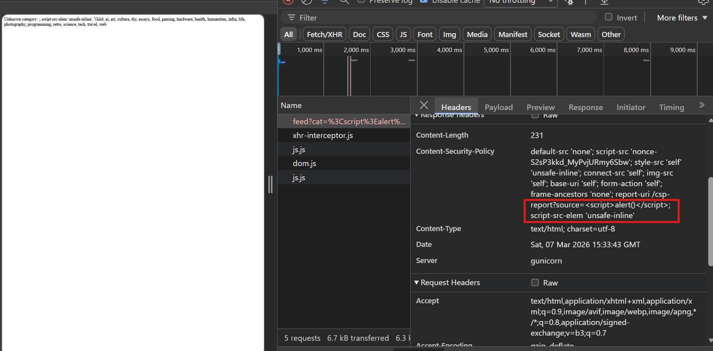
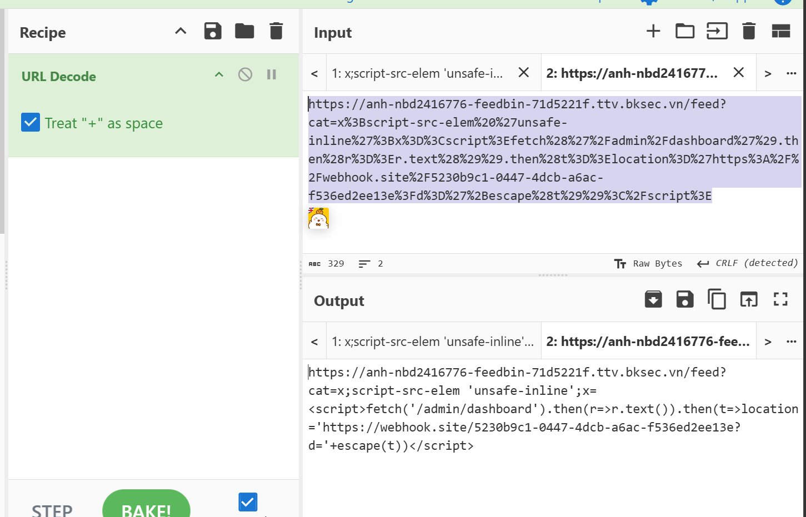
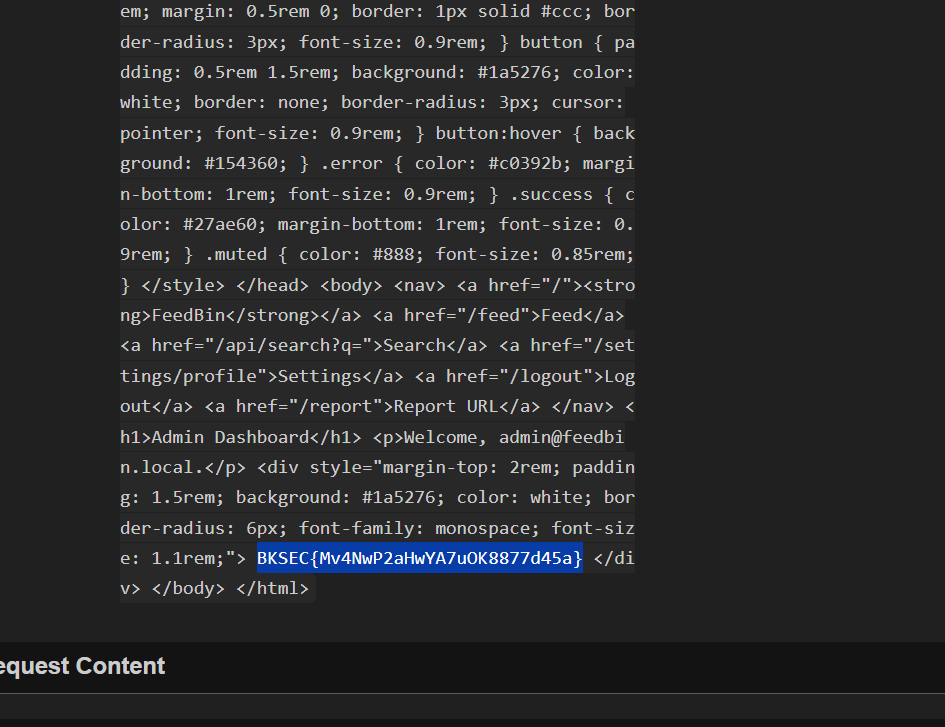

# feedbin (BKSEC TTV 2026)
---
## Tổng quan

Trang web có chức năng tạo tài khoản, login, logout, đổi mật khẩu, dashboard hiển thị bài báo, search bài báo và chỗ để report link tới admin

## Trinh thám

Đọc source code và thấy khá kì lạ:

```python
@app.route("/feed")
def feed():
    cat_filter = request.args.get("cat", "").strip().lower()
    if cat_filter and cat_filter not in CATEGORIES:
        nonce = generate_nonce()
        csp = (
            f"default-src 'none'; "
            f"script-src 'nonce-{nonce}'; "
            f"style-src 'self' 'unsafe-inline'; "
            f"connect-src 'self'; "
            f"img-src 'self'; "
            f"base-uri 'self'; "
            f"form-action 'self'; "
            f"frame-ancestors 'none'; "
            f"report-uri /csp-report?source={cat_filter}"
        )
        resp = Response(
            f"Unknown category: {cat_filter}. Valid: {', '.join(sorted(CATEGORIES.keys()))}",
            status=400,
        )
        resp.headers["Content-Security-Policy"] = csp
        return resp
```

Khi mà server nhận param từ url `cat`, không filter nó mà gắn thẳng vào CSP header trả về và trả về với nội dung ban đầu cho người dùng.

Như vậy ta có thể để là `<script>alert()</script>;script-src 'unsafe-inline` nhưng vì cơ chế CSP, k viết đè được. Hỏi AI được gợi ý 
`script-src-elem 'unsafe-inline'`





Bây giờ, thử check tính năng report URL có thật sự hoạt động:
Em bắn request sang webhook

Em paste hẳn url của web vào report nhưng chờ một lúc thì k có request nào tới. 

Nhưng do ở `/feed?cat=` có dính XSS, nên em report url với query `cat=<payload>` trong payload đó là script chuyển hướng tới webhook của em.


Một lúc sau confirm có request tới do có "headless chrome" là một con bot:


## Khai thác

Vì flag chỉ được hiển thị ở trang của admin, nên em sẽ lừa bot truy cập `feed?cat=` với payload là gửi request tới `/admin/dashboard`.
Do CSP `connect-src` là **self** nên gọi tới cùng orgin k bị chặn. Đọc request và gửi về webhook của em thông qua `location=`. Vì đây là **top-level-navigation** nên các CSP k chặn được.



Check webhook



> Flag: ***BKSEC{Mv4NwP2aHwYA7uOK8877d45a}***
