# Cyber News (BKSEC TRAINING 2026)
---

## Overview
The webapp provides us many functions: signup, signin, write posts, following other users, import posts from given url.

## Functionality Analysis
Dashboard:
- `GET /`: just a static page showing news
- `POST /signup`: register a new account

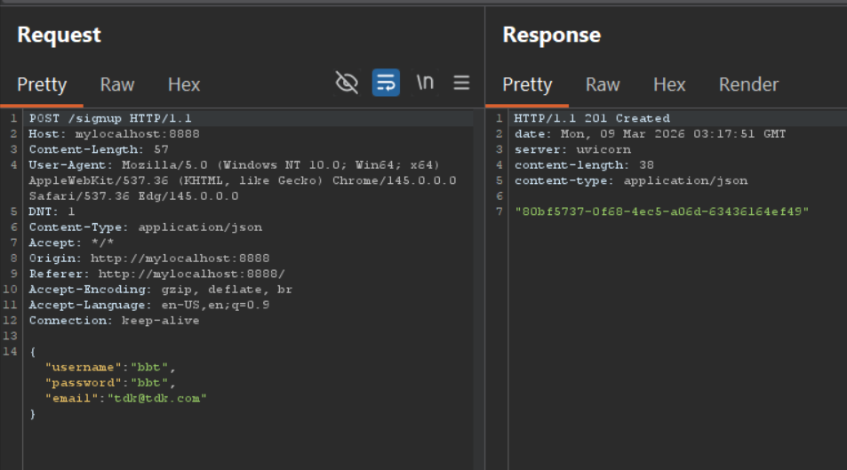

Signing in:
-  `GET /token`: log in with username/password, server will return access token and token type

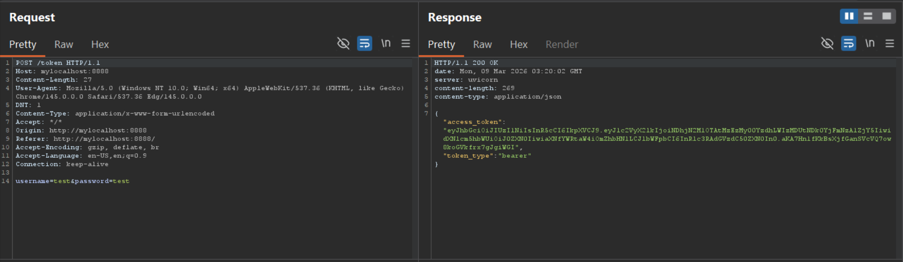

Signed in:
- `POST /subscribe`: provide the user ID you want to follow

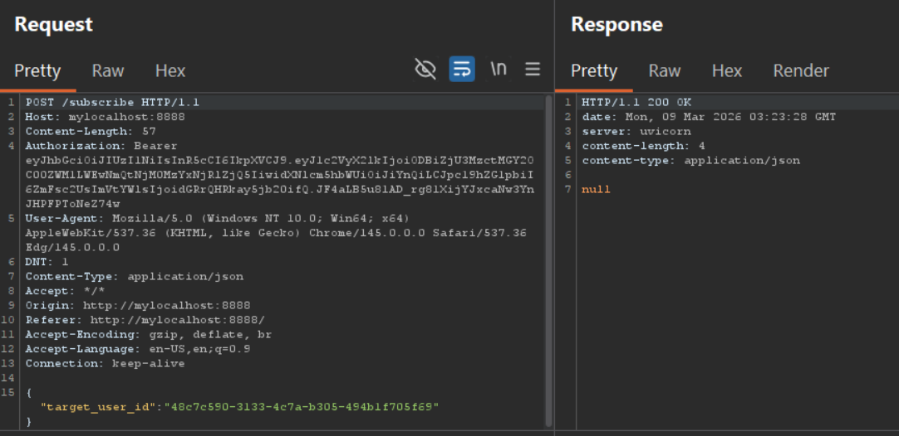

Account which is followed will be notified with an email as below:

```python
@router.post("/subscribe")
async def subscribe(
    
    ...

    try:
        target_user = UserRepository.get_user({"user_id": body.target_user_id})
        if target_user.email is not None:
            await send_new_subscriber_email(target_user, current_user)
    
    ...
```
Format and fill in mail's content
```python
async def send_new_subscriber_email(receiver: User, subscriber: User) -> None:
    assert receiver.email is not None

    template_data = {
        "username": receiver.username,
        "subscriber_username": subscriber.username,
        "subscriber_user_id": str(subscriber.user_id),
    }
    messages = [("html", render_template("new_subscriber.html", **template_data))]

    await send_email([receiver.email], "You Have a New Subscriber!", messages)
```

- `POST /post`: write your post

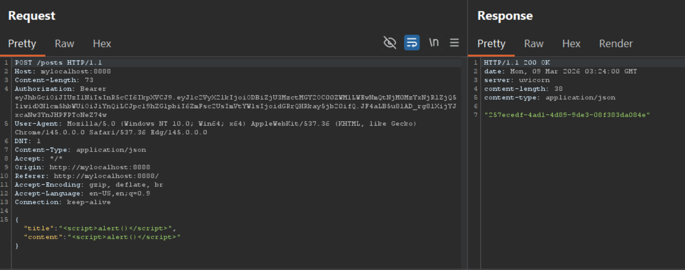

Similar to subscribe, send a email to followers whenever new post is created.

```python
async def send_new_post_email(author: User, post: Post) -> None:
    subscribers = [
        user
        for subscriber in author.subscribers
        if (user := UserRepository.get_user({"user_id": subscriber})) is not None
    ]
    subscriber_emails = [
        subscriber.email
        for subscriber in subscribers
        if subscriber and subscriber.email is not None
    ]

    template_data = {
        "author_user_id": str(author.user_id),
        "author_username": author.username,
        "post_id": str(post.post_id),
        "post_title": post.title,
        "post_content": post.content,
    }
    messages = [("html", render_template("new_post.html", **template_data))]

    await send_email(subscriber_emails, "New Post Published!", messages)
```


- `POST /post/import`: provide a url, server will write the response into the post's body. Title is "Imported Post" if no path provided. Before importing, server filter the url to ban if there is any specific keywords.

```python
def blocked_path(url: str) -> bool:
    path = urlparse(url.strip()).path
    path_lower = path.lower()
    decoded_path_lower = unquote(path).lower()
    return any(
        keyword in path_lower or keyword in decoded_path_lower
        for keyword in BLOCKED_PATH_KEYWORDS
    )


def is_url_safe(url: str) -> bool:
    parsed = urlparse(url)
    blocked_schemes = {"file", "ftp", "gopher", "data", "javascript", "vbscript"}
    return parsed.scheme.lower() not in blocked_schemes
```

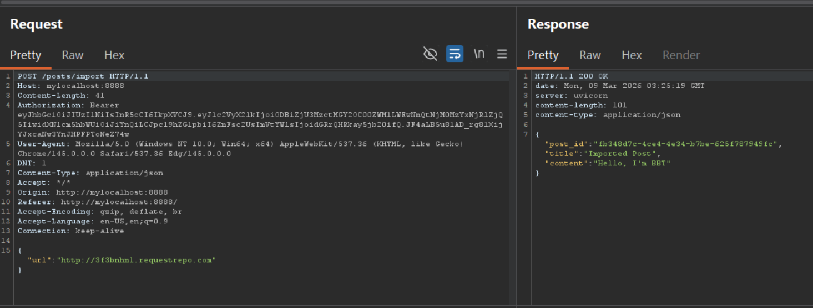


- `POST /post/mine`: get all posts of current account

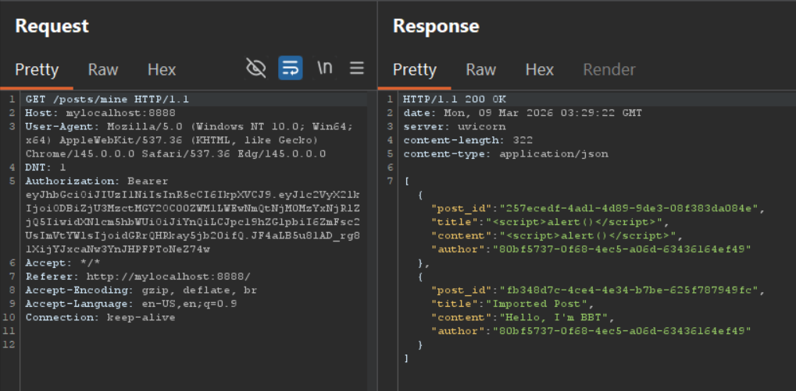

- `GET /users`: get all in4 of current user, including: post, subscribers, the following

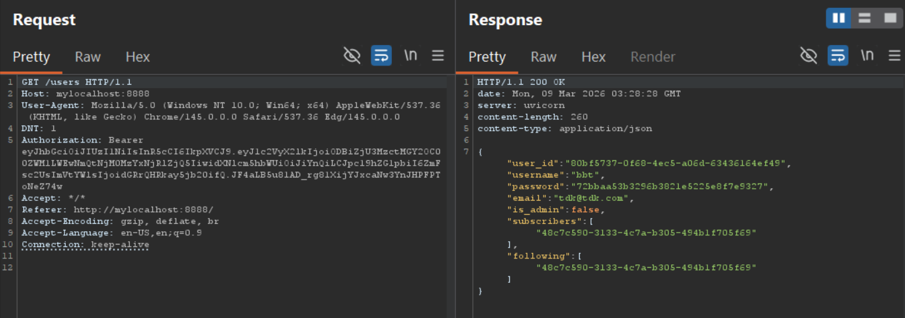


> In both cases: **subscribe** and **post**, the emails are not sent to users but writen into `/tmp` within filename is hash md5 of user's email (only write if there exists user email)

```python
async def send_email(
    receiver_emails: List[str], subject: str, messages: List[Tuple[str, str]]
) -> None:
    if not receiver_emails:
        return

    msg = MIMEMultipart()
    msg["From"] = EMAIL_SENDER
    msg["To"] = ", ".join(receiver_emails)
    msg["Subject"] = subject

    for type, content in messages:
        msg.attach(MIMEText(content, type))

    email_hash = hashlib.md5(receiver_emails[0].encode()).hexdigest()
    filepath = f"/tmp/{email_hash}.html"

    with open(filepath, "w") as f:
        f.write(msg.as_string())

```

## Vulnerability Analysis

Inspecting the src code, I found two interesting points:
- The backend is using `Jinja2 3.1.5` which is known for **CVE-2025-27516**. According to the [article](https://www.cve.org/CVERecord?id=CVE-2025-27516):

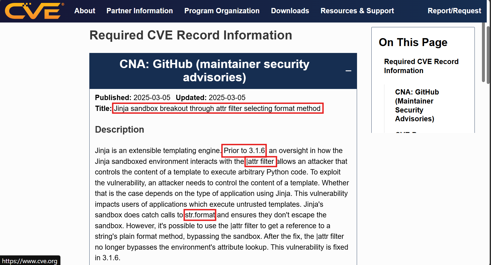

Normally, jinja2 will inspect the appearance of dot `.` and check if the attribute is being accessed is dangerous and block it. But in jinja2 3.1.5, it misses to check `|attr()` which behaves similar to the dot `.` to access dynamically attributes.

Jinja2 also blocks using Python format string `str.format()`. However, abusing `|attr()` will bypass this filter:

```python
{{ '{}'
    |attr('format')
    ('Hacked!')
}}
```
will print out `Hacked!`. 

- Another one is that backend is using `Python 3.11.3`, which is vulnerable to **CVE-2023-24329**:

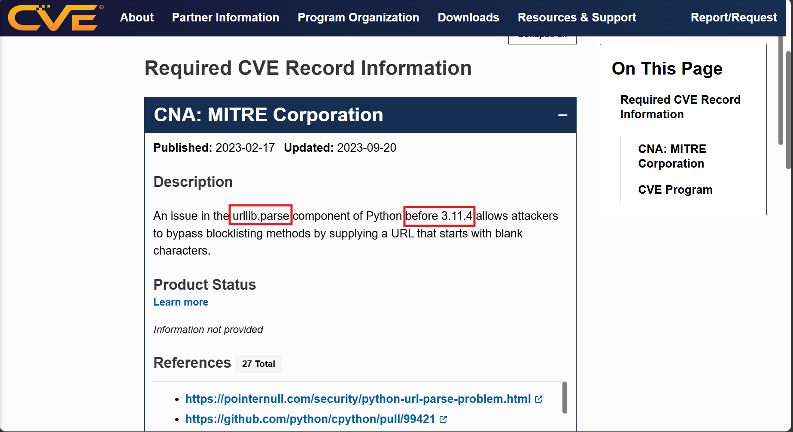

In the filter system when importing post, server use url.parse to get the scheme and path. If attacker inserts a space before the scheme, then the url.parse will not get the **correct** scheme, thereby later comparison wil be false and bypass the filter.


### Vulnerabilities:
The biggest mistake is employing old version of tech stacks, which have CVE.

The CVE for jinja2 3.1.5 in this case could only result in **Information Disclosure**. Because sandbox strictly forbids `__` and some dangerous attributes like `__globals__` and `__import__` etc.... Then, if we want to access attrbute and do dictionary lookup, the only way is via `str.format`or in this case is `str|attr('format')`. And format can only return the string representation of an object and cannot execute methods like popen() or read().

## Exploitation

We will chain the behaviours of the webapp to gain the secret.

First we **signup two accounts** and let them **follow each other** since email is only sent if there is followers/subscribers. 
Below is the credentials I sign up:
- bbt   :  bbt  :   tdk@tdk.com
- test  :   test    :   test@test.test

Then I post a post in bbt account with this content: `{{ "{0.__globals__[os].environ}" | attr("format")(lipsum) }}`


Check the docker, confirm that new file is written with the filename before .html is md5 hash of **test@test.test**


Check the content of file:

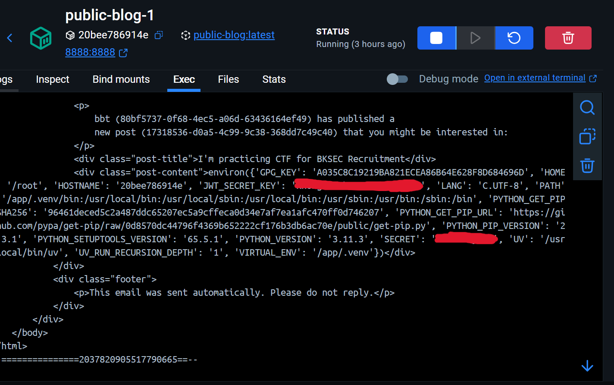

Since in the real challenge, we dont have docker, we will have to make it disclose the secret onto the screen. Now, I'll abuse CVE-2023-24329 to bypass the filter to import local file.


Carry out the same steps for the real challenge:

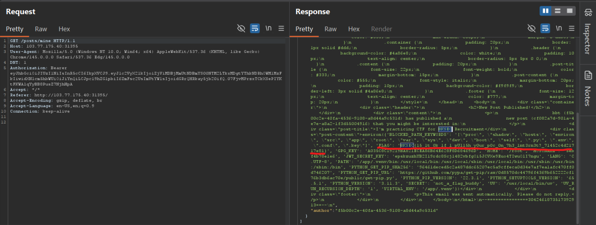

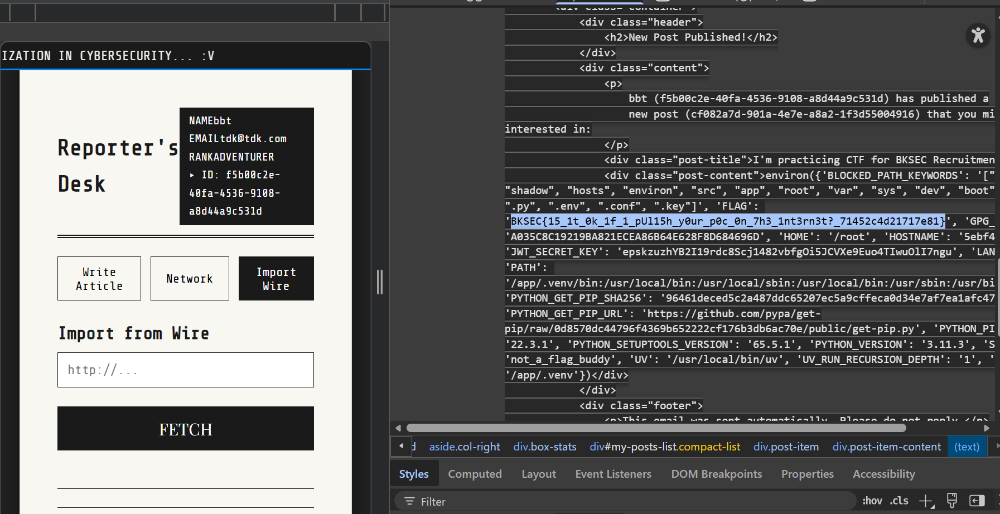

**Explanation of payload:** 

`{{ "{0.__globals__[os].environ}" | attr("format")(lipsum) }}`

As I state above, **str.format** is blocked, using **str|attr('format')** will bypass. As usual, using `__globals__` is detected by the sandboxedenvironment; however, after fooling jinja2 within **|attr**, the format function actually belongs to CPython, which is coded in C to enhance performance. Then when **format** is passed to lower level system, it is not in the control of jinja2 anymore, then \_\_globals__ works well.

`0` is the index of argument, in this case is `lipsum` which is default function installed in all jinja2 version and has attribute `__globals__`. Then just access the attributes. This payload doesn't run any command or function but attribute lookup, which works for `format`

> Flag: ***BKSEC{15_1t_0k_1f_1_pUl15h_y0ur_p0c_0n_7h3_1nt3rn3t?_71452c4d21717e81}***

