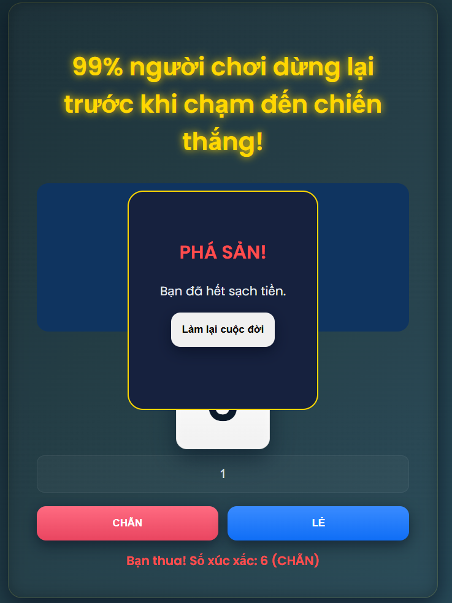
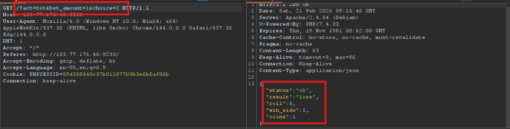
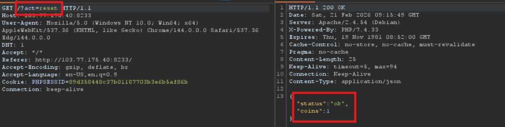
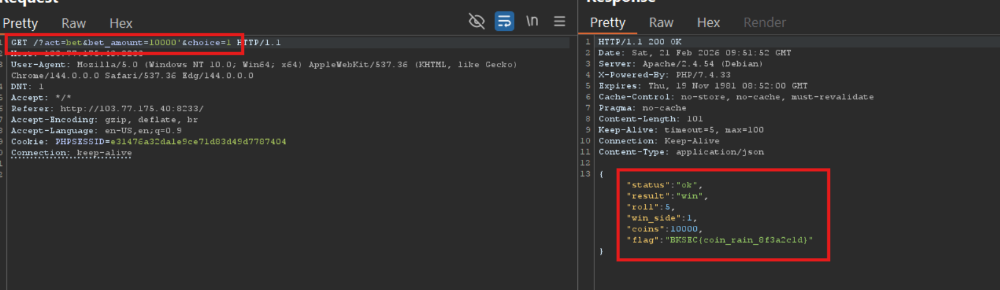

# Gambling Coin 1 (BKSEC Training 2026)
---
## Overview
The web gives us a dashboard to bet. Choosing correct output get one more coin, otherwise, lose one. If broke, remake your life =))))




## Functionality analysis

There only one route, the behaviour is updated based on the sent parameters:
- `/?act=bet&bet_amount=1&choice=1`: send the amount of bet and our choice, if choose correct, we get the bet amount, else lose such amount.


- `/?act=reset`: simply reset the game, set initial coin to 1



## Reconnaissance
Let the bet_amount to be **1000** and choice be **true**, server returns "Tiền cược không hợp lệ"


Leting choice be true or false doesn't affect the result.
It looks like the server does check the bet_amount like this: `if (bet_amount < coins) { bet }`

But when I inject `'` after bet_amount and let the bet_amount larger than my coins, server still accepts as normal whatever lose or win, server behave normally.


Win, coins increase


Lose, coins decrease


## Vulnerability analysis
At this time, I guess devs have made mistakes. The code may look like this:

```php
$bet_amount = $_GET['bet_amount'];
$choice = $_GET['choice'];

if (is_numeric($bet_amount) && $bet_amount > $coins){
    die("You are so poor, go out make some money")
}

if ($choice == $roll){
    $coins = $coins + $bet_amount;
}
```

So dev may have made two mistakes:
- ***Logic flaw***: I inject string `2'`, and since 2' in **is_numeric** is false, the latter condition is not checked anymore. Unintentionally escape the condition though **bet_amount** larger than **coins**.
- ***Type Juggling***: which happens when choice is correct, and inside the coin update. In php <= 7.x, when plus a number and a string, it will try to convert the string into number. In this case is `2'` will become 2 as a number. (Note that `'2` still work since it is converted to 0)


### Vulnerabilities:
- Logic flaw: dev doesn't check the conditions tightly
- Type juggling: auto convert string to number when performing operations.

## Exploitation
Now, everything is rather simple, let the `bet_amount` to be `10000'`, repeat the bet some times until the choice is correct and get the flag.



> ***BKSEC{coin_rain_8f3a2c1d}***