# Gambling Coin 2 (BKSEC Training)
---
## Overview
The dashboard gives us a form to input the bet amount and button place bet. Also reset game button (reset to 1 coin).

The author requires coins to be 9 to get the flag.

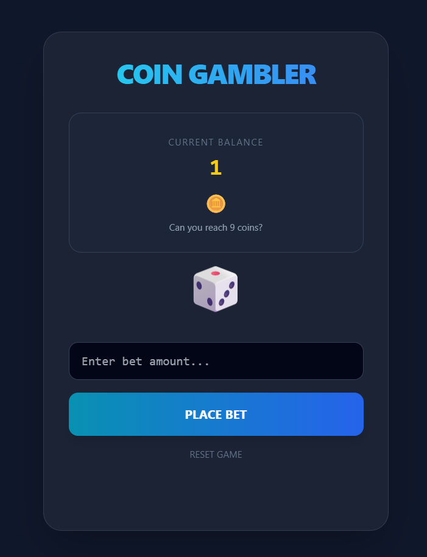

## Functionality analysis

There are 2 endpoints to call:

- `/api/status`: server returns the coin value and number of coin to display and flag value.

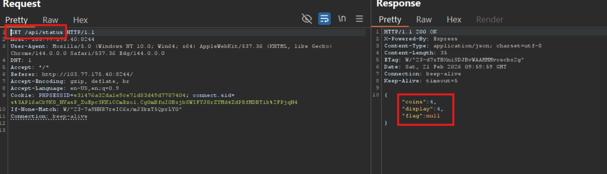

- `/api/bet`: post the bet amount, then server returns the result of losing or winning and new balance

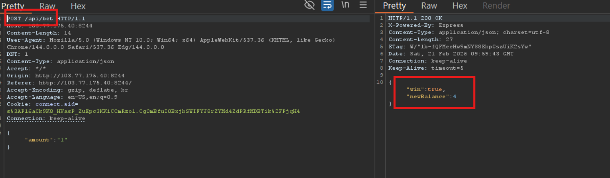

## Reconnaissance

I tried injecting weird char but nothing special.

with number `1`, it returns as normal

with string `"1"`, also same

with string `"1'"`, error shown

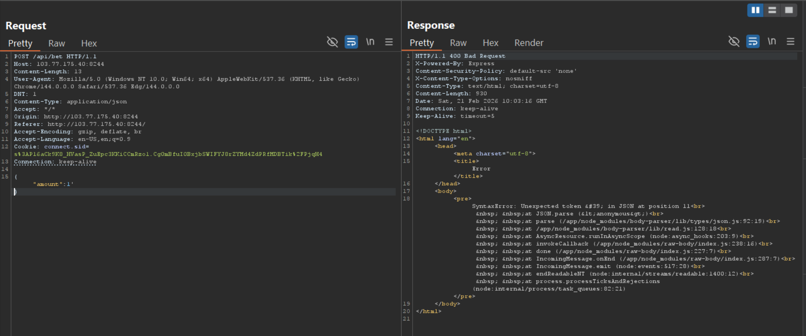

with value exceeding curren balance, error

I found it works with float number

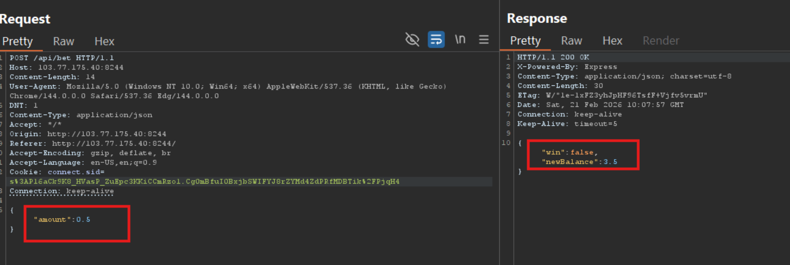

Since computer doesn't store float number in exact value, I tried bet_amount the same as balance. At this time, my balnce was 3.5 coins. I would bet 3.5 but it returns 0

At this points I wondered display value is the floor of coins or ceil of coins ?

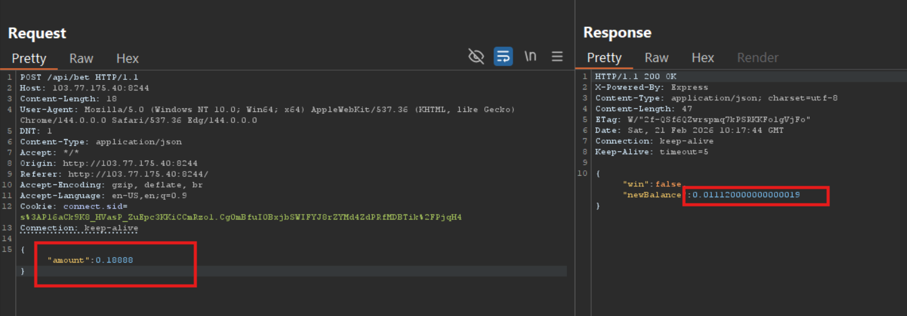
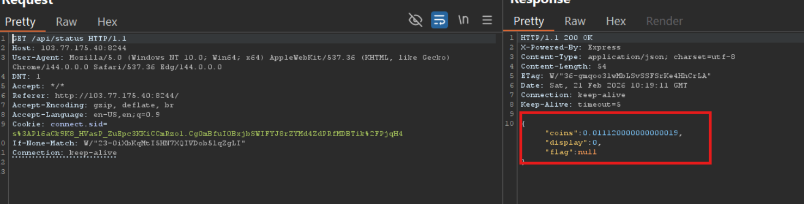

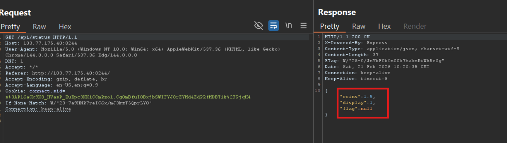

This indicates that display only takes the integer part to display. So if I can make it present scientific number like 1e-123 then display will be 1

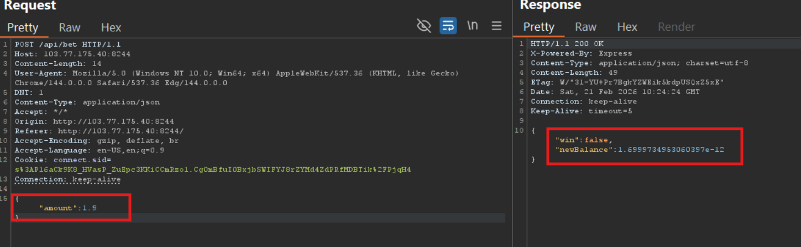
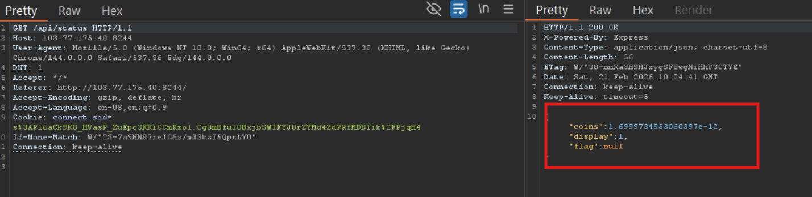
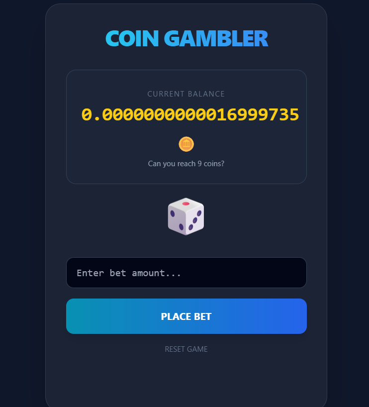

## Vulnerability analysis
This is apparently logic flow when dev takes integer part without the awareness of that scientific number can also be represented in floating point number.

A very easy way to fix this is to compare if the coins is equal to 9 before choosing the display coin.

## Exploitation

Now it's easy, just fine-tune until the whole part is 9. 

You should choose the number smaller than the balance

For example: if balance is 1.6e-12, then you can choose 0.7e-12, in which then your balance will become 9.0e-13

Gotchaaa, first blood on the third day of Lunar New Year 2026 !!!!!!

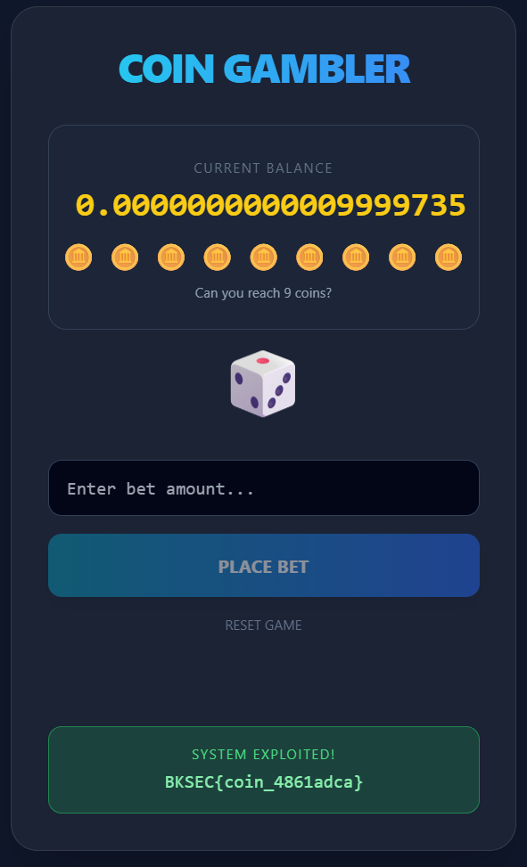

> ***BKSEC{coin_4861adca}***

