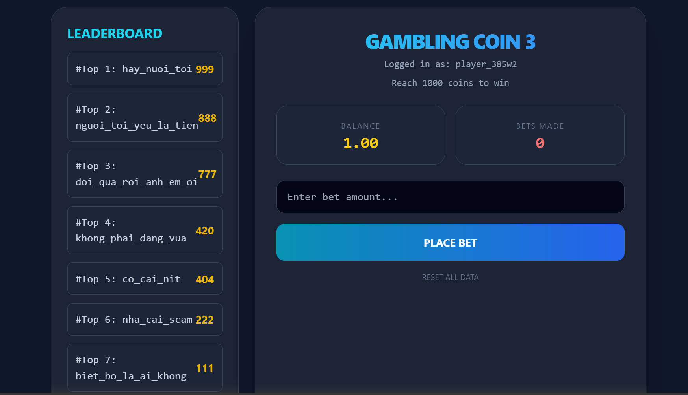
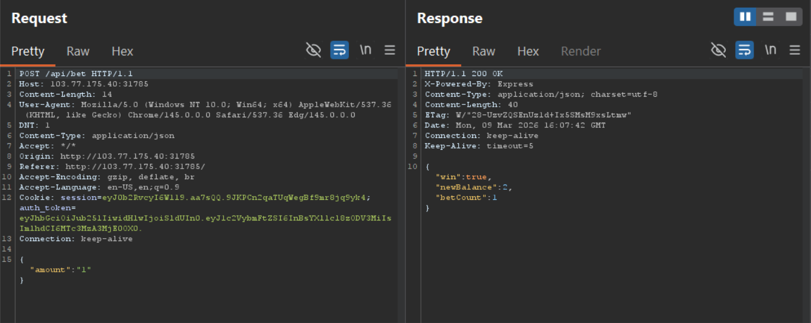
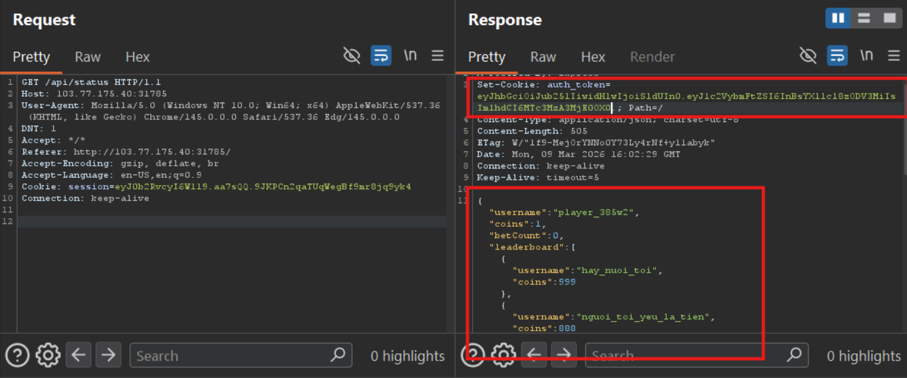
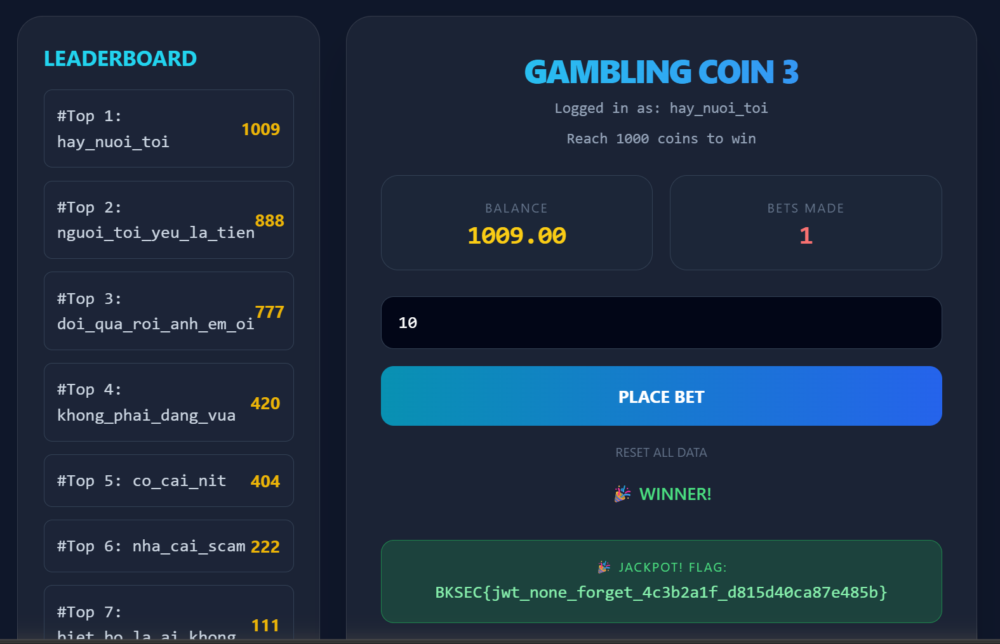

# Gambling Coin 3 (BKSEC Training 2026)
---

## Overview

The webapp provides us with a dashboard showing our balance, number of bets have been made by us, betting function and a list of users sorted by balance.

## Functionality analysis

An endpoint: `/api/bet`: win bet amount or lose the same amount, chances are 50:50

Doesn't allow betting exceeds current balance

`/api/status`: return json-structure list of users with their name and balance and current account information. Server also grants us an auth_token JWT.

## Vulnerability analysis

Decode the JWT token:

Server doesn't use any algorithm to sign the cookie, which is very dangerous, since attacker can forge the cookie and server won't know.

## Exploitation

Let forge a jwt with username of highest balance: **hay_nuoi_toi**

Paste the forge jwt into **authe_token*** and refresh:

Bet for some times to get more than 1000 coins

> Flag: ***BKSEC{jwt_none_forget_4c3b2a1f_d815d40ca87e485b}***