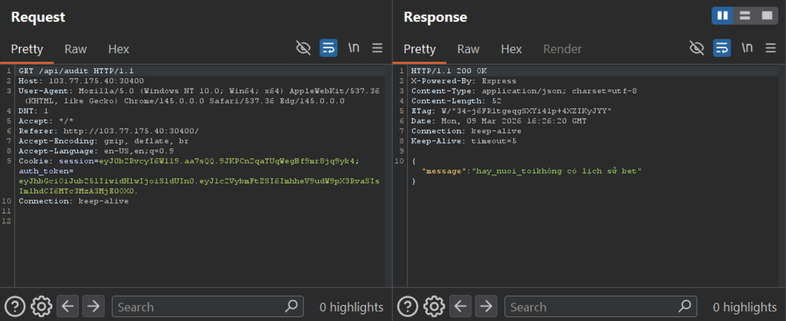
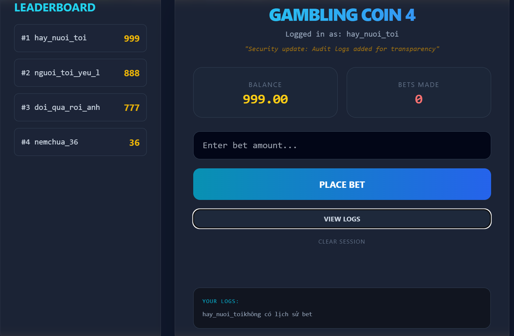
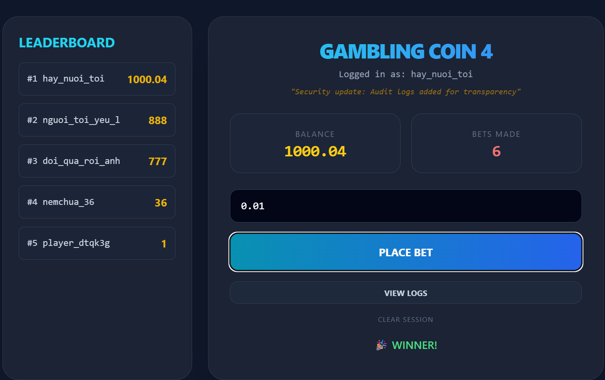
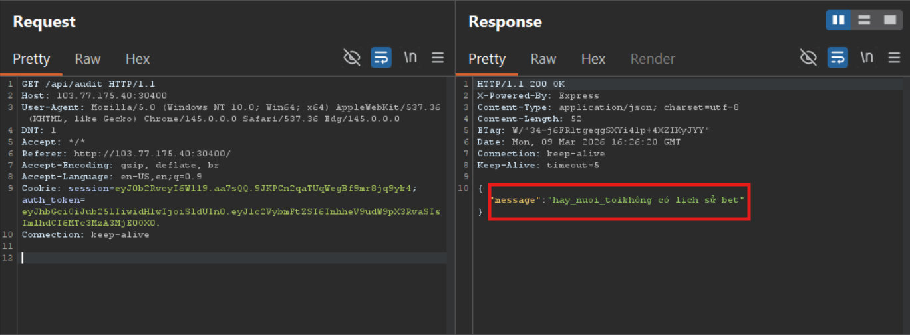
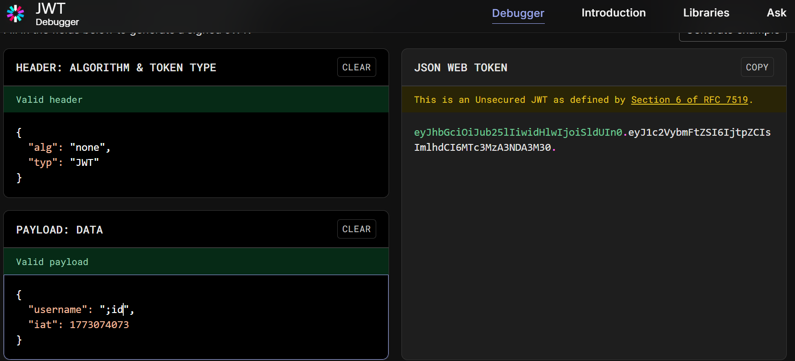
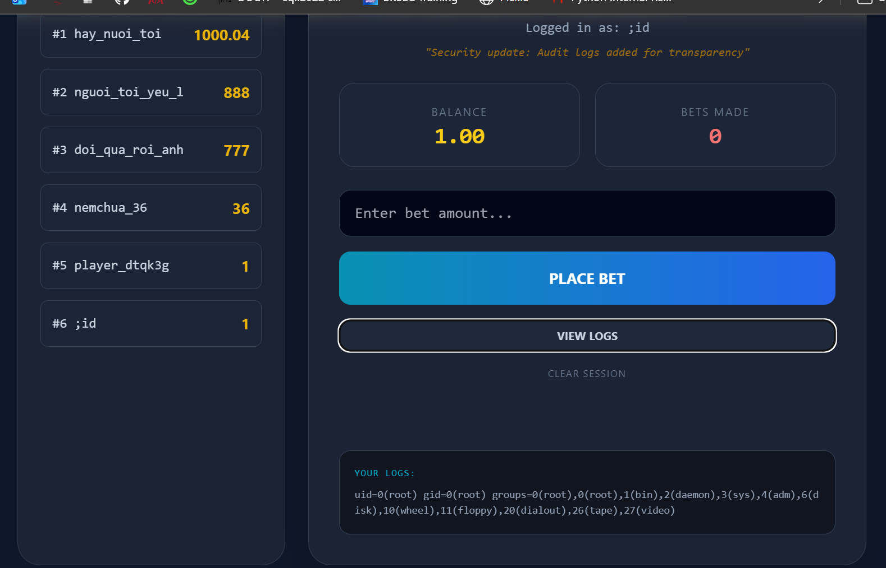
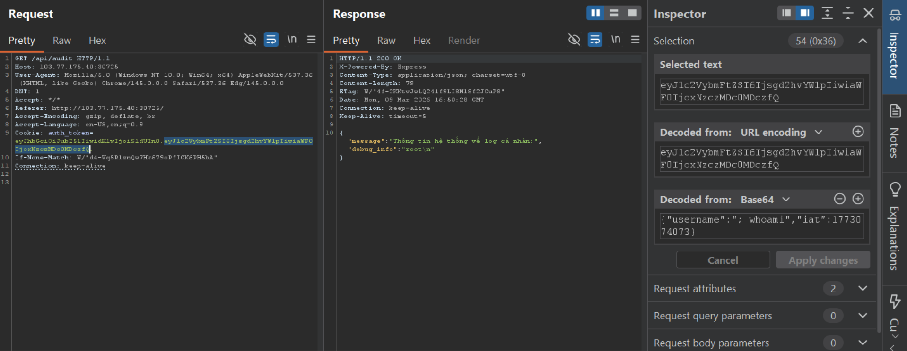
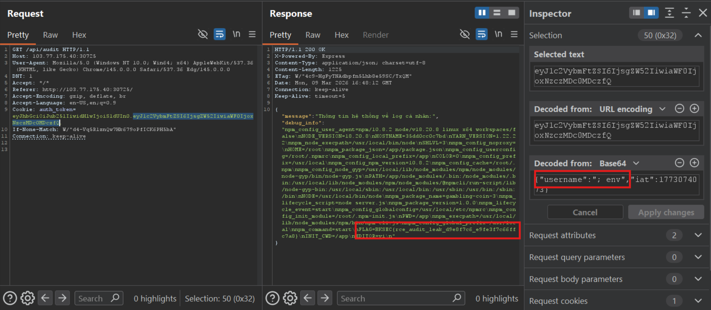

# Gambling Coin 4 (BKSEC Training 2026)
---
## Overview

The webapp has been updated with view log function, the rest is the same as [Gambling Coin 3](../Gambling%20Coin%203/README.md)

## Functionality analysis

Same as [Gambling Coin 3](../Gambling%20Coin%203/README.md)

Add view log function:

`/api/audit`: show bet history



## Vulnerability analysis

Server still employ JWT with None algorithm, let's forge a jwt with highest balance account.



Bet for some times to get 1000 coins



Even 1000 coins doesn't get us flag.

Look at the audit when we haven't made any bet yet:



"**hay_nuoi_toi**" is sticked to "**không có lịch sử bet**". I reckon that if user has no bet, server echo username with "**không có lịch sử bet**" like: 

```
username={username}
echo $usernamekhông có lịch sử bet
```

Try with OS command injection in username put in jwt:







This confirm the server is vulnerable to OS Command Injection

## Exploitation

Read environment variables



> Flag: ***BKSEC{rce_audit_leak_d9e8f7c6_e9fe3f7c66ffc7a8}***
