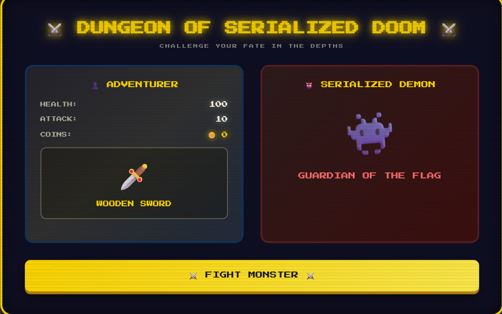
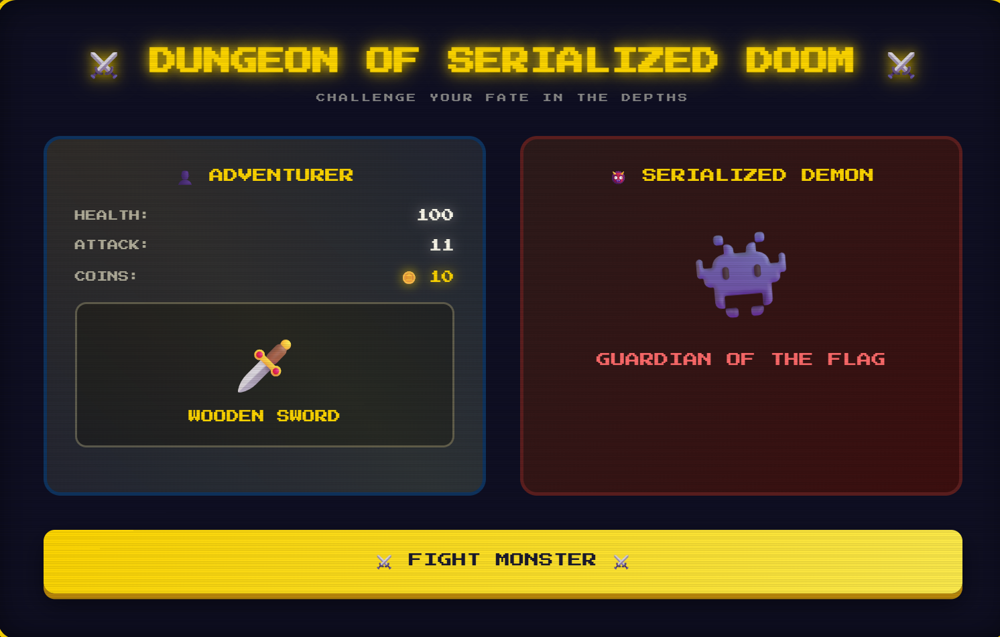
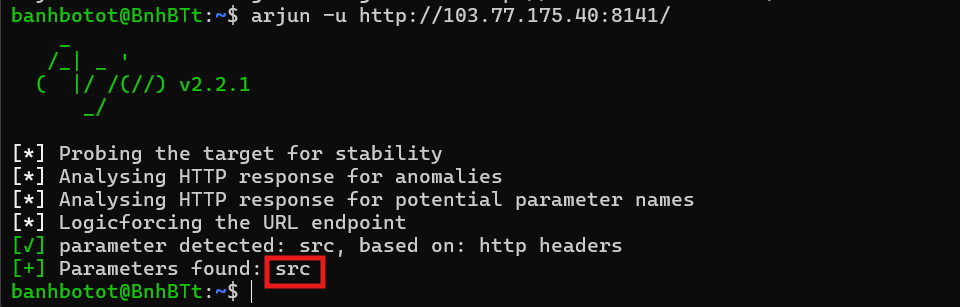
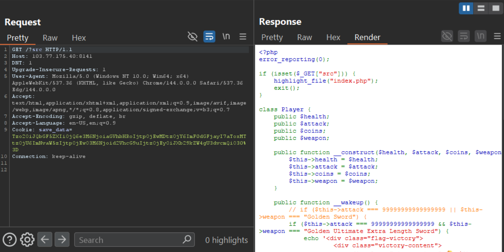
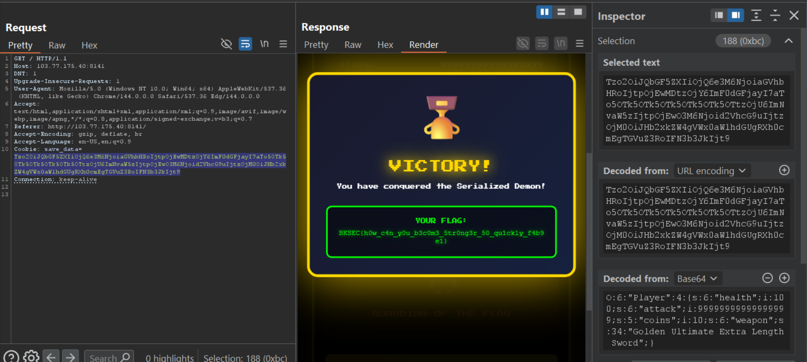

# Happy Soldier (BKSEC training 2026)
---

## Overview
- `/`:

The page shows us a console with player card including: `health`, `attack`, `coins` and `weapon`; together with moster card.

`Fight monster` button upon clicking will update attack +1 and coins +10



## Functionality analysis

At the first visit, the server grants us a cookie (based64 encoded) and the tech server uses is PHP 7.4.33.


Look at the decoded result, it's a serialized PHP object to store the state of our soldier. When we send the cookie to server, it looks at the cookie's values (attack, coins, ...) and renders html according to them. 

- `/?action=fight`:

Upon clicking `fight mosnter`, a GET request is sent with parameter `action` = `fight` together with cookie.

The server then returns updated cookie as shown in the figure below.




## Vulnerability analysis

From this situation, we can infer that server may be vulnerable to **insecure deserialization** for PHP Object.

Sending modified object gives us a new dashboard.


Even with super high attack and coins, also "golden sword" cannot defeat the boss. I check for other vulnerability.

First one is SSTI, I use this [polyglot](https://github.com/swisskyrepo/PayloadsAllTheThings/blob/master/Server%20Side%20Template%20Injection/README.md): `${{<%[%'"}}%\.` which almost induces error if there is template-rendering.


Not works.
Even with XSS is also filtered with function `htmlspecialchars`


After a while, various vul have been tried, I think there must be source which requires a specific value of attack or some stuff so that we can win.

I recon with `ffuf`:
Because the server is rather weak, almost of my requests from `ffuf` is not responded. Then I ask AI for tool that scans mildly and get `arjun`. It is a tool scanning for any hidden parameters. In this challenge, there is one param is `action`, so I think there will be some correlations or it can be a small hint from author =)).

I use `arjun` to seek for hidden parameter and get `src`:



A few explanation why arjun works is that: While other FUZZing tool like **ffuf** or **gobuster**, **dirbuster**, it constantly sends tons of requests to server which can't handle a large amount of such; **arjun** is a special tool used only for finding hidden parameter, whatever the sent parameters exists on the server or not, as long as the URL base is correct, server still responds. 

And for each request, arjun send hundreds of param at once. If there is any anomaly compared to original request, it uses binary search-alike technique to find out which parameter causes different behavior.

Now, we get `src`, send a request to: `/?src` returns source code of the challenge.



Looking at the code, we have this PHP code:

```php!
<?php
error_reporting(0);

if (isset($_GET["src"])) {
    highlight_file("index.php");
    exit();
}

class Player {
    public $health;
    public $attack;
    public $coins;
    public $weapon;

    public function __construct($health, $attack, $coins, $weapon) {
        $this->health = $health;
        $this->attack = $attack;
        $this->coins = $coins;
        $this->weapon = $weapon;
    }

    public function __wakeup() {
        // if ($this->attack === 99999999999999999 || $this->weapon === "Golden Sword") {
        if ($this->attack === 99999999999999999 && $this->weapon === "Golden Ultimate Extra Length Sword") {
            echo '<div class="flag-victory">
                    <div class="victory-content">
                        <div class="victory-icon">🏆</div>
                        <div class="victory-title">VICTORY!</div>
                        <div class="victory-subtitle">You have conquered the Serialized Demon!</div>
                        <div class="flag-box">
                            <div class="flag-label">YOUR FLAG:</div>
                            <div class="flag-text">' . htmlspecialchars(file_get_contents('/flag.txt')) . '</div>
                        </div>
                    </div>
                  </div>';
        }
    }
}

// Load or create player data
if (isset($_COOKIE['save_data'])) {
    $player = unserialize(base64_decode($_COOKIE['save_data']));
} else {
    $player = new Player(100, 10, 0, "Wooden Sword");
    setcookie('save_data', base64_encode(serialize($player)), time() + 3600, '/');
}

// Handle "upgrade" action
$justFought = false;
if (isset($_GET['action']) && $_GET['action'] === 'fight') {
    $player->coins += 10;
    $player->attack += 1;
    setcookie('save_data', base64_encode(serialize($player)), time() + 3600, '/');
    $justFought = true;
    header("Location: " . strtok($_SERVER["REQUEST_URI"], '?'));
    exit();
}
?>
```

The code has a magic method `__wakeup()` which is immediately called when php unserialized an object.
In this code block, it compares neccessary attributes of the object to determine whether the user wins or not. In other cases, if inside `__wakeup()` has function `file_get_contents()`, `readfile()`, `include()` or `require()`,... , if not handled properly, attackers can abuse the method to read arbitrary files on the server.


## Exploitation
Modify the object such that it satisfies the 2 conditions: 
- `attack` =  99999999999999999
- `weapon` = Golden Ultimate Extra Length Sword

Also edit the s string length according to weapon's length.

Payload: `O:6:"Player":4:{s:6:"health";i:100;s:6:"attack";i:99999999999999999;s:5:"coins";i:10;s:6:"weapon";s:34:"Golden Ultimate Extra Length Sword";}`

Final payload (base64 encoded): `Tzo2OiJQbGF5ZXIiOjQ6e3M6NjoiaGVhbHRoIjtpOjEwMDtzOjY6ImF0dGFjayI7aTo5OTk5OTk5OTk5OTk5OTk5OTtzOjU6ImNvaW5zIjtpOjEwO3M6Njoid2VhcG9uIjtzOjM0OiJHb2xkZW4gVWx0aW1hdGUgRXh0cmEgTGVuZ3RoIFN3b3JkIjt9`



> Flag: ***BKSEC{h0w_c4n_y0u_b3c0m3_5tr0ng3r_50_qu1ckly_f4b9e1}***