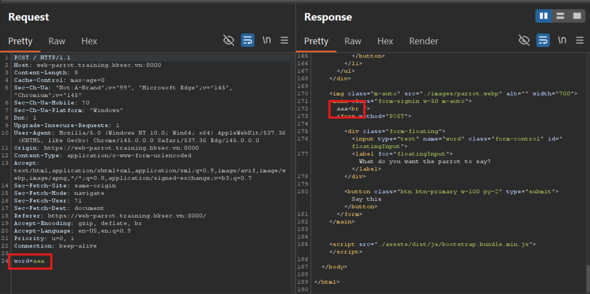
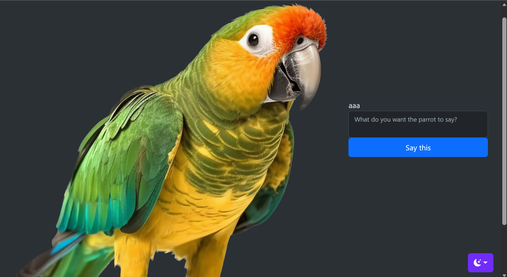
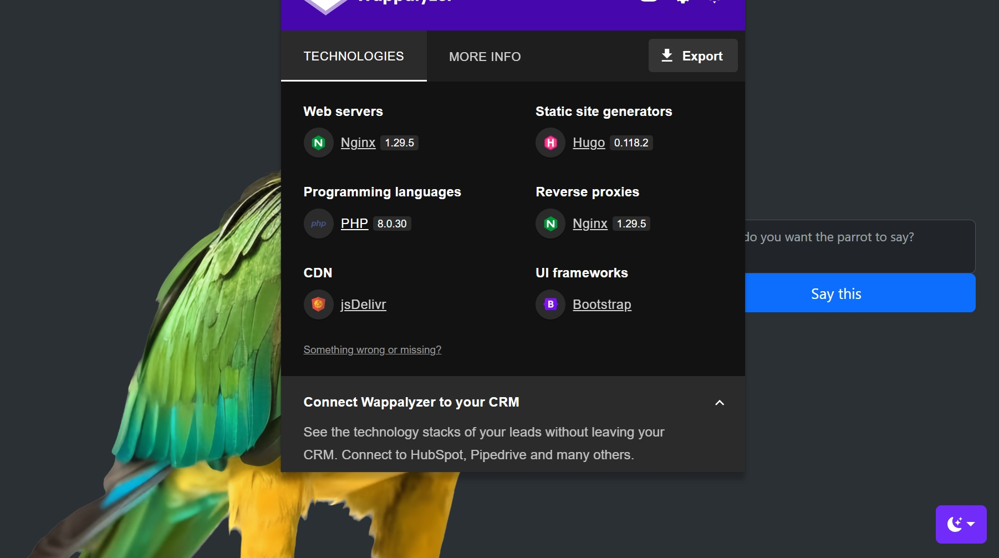
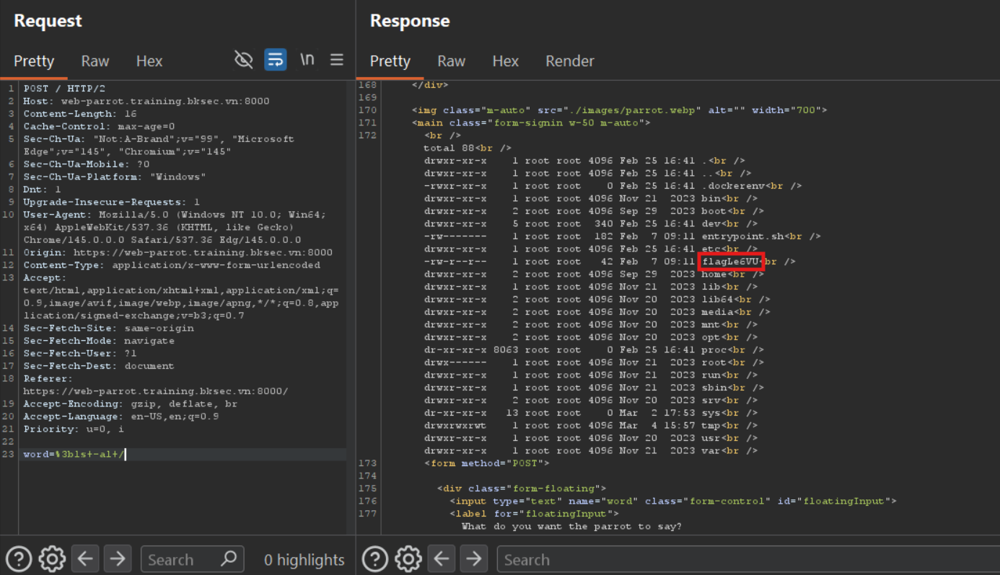

# Parrot (BKSEC Training 2026)
---

## Overview
Webapp provide an input form which reflect user' input.

## Reconnaissance

Check **wapalyzer** knowing that server employs **PHP 8.0.30** 

Reckon the backend using `echo {user input}` to reflect the data.

Try with `; id` to see if the code validates user input carefully. The semicolon `;` if concatenate directly behind `echo`, it will terminate the current command. And if `echo {user input}` is executed inside `system` or similar OS execution command, `;` ends `echo` command, start with new command `id`

This confirms that the server is vulnerable to **OS Command Injection** when somehow not validate user input but append directly to OS command

## Exploitation

Now this is easy, list dir at `/` and cat flag

> Flag: ***BKSEC{br0_th1s_s33ms_34sy_w1th_y0u_5e9c2b}***

