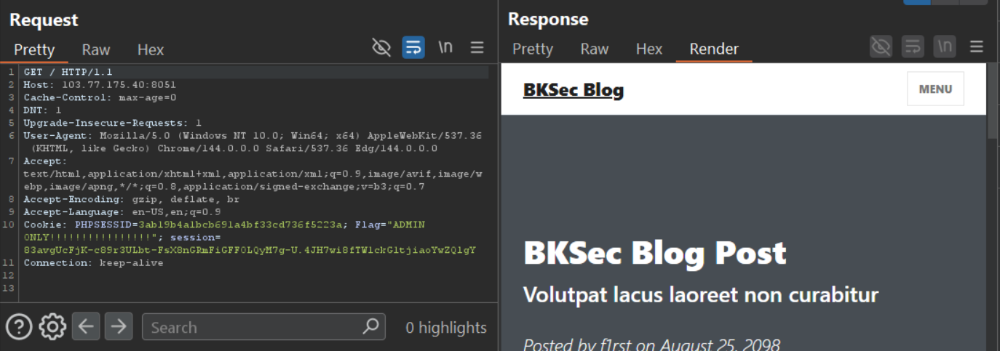
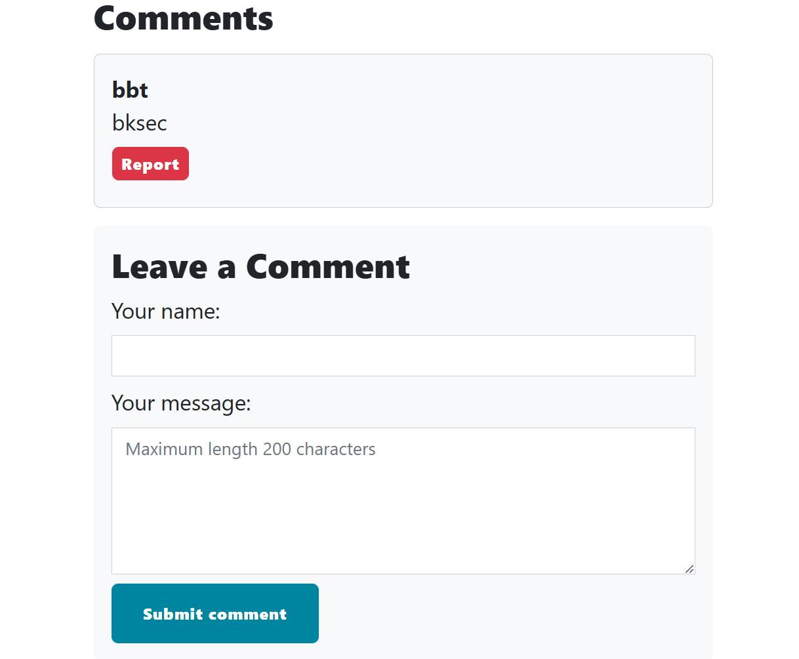
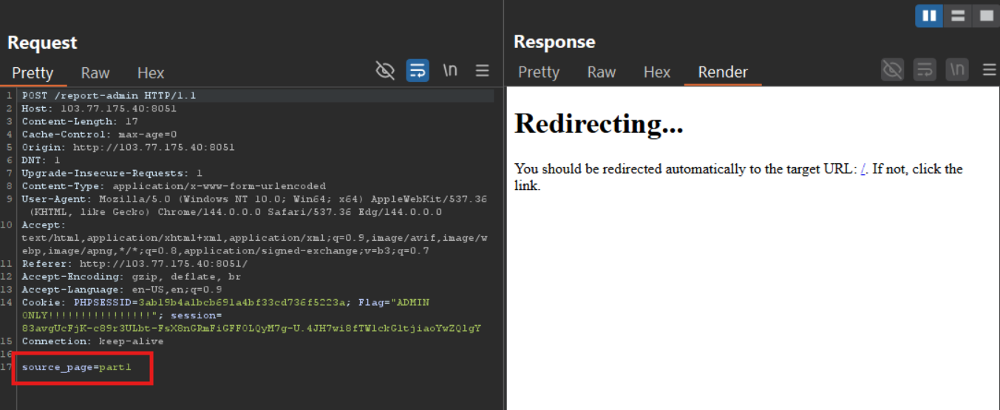
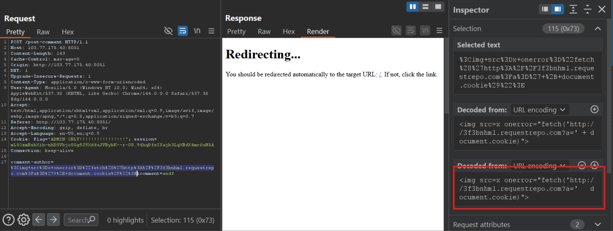
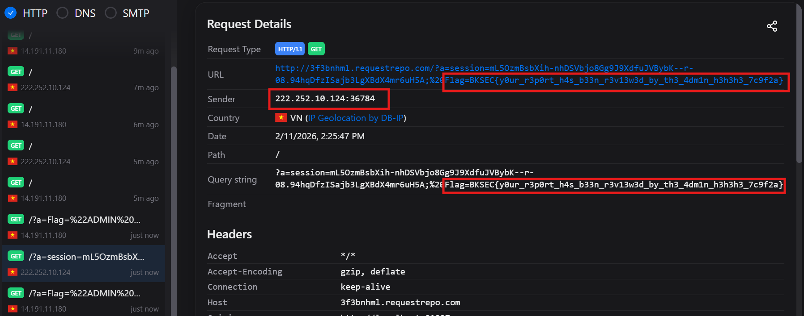

# Report the violations (BKSEC training 2026)
---
## Overview

The site shows us an article, in which we can comment and report the comment for admin.

## Functionality analysis
At `/`
- `Comment area`: Where we can type your name and your message

The server also sets cookies: with `PHPSESSID`, `Flag` and `session`

After submit our comment, a POST request is sent to `/post-comment` and is redirected to `/` to display our comment.

**Report** sends a POST request with body is `source_page=1` and redirects back to `/` with a notification of a successfully report.

## Vulnerability analysis

Let's try submiting XSS payload in both pages `name` and `message`, and also modify the `source_page`:

- This is `name` (**source_page 1** i think so)

The return page shows us `js` code has been inserted to the html results.

- However, the second page (**source_page 2**) is XSS-filtered as shown in the below figures.

And this time, to check if admin really visits `source_page` from user input, I'll send a payload which will call to our listener (RequestRepo)

And report:
- `source_page` = 1

A new request coming from the organizer's IP proves that admin check `name` part.

- `source_page` = 2

For value is 2 and whatever value, even I delete the value and let it be `source_page=`, there is still request to my listener, from which we can imply that admin checks the whole article, not just the part, and gets XSS whatever the `source_page` is.

- **Vul 1**: The admin will check the page sent from user, however, it is user-controlled: `source_page`. We can modify it to make admin check the source page we want.
> However, nothing can be exploited from vul 1

- **Vul 2**: Server doesn't filter `name` from users but inserts directly into the page and returns it to users. Attacker can abuse XSS to steal cookie admin when admin visit the page with XSS payload presented at the comment part.

### Root cause:
The server doesn't filter entirely user's content, which spares attack vector for attackers to insert XSS payload into the comment name, results in ***Stored XSS***. Attackers can inject malicious to the comment and steal credentials from web-visitors.

## Exploitation

I send the same payload as above with little modification to include admin's cookie when the admin visit the page:

Payload: ``

Report and wait for the coming request.

The article is checked by (maybe) bot from different IP address.

> ***Flag: BKSEC{y0ur_r3p0rt_h4s_b33n_r3v13w3d_by_th3_4dm1n_h3h3h3_7c9f2a}***

