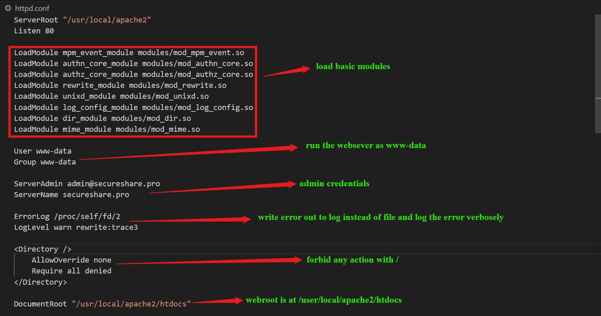
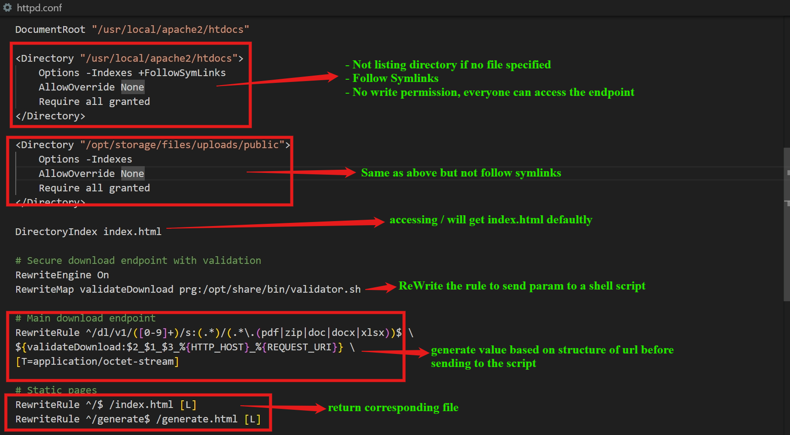
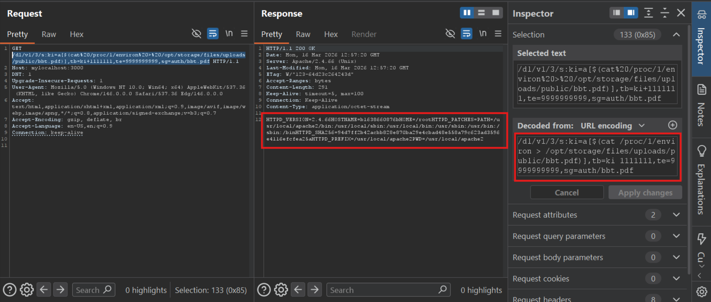
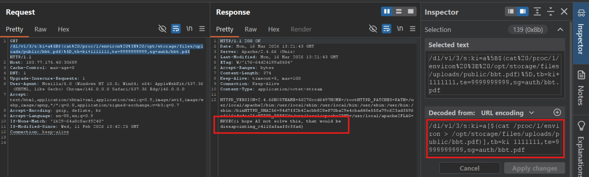

# bash (BKSEC Training 2026)
---

## Overview
The webapp provide an interface to adjust parameters and generate link based on these. Access to the generated link will download the chosen file.

## Source code analysis

It seems the challenge doesn't have a real backend. Just a shell script listens and responds to the call of Apache.

Looking at the [Dockerfile](src/Dockerfile), the interesting point is that there is a symlink points from `/usr/local/apache2/htdocs/opt` to `/opt`. 

[index.html](src/index.html) contains static contents

[generate.html](src/generate.html) has a script block that generates link to download specified file based on some parameters

For the [httpd.conf](src/httpd.conf)

The URI will be mapped to a new value before being sent to [validator.sh](src/validator.sh) as follow:

Inspecting **validator.sh** with this value:

`ki=3,tb=1000000000,te=9999999999,sg=auth_3_8f3a9b2c-4d1e-4a5f-9c8b-7e6d5a4b3c2d.pdf_{HTTP_HOST}_{REQUEST_URI}`

For the conditions, the script ensures `tb` and `te` have their length of 10 `if (( ${#te} != 10 ))`.

So, basically, if the URI is in correct form, the server will return the specified file in the URI.

## Vulnerability analysis

validator.sh splits input into parts with the separator is underscore `_`, which comes from users. Furthermore, the script doesn't validate or sanitize user input but split immediately. So, the attacker can manipulate input to make script create unintended value/elements.

And so does the next split on the first element of `parts`

Though you can control value of parts[2] which is appended to **path**, it's meaningless exploiting. I've spent hours trapped in that hole.

The problem is inside these if statement, though they look benign. **Untrusted data as user input is not validated but being compared in two if statement `if [[ ${now} -gt ${tb} ]]` `if [[ ${now} -lt ${te} ]]`. Inside `[[ ]]` used with comparative operators `-gt` `-lt`, this is an arithmetic context and it is evaluated by bash.** If attacker can inject malicious code into variable like `te` and `tb`, RCE can be achieved. I found the vulnerability at [this post,](https://dev.to/greymd/eq-can-be-critically-vulnerable-338m) it covers many similar vuln you can read there.

> The next part is what I have studied while solving this challenge. I write it as note for my study, but you can also refer for more information.

### Explain the vulnerability

In arithmetic context, arithmetic expression is evaluated by the shell. If the shell needs the value which is stored in an array with a given index (for example a[0]), in some cases, the shell has to compute the expression inside the `[]` to get the index before getting the element. But computing the index unintentionally creates another shell running the expression inside as a command. So, as example in the [blog](https://dev.to/greymd/eq-can-be-critically-vulnerable-338m), `x[$(whoami>&2)]`, `whoami` is run and redirected to stderr.

This trick only happens if 2 conditions are satisfied:
1) Array with the index is a command substitution.
2) Array inside arithmetic context.

Normall, `[[]]` is not arithmetic context, it's just string context to compare strings. However, by using comparative operators like `-gt`, `-lt`, `-ge`,...; the shell tries to converts other variables into number and this is where arithmetic expressions is evaluated.

Some regular arithmetic contexts you may encounter with are:
1) `(( ... ))`, `$(( ... ))`, this is where bug certain occurs without input sanitization.
2) `[[ ... ]]` using with `-eq`, `-ne`, `-gt`, `-lt`, `-ge`, `-le`.
Not vul if using `[ ]` or `[[ ]]` with > < != ==
3) **Classic declaration command** `let`: 
for example: let "a = usercontrol + 10"
4) **Substring expansion** `${var:start_pos:length}`.
For example, `new_string=${original_string:0:tb}` and `tb` is user-controlled, there will be RCE.

For more information or dangerous contexts, you can visit these links:
- [https://www.nccgroup.com/research/shell-arithmetic-expansion-and-evaluation-abuse/](https://www.nccgroup.com/research/shell-arithmetic-expansion-and-evaluation-abuse/)
- [https://unix.stackexchange.com/questions/172103/security-implications-of-using-unsanitized-data-in-shell-arithmetic-evaluation](https://unix.stackexchange.com/questions/172103/security-implications-of-using-unsanitized-data-in-shell-arithmetic-evaluation)

So for the next time, whenever you encounter an ***arithmetic context*** in a bash script, remember this technique to inject `x[$(whoami>&2)]` 

**Off-topic**:

1) Use `$()` when you want to **run a Linux command** (ls, cat,...)
2) Use `$var` (or `${var}`) when you want to **read** value of a variable
3) Not use `$` when assigning value to a variable or in special context / arithmetic context of Bash

When assigning value to a variable, there mustn't space between the equal sign `=` and variables:
- `a=5` is okay
- `a =${b}` is not valid
---
So in this challenge, we control the value of `ki`, `tb`, `te` and `sg`. We can get RCE via them.

## Exploitation

Since the length of `tb` and `te` must be 10, which is pretty short compared to shell command and length of `ki` is not restricted, I write a reference to `ki` in `tb` (or `te`)

The value of `tb=ki+1111111`: 10-character length. Value of `ki=a[$(cat /proc/1/environ > /opt/storage/files/uploads/public/bbt.pdf)]`

**Payload explanation**: 
- In `if [[ ${now} -gt ${tb} ]]`, bash will try to cast `tb` into number, arithmetic context occurs. I add `+1111111` to make the syntactically correct and satisfy length = 10. 
- The `ki` doesn't have to be enclosed in `${}` since inside arithmetic context, bash insists that the variable will contain a value, and so access it. If bash encounters `${}` in arithmetic context, it doens't understand it and raises error. 
- When bash wants to get value from `ki`, it meets `a[$( command )]`, it has to run the command to get index, and this is where RCE happens.
- The script won't crash because after executing the command, if nothing return, the array becomes `a[]`, and bash will try to convert anything into number, it regards **non-exists variables**, **empty array** to be 0. So 1111111+0 is always less than current date. The if condition passes.
- I write the value of environ to `/opt/storage/files/uploads/public/bbt.pdf` because later on, the script check if the file exists and returns that file. `bbt.pdf` since regex requires file-to-check must end with `.pdf` or similar.

 - Because I control value of `parts` via injecting `_`, I point the `parts[2]` to my recently generated file.

**Final payload**

`/dl/v1/3/s:ki=a[$(cat /proc/1/environ > /opt/storage/files/uploads/public/bbt)],tb=ki+1111111,te=9999999999,sg=auth/bbt.pdf
`
URL encoding the payload, especially the space. 
**Note**:
- Space in **Path** must be `%20`
- Space in **Query String** must be `+`

**Regex rule**: `^/dl/v1/([0-9]+)/s:(.*)/(.*\.(pdf|zip|doc|docx|xlsx))$`

The reason why `/` in the filename doesn't break the payload is for the regex rule. The `/` is swallowed by `s:(.*)` and is considered as normal character before catching the last `/filename` ending with extension. Only the last `/` is regarded as separator between directories.

Or you don't need to add extension to file, and get content of the file via symlink `opt`: `ln -s /opt /usr/local/apache2/htdocs/opt`

>Flag: ***BKSEC{i hope AI not solve this, that would be dissapointing_c4110afaaffc3fad}***
