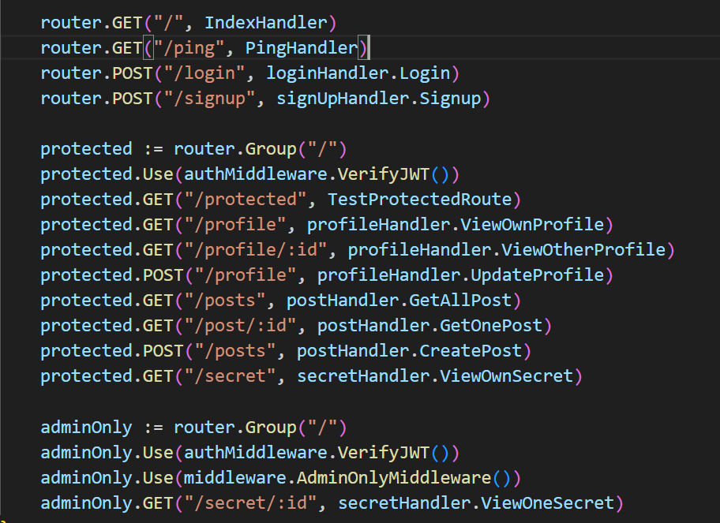
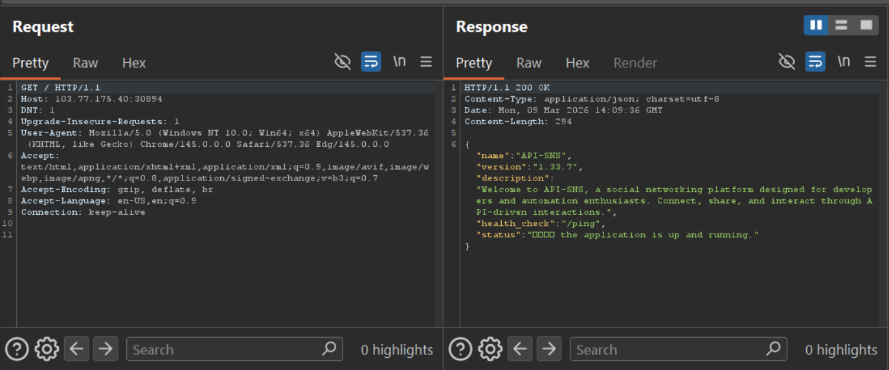
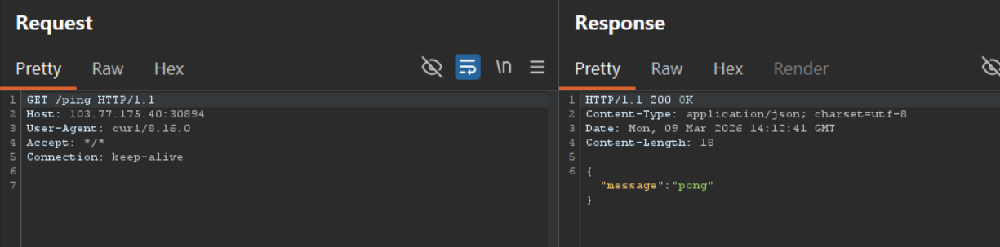
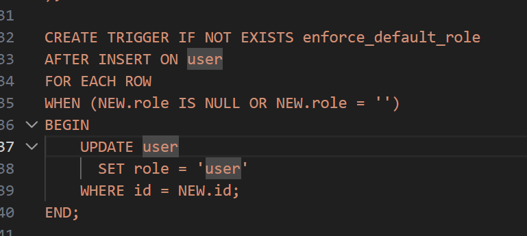
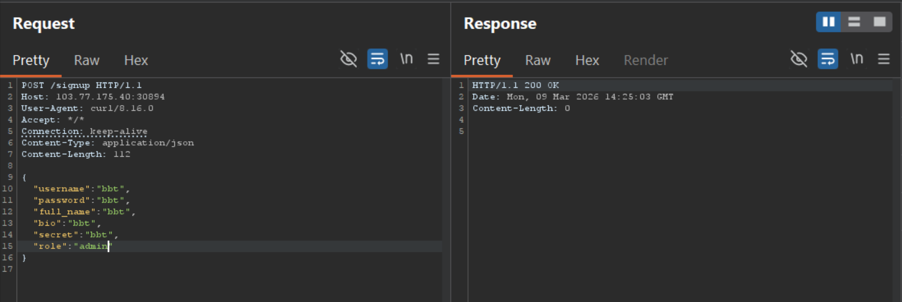
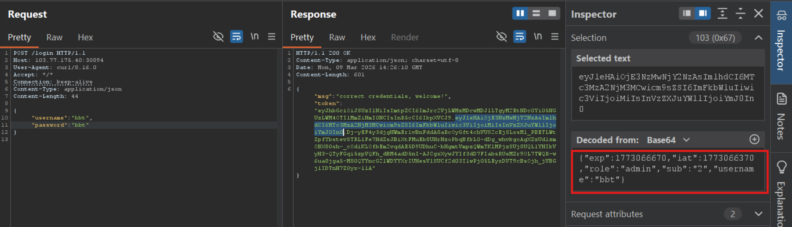
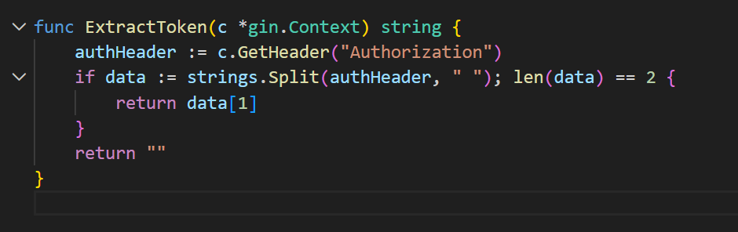
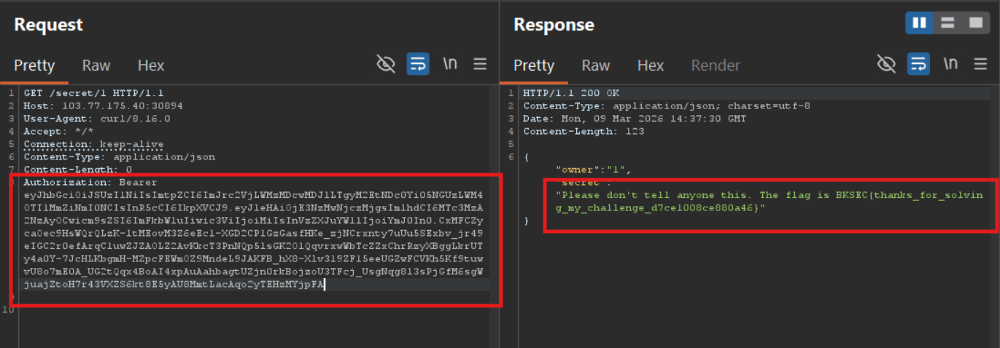

# Low-effort sns 2 (BKSEC Training 2026)
---

## Overview

The server has many endpoints including: signup, login, write post, healthcheck, secret



## Source code inspection

Firs,t check the source code, follow the application flow:

- `/`: show dashboard, nothing interesting



- `/ping`: healthcheck only



- `/signup`: sign up an account

Struct of user:

```go
type User struct {
	Username  string `json:"username"`
	Password  string `json:"password"`
	Fullname  string `json:"full_name"`
	Biography string `json:"bio"`
	Secret    string `json:"secret"`
	Role      string `json:"role"`
}
```
Account registry
```go
func (h *SignUpHandler) Signup(c *gin.Context) {
	var signupData model.User

	if err := c.BindJSON(&signupData); err != nil {
		c.JSON(http.StatusBadRequest, gin.H{
			"msg": "invalid json sent",
		})
		log.Println("error occured during read login JSON:", err)
		return
	}

	if signupData.Username == "" || signupData.Password == "" {
		c.JSON(http.StatusBadRequest, gin.H{
			"msg": "username and password can not be left blank",
		})
		return
	}

	if signupData.Fullname == "" {
		c.JSON(http.StatusBadRequest, gin.H{
			"msg": "full name must be supplied",
		})
		return
	}

	insertUser := `INSERT INTO user (username, password, fullname, bio, secret, role) VALUES (?, ?, ?, ?, ?, ?)`

	_, err := h.DB.Exec(insertUser, signupData.Username, util.HashPassword(signupData.Password), signupData.Fullname, signupData.Biography, signupData.Secret, signupData.Role)
```

Inside **db.go**



It seems that server does insert user-provided information without any validation, especially the `role` field. We can fake to be **admin**. Since role field is not null or empty, admin won't be override as user.



- `/login`: login with recently credentials registered



Server return a token whose decoded value confirms that my account is admin.

Next, inspecting `/secret/:id` since we're admin now.

Since the table user is initialized and admin account is inserted immediately, admin id should be 1 (for id is automatically increment)


Before accessing secret, we must be validated with posted token.

Read **authentication.go**, I found the token is extracted from header **Authorization**, take the second value from the list (which is created by split the value of Authorization by space)



Send the token as in this request and get the flag:



> Flag: ***BKSEC{thanks_for_solving_my_challenge_d7ce1008ce880a46}***


