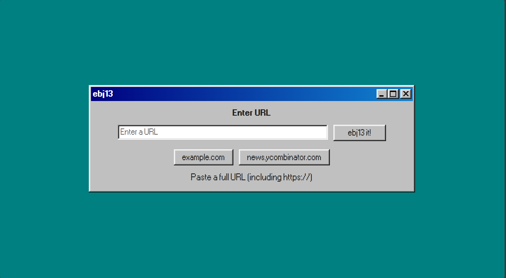
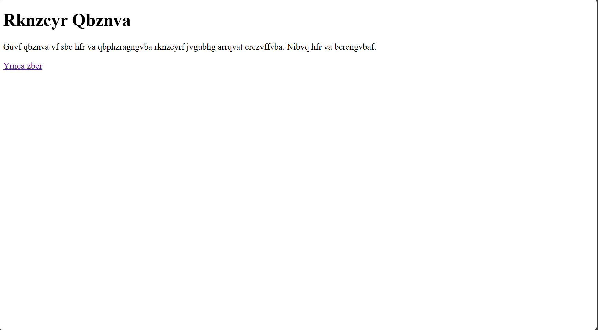
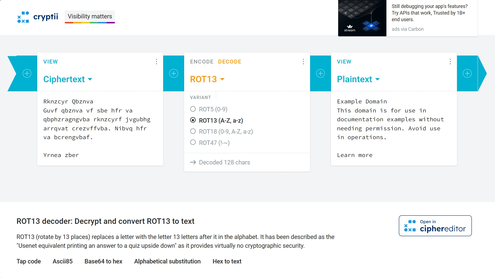
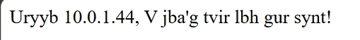
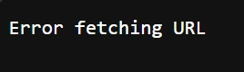
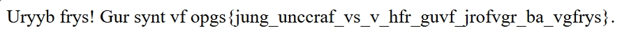
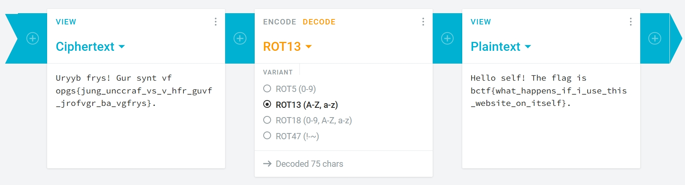

## ebg13
> This writeup is the proof of my learning process. I'm a newbie and of course there will be some stages that i get stuck and look for hints and supports from the Internet but you can still refer to mine as a reference materials. Thanks!

First let's take a look at the webpage.


I try one of the features presented on the page: `example.com` and it returns this


It seems that the contents is encoded by rot13. Let's decode it using [online tool](https://cryptii.com/pipes/rot13-decoder) and paste the text in.


The result confirms that the website gets the url from user input and encodes it via rot13 algo before returns the contents. At this moment, i think there may be SSRF here. Now, let's inspect the source code.

```javascript
fastify.get('/admin', async (req, reply) => {
    if (req.ip === "127.0.0.1" || req.ip === "::1" || req.ip === "::ffff:127.0.0.1") {
      return reply.type('text/html').send(`Hello self! The flag is ${FLAG}.`)
    }

    return reply.type('text/html').send(`Hello ${req.ip}, I won't give you the flag!`)
})
```
This code snippet interests me the most because of the line "I won't give you the flag!". Reading the code, it says that if we can access /admin page, we can get the flag. Let's try!!!

First, I input this line `https://ebg13.challs.pwnoh.io/admin` into the URL form.
The repsonse is

It means `Hello 10.0.1.44, I won't give you the flag!`

I see the IP address 10.0.1.44 (declined) and the if-block which checks for IP address and reckon that I have to be at the same network with the server to access the /admin page. 

Notice that the server is listening from all interfaces on port 3000

```javascript
fastify.listen({ port: 3000, host: '0.0.0.0' }, (err, address) => {
  if (err) throw err;
  console.log(`Server running at ${address}`);
});
```

I try `https://127.0.0.1:3000/admin`

Payload `https://[::1]:3000/admin` and http://[::ffff:127.0.0.1]gets the same error message (the [] is must-have to specify that it's IPv6 format)
I search for [SSRF payload online](https://github.com/swisskyrepo/PayloadsAllTheThings/blob/master/Server%20Side%20Request%20Forgery/README.md) and successfully get the page with this payload `http://[0:0:0:0:0:ffff:127.0.0.1]`



Decode the encoded text and get the flag!!!

> Flag: ***bctf{what_happens_if_i_use_this_website_on_itself}***
