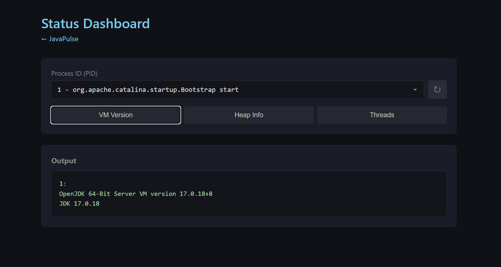
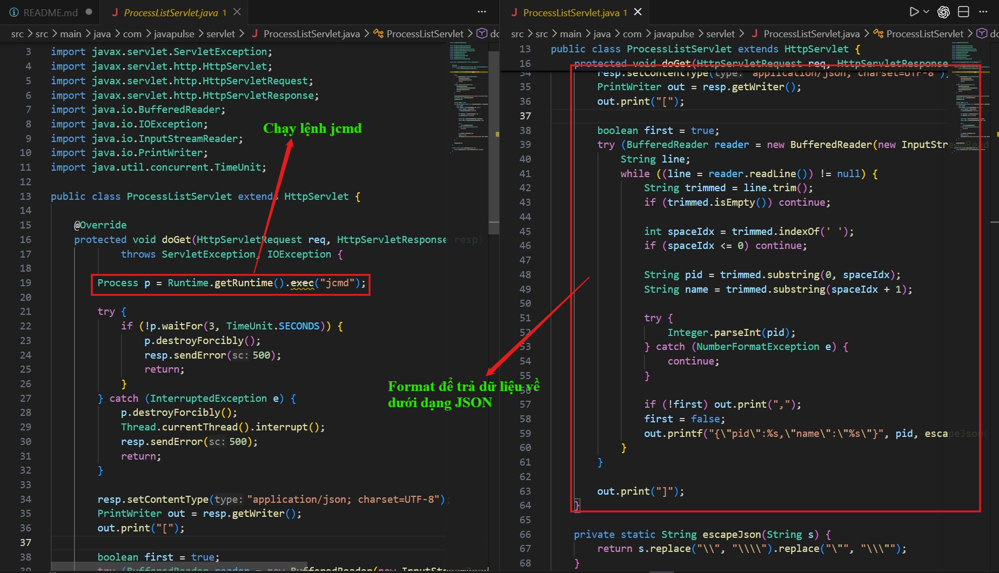
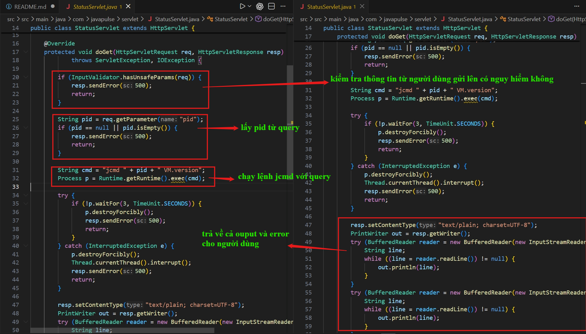
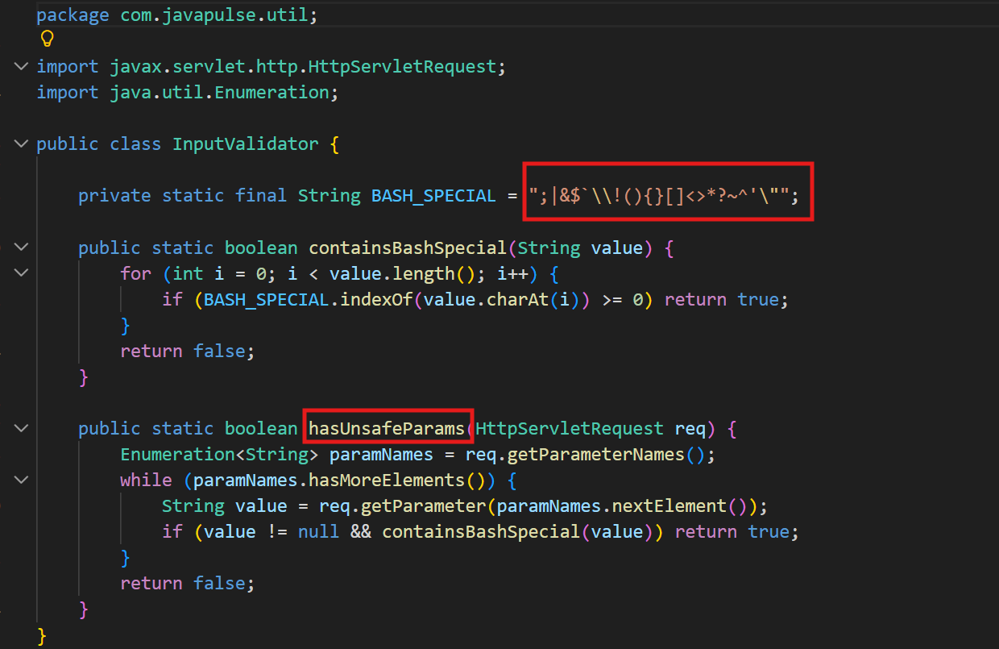
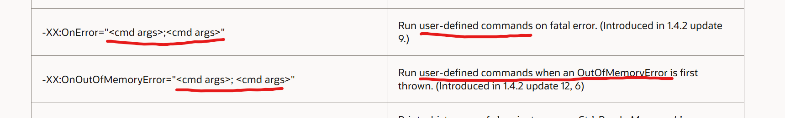
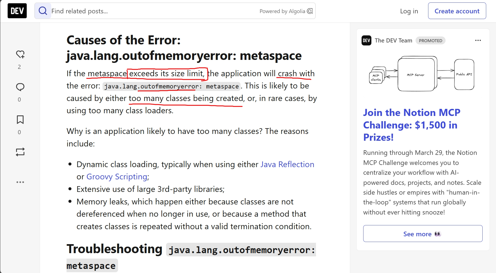
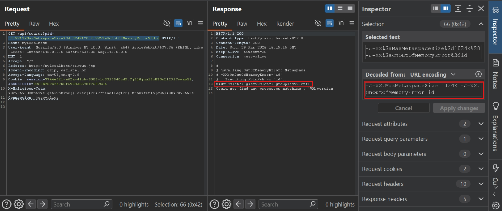
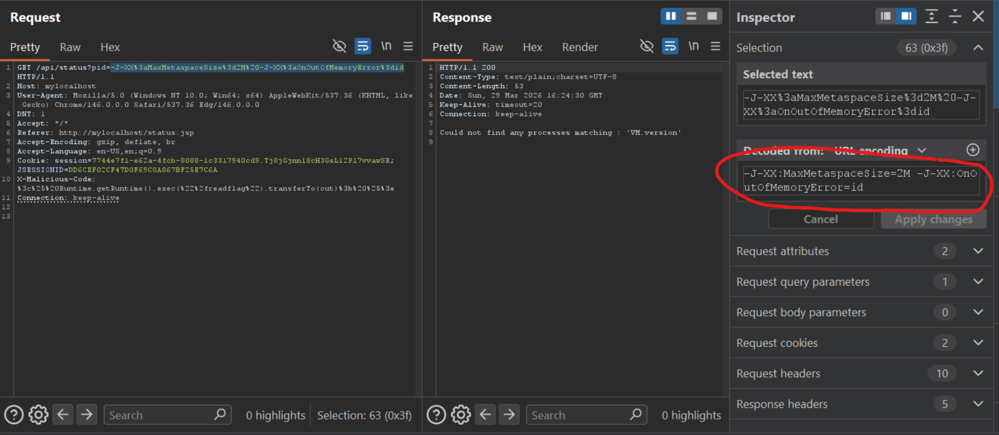
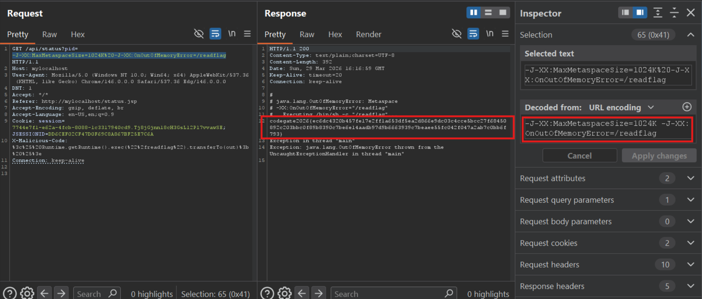

# Juice of Apple, Vegatable, Apricot (JAVA CODEGATE CTF 2026)
---

## Tổng quan:
Trang web có chức năng xem thông tin về VMversion, threads và heap info của một PID nhập bởi người dùng.




## Phân tích mã nguồn

- `/api/process`: trả về PID 1 và một PID chạy lệnh `jcmd`




- `/api/status?pid=<id>`: kiểm tra query có chứa kí tự nguy hiểm không, nếu không thì trả về thông tin VM version của PID đó. Các kí tự không được phép có trong query là ```; | & $ ` \ ! ( ) { } [ ] < > * ? ~ ^ ' " ```






- `/api/threads?pid=<id>` và `/api/heap?pid=<ip>` cũng tương tự, chỉ khác phần chạy lệnh: `cmd = "jcmd " + pid + " Thread.print"` và `cmd = "jcmd " + pid + " GC.heap_info"`

## Phân tích lỗ hổng

Như vậy, tác giả đã viết một lớp bảo vệ cho query, tuy nhiên nó vẫn chưa thực sự loại bỏ hết các kí tự đặc biệt và để lại các kí tự sau không bị cấm: `@ # % - _ + = ' , . /`

Trong Java, lệnh `Runtime.getRuntime().exec(cmd)` với `cmd = "jcmd " + pid + " VM.version"` thì nó sẽ thực hiện lệnh `cmd`. Tuy nhiên có một điểm đặc biệt là nó chỉ coi từ đầu tiên là tên lệnh, còn tất cả các giá trị phía sau đều được java coi là flag hoặc argument. Vì ở đây lệnh `cmd` đã bị cố định luôn bắt đầu bằng `jcmd` rồi nên nếu mình có thể thao túng `pid` thì cũng chỉ sửa được các argument đưa cho lệnh `jcmd` để chạy.

Do đó trong trường hợp này, mã nguồn có lỗ hổng `Argument Injection`. Ở đây mình lúc đọc code thì bập ra luôn là `OS Command Injection` nhưng không phải, do có cái `jcmd` ở đầu lệnh. Ví dụ như là:

```java
Runtime rt = Runtime.getRuntime();
Process proc = rt.exec(new String[] {"sh", "-c", "ls " + dir});
```

với `dir` là người dùng nhập, thì ở đây sẽ có lỗ hổng `OS Command Injection` vì lệnh bắt đầu bằng `sh`.

Tuy nhiên ở đây vẫn có thể khiến Java thực thi lệnh OS bằng một cách gián tiếp.

`jcmd` là một lệnh để kiểm tra tình trạng sức khỏe của các process cũng như các thông tin về các process đó. Có thể hiểu đơn giản nó là task manager. Và `jcmd` thì cũng là một chương trình Java như bình thường, nhận các flag/argument vào như bình thường. Tuy nhiên thì trong java, có một loại flag đặc biệt, nó được sử dụng để tác động đến cách hoạt động của java ở tầng hệ thống rất thấp - JVM - Java Virtual Machine. Đó là flag `-XX`: là một advanced options, thường được sử dụng để tinh chỉnh JVM.

Thông thường, tinh chỉnh trực tiếp JVM chỉ cần `-XX` khi chạy file bình thường:

```java
java -XX:+UseG1GC -XX:MaxHeapSize=2G MyApp
```

nhưng khi dùng các lệnh, công cụ của JDK thì cần phải dùng flag `-J-XX`:

```java
javac -J-Xmx4G -J-XX:+UseParallelGC MyHeavyClass.java
```

Ở đây khi `javac` thấy flag bắt đầu bằng `-J`, nó biết đây không phải flag dành cho chương trình của mình mà là flag cho tầng hệ thống sâu hơn ở dưới, nó truyền flag này xuống cấu hình JVM.

Ở trong JVM Options mình thấy có flag có khả năng thực thi lệnh hệ thống: `-J-XX:OnOutOfMemoryError="<cmd args>; <cmd args>"`. Xem thêm ở [đây](https://www.oracle.com/java/technologies/javase/vmoptions-jsp.html)



Tìm thêm các khả năng dẫn tới `OnOutOfMemory` thì mình tìm được bài viết này: [https://dev.to/jillthornhill/tuning-outofmemoryerror-metaspace-size-problems-4igk](https://dev.to/jillthornhill/tuning-outofmemoryerror-metaspace-size-problems-4igk)

Giải thích ngắn gọn, `Metaspace` là nơi mà JVM dùng để load và lưu các thông tin liên quan tới `class`, định nghĩa của các `class` khi chương trình chạy.



Có 2 cách để chỉnh thông số của `Metaspacesize`


Như vậy, mình có thể truyền flag xuống JVM yêu cầu metasize rất nhỏ, điều này sẽ dẫn tới `OnOutOfMemory`. Sau đó mình sẽ truyền cùng flag `-XX:OnOutOfMemoryError="<cmd args>; <cmd args>"` để có thể thực thi lệnh hệ thống.

Do `- = / :` không bị cấm nên mình có thể dùng được flag này.

## Khai thác

Mình sẽ truyền flag `-J-XX:MaxMetaspaceSize=1024K` để giới hạn size của **Metaspace** là 1mb, onerror để là `-J-XX:OnOutOfMemoryError=id`



Lý do mình chọn 1MB vì để 2MB thì JVM vẫn chạy ngon bình thường :vvvvvv. Cần chỉnh cho metasize nó bé vừa đủ, nếu bé quá thì JVM chưa kịp nạp các class cốt lõi thì đã lỗi rồi, cái này không được gọi là **Runtime error** mà là **Fatal Error during Initialization** 




Nguyên nhân output của **id** được trả về là vì trong code có viết phần trả về cả output và lỗi như được giải thích trong ảnh phần phân tích mã nguồn.

Đến bước này chỉ cần đọc flag bằng cách chạy `/readflag`. Ở đây mình chỉ đủ sức để chạy được một lệnh, `echo hello` cũng không được bởi vì lệnh không được bọc trong nháy kép `""` (cái này bị chặn trong filter rồi). Nếu chỉ dùng `echo hello` bình thường thì trong `Runtime.getRuntime().exec(cmd)`, các **space** được coi là delimiter, nên `echo` và `hello` bị tách ra thành các arguments.


### PoC



> Flag: ***codegate2026{ec6dc4320b457fe17e2ff1a653df5ea2d866e9dc03c4cce5bcc27f68450892c203bbc0f89b8390c7be6e14aadb97d9b6663939c7beaee55fc042f047a2ab7c0bb6f793}***

