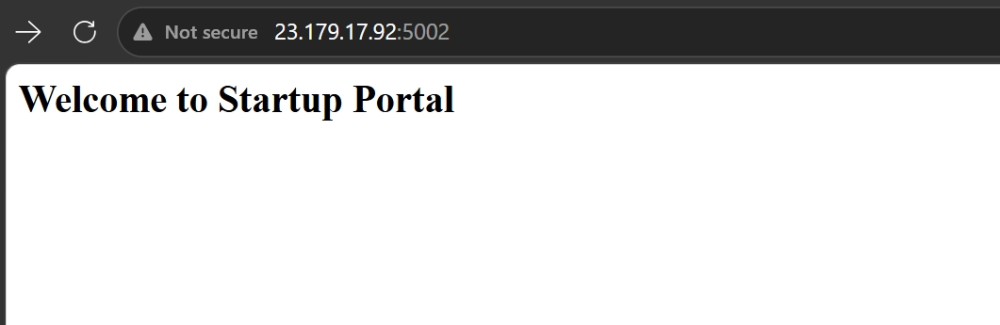
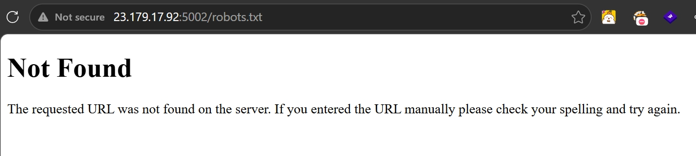
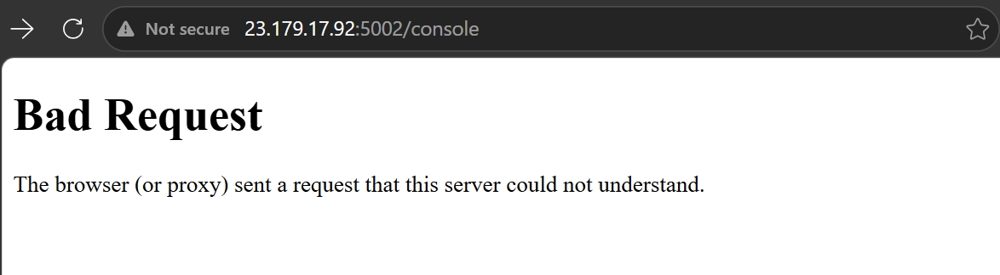
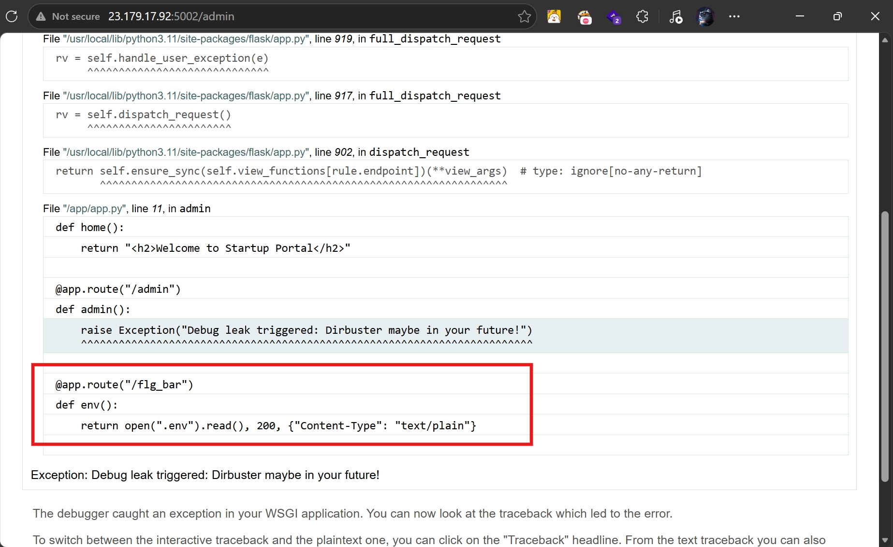
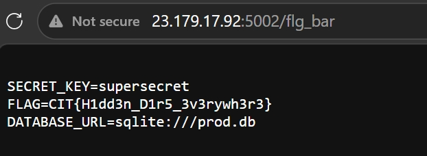

# Debug Disaster (CTF@CIT 2026)

**Description:**

Developing this application is tough, and I needed debug mode to be enabled... but I'm nervous I forgot to turn it off in production. I also think I may have forgot to remove something from the application structure.

---
## Overview
The webapp is presented with a static page but turn on `debug` functionality is **True**, which exposes error and internal endpoint outo the Internet. Access the private endpoint for flag.

## Exploitation Flow

At first access, there nothing other than static content.

Try recon at `/robots.txt` get 404 Not Found

Based on the description, which is debug = True, and on the Wappalyzer I know that server using Flask and Werkzeug. When debug = True, there is a portal at `/console` allowing dev to run code from the web rather than in the docker.

It seems we are blocked.

I tried fuzzing the directory and found `/admin`

Access the endpoint shows pretty much error information of Debug. The author intentionally exposes this with `raise Exception("Debug leak triggered: Dirbuster maybe in your future!")`

Look at below part, an intrigue endpoint appears: `/flg_bar`

Go to that and get flag

> Flag: ***CIT{H1dd3n_D1r5_3v3rywh3r3}***
