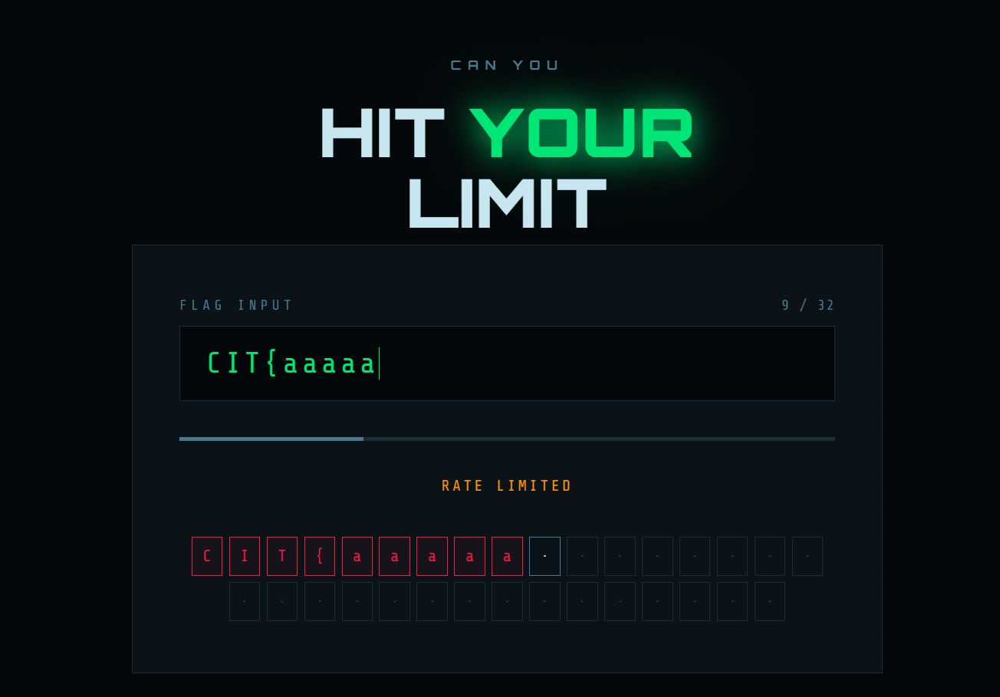
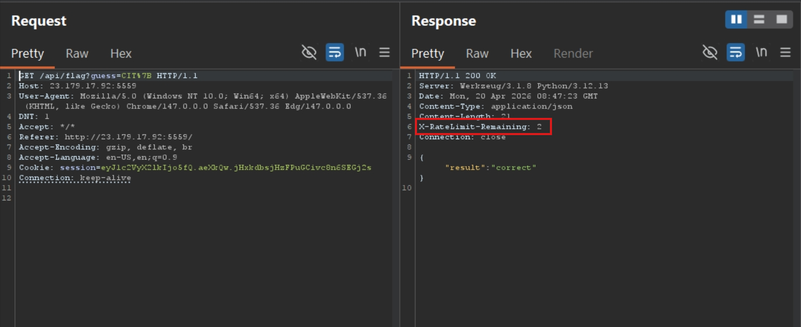
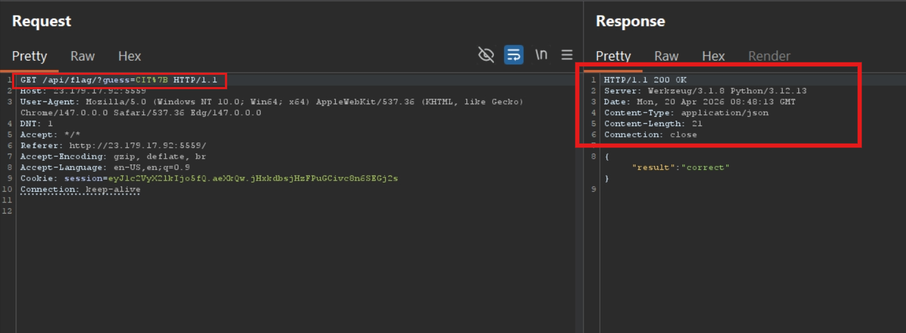
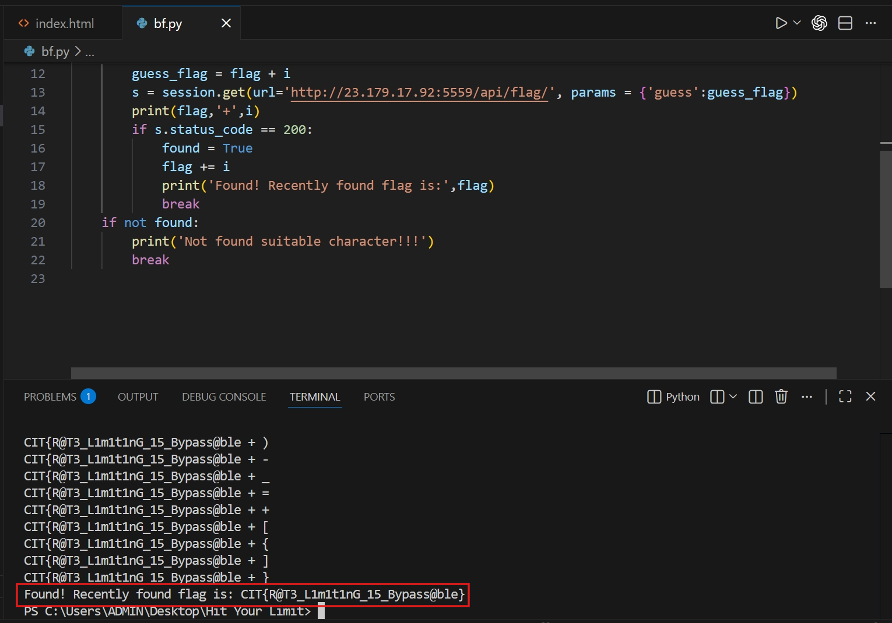
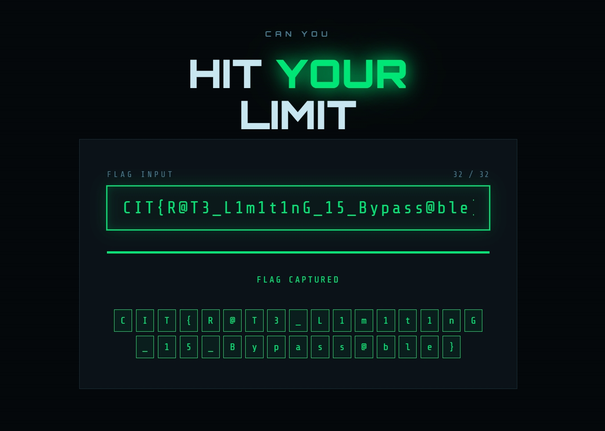

# Hit Your Limit (CTF@CIT 2026)
---
**Description:**

A wise man once said, stay calm, cool and collected. Don't go above your limit.

---
## Overview
Web has an input form to input your reckon flag. Server will check if it's correct or not. There is a rate limit mechanism preventing users from brute-force flag. Due to bug in code, users can bypass this `Rate-limit check` and brute-force for flag.

## Reconnaissance

Try with the prefix form of flag.

Try for more and get banned.

Try for different header to bypass such as: X-Forwarded-For, Ip-Forwarded-For,... but all of them don't work. Also fuzzing the directory gets nothing.

I try switch request method to POST, PUT, HEAD and OPTIONS; whatever the method, server still counts my limit.

However, when I try append the forward slash to the endpoint, server doesn't set `Rate-limit` header anymore.

According to what I have reconed above, I guess that server only counts if the requested endpoint exactly matches `/api/flag`. However, it misses a case that `/api/flag/` can also be resolved to `/api/flag` as well (Or the author intentionally writes code as such, idk =))))))

Now the problem is clear, write a [script](assets/brute_force_for_flag.py) and bruteforce.

> Flag: ***CIT{R@T3_L1m1t1nG_15_Bypass@ble}***