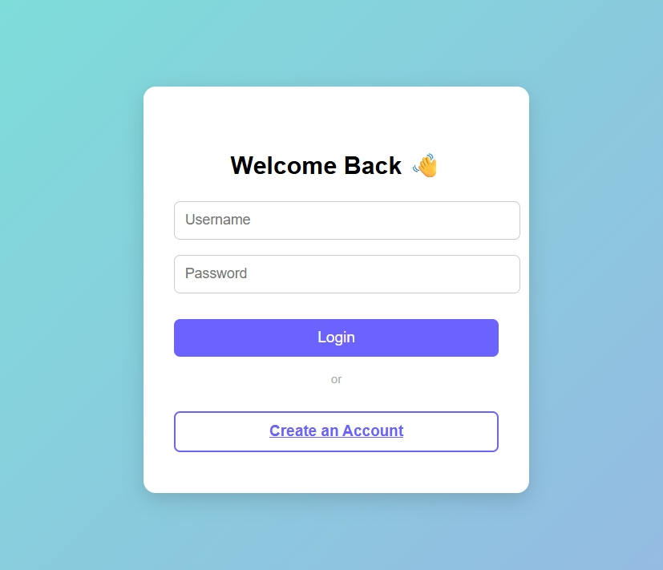
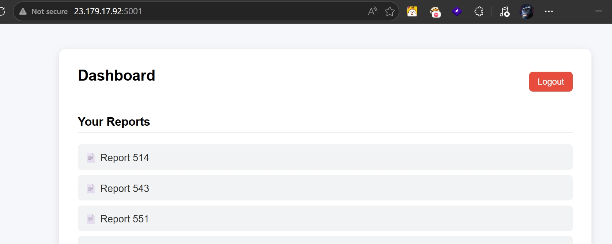
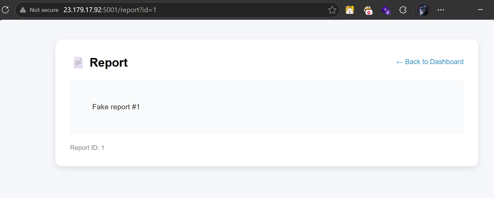
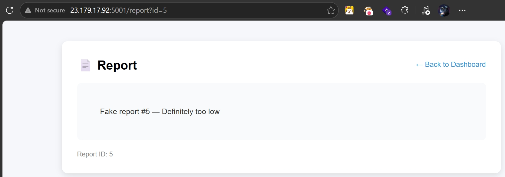
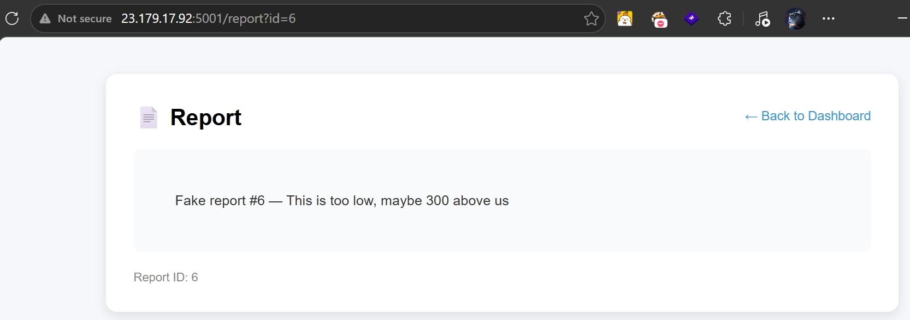
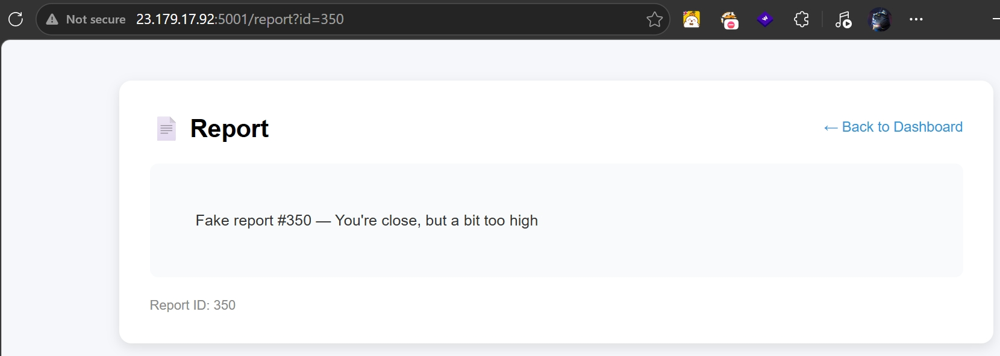

# Intern Portal (CTF@CIT 2026)
---
**Description:**

The intern said they made a custom report application... but I don't think security was in mind.

---

## Overview
The webapp allows creating account and login, also posting reports and view report as well.
The idea is not complex. Finding the flag among thousands of reports abusing `Insecure Direct Object Reference (IDOR)` or `Broken Access Controll`.

## Expoitation Flow

Register and account and login.

Try posting some reports with content of XSS, SSTI payload but it doesn't work. Refer to other players notes as well for quickness.

From those, we can assume that the server has encode data before returning to users. Look at the URL, the report is access via query `id`. For the report at the first login start with 500, I think they belong to users whereas smaller indexes belongs to admin. Try id=0 return error, id=1 return different report content.

It seems I'm right. Server doesn't check users role/permission but allow request for admin's report.

Try for more reports and find this:

The report suggests me to search for Id 306 and above. Using burp intruder, I get the flag.

> Flag: ***CIT{Acc355_C0ntr0l_M@tt3rs!}***

