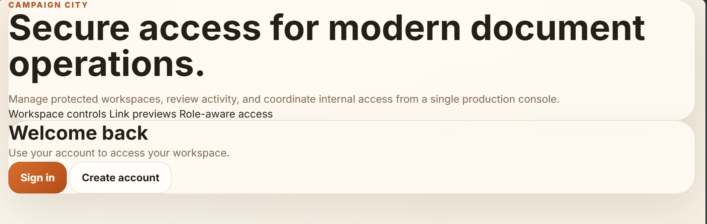
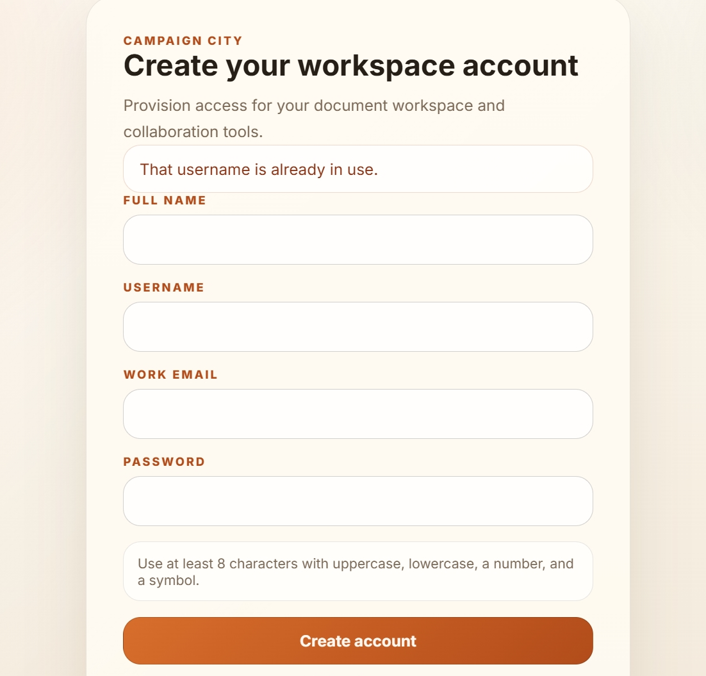
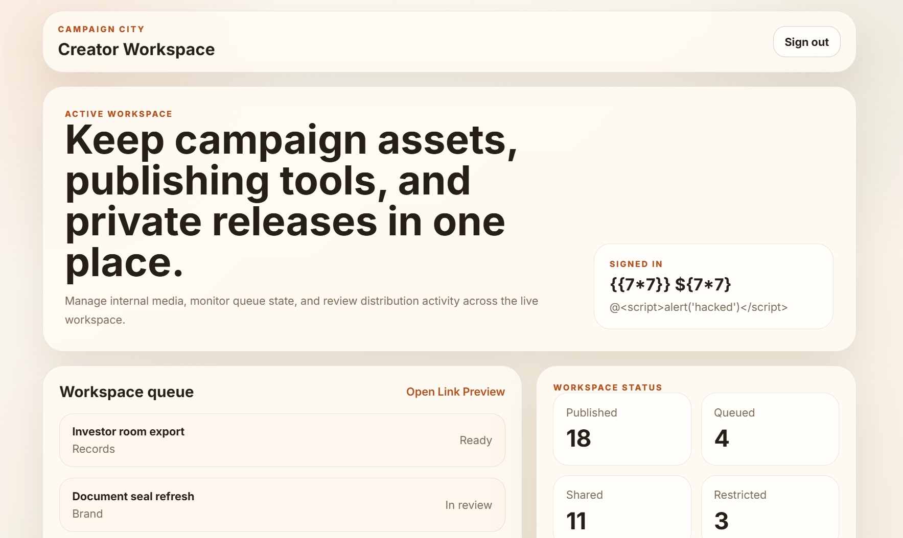
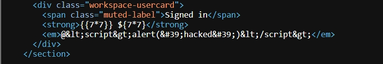
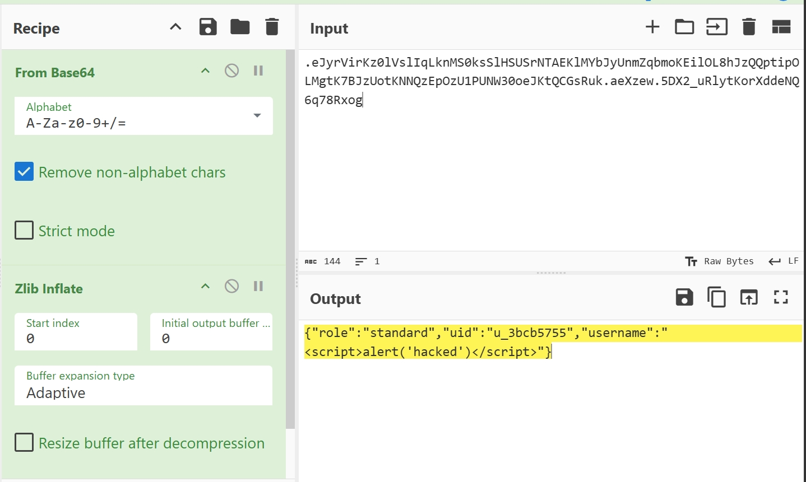
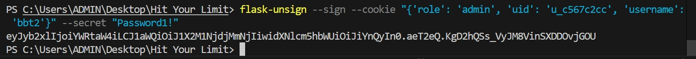
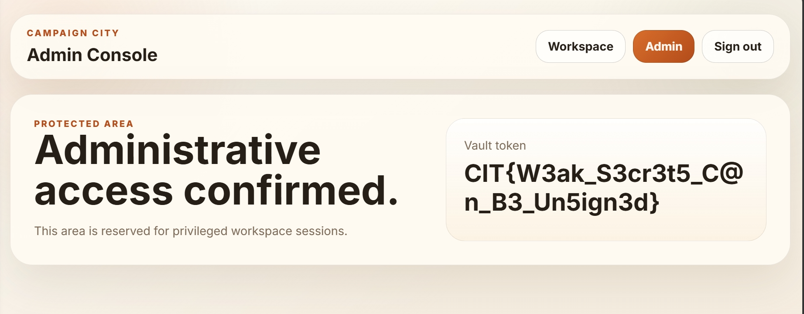

# Sign Up and Enjoy (CTF@CIT 2026)
---
**Description:**

I'm confused, what does this application do exactly?

---
## Overview
The webapp has basic functionalities like signup, signin, update profile, dashboard page and admin portal for admin only. The problem in this challenge is secret-key used to sign flask-cookie is too weak, in which attacker can crack and forge a cookie as an admin.

## Reconnaissance

Let sign up with malicious code

The XSS and SSTI don't work. Look at the source code and it is encoded.

Try SQLi with admin account but not works at all. Injecting `'` `\` `"` `--` but the server responds as normal.

Get to `/admin` is redirected to `/workspace` if not admin.

The webapp doesn't have pretty much functionalities, I inspect the cookie. Look at the Wapplyzer, I know server employing `Flask`, for that, the cookie is also signed by flask.

Decode the cookie got this:

I think I will have to forge the cookie as admin.

Using `flask-unsign` to decrypt the cookie with password from `rockyou.txt`:

Got it!!!

Now sign it as admin

Replace the current session with created one and then head to `/admin` for flag.

> Flag: ***CIT{W3ak_S3cr3t5_C@n_B3_Un5ign3d}***
