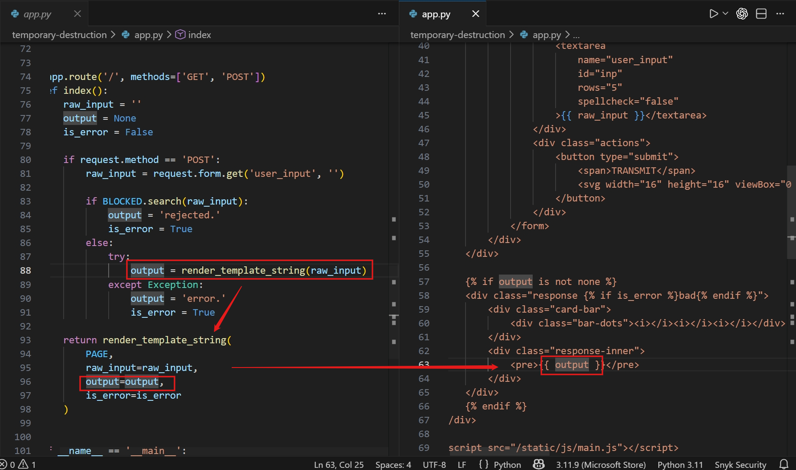
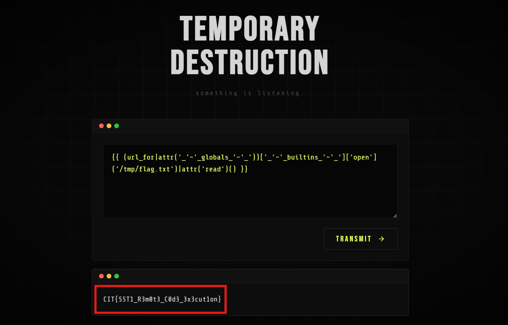

# Temporary Destruction (CTF@CIT 2026)
---
**Description:**

I hear something....

---
## Overview
Webapp reflects what ever user input. Due to misuse of `render_template_string` of dev, the webapp is vulnerable to `Server-side template injection`. Abuse the vuln to read flag at `/tmp/flag.txt`

## Source code and Vulnerabilty analysis

The server gets data from user and validate it with this condition: `BLOCKED = re.compile(r'__\w+__')`, the dev tends to block keyword like `dunder method`: `__globals__`, `__class__`,...

However, blacklist is never enough =))

Instead of inserting the user's text directly into the html content, backend uses `render_template_string` which is infamous for sink of SSTI.

The code renders/runs the malicious code user submits, gets the result and puts back into the html content.

## Exploitation

I use `~` to concatenate `_`,`_globals_`,`_` into `__globals__`. Or you can also use hex encode as well

> Flag: ***CIT{55T1_R3m0t3_C0d3_3x3cut1on}***