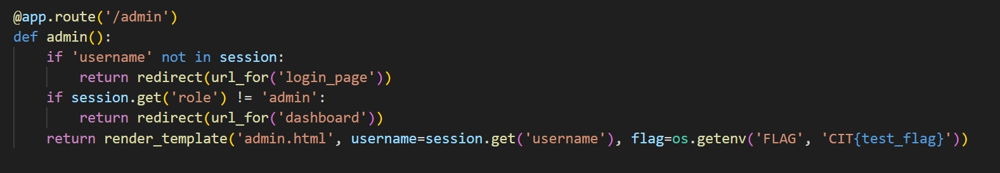
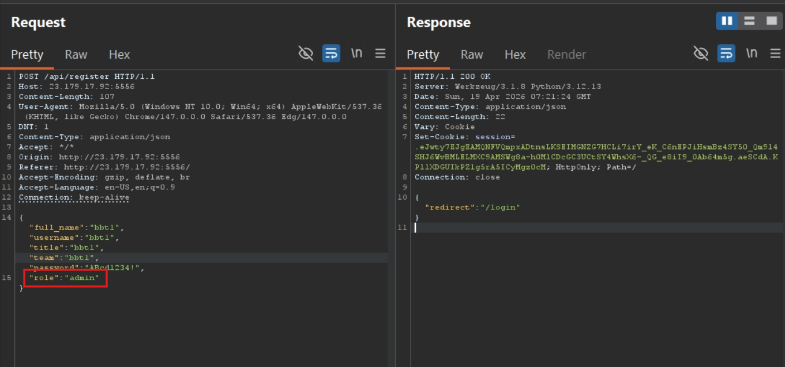
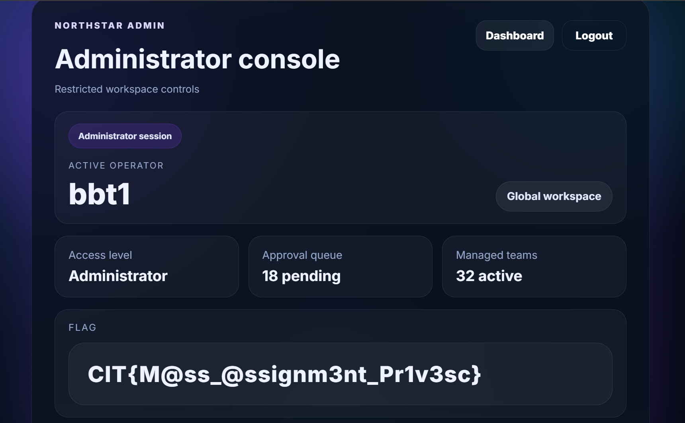

# A Massive Problem (CTF@CIT 2026)
---
**Description:**

Improper Authorization has been fixed! I think we are ready for production!

## Overview
The webapp has basic functionalities such as login, register, logout, see dashboard and update profile as any other webapp.

The problem lies in how server registers new account and updates account within vulnerability `Mass Assignment` in which it allows user to register account with **admin** role. We will register an admin account and go to `/admin` for flag.

## Source code (Vulnerable parts only) & Vulnerabilities analysis 

```
.
├── / [GET]
├── /login [GET]
├── /register [GET]                    
├── /logout [GET]
├── /profile [GET]
├── /dashboard [GET] 
├── /admin [GET]
└── /api                           
    ├── /register [POST]                    POST: username, password, role, full_name, title, team
    ├── /login [POST]                       POST: username, password
    └── /profile [POST]                     POST: username, password, role, full_name, title, team
```

- `/admin`: require role admin to get in



- `/api/register`: Receive data from user input. Even though initiating the role as `standard`, the server then override it with user input without awareness that user can submit `role` in the request.

Backend code lacks of user-data validation mechanism for `role` field.


> CWE-915: Mass Assignment

## Exploitation

Capture the request with burpsuite, add a field `role` with value `admin`.



Take the returned cookie and replace it with current cookie. Refresh and head to `/admin` for flag.



> Flag: ***CIT{M@ss_@ssignm3nt_Pr1v3sc}***