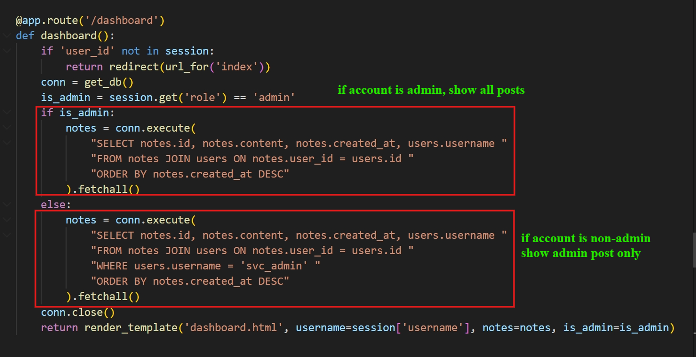
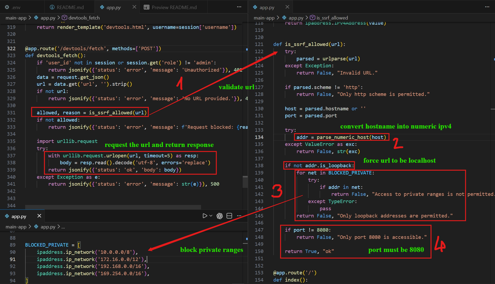
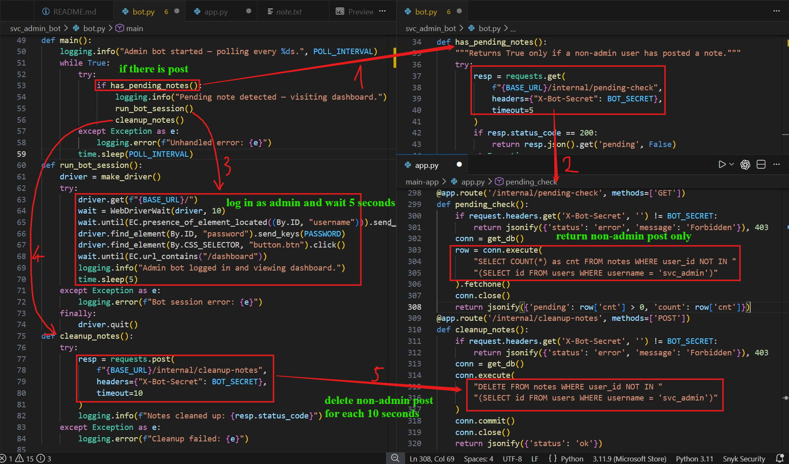
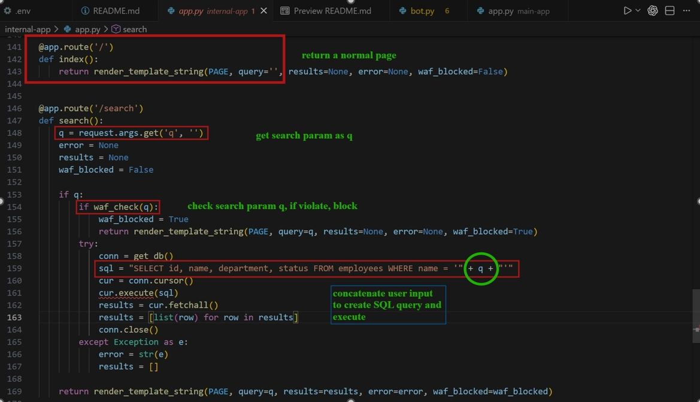
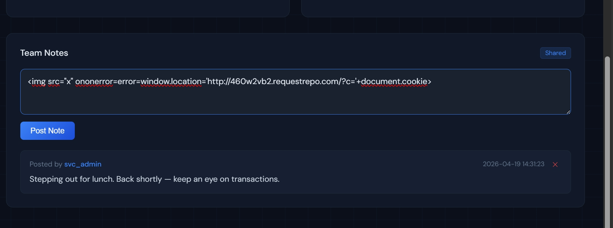
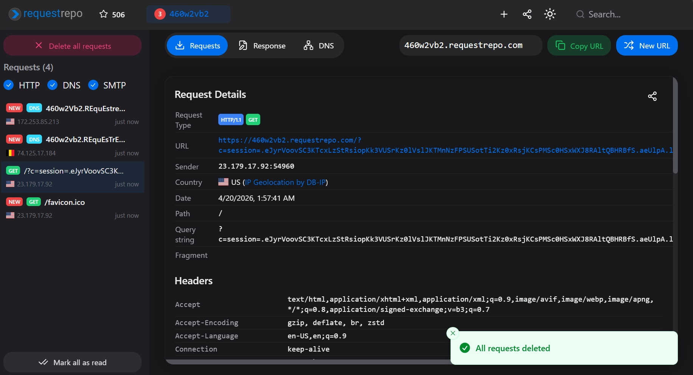
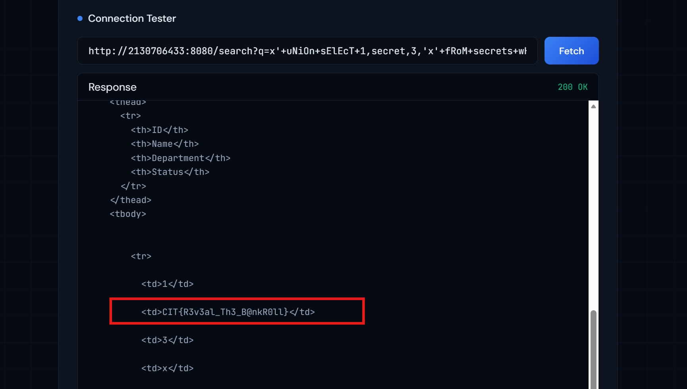

# Bankroll (CTF@CIT 2026)
---
**Description:**

Sorry! I'm out for lunch right now, but I'll check on things every few minutes! Hope nothing breaks when I'm gone!

## Table of contents

- [I. Overview](#i-overview)
- [II. Source code analysis](#ii-source-code-analysis)
- [III. Vulnerability analysis](#iii-vulnerability-analysis)
    - [1. Information Exposure](#1-information-exposure)
    - [2. Misconfiguration](#2-misconfiguration)
    - [3. Logic Flaw](#3-logic-flaw)
- [IV. Exploitation](#iv-exploitation)
    - [1. Account Stealth](#1-account-stealth)
    - [2. XSS](#2-xss-to-steal-admin-session-from-bot)
    - [3. SQli](#3-sql-injection)
---
## I. Overview

The webapp has basic functionalities such as: login, forgot-password, dashboard, note-posting service. For admin, he has an exclusive portal for checking url (enter url and get response).

The application has flaws in forgot-password service where it exposes too much information, making way for attacker to enumerate username, by that way he steals user account. In the dashboard, user can post notes contains malicious code which extracts bot cookies when it visits. Privilege escalation via admin cookie and using special dev tools for SQL injection to get the flag.

## II. Source code analysis

The challenge comprises of 3 services: `main-app` (which is exposed to the Internet), `internal-app` (connected to main-app only), `bot` (invoked by some services in main-app)

```
.
├── / [GET]
├── /login [POST]                           POST: username, password
├── /register [GET,POST]                    POST: email, password
├── /logout [GET]                           
├── /forgot-password [GET, POST]     
├── /dashboard [GET]
├── /notes [POST]                           POST: content
├── └──/<int:note_id> [DELETE]           
│
├── /internal
|   ├── /cleanup-notes [POST]
|   └── /pending-check [GET]
|
└── /devtools [GET]
    └── /fetch [POST]                       POST: url
```

- `/`: show first access page with login form
- `/login`: implement as usual, hash the input password and compare with hashed password in the database.
For **user**, using **SHA256**; for **admin**, using **MD5**. Logged user in and redirect to /dashboard
- `/logout`: nothing special
- `/forgot-password`: return error if the forgoted password account doesn't exist, otherwise return sha256 hash of that account (if it is admin account then not return md5 hash)


- `/dashboard`: show all posts for admin, only admin posts for standard account



- `/notes`: server does sanitize notes content before storage


- `/devtools/fetch`: admin posts url, url must points to localhost at 8080.



- For bot activity: it checkss if exists user post and clear it for each 10 second interval. Bot logs in as admin account and delete them.



For the `internal-app`:

There are two databases: `employees` contains data of employees, `secrets` contains one record of flag

- `/seach?q=`:



There are measures preventing SQLi


The `main-app` configs **session** as this
```python
app.config['SESSION_COOKIE_HTTPONLY'] = False
app.config['SESSION_COOKIE_SAMESITE'] = None
app.config['SESSION_COOKIE_SECURE'] = False
app.config['PERMANENT_SESSION_LIFETIME'] = timedelta(minutes=5)
app.config['SESSION_REFRESH_EACH_REQUEST'] = False
```
which is really vulnerable to Cross-site scripting (XSS)

## III. Vulnerability analysis

### 1. Information Exposure

In the `forgot-password` service, server informs users if the account being password-forgot exists or not, which is a venue for attacker to enumerate username via bruteforce with leaked credentials (username)

The server also returns SHA256 of standard users, which is very dangerous in case the password being used is predictable or password leaked in data breaches. Attacker would use tools to look up that password and successfully steal the account.

### 2. Misconfiguration

Setting `SameSite: None, HttpOnly: False, Secure: False` is like inviting XSS to steal cookie.

Besides, the bot used to clear notes is not set with `javascript disabled`. If it visits a page with stored XSS (for example in this case is XSS in notes), the cookie would be stolen easily.

### 3. Logic Flaw
#### In preventing SQLi
- In `waf_check`:

The employed database is Sqlite, it understands camel keyword like `Union`, `uNiOn`, etc. not just `union` and `UNION` as dev thinks. So he may miss this functionality of SQLite

```
if word.lower() in KEYWORDS:
    if is_bad_casing(word):
        return True
```

In this case, instead of return True immediately upon finding the forbidden keyword, dev still checks the case of `original word` is bad or not ? Which leaves way for attacker to bypass the filter as above.

- In `Buidling query from q`:

The dev concatenates `q` from untrusted data (user) into the query directly (though there is filter but it's bypassed now =))) rather than employs famous measures such as: prepared statements with parameterized queries or allow-list.

#### In preventing XSS
The server does have sanitization mechanism which removes forbidden keyword (which is believed to be dangerous) but not recursively.

For example: `I'm<script> bbt` will be `I'm bbt`
However, if payload is `<script<script>>` will be `<script>`, and it is clean (at least in the point of view of server =)))).

So using nested payload will bypass this filter.

## IV. Exploitation

The main idea here is: 
- **Firstly**: steal the account via bruteforce username and crack hashed password
- **Secondly**: login and post note with XSS payload stealing admin session
- **Finally**: Login as admin and exploit SQLi getting flag

### 1. Account Stealth

Since we don't have any credentials or account, we must abuse forgot-password service for username enumeration.

Using Burp Intruder with wordlists from `seclists/Usernames/Names/names.txt` from kali, I found `zack`


Got the hashed password of `zack`. I bring it to crackstation and wish for lucky.


Yeah, the password is `ryLis@1024`

So the credentials is `zack:ryLis@1024`. Let's login.

### 2. XSS to steal Admin session from Bot

Since bot logins as admin and visits `/dashboard` in which all posts of every one is shown. One of them will contain our note with XSS payload (that has been modified to bypass the XSS filter as I mentioned above)

**Payload**: ``




Wait for 10s for the bot to visit our note. Check at our webhook



Got the session! Replace current session with the stolen one to become admin.

### 3. SQL Injection

Head to `/devtools/fetch`

Exploiting this query is now easy, I use `UNION` technique.

However when I try `#` to comment the last quote `'`, it doesn't work eventhough I have encode the `#` into `%23`


Then I add `WHERE '1'='1`, which is appended with `'` will become valid

**Payload**: `http://127.0.0.1:8080/search?q=x'+uNiOn+sElEcT+1,secret,3,'x'+fRoM+secrets+wHeRe+'1'='1`




I use `127.0.0.1:8080` because the server requires it to be. In the picture, the number in netloc is in form of Dotted Decimal (decimal IP). And server still understands it via `parse_numeric_host`.

> Flag: ***CIT{R3v3al_Th3_B@nkR0ll}***


