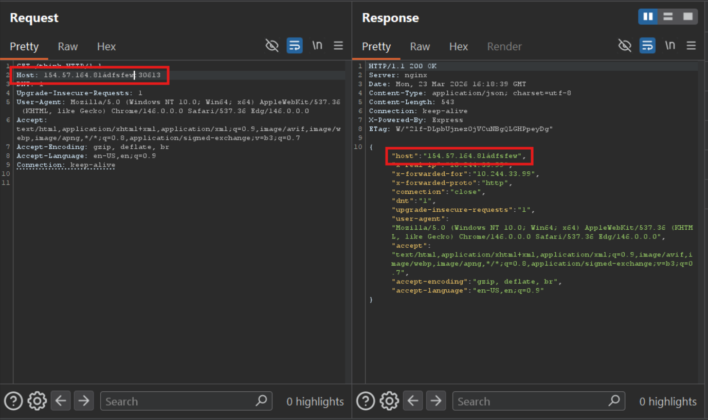
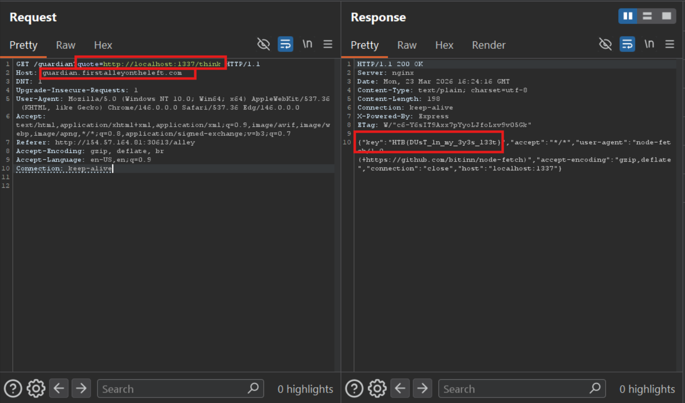

# Dusty Alleys (HTB)
---

## Source code analysis

The image of container is built in Dockerfile with hidden **SECRET_ALLEY**, in local lab is **REDACTED**

```Dockerfile
RUN apk update && apk add nginx
ENV SECRET_ALLEY=REDACTED
...
RUN sed -i "s/\$SECRET_ALLEY/$SECRET_ALLEY/g" /etc/nginx/http.d/default.conf
...
EXPOSE 80
ENV FLAG=HTB{REDACTED}
```

The server has four services:
- `/`: returns static website
- `/alley`: also static website and a link to `/guardian`
- `/think`: receive the request and return headers of the request

```javascript
router.get("/think", async (req, res) => {
  return res.json(req.headers);
});
```



- `/guardian`: check if query `quote` exists. If no, return default page `guardian.ejs` at `views` folder. Then check value of quote, if it is not `localhost`, returns with error. Finally, send a request to `quote` with header containing flag. Get the response and return the reponse to user.


A script defines rule of WebServer Nginx


Which means if we know the hostname of server (`SECRET_ALLEY`), we can request to `/guardian`


## Exploitation

Abusing service `/think` to get the hostname. When Nginx forwards a request without Host header, it will apply the server hostname to the request.

However, removing the Host header results in error


And there is a legacy version of HTTP which supports request without Host header - `HTTP/1.0`. See it [here](https://stackoverflow.com/questions/56331503/when-would-you-get-a-web-request-without-a-host-name)

Remove the `Host` header and downgrade the `HTTP/1.1` to `HTTP/1.0`


Get the `SECRET_ALLEY`.

Since `/think` returns the headers request and `/guardian` sends request to provided **URL** in `quote` with flag in its header. I let the `quote` be `http://localhost:1337/think`



> Flag: ***HTB{DUsT_1n_my_3y3s_l33t}***
