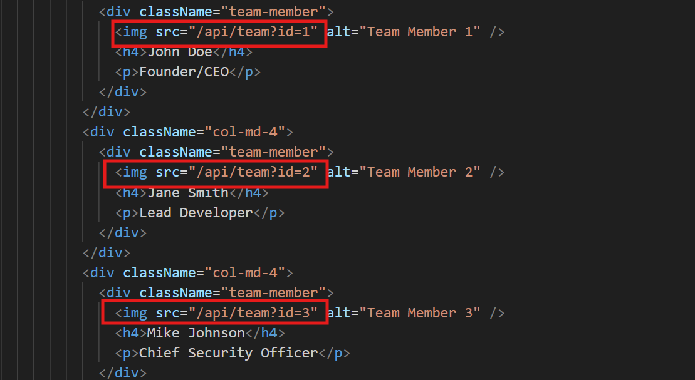
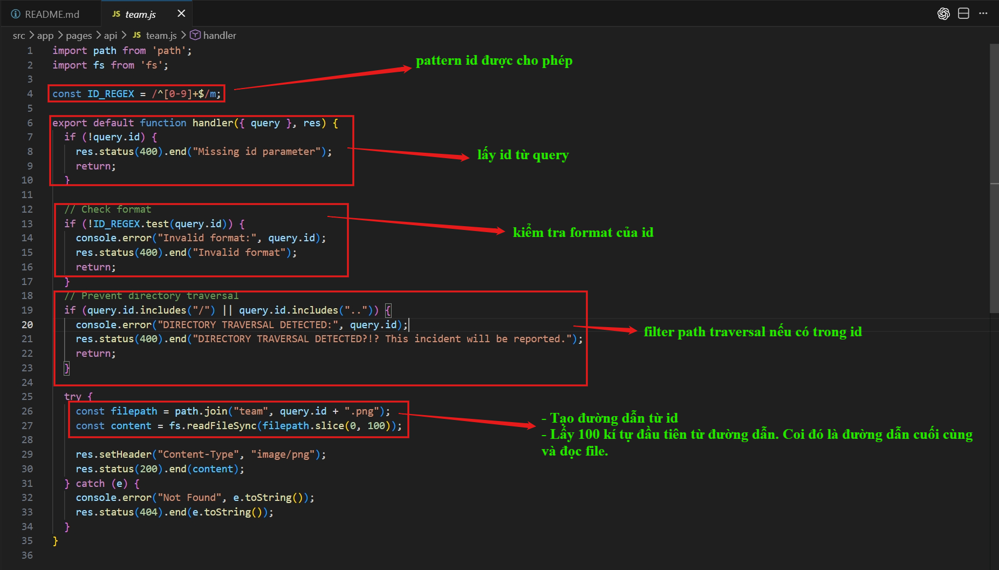
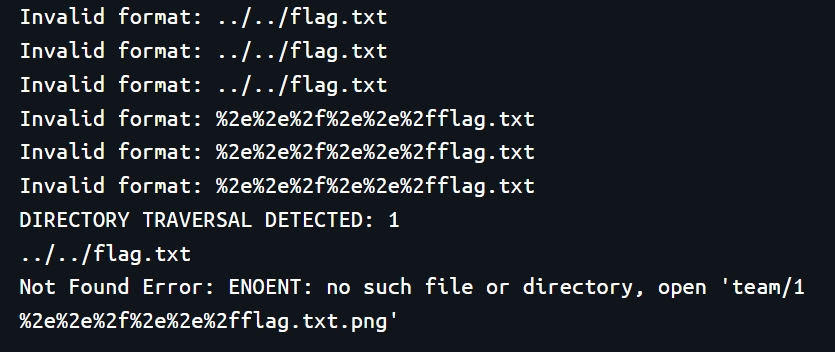
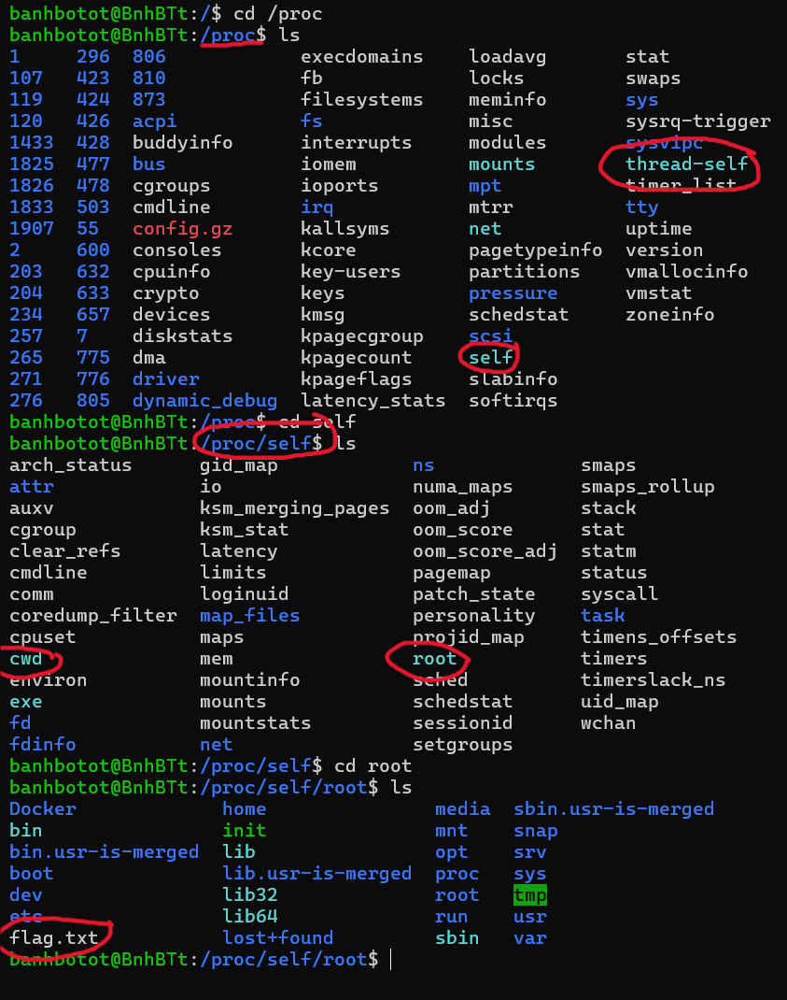
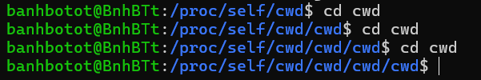
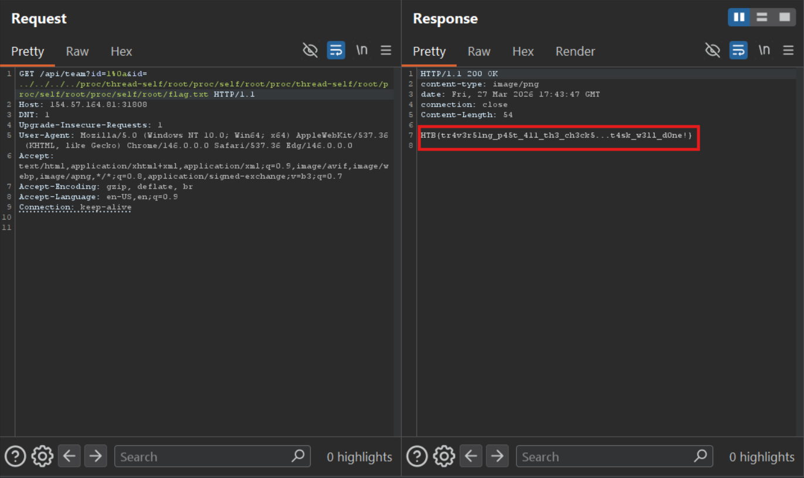

# NextPath (HTB)
---

## Tổng quan
Trang web đơn giản là hiển thị text và hiển thị 3 hình ảnh được trả về khi gọi api




## Phân tích mã nguồn

- `/api/team?id=<id>`: Trong mã nguồn nhận api này, code có kiểm tra format của id và có một lớp ngăn chặn path traversal từ id. Sau đó xây dựng đường dẫn từ qualified id và đọc file theo đường dẫn đó (lấy 100 kí tự đầu tiên)



## Phân tích lỗ hổng

Trong phần regex pattern `ID_REGEX = /^[0-9]+$/m`, regex cho phép được gửi id dưới dạng nhiều dòng (multi-line). Ví dụ:

```regex
1           1           a
2           abc         b
3           xyz         1
```
Và regex bắt vào các dòng chỉ có các chữ số trên dòng đó. Trong source code kiểm tra chỉ cần tồn tại pattern chứ không kiểm tra pattern tồn tại trên tất cả các dòng.

```javascript
if (!ID_REGEX.test(query.id)) {
    ...
  }
```
Trong phần filter phía dưới chỉ kiểm tra xem `id` có chứa `..` hoặc `/` mà bỏ qua `%` nên mình có thể dùng url-encode kí tự `line-feed` để xuống dòng `%0a`. 


Mình đã thử url-encode `../` một lần thì do browser nó luôn tự decode trước khi đưa cho backend nên khi chạm tới endpoints, nó đã bị chặn. Nhưng khi dùng double url-encode thì khi tới endpoints, nó không được decode tiếp.




Đến mức này thì hướng đi này có vẻ không hiệu quả và cần hướng đi khác. Và trong phần xử lí `query string`, javascript rất linh hoạt. Mục đích ban đầu của `id` là truyền string nhưng javascript cho phép query là một array.  =>> Có thể gọi đây là lỗ hổng `HTTP Parameter Pollution`

```javascript
?id=1&id=2             
// id = ['1','2']
```

- Khi kiểm tra `if (!query.id) {}` thì sẽ trả về một array.
- Khi kiểm tra `if (!ID_REGEX.test(query.id)) {}`thì hàm test này nó chỉ hoạt động trên string, lúc này array nó phải tự động chạy method `toString()` của nó để biến cái array thành string. Nó tự động ghép các phần tử lại, ngăn cách nhau bởi dấu phẩy


Điền `id=1&id=2` thì khi chạy toString(), nó trở thành `1,2` không khớp với pattern nên sẽ trả lỗi.


- Khi kiểm tra `if (query.id.includes("/") || query.id.includes("..")) {}` thì nó sẽ kiểm tra array có chứa **CHÍNH XÁC** element đó trong array không (lúc này array không bị chuyển về string vì array trong js có method includes)


Vậy bây giờ chỉ cần add `../` ở phía trước đủ nhiều để sao cho vừa tròn 100 kí tự, thì code sẽ cắt phần dư luôn được append là `.png` đi.


Tuy nhiên, trong trường hợp `id=../` nằm ở phía trước thì cần chỉnh số lượng `../` cho phù hợp để có thể trả về kết quả. Trong trường hợp `id=../` nằm ở sau thì khi join, `query.id` tự động gọi `toString()` rồi nên `1%0a` kết hợp với `../../` sẽ thành một dir `team/1%0a../../` và tốn thêm một `../` để thoát khỏi dir đó.

## Khai thác
Nếu gọi `etc/passwd`.
Trong trường hợp này khi đến lúc gọi `fileReadSync` thì còn dư 30 `../` tổng là 90 và `etc/passwd` dài 10. Cuối cùng là tổng 100.

Tuy nhiên nếu gọi `flag.txt`, dài 8 và `../` có tổng luôn chia hết cho 3 ví dụ như 90 93 96 99, không thể kết hợp với flag.txt cho tròn 100 để cắt đuôi `.png` ra được.

Trong linux lại có **tính năng** đi đường vòng. Nếu đi từ `/proc/self/root` thì cuối cùng sẽ lại trở về `/`



Ngoài ra còn có:
- `/proc/thread-self/root` trả về `/`
- `/proc/self/cwd                         ` luôn trả về `pwd`, nên nếu muốn trả về `/` thì cần phải đứng sẵn ở `/` (từ `cwd` luôn đi tiếp đến `cwd` được)



Lúc này thì cần đếm độ dài và tính tổ hợp của 3 cái này sao cho cuối cùng kết hợp với `flag.txt` là tròn 100

Ở đây mình tìm được một tổ hợp thỏa mãn là `../proc/thread-self/root/proc/self/root/proc/thread-self/root/proc/self/root/proc/self/root/flag.txt`

Add thêm vài `../` ở phía trước để thoát `/app/team/` về `/` cho phù hợp


### PoC



> Flag: ***HTB{tr4v3r51ng_p45t_411_th3_ch3ck5...t4sk_w3ll_d0ne!}***

