# [What's Your Name](https://tryhackme.com/room/whatsyourname)
> Personal writeup for learning purposes.

---

## Overview
- **Platform**: TryHackMe
- **Category**: Web
- **Difficulty**: Easy-Medium (subjective)
- **Goal**: Login into moderator and admin panel via XSS and Session Hijacking

## Analysis and Exploration

First I configured the /etc/hosts file as the challenge required by appending the IP and hostname to the file.
After that, I went to `worldwap.thm` and it represented me a page looked like an artical with **register** function. Clicking on that, the page shows a pre-registration form

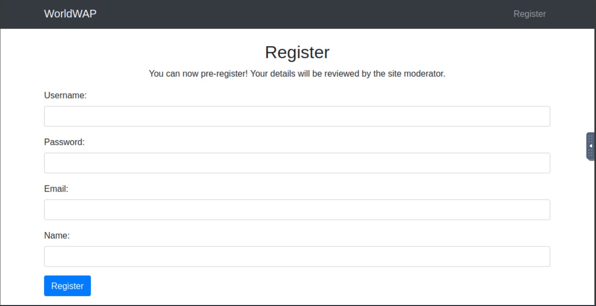 

I tried to poke around by filling out the form, the page redirected me to login page. However, after so many times I created new account and re-login with correct password, it always showed me that: **User not verified**.

Inspecting the source code at *login.php*, this caught my interest:

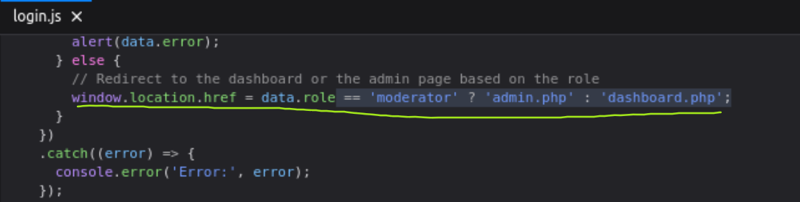

I thought I would have to somehow login as admin or moderator. I tried using BurpSuite to capture and modify the response but it didn't work. Also checked the src for register page but nothing interesting.

*A small trick* Since the challenge is put in the *Advanced client-side attack*, after *XSS, CRSF, DOM-based and SOP & CORS*, I thought it should be related to them. Looking at the descriptive line:

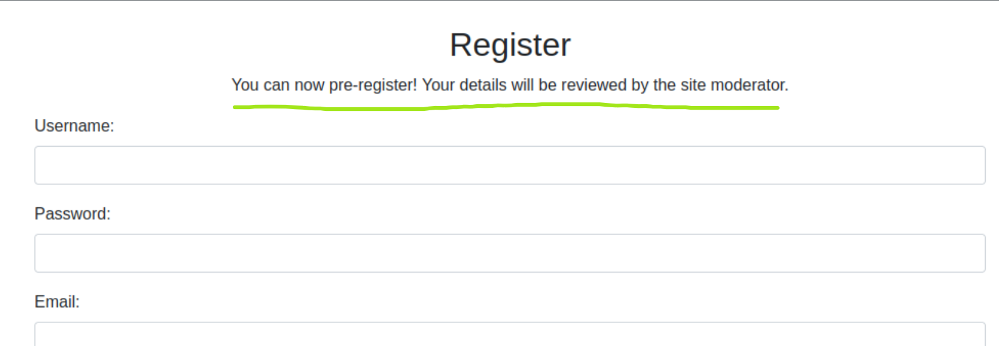

`Your details will be reviewed by the site moderator` told me that the moderator would check my registration form, that could lead to XSS or CSRF. Then I tried building up the payload using function *Repeater* of *BurpSuite*.

I setup a listener on my attack machine (*Attack Box*): `python3 -m http.server 1337`

Crafting payload and put in **username, name** input field. The page page prompted me that the username is too long, then I inserted the payload into **name** field only.

At first, I crafted the payload using `localStorage.getItem('role')` as it was used in *login.php* but not worked, my machine received nothing (I had also changed to **data**).
```javascript

```
After a while, I was successful with this

```javascript

```

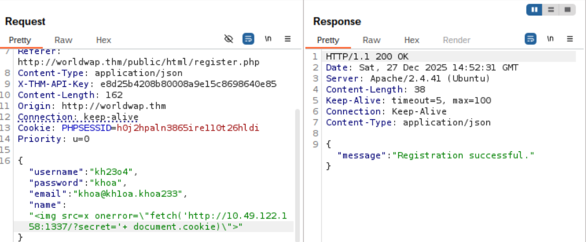

And got this request:

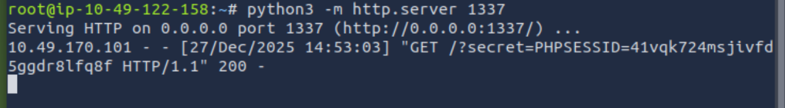

I replace the **PHPSESSID** in `register.php` and `login.php`. Though the page switched to moderator panel, yet nothings special happened, all functions were blocked or disabled. Even accessing `admin.php` & `dashboard.php` gave me nothing. At this moment, I thought there should be hidden dir or port. I used **nmap** and found another running port.

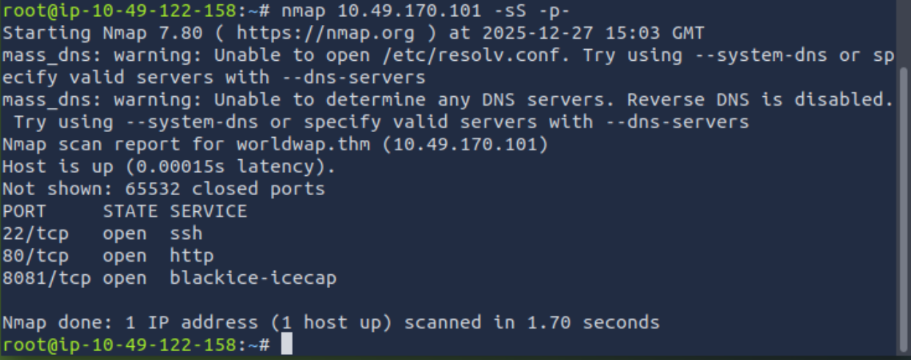

I also enumerated directory using **gobuster** for port **8081**:
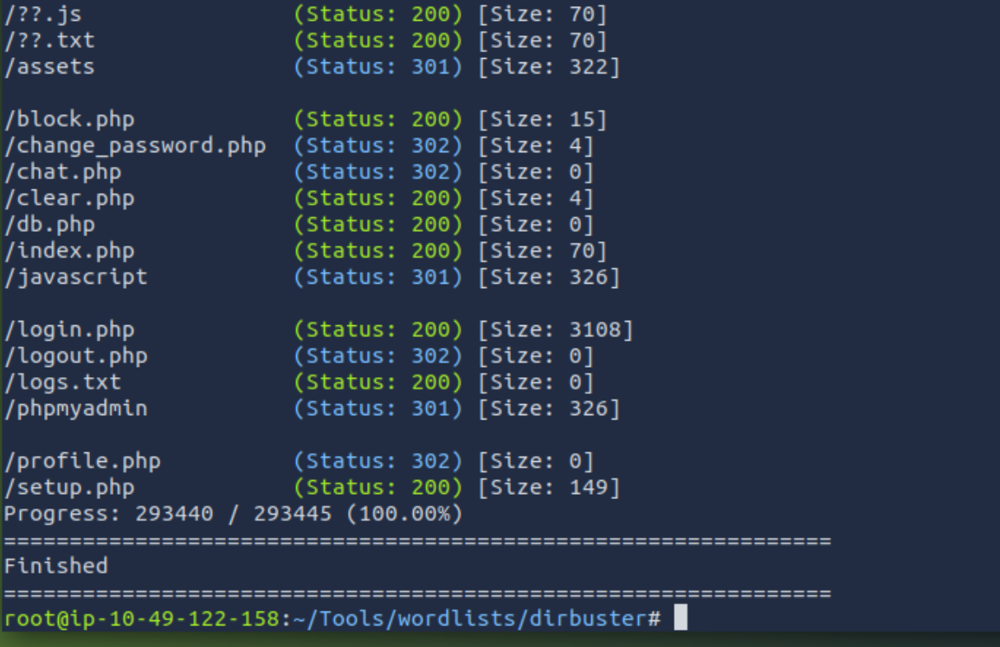

After checking them all, I bumped into **login.php**, it showed me a form to login.

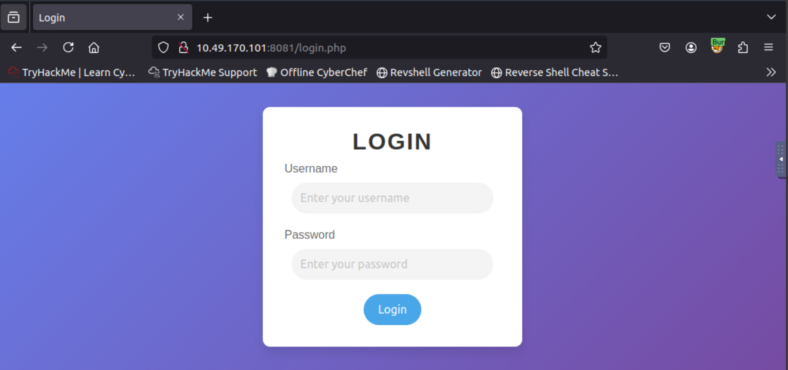

This would be SQLi. After some attempts, I gave up, I replaced the previously received **PHPSESSID** and got logged in, the flag is on the nav bar:

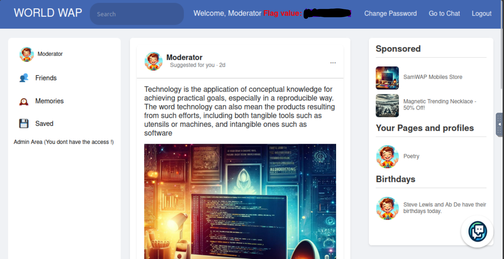

Poking around, I played with **Change password** function but it said only admin could change, unfortunately. Then I got to `chat.php`

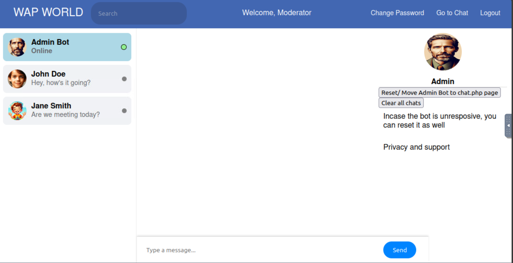

At this scene, I checked BurpSuite history and saw unusual traffic

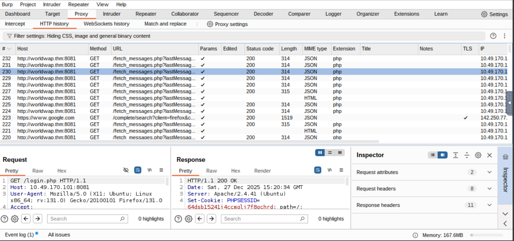

Because the code constantly requested for the content of the box chat, I thought this box was also vulnerable to XSS. Two buttons on the right side also supported my opinion:
- One for reset the bot if lag
- One for clear chat if payload was wrong or annoying (After checking with PoC)

First, I attempted for PoC
```javascript
<script>alert('xss')</script>
```
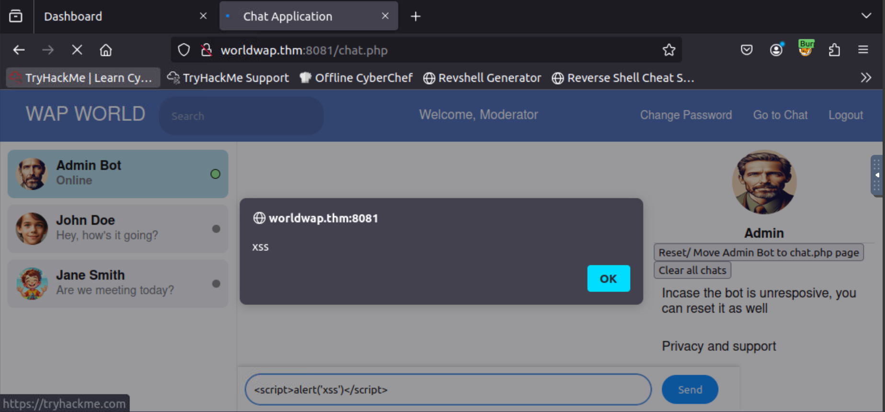

I cleared the box chat using *clear* button. Then I chat the real payload extracting the cookie:
```javascript

```
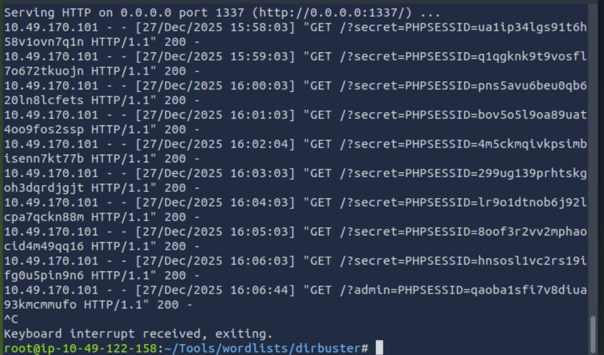

Replace the **PHPSESSID** into the same page and we got *Admin* panel, hence the flag.

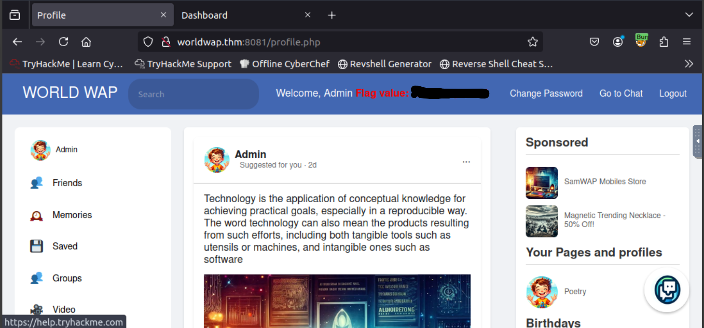

> **Easter Egg**: Even you get *admin* session, you still can't change the password or use admin's privilege.